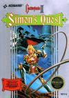

[恶魔城2：诅咒的封印](https://pewae.com/gaan/aHR0cHM6Ly93d3cuZG91YmFuLmNvbS9nYW1lLzEwNzM0MzEz)

原名：ドラキュラII 呪いの封印 / Castlevania II: Simon's Quest别名：恶魔城2：西蒙的冒险机种：FC厂商：科乐美类别：ACT发行年月：1987-08耗时：20

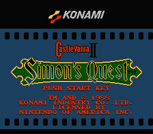
第一次接触这个游戏大概是在1994年的寒假。当时搞到一盘质量非常高的合卡，里面就有这个游戏。
当时我废寝忘食地打了两个白天，然后就因为“玩不下去了”而败退了。
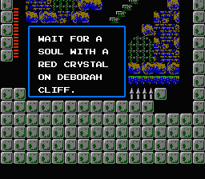
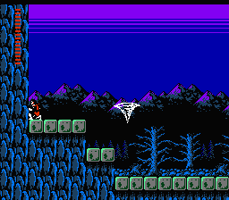

恶魔城这个系列声名显赫，但它并不是从一开始就是现在这种模式。开创性的恶魔城一代引入了鞭子、副武器、心、各种各样的恶魔敌人，以及斜四十五度楼梯结合密特罗德式的分片地图。而二代定义的东西也不少——通过任务获得隐藏的道具、武器的升级、经验值、购买道具等。最重要的一点，从二代开始，恶魔城系列才变成了完全的开放式地图，挥着鞭子的一代又一代驱魔人才能像萨姆斯一样到处乱窜收集各式各样乱七八糟的东西。
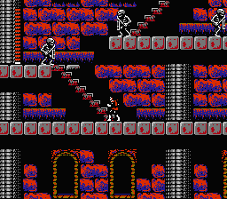
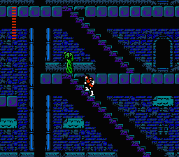
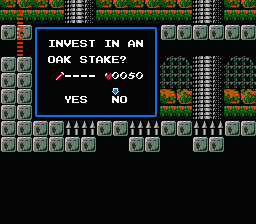

本作的副武器系统可以说倒退了。匕首、银刀、金刀本质上是一种东西，而有恶魔城特色的攻击上方的斧头和攻关利器怀表被取消了。圣水被一分为二，瓶装水只剩开隐藏砖块一个作用，而能“粘住”敌人的圣火成了另一种道具。
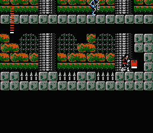
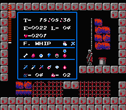

二代的另外一个特色是只有3场BOSS战，还都特简单。不知道是不是被技术限制了，反正不打BOSS的恶魔城是挺不带劲的。
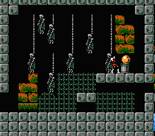

还有，二代的一个超级巨大的贡献，是奉献了恶魔城系列的三大神曲之一的Bloody Tears（血泪）。这曲子其实是白天郊外的正常主题曲，我感觉一般。主要是找不到正确的路，来来回回打转转，再好的曲子也欣赏不来。
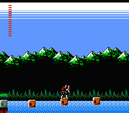
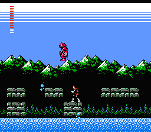

再说说当年玩不下去这事儿。本作发售的时候，把自己定义成ARPG游戏，其中的RPG含量是相当高的。制作方设计了很多谜题。在城中跟村民对话，以及打碎一些特定的墙角，能得到一些谶语或者提示。
当时我已经学了不少英语，也玩了一些RPG游戏，觉得自己可以了，结果就被卡住了。
卡住我的地方，是要在身上装备水晶球的时候，在走不过去的河边按方向键下等待5秒。
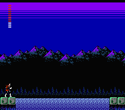
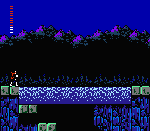

这句提示藏在野外的脚下，且脑袋上有一只碍事的蜘蛛，打到这的时候只想着怎么快速躲过去，而不会往地上扔个瓶子。况且我一直以为只有城里或者恶魔城的墙角里才有提示，被卡得一点脾气都没有。
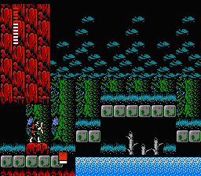
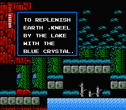

有一个可怕的事实，直到今天重温查资料以后才知道：城镇里的居民给提供的情报，并不一定是真实的。犹记当年找不着路的时候，看到村里有人说：“摆渡人喜欢大蒜。”后如同捞到救命稻草，买了一兜子大蒜对那个船夫各种演练——往船上扔，往他身上扔，往河里扔，往河岸上扔，就是不见特殊剧情。原来这句话是他娘蒙事的！
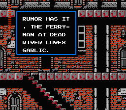

哦，还有，这一代的故事是写了好长好长的。说西蒙在一代里干掉德古拉之后，自己也受到了诅咒，背伤难愈。于是他再次来到特兰西瓦尼亚，寻找德古拉的5个残骸，在祭坛上复活了德古拉的影子后在把它干掉，以期望消除身上的诅咒。主线剧情以及收集德古拉的零件这回事，在后来的版本中被用了无数次。
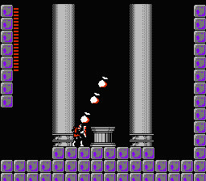

3个BOSS的第一个，是一张面具。剧情里说是女吸血鬼卡米拉（GBA月轮人物）的化身。两部作品差了20年，估计只是卡米拉这个名字太俗了。
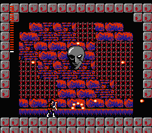

第二位是从不缺席的老朋友，铁打的死神，流水的1P。
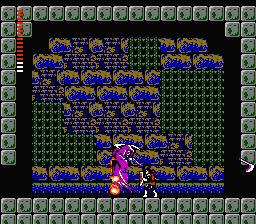

最终BOSS，好丑，说是德古拉的影子。只要简单的扔火柱就能烧死，连出招的机会都没有，好弱。
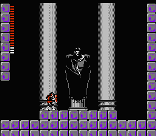

通关。关于通关还要多说几句，游戏按照通关时间分为三种结局。游戏里的时间14天以上为Bad Ending，7天以内是Good Ending。我是打出灰色图片后觉得不对劲，才查到这件事的。
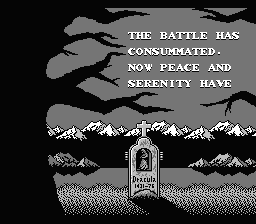

存盘存得太晚，改时间已经来不及了为了完美结局只好再打一遍。几年前我在《[银河战士2](https://pewae.com/2017/06/metroid_2.html)》里遇到过一模一样的设定，银河和城，还真是相爱相杀的两个系列啊。
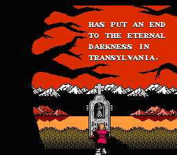
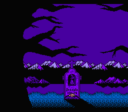