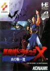

[恶魔城X：血之轮回](https://pewae.com/gaan/aHR0cHM6Ly93d3cuZG91YmFuLmNvbS9nYW1lLzEwNzM0MzA2)

原名：悪魔城ドラキュラX 血の輪廻别名：Castlevania: Rondo of Blood机种：PC-E厂商：科乐美类别：ACT发行年月：1993-10耗时：5

前不久看电影《孤注一掷》，片子一般，里面咏梅劝人的一句台词倒是引起了我的共鸣：“人有两颗心，一颗是贪心，一颗是不甘心。”
我觉得她概括的不全面。因为还少了一颗好奇心。
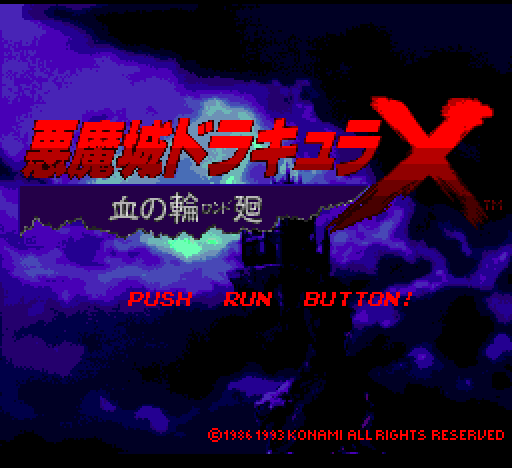

PC-E这台主机，对于我来说是个“只知道它有，从来没见过”的存在。这在想“下一个玩什么”的时候，就像一只潘多拉的盒子，总想弄来看看。刚巧上一个游戏搜攻略的时候，油管紧接着给我推的视频就是PC-E最佳音乐TOPN。立刻便种下一颗“我一定要模拟一个PE-C游戏来玩”的草。随后立刻生根发芽。
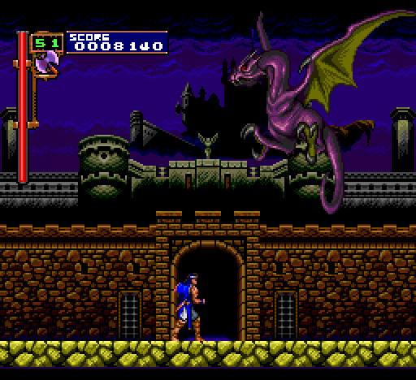
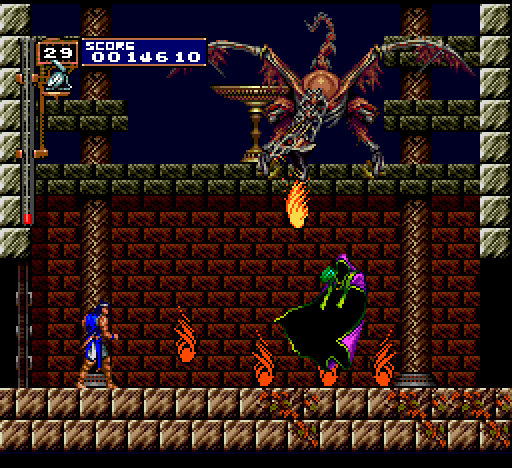

后面的事就水到渠成了。血之轮回在PC-E上算是TOP3的存在，不玩文字游戏的话很难不选中它。
这部作品在整个恶魔城正传系列中也非常重要。整个恶魔城系列中，有四部作品是以《恶魔城X》开头的。另外三个是SFC上的《恶魔城XX》、PS上的《恶魔城X历代记》和大名鼎鼎的《恶魔城X月下夜想曲》。又及，《恶魔城XX》和《恶魔城历代记》只是本作的魔改复刻版，所以，这部作品是伟大的《恶魔城X月下夜想曲》的血脉相连的前作。
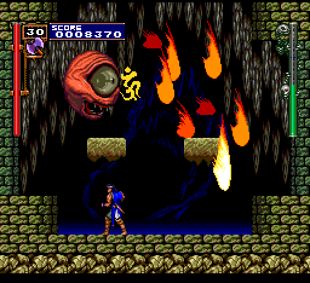

本作的主角里希特，就是贯穿《月下》剧情始终，并且在PS版通关后可以使用的那个人。只不过本作中他尚未学会滑铲和升龙这些飞天遁地的本事，但是比起西蒙[[1]](https://pewae.com/2023/09/castlevania-rondo-of-blood.html#inner_anchor_1)和拉尔夫[[2]](https://pewae.com/2023/09/castlevania-rondo-of-blood.html#inner_anchor_2)，里希特多出了一个耗费大量心释放的全屏魔法攻击大招“副武器粉碎”，不愧有“最强吸血鬼猎人”之名。主要是操作性比红白机的三作好太多了。
这也是迄今为止我玩过最容易的动作城。
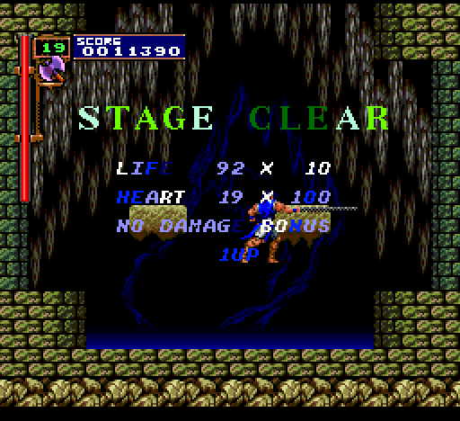

但里希特还不是最好用的。第二关救出玛丽亚之后，就可以在读档时换出玛丽亚来操控。玛丽亚的攻击硬直时间比里希特短得多，且拥有二段跳技能，比里希特的“鹞子翻身”可要方便实用得多了。
玛丽亚的缺点首先是脆皮，被敌人摸三下就快完了。另外就是副武器单调。名义上四圣兽，但玄武只有一两个特定场景使用有意义，而白虎就是凑数搞笑的。其实当年我是玩过能直接选玛丽亚的土星版月下的。但用了几下觉得不爽，还是换阿鲁卡多了。
月下的剧情跟血之轮回差了5年，玛丽亚的罩杯不升反降，怪哉！
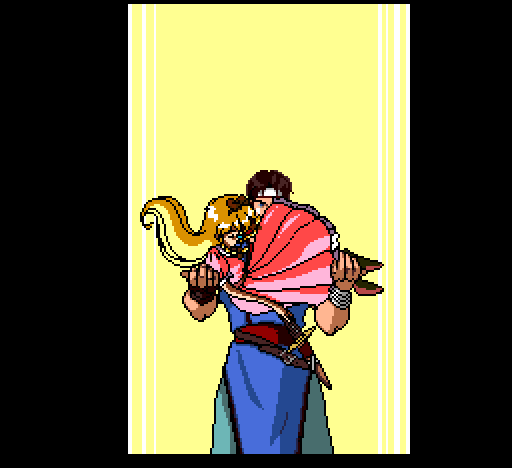
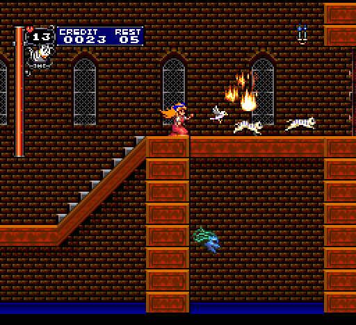

PC-E是款奇葩的主机，它的主CPU只有8bit，跟红白机是一样的。但却另外单独配备了一颗16bit的GPU和另一颗16bit的声音处理芯片。于是这部主机上的优秀游戏都拥有共同的优点：强大的声音和图像效果。
这里我着重推荐一下表关第二关的背景音乐，恶魔城三大名曲之《Vampire Killer（吸血鬼猎人）》在本作中的重制版，动感Q弹，血性十足。
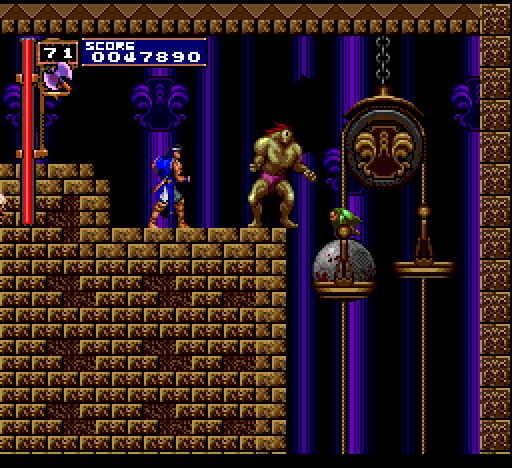

画面就更是美轮美奂。出品时间晚于本作的SFC《XX》和MD《血族》的画面都不及本作精细。大约一多半的怪物贴图直接被《月下》拿了去用也可以间接说明这一特色。
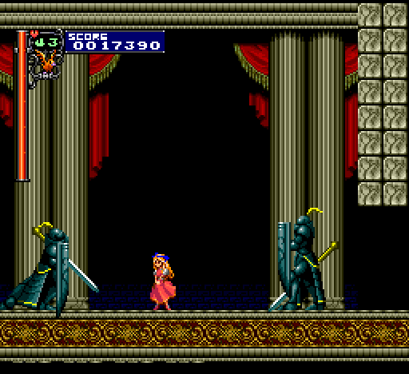
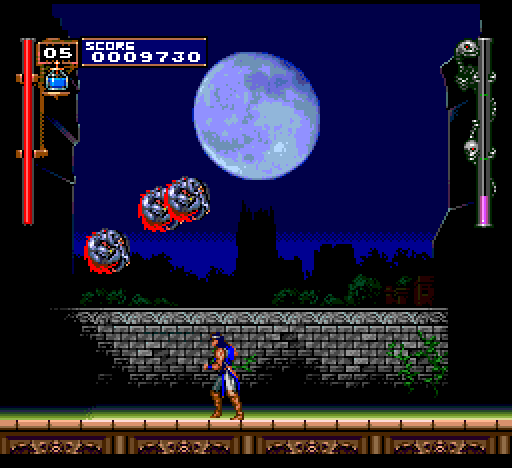

另外一个特色是隐藏的关卡。三代虽然有分支路线的选择，但是明面提供了选项的。而本作“里关”都是出现在不起眼的分岔路上，一不小心就好回到“表关”。里希特有两个红颜知己只有走里路线才能救到，想达成救出4个MM的完美结局就要表里路线各走一遍，这也是后来银河城系列多结局和隐藏地图的开端吧。
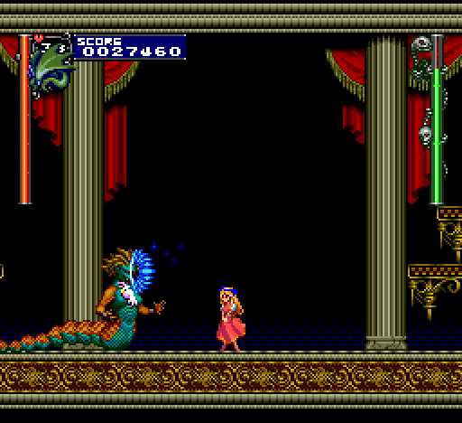

但本作也有巨大的缺陷。因为使用CD介质，所以塞进了大量的动画剧情。动画的分镜头非常死板还跳不过去，实在是够无聊的。
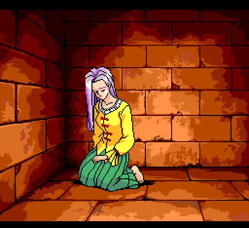

死神在这一作出现了两次。第二次使用“副武器崩坏”放他娘的，非常爽。
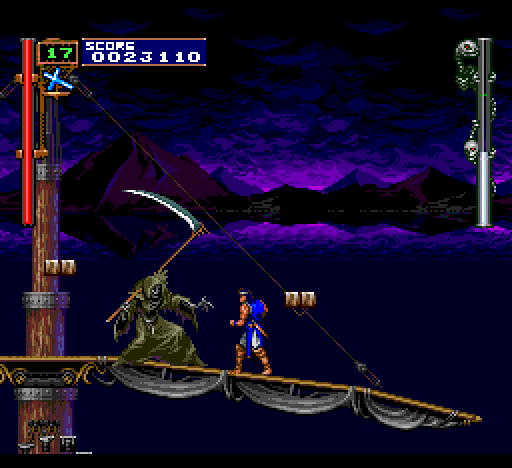
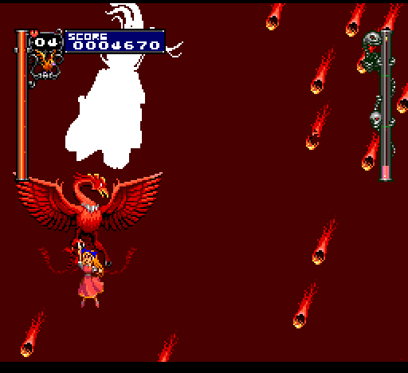
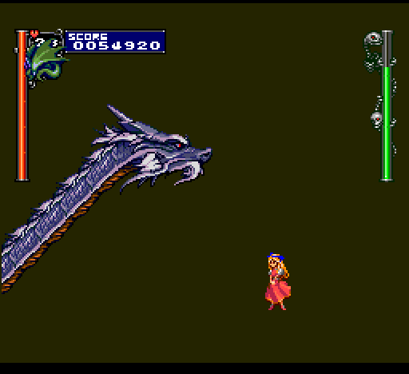

其余的BOSS也很多老朋友。卡米拉、科学怪人、美杜莎……
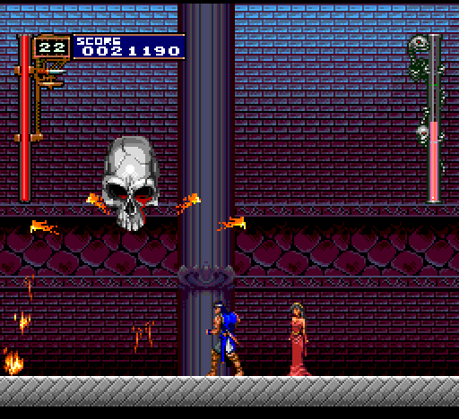
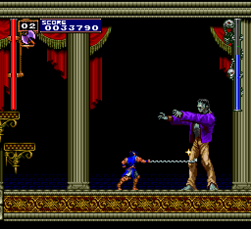
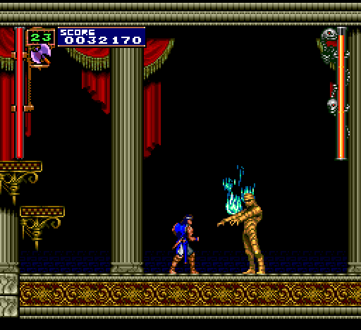

最终的德古拉，跟月下简直一毛一样！
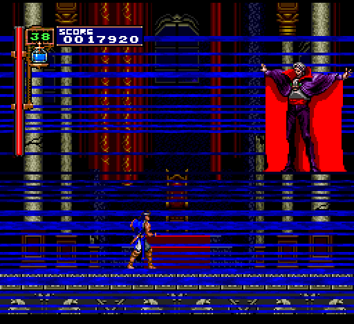
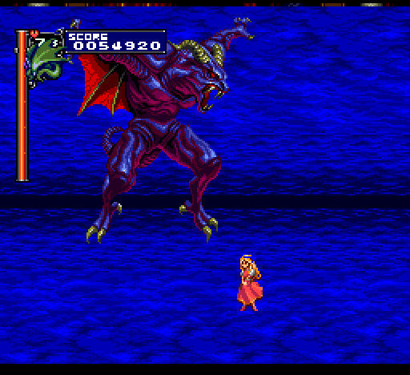

通关。

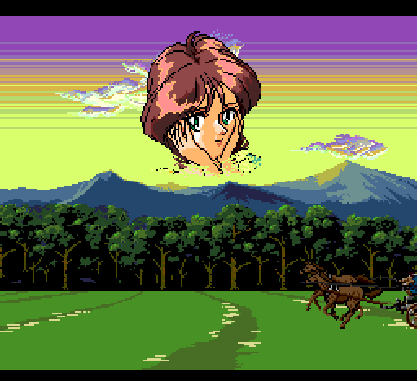
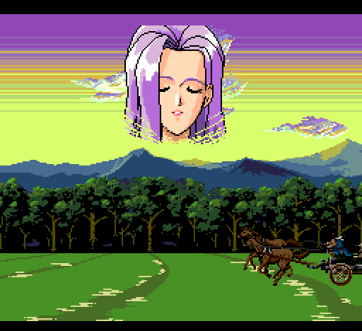
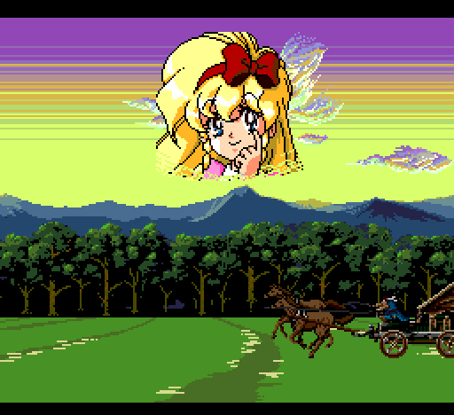
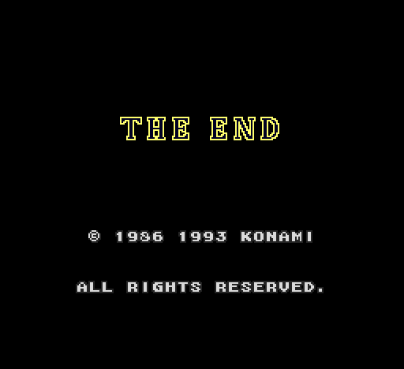
如果用玛丽亚通关的话，画风也会变得怪怪的。
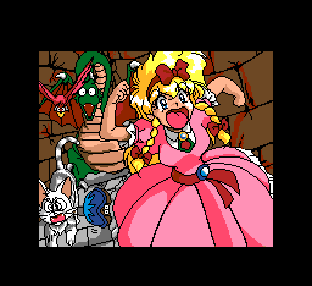
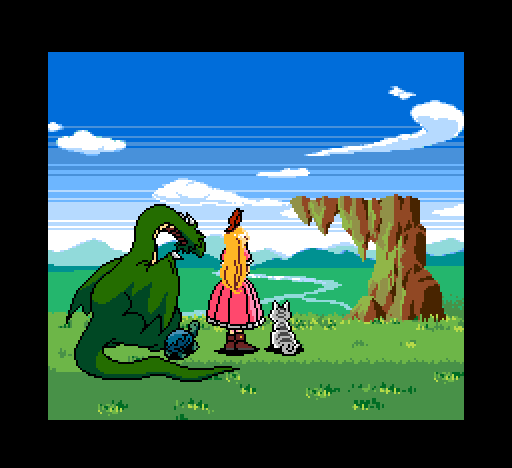

---

- [(1)](https://pewae.com/2023/09/castlevania-rondo-of-blood.html#inner_ref_1)：恶魔城I代和II代的主角
- [(2)](https://pewae.com/2023/09/castlevania-rondo-of-blood.html#inner_ref_2)：恶魔城传说（三代）主角