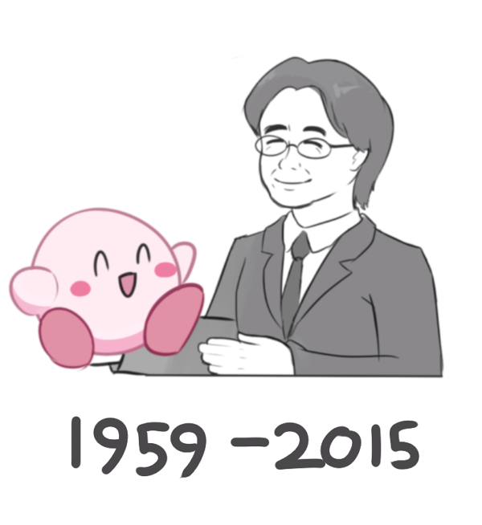

任天堂社长岩田聪先生7月11日去世了。
一个给人带来快乐的人走了。

正式合并到任天堂前,岩田从HAL的程序员一直做到社长的位置。他开发的《气球岛》一直就是我心目中玩不好却一直放不下的游戏。还有卡比，任天堂的角色里我最喜欢的就是这个粉嘟嘟的胖子。
后来岩田做了任天堂的社长。
他的任期里发售了NDS。我看到一个可以通过触摸来玩的解谜游戏（雷顿教授）的时候，立即决定自己也要弄一个回来。
他主持开发了Wii。招呼三五好友回家每人一只手柄在电视前疯狂的摇动疯狂的笑，无论何时回忆起来都是那么的快乐。
经济危机，岩田坚持不裁员，他说：“心理惴惴的开发人员是做不出让人快乐的游戏的。”

我喜欢玩游戏。我讨厌3A大作。我玩的是简单快乐，而不是什么华丽刺激真实感人。
岩田的游戏理念正是“好玩”。
如此一个有契合度的业界领袖走了，我不知还能不能在新游戏里找到“好玩”二字。

我不想用悲伤的曲子去纪念快乐的人。

Audio Player

[http://ocremix.dreamhosters.com/files/music/remixes/Balloon_Fight_Ska_Poppin%27_OC_ReMix.mp3](https://pewae.com/gaan/aHR0cDovL29jcmVtaXguZHJlYW1ob3N0ZXJzLmNvbS9maWxlcy9tdXNpYy9yZW1peGVzL0JhbGxvb25fRmlnaHRfU2thX1BvcHBpbiUyN19PQ19SZU1peC5tcDM=)

00:00

00:00

00:00

[Use Up/Down Arrow keys to increase or decrease volume.](javascript:void(0);)

R.I.P.