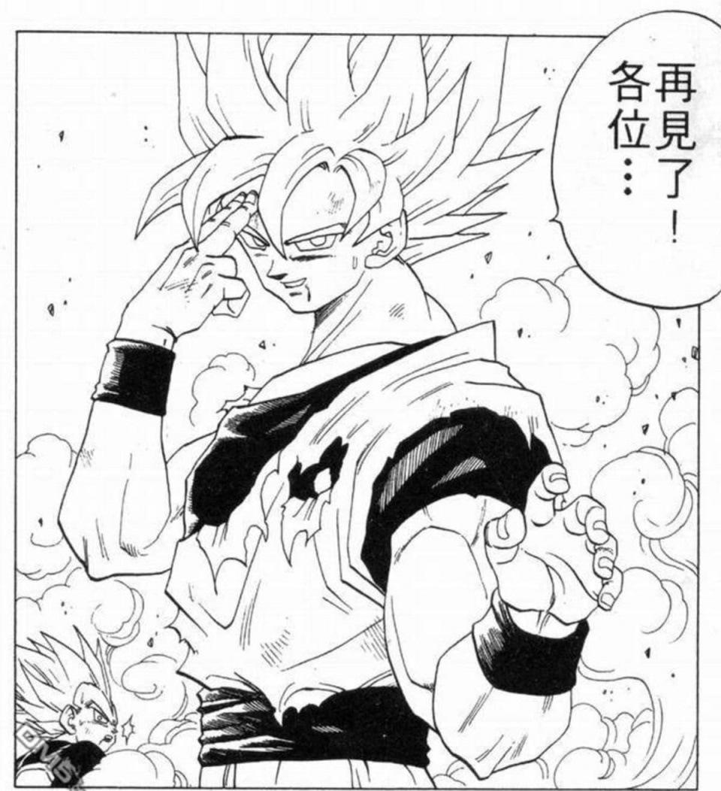

鸟山明先生于2024年3月1日去世了。
又一个给童年带来快乐的人走了。

1991年春天，追捧《圣斗士》的热潮还未褪去之时，3P哥给我推荐一套新漫画《七龙珠》。推荐语是《七龙珠》比《圣斗士》有趣得多。只不过那时的我囊中羞涩，一块九的圣斗士买不起，两块二的七龙珠就更买不起了。从小伙伴手里也借不到全套，看得一知半解。
1992年春天，转学去了新学校。每天上学要坐11站公交，还包括一次换乘。每当值日，我就会住到离学校只有1000米左右的大姨家。某个周一值日，恰逢周日我在甘井子图书馆少年区借到了一本龙珠前N回的合订本，准确的说，是到第22回天下第一武道会打天津饭。公交车看了一路，到大姨家之后又反复看了两遍。
1992年暑假结束，一位好心的黄同学分三次借给我了海南版的第五卷到第七卷。故事算是续上了。然而，还是差了小林之死的那一段，耿耿于怀。
1992年12月30日，小学最后一次新年晚会。黄同学带去了八（贝吉塔和那巴卷）、九（战斗在娜美克星卷）两卷和第十卷（重返地球卷）的第一集。黄同学是那天晚会上最靓的崽。黄同学手上不仅有全套的《七龙珠》，他还有15本《龙珠Z》。
1993年5月，小学阶段最后一次春游，大鹏同学分享了重返地球卷的后两集和未来人造人卷的前两集。至此，心中的恶魔再也禁锢不住，春游放学后就绕道去了书摊，买了后续的未来人造人卷第三集《超级贝吉塔》。
此后的海南版本本不落。此时的单行本出版已经追进日本的连载进度，所以出书时间完全不确定。上了初中，养成了每天中午去书摊逛一圈的习惯。
1993年11月，与同桌宝宝成了好朋友。他有前面的全套龙珠。这才陆续补全了前面的故事。
1994年1月，寒假，迎来了悟空辞世卷的前两集。以为故事就此终结。
《画王》杂志1993年便已创刊。起初对此杂志毫无感觉，直到第七期，爆出惊天猛料：画王开始连载《七龙珠》。同样是1994年的寒假，此时画王已经出到第11期，我跑了二十几家书摊，凑齐了前面十期画王。
因为版权问题，《画王》后面的某期又忽然不再连载《七龙珠》。而闻到血腥味的盗版商却开始猪突猛进。什么《新画王》、《XX卡通》、《少年XX》，无一不是用连载最新版龙珠作为卖点。最恶心的时候，两三本杂志放的是龙珠的同一回。好在这时我已经是太原街卖书老太太家的超级VIP，可以先翻后买，发现已经看过，给放回去就行。
到1996年夏天，穿梭于形形色色的盗版杂志中，故事没落下，海南美术摄影出版社却倒下了。水蓝色封面的那一卷，换了好几个出版社。而再往后的版本，都不知该选哪家的才好。
我一点儿也不喜欢坏布欧出现以后的故事。不过我也不是弗利萨党，我是个沙鲁派。高中以后我也失去了在各色盗版杂志中厮混的兴趣（主要是换了地方，我不再是书摊VIP了），最后的结尾我还是在2001年通过网络补上的。
我在电视台没看过龙珠动画。下载追过一遍98集版。

我不太喜欢紧张的打斗，喜欢黑绸军篇，皮拉夫篇，短笛篇，基纽篇，悟饭和比迪丽篇。
最喜欢弥次郎兵卫，其次16号，再次天津饭。

鸟山明先生一路走好。

