戊戌年是平年，全年354天=50.57周。本人在这一年里观影122部，平均每周2.41部。
相对于[丁酉年](https://pewae.com/2018/02/record-of-movies-2017.html)，多看片36部，增长了41.8%。增长率如此之高，主要原因是世界杯开赛前的等待和中场休息。

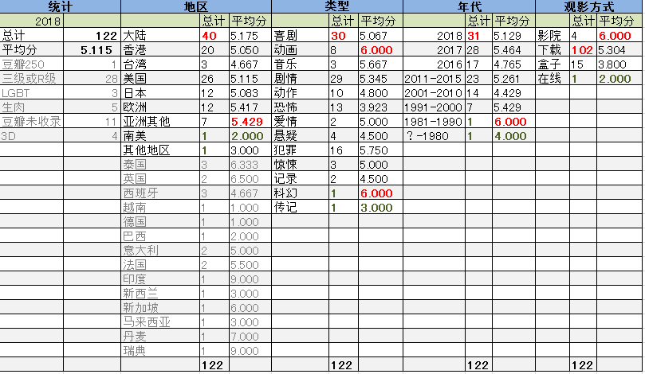

本年度共进电影院4次，比上一年增加一次。仍旧有三次是陪小朋友进的影院；另一次贡献给了黄渤先生的导演作品，略失望。

从评分分布来看，仍旧苛刻，总评分比去年下降了0.397分，可能是跟看了很多小成本恐怖片有关。
以10分制计算，很遗憾，今年没有满分电影出现。0分电影两部，分别是台湾尬片《毕业旅行笑翻天》和不可描述的《XXX，XXX》。

从地区分布上看，陆港台刚好占了51%，比去年下降5%。
大陆片总评分比去年提高了0.425分，在5部以上的统计分布中列倒数第四，算是不小的进步。
今年观看港片的数量是20，比去年的9部增加了一倍，评分却下降了0.7还要多。其中《十年》的表现实在是另我很失望。那个辉煌的年代真的是回不去了。
日本片12部，数量基本与去年持平，评分降低了1.3，跌得很惨，可能是去年看了太多好评片的缘故吧。
美国片26部，几乎是去年的三倍。这跟世界杯的爆米花选片标准有关。评分同样降了0.7。
欧洲片数量小幅增长，评分跟去年差不多。还是因为但凡能选中的，都小有名气，一般不会特别糟烂。但其中法国和西班牙表现都不如去年，倒是北欧的丹麦和瑞典给我惊喜。
今年的处女地开拓，看了一部新西兰片、一部马来西亚片、一部新加坡片和一部越南片，都比较失望。

今年的类型统计，尽量把“剧情”拆开，所以有些分散。
但其实“惊悚”和“恐怖”区别不大，而“音乐”似乎也不是很好的一个类别，这只是一种尝试。
今年评价最好的类型是动画。因为看的数量不太多，而且基本没碰过国产动画。
评价最低的是恐怖片，这真是没办法了，这个类型的门槛太低，而我又喜欢看，所以看的烂片也多。

观看方式来说，仍旧是下载为主，盒子的成绩仍旧惨不忍睹。

今年增加了对于影片发行时间的统计。
不出所料，数量是按照18、17、16的顺序递减的。
本来是记录了观影时间的，可惜[在11月份的事故中](https://pewae.com/2018/12/random_kuso_27.html)记录丢失，只有在新的一年里重新追加了。

因为看片基数增大，所以豆瓣上没记录的片子数量也增加到了11部。最神奇的是《大同》，在我6月份看的时候豆瓣上还存在，到了这个时候再看，这片子已经消失了，难道耿市长出问题了？另外厉害国一片在豆瓣不登录的情况下能访问到，用豆瓣API查不到记录，也是没遇到先例的。
今年的非大陆的所有条目都去imdb查看了分级情况。R级跟三级共28部，占23%。我还是很喜欢很黄很暴力的片子的。比较难缠的是米国标记的未分级，很多时候是因为没有公开上映，有的色情暴力，有的则屁事儿没有，所以没另行统计。
LGBT的片子碰了3部，果然不是我的菜。
啃了5部没有字幕的外语片，包括一部巴西片和一部德国片，不过都是小成本的血浆片，有没有字幕影响不大。
豆瓣250只看了一部《头脑特工队》，不咸不淡，新年没有针对的补片计划。

后面的详情太长，今年增加一个摘要环节：
年度佳作：《斯大林之死》、《此房是我造》、《炙热》、《大佛普拉斯》、《芳华》、《大同》、《树大招风》、《鬼三惊》。
年度抵制：《XXX，XXX》、《毕业旅行笑翻天》、《欧洲攻略》
年度惊喜：《哀乐女子天团》、《暴裂无声》、《不成问题的问题》、《闪光少女》、《透明人的倒霉性事》、《动物世界》
年度失望：《大世界》、《盲·道》、《十年》、《大象席地而坐》、《李茶的姑妈》、《阿尔忒弥斯酒店》、《死亡飞车4》、《一出好戏》、《李宗伟：败者为王》
年度最佳导演：《此房是我造》 拉斯·冯·提尔
年度最佳剧本：《暴裂无声》 忻钰坤
年度最佳男主角：《罪人》 雅各布·克莱恩格
年度最佳女主角：《盲女72小时》 叶玉卿
年度最佳男配角：《赌博默示录》 香川照之
年度最佳女配角：《无名之辈》 任素汐
年度最佳音乐：《雪怪大冒险》
年度最差导演：《妖灵灵》 吴君如
年度最差剧本：《欧洲攻略》 小彭
年度最差男主角：《盲·道》 李杨
年度最差女主角：《大嫂》 徐冬冬

下面是影片的详细信息和三句话简评。
评论皆原创。

[捉妖记2](https://pewae.com/gaan/aHR0cHM6Ly9tb3ZpZS5kb3ViYW4uY29tL3N1YmplY3QvMjY1NzUxMDMv)

导演：许诚毅主演：井柏然 / 伍嘉成 / 吴君如 / 吴莫愁 / 大鹏 / 彭楚粤 / 曾志伟 / 李宇春 / 杨祐宁 / 柳岩类型：动作 / 古装 / 喜剧 / 奇幻地区：大陆 / 香港首映时间：2018

作为低幼向合家欢电影来说勉强合格。
李宇春那个角色是为了凑时间而加的吗？

[头脑特工队](https://pewae.com/gaan/aHR0cHM6Ly9tb3ZpZS5kb3ViYW4uY29tL3N1YmplY3QvMTA1MzM5MTMv)

原名：Inside Out导演：彼特·道格特 / 罗纳尔多·德尔·卡门主演：乔什·库雷 / 保拉·佩尔 / 凯尔·麦克拉克伦 / 凯特林·迪亚斯 / 刘易斯·布莱克 / 大卫·戈尔兹 / 弗兰克·奥兹 / 弗利 / 戴安·琳恩 / 敏迪·卡灵类型：冒险 / 动画 / 喜剧地区：美国首映时间：2015

译名毁好片系列，除了“总动员”就是“特工队”，就找不到其他的语汇了吗？
把情绪做成小人儿，这点子真的很棒！
童年玩伴的消失，和悲伤的加入，意味着人的成长，这就是本片的味道。

[摇滚藏獒](https://pewae.com/gaan/aHR0cHM6Ly9tb3ZpZS5kb3ViYW4uY29tL3N1YmplY3QvMjU3NDk4MTMv)

导演：艾什·布兰农主演：于谦 / 冯小刚 / 刘芸 / 孙越 / 小小岳 / 张雪凌 / 朱云峰 / 路知行 / 郑熙岳 / 郑钧类型：动画 / 音乐地区：大陆 / 美国 / 香港首映时间：2016

太中规中矩了，太模式化了。
即使不用藏獒，不把背景设在雪山上，换成任何一个国家的任何一种动物，也都可以无缝对接。
老郑挂了个编剧的名字，除了放上他自己的、许巍的和朴树的三首歌以外，根本看不到任何特色的东西。

[羞羞的铁拳](https://pewae.com/gaan/aHR0cHM6Ly9tb3ZpZS5kb3ViYW4uY29tL3N1YmplY3QvMjcwMzgxODMv)

导演：宋阳 / 张吃鱼主演：宋阳 / 常远 / 沈腾 / 王智 / 田雨 / 艾伦 / 薛皓文 / 马丽 / 黄才伦类型：喜剧 / 奇幻地区：大陆首映时间：2017

除了马丽毫无亮点。
编剧对于格斗搏击类竞技的理解太差了。

[闪光少女](https://pewae.com/gaan/aHR0cHM6Ly9tb3ZpZS5kb3ViYW4uY29tL3N1YmplY3QvMjY3OTA5NjEv)

导演：王冉主演：乐思宏 / 刘泳希 / 崔可法 / 彭昱畅 / 徐璐 / 李诺 / 汤甄 / 耿乐 / 闫妮 / 陆建艺类型：喜剧 / 音乐地区：大陆首映时间：2017

因为海报美工下跪道歉的事而关注的这个片，不管是不是一种营销吧，片子的质量确实还可以，反正下载看的一分钱没花。
要么现在的ACG跟我所理解的ACG果然不是一个东东。
能不能别一尬音乐就上《野蜂飞舞》啊，某点上都玩腻了的老梗了——说您呐，音乐总监梁翘柏老师。

[我心雀跃](https://pewae.com/gaan/aHR0cHM6Ly9tb3ZpZS5kb3ViYW4uY29tL3N1YmplY3QvMjY3NjEzMzQv)

导演：刘紫微主演：任运杰 / 修健 / 刘北妍 / 周楚濋 / 孙伊涵 / 宋宁峰 / 杜双宇 / 池韵类型：剧情地区：大陆首映时间：2017

作为青春片，启用年轻演员，描写高中生的小暧昧，值得称道。
剧情不矫情，没有堕胎车祸出国之类的狗血。
可能女生们看了会有感觉吧，对于大老爷们儿来说，太闷。

[老笠](https://pewae.com/gaan/aHR0cHM6Ly9tb3ZpZS5kb3ViYW4uY29tL3N1YmplY3QvMjYzNTI0NjIv)

导演：火火主演：冯淬帆 / 卢惠光 / 周祉君 / 姜皓文 / 崔碧珈 / 曾国祥 / 林雪 / 郭伟亮 / 雷琛瑜 / 马志威类型：惊悚 / 犯罪地区：香港首映时间：2016

并没有传说得那么好。
冯淬帆大叔演得非常不错，剩下也就崔碧珈的身材可以谈一谈了。
主人公回魂的设定个人感觉非常之蛋疼，一帮鬼要不是为了用他的尸体，折腾这半天干嘛，闲得慌吗？

[妖铃铃](https://pewae.com/gaan/aHR0cHM6Ly9tb3ZpZS5kb3ViYW4uY29tL3N1YmplY3QvMjY5NjY1ODAv)

导演：吴君如主演：吴君如 / 吴镇宇 / 周冬雨 / 姜逸磊 / 岳云鹏 / 张译 / 方中信 / 李亦航 / 李尚正 / 沈腾类型：喜剧 / 惊悚地区：大陆首映时间：2017

大名鼎鼎的Papi戏份太少，简直一路人嘛，经纪公司公关太不到位了。
吴君如算有野心，却没找对人——那帮“喜剧人”里，没几个像当年的冯巩叔叔那么适合大银幕的。
剪辑太烂了。

[火锅英雄](https://pewae.com/gaan/aHR0cHM6Ly9tb3ZpZS5kb3ViYW4uY29tL3N1YmplY3QvMjU2NjIzMjcv)

导演：杨庆主演：任敏 / 凌琳 / 唐佐辉 / 喻恩泰 / 尹昉 / 张亦驰 / 李九霄 / 李润 / 王彦霖 / 王紫璇类型：剧情 / 犯罪地区：大陆首映时间：2016

在国产片里算少见的血腥，这点很赞。
白百合的副作用跟陈坤的正作用正好抵消了。

[西谎极落之太爆太子太空舱](https://pewae.com/gaan/aHR0cHM6Ly9tb3ZpZS5kb3ViYW4uY29tL3N1YmplY3QvMjY4NTcxNzAv)

导演：吴兆麟 / 吴汉邦主演：卢宛茵 / 吴志雄 / 周柏豪 / 周祉君 / 宋本中 / 庄思敏 / 张继聪 / 徐浩昌 / 杜小乔 / 林敏骢类型：喜剧地区：大陆 / 香港首映时间：2017

还算保留了那么点儿老港片黑色幽默的风骨。
作为《一路向西》的续集，就给看个郑欣宜这个死胖子，这合适吗？

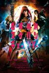

[电锯少女血肉之华](https://pewae.com/gaan/aHR0cHM6Ly9tb3ZpZS5kb3ViYW4uY29tL3N1YmplY3QvMjY2MDkxMjkv)

原名：血まみれスケバンチェーンソー导演：山口ヒロキ主演：中村誠治郎 / 佐藤圣罗 / 内田理央 / 奥田佳弥子 / 山地真理 / 玉城裕规 / 西村禮 / 阿部恍沙穂类型：动作 / 恐怖地区：日本首映时间：2016

我本身是挺喜欢这种日式低成本搞笑B级片的，但本片实在缺乏特色。
除了一个哔射迫击炮以外再没什么脑洞了。
以及女主女配都太丑了。

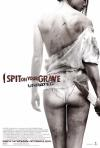

[我唾弃你的坟墓（2010）](https://pewae.com/gaan/aHR0cHM6Ly9tb3ZpZS5kb3ViYW4uY29tL3N1YmplY3QvMzA5NzA0NC8=)

原名：I Spit on Your Grave导演：史蒂文·R·蒙若尔主演：Amber Dawn Landrum / Mollie Milligan / 丹尼尔·弗兰泽兹 / 安德鲁·霍华德 / 崔西·沃特 / 杰夫·布兰森 / 查德·林德伯格 / 罗德尼·伊士曼 / 莎拉·巴特勒 / 萨克斯·沙比诺类型：恐怖 / 惊悚地区：美国首映时间：2010

没看过老版，谈不上什么对比。
看完没感觉，可能因为女主身材一般而坏人演得不够凶吧。

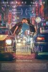

[天亮之前](https://pewae.com/gaan/aHR0cHM6Ly9tb3ZpZS5kb3ViYW4uY29tL3N1YmplY3QvMjYzNTI0NDAv)

导演：吴中天主演：周雨彤 / 安志杰 / 春夏 / 李浩菲 / 杨子姗 / 范湉湉 / 郝蕾 / 郭富城 / 高捷类型：爱情地区：台湾 / 大陆 / 香港首映时间：2016

杨子珊扮相不错。
故事太矫情，后面的大翻转太假。
豆瓣给推荐这个，是收了公关费了吧……

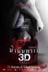

[尸油 3D](https://pewae.com/gaan/aHR0cHM6Ly9tb3ZpZS5kb3ViYW4uY29tL3N1YmplY3QvMjU5OTMwNjcv)

原名：น้ำมันพราย 3D导演：Dulyasit Niyomgul主演：瓦妮达·特姆散纳波类型：恐怖 / 情色 / 惊悚地区：泰国首映时间：2014

女主的颜和身材都可以的。
特效也太五毛了，女主黑化的时候变的鬼真的是黑色的。

[人皮客栈](https://pewae.com/gaan/aHR0cHM6Ly9tb3ZpZS5kb3ViYW4uY29tL3N1YmplY3QvMTQ1NjE5Ny8=)

原名：Hostel导演：伊莱·罗斯主演：Jana Havlickova / Jana Kaderabkova / Keiko Seiko / Lubomír Bukový / Milda Jedi Havlas / Patrik Zigo / Petr Janis / 三池崇史 / 德里克·理查德森 / 扬·弗拉萨克类型：恐怖地区：捷克 / 美国首映时间：2005

斯洛伐克被黑惨了。
好不容易救出来的日本人被火车撞死的桥段，很喜欢。

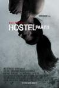

[人皮客栈2](https://pewae.com/gaan/aHR0cHM6Ly9tb3ZpZS5kb3ViYW4uY29tL3N1YmplY3QvMTc5MzU3MS8=)

原名：Hostel: Part II导演：伊莱·罗斯主演：劳伦·日尔曼 / 希瑟·玛塔拉佐 / 理查德·布基 / 碧悠·菲利浦斯 / 罗杰·巴特类型：恐怖 / 惊悚地区：美国首映时间：2007

把1的主角团队换成女的，人数增加1个，再拍一遍就成了个新电影？
女主团队里那个相貌清奇的白人在《女间谍》里出现过，这长相的也可以脱？！
继续黑斯洛伐克。

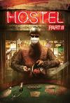

[人皮客栈3](https://pewae.com/gaan/aHR0cHM6Ly9tb3ZpZS5kb3ViYW4uY29tL3N1YmplY3QvMzE0Nzk2OS8=)

原名：Hostel: Part III导演：斯科特·斯皮格尔主演：布莱恩·哈利塞 / 琦普·帕杜 / 约翰·亨斯利类型：恐怖地区：美国首映时间：2011

总算不黑东欧国家了，而是搬回了拉斯维加斯。
血量和奶量都不足，可谓毫无亮点。

[灭门惨案之孽杀](https://pewae.com/gaan/aHR0cHM6Ly93d3cuaW1kYi5jb20vdGl0bGUvdHQwMTA3NTcyLw==)

导演：黎继明主演：何家驹 / 吴岱融 / 吴毅将 / 钟淑慧 / 黄秋生类型：喜剧 / 惊悚地区：香港首映时间：1993

三级片里难得的精品，黄秋生和何家驹表现完美。
女主身材很好，鼻子往上像年轻的张曼玉，不知为什么没红起来。
那些年黑大陆公安的段子，还挺有趣的。

[比得兔](https://pewae.com/gaan/aHR0cHM6Ly9tb3ZpZS5kb3ViYW4uY29tL3N1YmplY3QvMjY2NDk2MDQv)

原名：Peter Rabbit导演：威尔·古勒主演：伊丽莎白·德比茨基 / 伊文·莱斯利 / 多姆纳尔·格里森 / 山姆·尼尔 / 希雅 / 玛格特·罗比 / 科林·穆迪 / 罗丝·伯恩 / 詹姆斯·柯登 / 黛西·雷德利类型：冒险 / 动画 / 喜剧地区：美国首映时间：2018

技术细节无可挑剔，笑点也挺合适的。
就是女主太讨人厌了，她那么喜欢兔子，就不能自己种菜喂吗？

[灭门惨案2：借种](https://pewae.com/gaan/aHR0cHM6Ly93d3cuaW1kYi5jb20vdGl0bGUvdHQwMTEwNTEz)

导演：黎继明主演：何家驹 / 刘的之 / 卢敏仪 / 吴毅将 / 廖启智 / 张兰英 / 郑艳丽 / 韩坤类型：喜剧 / 惊悚地区：香港首映时间：1994

仍旧是灭门的故事，仍旧是倒叙插叙的结构，仍旧黑大陆公安，有些审美疲劳。
《天下无敌》里的吴毅将竟然有演这么憋屈的角色的时候——越战阳痿老兵。
女主角身材很好，表情就有些做作，最后杀人时两眼圆瞪的样子让我想起了杨天宝同学，随即出戏了。

[童军手册之僵尸启示录](https://pewae.com/gaan/aHR0cHM6Ly9tb3ZpZS5kb3ViYW4uY29tL3N1YmplY3QvNjg3NDE0MC8=)

原名：Scouts Guide to the Zombie Apocalypse导演：克里斯托弗·兰登主演：大卫·科恩查内 / 布莱克·安德森 / 帕特里克·施瓦辛格 / 德鲁·德勒格 / 泰伊·谢里丹 / 洛根·米勒 / 莎拉·杜蒙 / 莎拉·玛卢库·莱恩 / 豪斯顿·塞奇 / 马修·卡德罗普类型：喜剧 / 恐怖地区：美国首映时间：2015

既青春又恶俗既香艳又搞笑的僵尸片——懵懂的少年逃亡的过程中去摸变成僵尸的女保安曝露的大咪咪。
扯僵尸的JB那段真是又恶俗又搞笑，真是能扯啊。
两个女主角要颜有颜要凶有凶，还有小施瓦辛格的客串，总之挺愉快的片片。

[极乐宿舍](https://pewae.com/gaan/aHR0cHM6Ly9tb3ZpZS5kb3ViYW4uY29tL3N1YmplY3QvMjY3OTEzNTIv)

导演：林世勇主演：刘峻纬 / 卜学亮 / 李程彬 / 李铨 / 李颖 / 洪晨颖 / 王暄晴 / 王朵朵 / 石知田 / 黄尹宣类型：喜剧地区：台湾首映时间：2016

开头非常不错，但勇斗地产商之后，剧情直接跳到7年之后，变成了平庸的三角恋苦情戏，实在是虎头蛇尾。
偌大一个台湾岛，找不到一个颜值在线的女主角了吗？
男主角的性格就是欠收拾，台岛受日本漫画的影响还是太大了。

[少女椿](https://pewae.com/gaan/aHR0cHM6Ly9tb3ZpZS5kb3ViYW4uY29tL3N1YmplY3QvMjY3MjY5MTIv)

导演：托丽可主演：中村里砂 / 中谷彰宏 / 佐伯大地 / 森野美咲 / 武瑠 / 深水元基 / 风间俊介 / 鸟居美雪 / 鸟肌实类型：剧情 / 恐怖地区：日本首映时间：2016

大女主的片，女主撑不起来，片子也就废掉了。
每个角色刻画得都不够细致，整体上糊掉也不足为怪。

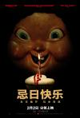

[忌日快乐](https://pewae.com/gaan/aHR0cHM6Ly9tb3ZpZS5kb3ViYW4uY29tL3N1YmplY3QvMjcwMjc5MTMv)

原名：Happy Death Day导演：克里斯托弗·兰登主演：伊瑟尔·布罗萨德 / 劳拉·克利夫顿 / 布雷迪·刘易斯 / 拉姆齐·安德森 / 杰森·拜尔 / 杰西卡·罗德 / 查尔斯·艾特肯 / 瑞秋·马休斯 / 罗布·梅洛 / 露比·莫迪恩类型：恐怖 / 悬疑 / 惊悚地区：美国首映时间：2018

一切都中规中矩，连最后的大翻转也是，所以难起波澜。
女主非常漂亮。

[斯大林之死](https://pewae.com/gaan/aHR0cHM6Ly9tb3ZpZS5kb3ViYW4uY29tL3N1YmplY3QvMjY3Nzk4ODUv)

导演：阿尔曼多·伊安努奇主演：史蒂夫·布西密 / 安德丽娅·赖斯伯勒 / 帕迪·康斯戴恩 / 杰弗里·塔伯 / 欧嘉·柯瑞兰寇 / 理查德·布雷克 / 詹森·艾萨克 / 迈克尔·帕林 / 阿德里安·麦克洛格林 / 鲁伯特·弗兰德类型：传记 / 历史 / 喜剧地区：英国首映时间：2017

真实状态下的搞笑。
本来对苏联历史不屑一顾，因为我记不住那种又长又拗口的斯拉夫名字，但看完片子后认真地去自行科普了一下“贝利亚”、“马林科夫”、“贝尔加宁”、“莫洛托夫”，以及重新认识了一下朱可夫和赫鲁晓夫。
制片方都从哪找来的这帮老戏骨，状态拿捏得太到位了……

[天使的性](https://pewae.com/gaan/aHR0cHM6Ly9tb3ZpZS5kb3ViYW4uY29tL3N1YmplY3QvMzE0ODA2OC8=)

原名：El sexo de los ángeles导演：泽维尔·比利亚韦德主演：Lluïsa Castell / 略伦斯·冈萨雷斯 / 阿尔瓦罗·塞万提斯 / 阿斯特丽德·伯格斯-弗瑞斯贝类型：剧情 / 同性 / 情色 / 爱情地区：西班牙首映时间：2012

女主角是加勒比海盗4里那只人鱼，有脱，身材不咋样。
虽然故事有点奇葩，但终归是个沉闷的爱情片。

[大嫂](https://pewae.com/gaan/aHR0cHM6Ly9tb3ZpZS5kb3ViYW4uY29tL3N1YmplY3QvMjY5OTY3ODMv)

导演：阚家伟主演：任娇 / 伍允龙 / 叶项明 / 吴毅将 / 张锦程 / 徐冬冬 / 文凯玲 / 郑子诚 / 黄文慧 / 黎彼得类型：剧情 / 悬疑 / 犯罪地区：香港首映时间：2017

真是可惜了这帮香港的老戏骨。
这女主演得太尬了，每一个表情每一个动作每一句台词都让人出戏，偏偏是大女主的片子，所以就废掉了。
王晶哪怕你找（cao）不到下一个邱淑贞下一个张敏，能找到下一个孟瑶也好啊，这个长得像杨丽菁的真不是演戏这块料！

[痞客青春](https://pewae.com/gaan/aHR0cHM6Ly9tb3ZpZS5kb3ViYW4uY29tL3N1YmplY3QvMjQxNjM1MjMv)

原名：เกรียนฟิคชั่น导演：楚克·萨克瑞科主演：Bawriboon Chanreuang / Nitit Warayanon / Purim Rattanaruangwattana / 兰可娜拉·皮艾塔 / 可林桑拉铺·皮木颂克朗 / 帕塔丹·詹金 / 瓦妮达·特姆散纳波 / 维特维斯特·海伦亚沃恩酷 / 齐提萨克·帕通布拉纳类型：喜剧地区：泰国首映时间：2013

泰国的青春片，虽然也挺狗血的，但拍得比较真诚，而且泰国的演员起码看起来比较嫩。
他姐其实是他妈这种桥段，也是细思极恐了，起码国内是过不了审的吧……

[鲨滩](https://pewae.com/gaan/aHR0cHM6Ly9tb3ZpZS5kb3ViYW4uY29tL3N1YmplY3QvMjYwMDAyMDUv)

原名：The Shallows导演：佐米·希尔拉主演：塞多纳·利 / 奥斯卡·贾恩那达 / 布莱特·卡伦 / 布蕾克·莱弗利类型：冒险 / 惊悚地区：美国首映时间：2016

莱弗利也没多老啊，怎么满脸褶子的样子，虽然身材是真好。
鲨鱼太假了。
氛围营造得不错，小制作精品。

[豆福传](https://pewae.com/gaan/aHR0cHM6Ly9tb3ZpZS5kb3ViYW4uY29tL3N1YmplY3QvMjY3MDUxMDcv)

导演：邹燚主演：付博文 / 季冠霖 / 张磊 / 李立宏 / 李立群 / 樊俊航 / 胡健 / 赵毅 / 陈佩斯类型：动画地区：大陆首映时间：2017

虎头蛇尾到这种地步，简直无耻。
从飞碟出来那一刻开始，全崩了。
方文山+王力宏的主题歌，明显敷衍，写的唱的都叫什么玩意儿！

[硬汉](https://pewae.com/gaan/aHR0cHM6Ly9tb3ZpZS5kb3ViYW4uY29tL3N1YmplY3QvMjIyMjk5NS8=)

导演：丁晟主演：于荣光 / 刘洋 / 刘烨 / 孙红雷 / 尤勇智 / 陈雅伦 / 黄秋生类型：动作 / 喜剧地区：大陆首映时间：2008

刘烨用力过猛，尤勇用力过猛，黄秋生用力过猛。
让一个神经病拿个红缨枪在大街上“见义勇为”，这剧情真的不是高级黑？
后面狂躁的小弟摔了个青铜头盔，黄秋生痛心疾首地骂：“你不能摔700年前的东西”，可是元朝哪来的青铜头盔？

[芳华](https://pewae.com/gaan/aHR0cHM6Ly9tb3ZpZS5kb3ViYW4uY29tL3N1YmplY3QvMjY4NjI4Mjkv)

导演：冯小刚主演：张仁博 / 李晓峰 / 杨采钰 / 王可如 / 王天辰 / 苏岩 / 苗苗 / 钟楚曦 / 隋源 / 黄轩类型：剧情 / 历史 / 战争地区：大陆首映时间：2017

看完挺感动的，冯大导用他的角度诠释了50末60初的青春，很真诚。
那段篇幅不长的战争场面，代入感十足，比手撕100个鬼子都要震撼。
男猪在海南拉书，结合年代，该不会是“海南美术摄影出版社”的小弟吧，那应该很挣钱的说。

[大世界](https://pewae.com/gaan/aHR0cHM6Ly9tb3ZpZS5kb3ViYW4uY29tL3N1YmplY3QvMjY5NTQwMDMv)

导演：刘健主演：刘健 / 施海涛 / 曹寇 / 曹恺 / 朱昌龙 / 朱虹 / 杨思明 / 王达 / 薛峰 / 马晓峰类型：剧情 / 动画 / 犯罪地区：大陆首映时间：2018

好的时候可以自吹简陋和艰苦的不易，但是艰苦和简陋不等同于好。
剧情很一般，废镜头又多，配音更是让人出戏，如果是真人版而非动画，绝对得不了那么高的分。
唯有中间的那首不到5分钟的MV不错。

[追龙](https://pewae.com/gaan/aHR0cHM6Ly9tb3ZpZS5kb3ViYW4uY29tL3N1YmplY3QvMjY0MjUwNjgv)

导演：关智耀 / 王晶主演：刘德华 / 刘浩龙 / 喻亢 / 姜皓文 / 徐冬冬 / 汤镇业 / 甄子丹 / 胡然 / 郑则仕 / 黄日华类型：动作 / 犯罪地区：香港首映时间：2017

只要王晶愿意，拍出的东西还是可以看的，虽然片尾的字幕太广电特色了些。
刘德华吴毅将黄日华年纪差不多，都年届花甲了，汤镇业业已六十好几大腹便便，转眼都称得上是德高望重的老艺术家了。
片子里别人都穿短袖，甄子丹偏偏要穿个皮夹克，也不怕长痱子！

[侍女](https://pewae.com/gaan/aHR0cHM6Ly9tb3ZpZS5kb3ViYW4uY29tL3N1YmplY3QvMjY4NTU2OTUv)

原名：Cô Hâu Gái导演：Derek Nguyen主演：凯特·绒 / 吉恩·米歇尔·里肖德 / 罗茜·费尔纳 / 金春类型：恐怖 / 惊悚地区：越南首映时间：2016

小成本恐怖片果然是烂片重灾区，哪怕越南出品也不能幸免。
女主颜值尚可，片子快结束的时候有不到半秒的漏点镜头。

[树大招风](https://pewae.com/gaan/aHR0cHM6Ly93d3cuaW1kYi5jb20vdGl0bGUvdHQ0Mzc5ODAw)

导演：frank hui / jevons au / vicky wong主演：任贤齐 / 林家栋 / 陈小春类型：剧情 / 犯罪地区：香港首映时间：2016

林家栋很出色，山鸡哥一般，任贤齐有进步，却仍旧有些ging。
任贤齐的故事里有个特大穿帮镜头——97年的背景下出现了中国梦的宣传标语，还给了3秒钟特写，以至于都搞不清导演是不是故意反讽了。
整部片子用一句诗就能概括：“青山遮不住，毕竟东流去”，是近年来难得的港片精品，实在搞不懂禁掉的理由是什么。

[红辣椒](https://pewae.com/gaan/aHR0cHM6Ly9tb3ZpZS5kb3ViYW4uY29tL3N1YmplY3QvMTg2NTcwMy8=)

原名：パプリカ导演：今敏主演：兴梠里美 / 古谷彻 / 堀胜之祐 / 大塚明夫 / 山寺宏一 / 岩田光央 / 林原惠美 / 江守彻 / 爱河里花子 / 田中秀幸类型：动画 / 悬疑 / 惊悚 / 科幻地区：日本首映时间：2006

梦境与现实的快速精彩切换。
不像个打败恶人的故事，而像在讨论“自我”与“本我”应该如何相处。
林原惠美同时扮演两个人格的本事非常厉害。

[未分级电影](https://pewae.com/gaan/aHR0cHM6Ly9tb3ZpZS5kb3ViYW4uY29tL3N1YmplY3QvNDAzNjUxOS8=)

原名：Unrated: The Movie导演：安德里亚·斯纳斯 / 蒂莫·罗斯主演：埃莉诺·詹姆斯 / 安妮卡·施特劳斯 / 安德里亚·斯纳斯 / 托比亚斯·皮韦克 / 维维安·施密特 / 艾琳·达利 / 萨沙·哈特曼 / 蒂莫·罗斯 / 马里奥·兹默希特类型：恐怖地区：德国首映时间：2009

小成本恐怖片果然是烂片重灾区，哪怕德国出品也不能幸免。
最后十五分钟5分，前七十五分钟0分，平均下来1.25分。
虽然最后的裸女战僵尸尺度很大，而且四位女主几乎都脱了，但实在长得太丑了，不能加分。

[死人的收藏](https://pewae.com/gaan/aHR0cHM6Ly9tb3ZpZS5kb3ViYW4uY29tL3N1YmplY3QvMTE1MzMwNjE=)

原名：Coleção de Humanos Mortos导演：Fernando Rick主演：Fabio de Castro / Luciana Caruso / Tiara Cury类型：恐怖地区：巴西首映时间：2005

小成本恐怖片果然是烂片重灾区，哪怕巴西出品也不能幸免。
片长一共才21分钟，竟然有长达3分钟的片尾staff，实在丧心病狂。
小确幸的是，女主角身材和颜都在水准之上。

[省港旗兵4：地下通道](https://pewae.com/gaan/aHR0cHM6Ly93d3cuaW1kYi5jb20vdGl0bGUvdHQwMTAzMTYyLw==)

导演：麦当杰主演：吴雪雯 / 徐锦江 / 程小龙 / 陈敬 / 陈治良类型：动作 / 惊悚 / 犯罪地区：香港首映时间：1990

现在的年轻人真应该看看这部片，因为里面有几个当年浩浩荡荡场面的真实镜头。
徐锦江先生的演技果然不怎么样。
小时候特别不喜欢“血染的风采”，因为在九十年代初的点播节目里出现得太频繁了，现在看来电视台的小编可能是有想法的。

[十年](https://pewae.com/gaan/aHR0cHM6Ly93d3cuaW1kYi5jb20vdGl0bGUvdHQ1MjY5NTYwLw==)

导演：周冠威 / 欧文杰 / 郭臻主演：刘浩之 / 利沙华 / 梁建平 / 陈彼得 / 陈桂芬 / 黄静类型：剧情地区：香港首映时间：2015

它太直白了，像宣传片多过像电影，生硬不好看。
真理部这种完全容不下异种声音的态度令人厌恶。

[在床上](https://pewae.com/gaan/aHR0cHM6Ly93d3cuaW1kYi5jb20vdGl0bGUvdHQwNDc0NjQyLw==)

原名：En la Cama导演：matías·bize主演：blanca·lewin / gonzalo·valenzuela类型：剧情地区：智利首映时间：2005

据说拿了很多奖，其实就是一男一女在一个宾馆里脱衣服，ML，穿衣服，唠嗑，脱衣服，洗澡，ML，穿衣服，脱衣服，唠嗑，ML……成本低到令人发指！
没字幕，再好的戏也看不懂，尤其还是西语的，要不是女主角身材确实一级棒，还真不如看日本动作片了。
imdb上，老美把这部片子算成了未分级，具体描述是“Both characters are never more fully dressed than in their underwear throughout the entire film.”

[隐形人的倒霉性事](https://pewae.com/gaan/aHR0cHM6Ly93d3cuaW1kYi5jb20vdGl0bGUvdHQwMzgyMDE0Lw==)

原名：The Erotic Misadventures of the Invisible Man导演：rolfe·kanefsky主演：doug·merrill / gabriella·hall / holly·hollywood / scott·coppola类型：喜剧 / 科幻地区：美国首映时间：2003

每个（男）人可能都幻想过——如果我能隐身，我就可以随便XXX了——这部片子就是把这种YY拍成了电影。
女主角Gabriella Hall是个典型的美式大美妞，只可惜是假奶。
通篇都是在找机会就拍床戏，跟港式三级片一个路子，豆瓣竟然有记录，难得。

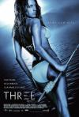

[荒岛惊魂](https://pewae.com/gaan/aHR0cHM6Ly9tb3ZpZS5kb3ViYW4uY29tL3N1YmplY3QvMTQzNzMzMi8=)

原名：Survival Island导演：斯图尔特·拉菲尔主演：凯莉·布鲁克 / 加里·布罗克特 / 比利·赞恩 / 胡安·巴勃罗·迪·帕塞类型：冒险 / 剧情 / 恐怖 / 惊悚地区：美国首映时间：2006

凯利布鲁克和凯莉布鲁克的胸都非常漂亮。
剧情很闷，能把人看睡着了，想讨论人性那套东西，但其实不过是重复了千万遍的真理：女人善变。
血量和气氛都不够，实在称不上是惊悚片。

[唐人街探案2](https://pewae.com/gaan/aHR0cHM6Ly9tb3ZpZS5kb3ViYW4uY29tL3N1YmplY3QvMjY2OTg4OTcv)

导演：陈思诚主演：元华 / 刘承羽 / 刘昊然 / 妻夫木聪 / 尚语贤 / 王宝强 / 王迅 / 白灵 / 肖央 / 迈克尔·皮特类型：动作 / 喜剧 / 悬疑地区：大陆首映时间：2018

一部及格的爆米花电影，而已。
笑点很尬很俗烂，能大卖只能说是人民需要三俗。
或者说同行衬托得好。

[踏血寻梅](https://pewae.com/gaan/aHR0cHM6Ly9tb3ZpZS5kb3ViYW4uY29tL3N1YmplY3QvMjU5NjYwODUv)

导演：翁子光主演：吴嘉星 / 春夏 / 李逸朗 / 杨诗敏 / 白只 / 蔡洁 / 谭耀文 / 邵美琪 / 郭富城 / 金燕玲类型：剧情 / 悬疑 / 犯罪地区：香港首映时间：2015

非常平庸，能得那么多奖只能说港片现在太弱势了。
看的是2小时的导演剪切版，冗长。

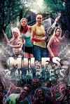

[熟女大战僵尸](https://pewae.com/gaan/aHR0cHM6Ly93d3cuaW1kYi5jb20vdGl0bGUvdHQzNjA5NDU4Lw==)

原名：Milfs vs. Zombies导演：brad·twigg主演：andrea·marie / jenny·jannetty / rosanna·nelson类型：喜剧 / 恐怖地区：美国首映时间：2015

标准B级片，有血有肉的，可尼玛僵尸不吃脑子专吃肠子是怎么回事？
抠一次两次也就罢了，全片里僵尸就没干别的，尤其是有个僵尸把一女的XX了，然后竟然从pussy里揪出肠子来吃，你妹的难道是赵姨娘客串的——“从肠头里生出来的……”

[盲·道](https://pewae.com/gaan/aHR0cHM6Ly9tb3ZpZS5kb3ViYW4uY29tL3N1YmplY3QvMjY0MTUzMjc=)

导演：李杨主演：于越 / 吴一含 / 李杨 / 杜函梦 / 胡明类型：剧情 / 犯罪地区：大陆首映时间：2018

水准跟前两部比确实大相径庭，穷只是一方面，该长的地方短，该短的地方长，小姑娘跟男猪的感情变化没刻画好是最大的毛病，不知跟广电剪刀手有多大关系。
导演亲自上阵，证明了自己是个蹩脚的演员，尤其是台词，分分钟出戏。

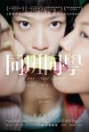

[同班同学](https://pewae.com/gaan/aHR0cHM6Ly9tb3ZpZS5kb3ViYW4uY29tL3N1YmplY3QvMjYzNDgyMTgv)

导演：陆以心主演：卢惠光 / 廖子妤 / 王宗尧 / 苍井空 / 蔡洁 / 谢高晋 / 邵音音 / 郭奕芯 / 陈静 / 麦芷谊类型：剧情地区：香港首映时间：2015

三个援交妹互相抢炮友翻脸撕逼，后来因为找狗而和好的故事，真真微妙的世界观。
一个二个三个都是贫乳，偌大的香港，就不能好好找几个大波妹好好拍三级片吗？
苍井空客串，包得严严实实的，差评！

[不成问题的问题](https://pewae.com/gaan/aHR0cHM6Ly9tb3ZpZS5kb3ViYW4uY29tL3N1YmplY3QvMjY2NTcxMjYv)

导演：梅峰主演：冯满天 / 史依弘 / 张超 / 梁霆炜 / 殷桃 / 王一鸣 / 王侃伟 / 王梓桐 / 范伟 / 蒋中炜类型：剧情地区：大陆首映时间：2017

范伟这个老戏精演得非常好。
原汁原味地还原了原著的神髓，就是两个小时的片长有点儿长。
镜头单调得过分。

[毕业旅行笑翻天](https://pewae.com/gaan/aHR0cHM6Ly9tb3ZpZS5kb3ViYW4uY29tL3N1YmplY3QvMjY1OTc4MDQ=)

导演：张毅 / 胡圣亚 / 高志森主演：徐娇 / 恬妞 / 昌隆 / 林子聪 / 欧阳妮妮 / 王栎鑫 / 禾浩辰 / 蒲冰墨 / 邱胜翊 / 韩雨洁类型：剧情 / 喜剧 / 爱情地区：台湾 / 大陆首映时间：2018

一坨屎。
徐娇才刚刚20岁，这是想烂到什么时候？！

[雌猫们](https://pewae.com/gaan/aHR0cHM6Ly9tb3ZpZS5kb3ViYW4uY29tL3N1YmplY3QvMjY4NjI5MDUv)

原名：牝猫たち导演：白石和弥主演：井端珠里 / 吉村界人 / 吉泽健 / 村田秀亮 / 松永拓野 / 白川和子 / 真上五月 / 美知枝 / 郭智博 / 音尾琢真类型：情色地区：日本首映时间：2017

一个情色片竟然拍出了一点讨论生命意义的味道，还是非常不错的。
要是三个女主胸没那么平就更好了。
一个小孩走丢了，家长和监护人竟然完全不去想人贩子的事儿，日帝国主义更接近和谐社会啊。

[少年，你对群马一无所知](https://pewae.com/gaan/aHR0cHM6Ly9tb3ZpZS5kb3ViYW4uY29tL3N1YmplY3QvMjY5Njk2NzAv)

原名：お前はまだグンマを知らない导演：水野格主演：ほんこん / 入江甚仪 / 加治将树 / 吉村界人 / 山本博 / 椿鬼奴 / 间宫祥太朗 / 马场富美加类型：喜剧地区：日本首映时间：2017

漫画改编，主题是地域歧视和排外，最后强行社会主义价值观一波，成了地方宣传片。
主角表情超级夸张，但作为喜剧，笑料是不足的。
片子的最大亮点是少年们闪光的丁丁以及片尾的胖次拯救全世界。

[我是你妈](https://pewae.com/gaan/aHR0cHM6Ly9tb3ZpZS5kb3ViYW4uY29tL3N1YmplY3QvMjY5NjgwMjQv)

导演：张骁主演：吴大维 / 吴樾 / 吴若甫 / 廖学秋 / 张恒 / 曾江 / 耿乐 / 那威 / 邹元清 / 闫妮类型：剧情 / 喜剧地区：大陆首映时间：2018

一切表演都中规中矩，剧情逻辑性较差。
我住了20年的地方上电影了，给了个不到3秒的大广角，所以有2分的加分。

[麻烦大了](https://pewae.com/gaan/aHR0cHM6Ly9tb3ZpZS5kb3ViYW4uY29tL3N1YmplY3QvMjY3MjM0MjAv)

原名：Labbiamo fatta grossa导演：卡洛·维尔多内主演：卡洛·维尔多内类型：喜剧地区：意大利首映时间：2016

两个老男人演得挺好。
一点儿也不搞笑。

[坑爹游戏](https://pewae.com/gaan/aHR0cHM6Ly9tb3ZpZS5kb3ViYW4uY29tL3N1YmplY3QvMjY5MTQ4MjQv)

导演：米宝主演：于谦 / 倪虹洁 / 傅奕晨 / 李勤勤 / 李立群 / 汪东城 / 韩彦博 / 黄一琳类型：剧情 / 喜剧地区：大陆首映时间：2017

并没有评价的那么差，起码谦叔挑剧本的本事比郭德纲高了一个数量级。
老演员包括于谦、李立群、蒋勤勤都演得很好，女主角和汪东城很尬，导演很垃圾，以及倪虹洁都40了还只能演小三花瓶，真悲哀。
女主角的颜是我中意的类型。

[爱爱囧事](https://pewae.com/gaan/aHR0cHM6Ly9tb3ZpZS5kb3ViYW4uY29tL3N1YmplY3QvMTA3ODE5NTI=)

导演：关尔主演：李曼铱 / 游艺湉 / 王一 / 秦汉擂 / 莫熙儿 / 董玉峰 / 赵奕欢 / 赵雨菁 / 陈美行类型：喜剧 / 爱情地区：大陆首映时间：2013

要是有人能笑出一声来，算我输。
某些镜头take得很下流，但片名其实是标题党，因为女主角叫X爱爱——叫你丫手欠。
男主他爹作为霸道总裁，演得很出色。

[十二星座离奇事件](https://pewae.com/gaan/aHR0cHM6Ly9tb3ZpZS5kb3ViYW4uY29tL3N1YmplY3QvNjg2MTU3My8=)

导演：盛志民主演：乔任梁 / 佟大为 / 宋宁峰 / 张钧涵 / 杜海涛 / 柳岩 / 王景春 / 甘薇 / 秦昊类型：悬疑 / 惊悚 / 犯罪地区：大陆首映时间：2012

国产悬疑恐怖，即使有这么一堆大牌小牌加持，仍是一堆烂泥扶不上墙。
在女主角甘薇的衬托下，头一次觉得柳岩不是靠纯卖胸，还是有演技的。

[厉害了，我的国](https://pewae.com/gaan/aHR0cHM6Ly9tb3ZpZS5kb3ViYW4uY29tL3N1YmplY3QvMzAxNTI0NTEv)

导演：卫铁类型：纪录地区：大陆首映时间：2018

看是为了骂，看完发现想骂但是骂不出来。
内容完全跟你国还是他国没什么关系，标题应该起成《习老先生事事精通处处牛B》。
我要是前任，看到通篇弥漫的“这五年”，能气得跑去中南海上访。

[大佛普拉斯](https://pewae.com/gaan/aHR0cHM6Ly9tb3ZpZS5kb3ViYW4uY29tL3N1YmplY3QvMjcwNTkxMzAv)

导演：黄信尧主演：丁国琳 / 庄益增 / 张少怀 / 戴立忍 / 朱约信 / 李永丰 / 纳豆 / 陈以文 / 陈竹昇 / 雷婕熙类型：剧情 / 喜剧地区：台湾首映时间：2017

小人物的悲哀，与《活着》表达了相同的主题。
女助理的演员，如果是真声出镜的话，很有下海的潜力。
其实片子一看就感觉剧组很穷，两个主角吃的过期盒饭，如果是彩色的，可能会失去质感，莫非这就是低成本带来的好处？

[熊出没注意](https://pewae.com/gaan/aHR0cHM6Ly9tb3ZpZS5kb3ViYW4uY29tL3N1YmplY3QvNDMyMzk0Mg==)

导演：程樯主演：尚雯婕 / 李乃文 / 李晨类型：剧情 / 喜剧地区：大陆首映时间：2010

显然是有金主想捧尚雯婕而搞出来的垃圾。
尚小姐的一笑一颦一言一语举手投足行动坐卧无不体现出一个尬字，尤其是台词，字字珠玑的烂！
而且尚小姐可能得罪了化妆师。

[逃出绝命镇](https://pewae.com/gaan/aHR0cHM6Ly9tb3ZpZS5kb3ViYW4uY29tL3N1YmplY3QvMjY2ODg0ODAv)

原名：Get Out导演：乔丹·皮尔主演：丹尼尔·卡卢亚 / 凯瑟琳·基纳 / 勒凯斯·斯坦菲尔德 / 卡赖伯·兰德里·琼斯 / 布莱德利·惠特福德 / 斯蒂芬·鲁特 / 艾莉森·威廉姆斯 / 贝蒂·加布里埃尔 / 里尔·莱尔·哈瓦瑞 / 马库斯·亨德森类型：恐怖 / 悬疑 / 惊悚地区：美国首映时间：2017

你一悬疑恐怖片，搞什么美式政治正确啊。
片子本身不咋吓人，但那个黑人女佣笑起来真的挺惊悚的。

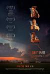

[三块广告牌](https://pewae.com/gaan/aHR0cHM6Ly9tb3ZpZS5kb3ViYW4uY29tL3N1YmplY3QvMjY2MTE4MDQv)

原名：Three Billboards Outside Ebbing, Missouri导演：马丁·麦克唐纳主演：伍迪·哈里森 / 凯瑞·康顿 / 凯瑟琳·纽顿 / 卡赖伯·兰德里·琼斯 / 卢卡斯·赫奇斯 / 山姆·洛克威尔 / 弗兰西斯·麦克多蒙德 / 彼特·丁拉基 / 约翰·浩克斯 / 艾比·考尼什类型：剧情 / 犯罪地区：美国首映时间：2018

很好的电影，同时也是很好的冲奖电影。
所有的演员几乎同时演技炸裂，看片的时候完全不觉得累。
但是冲奖电影看多了就那么回事儿，好像揭露了很深刻的问题，却其实什么都没说。

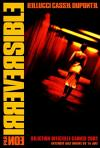

[不可撤销](https://pewae.com/gaan/aHR0cHM6Ly93d3cuaW1kYi5jb20vdGl0bGUvdHQwMjkwNjczLw==)

原名：Irréversible导演：加斯帕·诺主演：维森特·卡塞尔 / 莫妮卡·贝鲁奇 / 阿尔贝·杜邦泰尔类型：剧情 / 犯罪 / 神秘地区：法国首映时间：2002

贝鲁奇的身材是好。
可是镜头晃啊晃啊，什么感觉都晃没了。

[满清十大酷刑之赤裸凌迟](https://pewae.com/gaan/aHR0cHM6Ly93d3cuaW1kYi5jb20vdGl0bGUvdHQwMjg5MTE1Lw==)

导演：曹建南主演：杨梵 / 杨雄 / 林伟键 / 甄楚倩 / 郑浩南类型：剧情 / 恐怖 / 惊悚地区：香港首映时间：1998

女主角不但老，而且满脸坑。

[驱魔道长](https://pewae.com/gaan/aHR0cHM6Ly9tb3ZpZS5kb3ViYW4uY29tL3N1YmplY3QvMjEyNzY3Ni8=)

导演：午马主演：午马 / 原森 / 叶荣祖 / 岳虹 / 林正英 / 邹兆龙 / 陈佳君类型：喜剧 / 恐怖地区：香港首映时间：1993

中国道士大战西方吸血鬼。
午马先生导演，编剧极具当年的港片特色，往好了说是天马行空，往坏了说叫胡编乱造。
邹兆龙还叫倪星的时候，还是蛮帅的说。

[超时空同居](https://pewae.com/gaan/aHR0cHM6Ly9tb3ZpZS5kb3ViYW4uY29tL3N1YmplY3QvMjcxMzMzMDMv)

导演：苏伦主演：于和伟 / 佟丽娅 / 张衣 / 李光洁 / 李念 / 杨玏 / 王正佳 / 范明 / 陶虹 / 雷佳音类型：喜剧 / 奇幻 / 爱情地区：大陆首映时间：2018

佟丽娅颜值实在是高，以至于她说出：“老娘天下最美！”的台词的时候，毫无违和感，可惜佟丽娅的表现还是有一些紧绷。
雷佳音无懈可击。
时间过得真快，99年12岁的人，2018年已经是剩女了。

[一出好戏](https://pewae.com/gaan/aHR0cHM6Ly9tb3ZpZS5kb3ViYW4uY29tL3N1YmplY3QvMjY5ODUxMjcv)

导演：黄渤主演：于和伟 / 宁浩 / 张艺兴 / 李勤勤 / 李又麟 / 王宝强 / 王迅 / 管虎 / 舒淇 / 黄渤类型：剧情 / 喜剧地区：大陆首映时间：2018

虽然舒淇跟黄渤关系好，找她可能更便宜，但这个角色用舒淇真是浪费了，随便摆个花瓶就行。
王宝强演谁都是王宝强。
张艺兴惊喜，他的黑化剧情也很棒。

[X计划](https://pewae.com/gaan/aHR0cHM6Ly9tb3ZpZS5kb3ViYW4uY29tL3N1YmplY3QvNDgxMDY5OC8=)

原名：Project X导演：尼玛·诺里扎德主演：乔纳森·丹尼尔·布朗 / 亚历克西斯·克纳普 / 可比·毕丝·布兰顿 / 奥利弗·库珀 / 尼克·维斯 / 布雷迪·亨德尔 / 德克斯·弗拉姆 / 托马斯·曼类型：喜剧地区：美国首映时间：2012

都说国产片没创意，好莱坞其实也一样，一个美国派模式照样玩了20年，看来老美对那话儿的追求还真是持之以恒啊。
伪纪录片玩多了真没意思，本片最大的创意也就是多了个开party把房子点了，说新鲜不新鲜，说老以前还真没这么拍的。
给6分是因为含奶量足，哈哈！

[赌博默示录](https://pewae.com/gaan/aHR0cHM6Ly9tb3ZpZS5kb3ViYW4uY29tL3N1YmplY3QvMzI1OTk1Ni8=)

原名：カイジ　人生逆転ゲーム导演：佐藤东弥主演：佐藤庆 / 光石研 / 吉高由里子 / 天海祐希 / 山本太郎 / 松尾铃木 / 松山研一 / 藤原龙也 / 香川照之类型：剧情地区：日本首映时间：2009

即使是漫改，男猪的表情也过于夸张了。
天海祐希的御姐范儿真棒，香川太君照旧是演什么像什么。
节奏真的是好慢好慢。

[三个绑匪七条心](https://pewae.com/gaan/aHR0cHM6Ly9tb3ZpZS5kb3ViYW4uY29tL3N1YmplY3QvMjcwMzc1MDQv)

导演：施柏林主演：伍咏薇 / 何华超 / 余香凝 / 周祉君 / 张建声 / 徐浩昌 / 郭伟亮 / 陈婉衡 / 黃思迦 / 黄文慧类型：喜剧 / 犯罪地区：香港首映时间：2018

香港电影式微也就罢了，连个好看的花瓶都找不出来了。
不知不觉间，伍咏薇已经这么老了。

[21克拉](https://pewae.com/gaan/aHR0cHM6Ly9tb3ZpZS5kb3ViYW4uY29tL3N1YmplY3QvMjY2OTEzNjEv)

导演：何念主演：刘芮麟 / 包贝尔 / 大鹏 / 张杨智子 / 张钟仪 / 榕榕 / 王厂长 / 迪丽热巴 / 郭京飞类型：喜剧 / 爱情地区：大陆首映时间：2018

一切都很俗套，看开头都能猜到片尾花絮是什么。
迪丽热巴某些角度看，真不够漂亮。
用口吃来抓哏，不厚道。

[幕后玩家](https://pewae.com/gaan/aHR0cHM6Ly9tb3ZpZS5kb3ViYW4uY29tL3N1YmplY3QvMjY3NzQwMzMv)

导演：任鹏远主演：于和伟 / 任达华 / 徐峥 / 朱珠 / 段博文 / 王丽坤 / 王砚辉 / 谢楠 / 赵达 / 鲍晓类型：剧情 / 悬疑 / 犯罪地区：大陆首映时间：2018

作为悬疑片，故事失败就是彻底的失败。
王丽坤演得再出色也是尬
全片多处视警察叔叔为无物，也不知是怎么过的审。

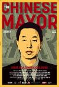

[大同](https://pewae.com/gaan/aHR0cHM6Ly93d3cuaW1kYi5jb20vdGl0bGUvdHQ0MDU2ODA4Lw==)

原名：The Chinese Mayor导演：周浩主演：耿彦波类型：剧情 / 纪录地区：大陆首映时间：2015

这位耿市长让人联想起当年的小草，耿的大同欠了50亿美金，小草透支了大连后来十几年的财政，在任或者升职的时候没事，一旦下台，呵呵。
这其实是一部高级黑的纪录片，你市长大手一挥就拆拆拆，议会（人大）呢？市长天天跑工地，面对面去做拆迁户工作，手下呢？
“不让拆，就强拆。”也录了进来，这就是所谓纪录片的真实性吧。

[他们叫我吉克](https://pewae.com/gaan/aHR0cHM6Ly9tb3ZpZS5kb3ViYW4uY29tL3N1YmplY3QvMjY3NDI3NjYv)

原名：Lo chiamavano Jeeg Robot导演：加布里尔·梅内提主演：Daniele Trombetti / Francesco Formichetti / Joel Sy / 伊莱尼·帕斯托雷利 / 克劳迪奥·桑塔玛利亚 / 卢卡·马里内利 / 斯特凡诺·安布罗吉 / 毛里齐奥·特塞 / 萨尔瓦托雷·埃斯波西托 / 詹卢卡·迪·热纳罗类型：动作 / 喜剧 / 科幻地区：意大利首映时间：2015

意大利的超级英雄电影，挺有意思的，就是经费不足，没什么特效，这个超级英雄只会抡拳头。
英雄爱看AV撸管，也是够了。
剧情没亮点。

[头号玩家](https://pewae.com/gaan/aHR0cHM6Ly9tb3ZpZS5kb3ViYW4uY29tL3N1YmplY3QvNDkyMDM4OS8=)

原名：Ready Player One导演：史蒂文·斯皮尔伯格主演：T·J·米勒 / 丽娜·维特 / 奥利维亚·库克 / 本·门德尔森 / 森崎温 / 汉娜·乔恩-卡门 / 泰伊·谢里丹 / 西蒙·佩吉 / 赵家正 / 马克·里朗斯类型：冒险 / 动作 / 科幻地区：美国首映时间：2018

流行文化是流行文化，却是美国那边的为主，日系的街霸高达都只是点缀，其他的，除了金刚和真人快打有惊喜，都一脸懵逼啊，tmd最大谜题雅达利2600，听说过没见过。
闪灵这种烂片有什么好致敬的。

[今晚打丧尸](https://pewae.com/gaan/aHR0cHM6Ly9tb3ZpZS5kb3ViYW4uY29tL3N1YmplY3QvMjY3NDczNDQv)

导演：卢炜麟主演：万梓良 / 吴家丽 / 张继聪 / 王敏奕 / 白只 / 颜卓灵类型：喜剧 / 恐怖地区：香港首映时间：2017

如今的港片啊，这题材就不能好好拍一部血腥暴力色情的三级片嘛？搞乱七八糟的感情戏，一塌糊涂啊。
万梓良已经这么老了，吴家丽怎么老了眼睛反而变大了？

[死亡飞车4：混乱之上](https://pewae.com/gaan/aHR0cHM6Ly9tb3ZpZS5kb3ViYW4uY29tL3N1YmplY3QvMjY5MjAwNzEv)

原名：Death Race 4: Beyond Anarchy导演：唐·迈克尔·保罗主演：丹尼·格洛弗 / 丹尼·特雷霍 / 克里斯汀·马扎诺 / 凯西·克莱尔 / 尼古拉斯·阿隆 / 弗雷德里克·凯勒 / 张茵 / 扎克·麦克格温 / 洛丽娜·卡姆布罗瓦 / 露西·阿登类型：动作地区：美国首映时间：2018

含奶量很足，含脑量不足，剧情跟小屁孩打架差不多，飞车也不出彩。
这个系列可以终结了。

[卧底巨星](https://pewae.com/gaan/aHR0cHM6Ly9tb3ZpZS5kb3ViYW4uY29tL3N1YmplY3QvMjY5ODQ1Mzgv)

导演：谷德昭主演：刘浩龙 / 崔志佳 / 李一桐 / 李荣浩 / 田启文 / 许绍雄 / 陈国坤 / 陈奕迅 / 马志威 / 高战类型：动作 / 喜剧地区：大陆 / 香港首映时间：2018

李荣浩一团糟。
戏中戏中戏的设定，一般人等不到第三层就弃坑了。
成龙究竟怎么谷德昭了，为什么专门拍这么部片子来恶心他？

[盲女72小时](https://pewae.com/gaan/aHR0cHM6Ly9tb3ZpZS5kb3ViYW4uY29tL3N1YmplY3QvMTQyNDYzMy8=)

导演：陈荣照主演：叶玉卿 / 张坚庭 / 陆剑明 / 陈友 / 陈果 / 陈荣照 / 黄秋生类型：剧情 / 惊悚地区：香港首映时间：1993

即使在巅峰的叶玉卿也不是特别漂亮，身材是真好，难得的是演出了一股狠劲。
黄秋生演变态真是一绝。
塞电池这个梗，在华语电影的历史上是有其重要地位的，谁能说“裤裆藏雷”不是向二友（陈友、张坚庭）致敬呢？

[残秽，不可以住的房间](https://pewae.com/gaan/aHR0cHM6Ly9tb3ZpZS5kb3ViYW4uY29tL3N1YmplY3QvMjY0Mjk4NDkv)

原名：残穢 -住んではいけない部屋-导演：中村义洋主演：佐佐木藏之介 / 坂口健太郎 / 桥本爱 / 泷藤贤一 / 竹内结子类型：恐怖地区：日本首映时间：2015

之前看睡了两次，这次终于看完了，好闷。
那些琐碎的恐怖在神经大条的人看来根本就不叫事儿嘛。

[机器人大爷](https://pewae.com/gaan/aHR0cHM6Ly9tb3ZpZS5kb3ViYW4uY29tL3N1YmplY3QvNjAwNjMzNS8=)

原名：ロボジー导演：矢口史靖主演：五十岚信次郎 / 吉高由里子 / 和久井映见 / 小野武彦 / 川合正悟 / 川岛润哉 / 滨田岳 / 田畑智子 / 田边诚一 / 西田尚美类型：剧情 / 喜剧地区：日本首映时间：2012

吉高由里子的萌妹子演得真好。
喜剧中的夸张程度恰到好处。
结局很棒。

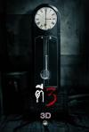

[鬼三惊](https://pewae.com/gaan/aHR0cHM6Ly9tb3ZpZS5kb3ViYW4uY29tL3N1YmplY3QvMTE2MTA5OTgv)

原名：ตีสาม 3D导演：伊萨拉·纳迪 / 卡洛堤·奈金塔隆 / 皮查农·塔玛杰拉主演：彼得·奈特 / 查克利·彦纳姆 / 阿萍雅·萨库尔加伦苏 / 雷·麦克唐纳 / 霍嘉丝·芝华顾类型：恐怖地区：泰国首映时间：2012

三个小故事，前两个平平无奇，第二个的女尸倒是挺漂亮的。
第三个故事太棒了！不停地反转再反转。
可能编剧也是看时间有限，索性拼了命地开脑洞。

[电锯惊魂8：竖锯](https://pewae.com/gaan/aHR0cHM6Ly9tb3ZpZS5kb3ViYW4uY29tL3N1YmplY3QvMjU3ODg0MjYv)

原名：Jigsaw导演：彼得·斯派瑞 / 迈克尔·斯派瑞主演：乔赛亚·布莱克 / 保罗·布朗斯坦 / 克雷·班奈特 / 劳拉·范德沃特 / 布列塔尼·艾伦 / 托宾·贝尔 / 曼德拉·范·皮布尔斯 / 汉娜·艾米莉·安德森 / 考乐姆·吉斯·雷尼 / 马特·帕斯摩尔类型：恐怖 / 悬疑 / 惊悚地区：美国首映时间：2017

利用时间差和尸体蒙太奇来制造悬疑，有些刻意。
机关的设定还算中规中矩。
唯一恶心的是，jigsaw这个单词是个双关，剧情里也确实出现了拼图，可现代尸体上的拼图根本没什么用嘛！

[最差劲](https://pewae.com/gaan/aHR0cHM6Ly9tb3ZpZS5kb3ViYW4uY29tL3N1YmplY3QvMjY5ODA4NTkv)

原名：最低。导演：濑濑敬久主演：佐佐木心音 / 山田爱奈 / 忍成修吾 / 根岸季衣 / 森冈龙 / 森口彩乃 / 江口德子 / 渡边真起子 / 高冈早纪 / 齐藤阳一郎类型：剧情地区：日本首映时间：2017

探讨女优的心理，也就日本人有这个资源拍吧。
佐佐木老湿很赞。

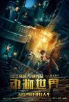

[动物世界](https://pewae.com/gaan/aHR0cHM6Ly9tb3ZpZS5kb3ViYW4uY29tL3N1YmplY3QvMjY5MjUzMTcv)

导演：韩延主演：周冬雨 / 曹炳琨 / 李易峰 / 王戈 / 苏可 / 迈克尔·道格拉斯类型：冒险 / 剧情 / 动作地区：大陆首映时间：2018

剧情比日本电影版要好很多。
但是我非常不喜欢小丑的设定，把人看成各种怪物除了费钱，毫无必要。
要是续集能把香川太君请来就完美了。

[快手枪手快枪手](https://pewae.com/gaan/aHR0cHM6Ly9tb3ZpZS5kb3ViYW4uY29tL3N1YmplY3QvMjYyMTk4OTMv)

导演：潘安子主演：刘晓庆 / 含笑 / 张静初 / 文淇 / 施予斐 / 曾江 / 林更新 / 腾格尔 / 锦荣类型：动作 / 喜剧地区：大陆首映时间：2016

普通而又尴尬的暑期爆米花电影。
腾格尔大爷的演技真不错，碾压影后刘晓庆。
如果换个咸湿系的导演，让张静初再多露一点儿就好了。

[广州杀人王之人皮日记](https://pewae.com/gaan/aHR0cHM6Ly93d3cuaW1kYi5jb20vdGl0bGUvdHQwMTEzMjMwLw==)

导演：陈奥图主演：何家劲 / 何家驹 / 张睿羚 / 杨玉梅 / 陈国邦类型：恐怖 / 犯罪地区：香港首映时间：1995

一个“雨夜屠夫”拍了这么多版……
驹哥演个警察，还是心理专家，反差好大。

[贼王](https://pewae.com/gaan/aHR0cHM6Ly93d3cuaW1kYi5jb20vdGl0bGUvdHQwMTE1MDQ2Lw==)

导演：李修贤主演：任达华 / 关秀媚 / 周文健 / 李修贤 / 罗敏仪 / 黄柏文类型：犯罪地区：香港首映时间：1995

李修贤大哥怎么这么喜欢拍警察刑讯逼供的桥段？
关秀媚内衣秀。

[赌博默示录2](https://pewae.com/gaan/aHR0cHM6Ly9tb3ZpZS5kb3ViYW4uY29tL3N1YmplY3QvNjEyNDA0My8=)

原名：カイジ2 人生奪回ゲーム导演：佐藤东弥主演：伊势谷友介 / 光石研 / 吉高由里子 / 岛田久作 / 松尾铃木 / 柿泽勇人 / 生濑胜久 / 藤原龙也 / 香川照之类型：剧情地区：日本首映时间：2011

套路与反套路之战。
原著柏青哥篇是不如猜拳篇的，可电影却恰好翻转了过来，第一部的事确实讲得太多太杂乱了。
吉高MM的妆没画好，显老。

[战狼2](https://pewae.com/gaan/aHR0cHM6Ly9tb3ZpZS5kb3ViYW4uY29tL3N1YmplY3QvMjYzNjMyNTQv)

导演：吴京主演：丁海峰 / 于谦 / 余男 / 卢靖姗 / 吴京 / 吴刚 / 弗兰克·格里罗 / 张翰 / 淳于珊珊 / 石兆琪类型：动作 / 战争地区：大陆首映时间：2017

动作戏7分，剧情0分。
如果片子是虚构的，那么中国护照和国旗就没那么好用，那么爱国情怀就成了YY扯淡；
如果片子是真实的，那么非洲就是那么脏乱差战争频仍，那么大大撒了那么多币还能收回来吗？

[炙热](https://pewae.com/gaan/aHR0cHM6Ly9tb3ZpZS5kb3ViYW4uY29tL3N1YmplY3QvMjU4MjI0MzAv)

原名：Parched导演：莉娜·亚达夫主演：塔妮莎·查特吉 / 拉迪卡·艾普特 / 法如克·贾法尔 / 苏莉温·查瓦拉 / 萨米特·维亚斯 / 阿迪勒·侯赛因类型：剧情地区：印度首映时间：2015

虽然是女权思想的片子，但看着毫不晦涩。
唯一的扣分点是我下载的版本激情戏打码了。

[哀乐女子天团](https://pewae.com/gaan/aHR0cHM6Ly9tb3ZpZS5kb3ViYW4uY29tL3N1YmplY3QvMjcwNDE1MTkv)

导演：刘博文 / 桑木天主演：刘頔 / 叶禹含 / 尹菲 / 杨小兰 / 秦勇 / 谭志玲 / 陈洁怡类型：剧情 / 音乐地区：大陆首映时间：2017

事实证明，网大只能说明上限不高，不等同于水准一定不高，本片强于70%的院线片。
虽然很多地方限于成本拍得很粗糙，但故事真的讲得很出色。
男主角要火。

[宠物](https://pewae.com/gaan/aHR0cHM6Ly9tb3ZpZS5kb3ViYW4uY29tL3N1YmplY3QvMTA5NTUzMjIv)

原名：Pets导演：Raphael Nussbaum主演：Candice Rialson / Frank Parker / K·T· Stevens / Matt Green / Roberto Contreras / Rodney Wallace / Teri Guzman / 琼·布拉克曼 / 艾德·毕肖普 / 贝里·克勒格尔类型：剧情地区：美国首映时间：1973

完全不知道导演想表达什么。

[暴裂无声](https://pewae.com/gaan/aHR0cHM6Ly9tb3ZpZS5kb3ViYW4uY29tL3N1YmplY3QvMjY2NDcxMTcv)

导演：忻钰坤主演：伊天锴 / 姜武 / 安琥 / 宋洋 / 王梓尘 / 袁文康 / 谭卓类型：剧情 / 悬疑 / 犯罪地区：大陆首映时间：2018

这个导演真不错，作品很走心。
动作戏过多，可能是制作费增加导致的。

[湿濡的女人](https://pewae.com/gaan/aHR0cHM6Ly93d3cuaW1kYi5jb20vdGl0bGUvdHQ1ODgzMDA4Lw==)

原名：風に濡れた女导演：盐田明彦主演：永冈佑 / 赤城優実 / 间宫夕贵类型：剧情 / 爱情地区：日本首映时间：2016

建议日本政府出台法律，以后没有对C的就不要出来演色情片了。

[巴西奇遇记](https://pewae.com/gaan/aHR0cHM6Ly9tb3ZpZS5kb3ViYW4uY29tL3N1YmplY3QvMjcwMDQyMTgv)

原名：Going to Brazil导演：帕特里克·米勒主演：Alison Wheeler / Ingra Liberato / Margot Bancilhon / Philippine Stindel / Susana Pires / 克里斯汀·奇蒂 / 凡妮莎·吉德 / 奇科·迪亚斯 / 帕特里克·米勒 / 约瑟夫·玛勒巴类型：剧情 / 喜剧地区：法国首映时间：2017

脑洞不错，剪辑凌乱。
演孕妇的女主非常漂亮。

[雪怪大冒险](https://pewae.com/gaan/aHR0cHM6Ly9tb3ZpZS5kb3ViYW4uY29tL3N1YmplY3QvMjY5NDQ1ODIv)

原名：Smallfoot导演：凯瑞·柯克帕特里克 / 杰森·雷西格主演：丹尼·德维托 / 伊利·亨利 / 勒布朗·詹姆斯 / 吉娜·罗德里格兹 / 吉米·塔特罗 / 查宁·塔图姆 / 科曼 / 詹姆斯·柯登 / 赞达亚 / 雅拉·沙希迪类型：冒险 / 动画 / 喜剧 / 歌舞地区：美国首映时间：2018

这片子竟然能在天朝上映，实属奇迹，虽然很寓教于乐，但怎么看怎么是在嘲讽大防火墙的。
里面的几首歌曲都挺不错，尤其是老酋长的那段说唱，跟快板似的，朗朗上口。
故事应该发生在喜马拉雅山脚下中国一侧，中国警察能有直升机和雪地摩托车？别扯了，武警也没有啊！

[阿尔忒弥斯酒店](https://pewae.com/gaan/aHR0cHM6Ly9tb3ZpZS5kb3ViYW4uY29tL3N1YmplY3QvMjY5MjU1MzIv)

原名：Hotel Artemis导演：德鲁·皮尔斯主演：布莱恩·泰里·亨利 / 戴夫·巴蒂斯塔 / 扎克瑞·昆图 / 斯特林·K·布朗 / 朱迪·福斯特 / 杰夫·高布伦 / 查理·戴 / 珍妮·斯蕾特 / 索菲亚·波多拉 / 肯尼斯·崔类型：动作 / 惊悚 / 犯罪地区：美国首映时间：2018

不知不觉间，朱迪福斯特已经这么老了……
波多拉的动作戏惊艳。
故事前言不搭后语，非常失败。

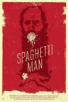

[面条侠](https://pewae.com/gaan/aHR0cHM6Ly9tb3ZpZS5kb3ViYW4uY29tL3N1YmplY3QvMjY3NzkxNjAv)

原名：Spaghettiman导演：Mark Potts主演：Ben Crutcher / Brand Rackley / Winston Carter类型：动作 / 喜剧 / 犯罪地区：美国首映时间：2016

挺恶俗的。
但是超级英雄收费仔细想想也很合理啊，毕竟不是每个英雄都像蝙蝠侠和托尼斯塔克那么有钱。

[酒吧](https://pewae.com/gaan/aHR0cHM6Ly9tb3ZpZS5kb3ViYW4uY29tL3N1YmplY3QvMjY2OTQ0OTcv)

原名：El bar导演：艾利克斯·德·拉·伊格莱希亚主演：亚历杭德罗·亚旺达 / 华金·克莱门特 / 卡门·马奇 / 塞康·德拉罗萨 / 布兰卡·苏亚雷斯 / 杰米·奥多尼斯 / 特雷勒·帕维斯 / 苏·弗拉克 / 马里奥·卡萨斯类型：喜剧 / 恐怖 / 惊悚地区：西班牙首映时间：2017

因为有病毒，政府就直接把人灭口了，西班牙政府都这么狠的？
有些强行制造紧张气氛的感觉。
女主角的罩罩这么折腾都不破，也不知道是什么材料做成的。

[快把我哥带走](https://pewae.com/gaan/aHR0cHM6Ly9tb3ZpZS5kb3ViYW4uY29tL3N1YmplY3QvMzAxMjI2MzMv)

导演：郑芬芬主演：刘冠毅 / 周翊然 / 姜宏波 / 孙泽源 / 张子枫 / 彭昱畅 / 徐光宇 / 赵今麦类型：喜剧 / 奇幻地区：大陆首映时间：2018

开头还可以，后面强行制造感动，太假了。
小孩儿面对父母离婚这思路不错，可惜根本没细讲。

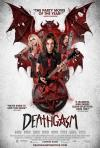

[死亡高潮](https://pewae.com/gaan/aHR0cHM6Ly9tb3ZpZS5kb3ViYW4uY29tL3N1YmplY3QvMjYzNDAxMTgv)

原名：Deathgasm导演：杰森·李·豪顿主演：Jodie Rimmer / Kate Elliott / 史蒂芬·乌瑞 / 德莱妮塔布伦 / 米洛·考索恩 / 蒂姆·弗莱 / 金伯莉·克罗斯曼类型：喜剧 / 恐怖地区：新西兰首映时间：2015

玩金属的怎么你们了，要不要这么鄙视啊。
花式dick插脑袋。

[我们的故事](https://pewae.com/gaan/aHR0cHM6Ly9tb3ZpZS5kb3ViYW4uY29tL3N1YmplY3QvMjY3MDU3NDQv)

原名：Long Long Time Ago导演：梁智强主演：廖永谊 / 李国煌 / 王雷 / 程旭辉 / 萨米·优素夫 / 薛素丽 / 陈丽贞 / 陈俊铭 / 黄晶晶 / 黎沸挥类型：剧情 / 喜剧 / 家庭地区：新加坡首映时间：2016

太过于主旋律了,缺乏冲突。
仿佛回到了争相比惨的80年代。
李光耀就是那不落的太阳。

[西虹市首富](https://pewae.com/gaan/aHR0cHM6Ly9tb3ZpZS5kb3ViYW4uY29tL3N1YmplY3QvMjc2MDU2OTgv)

导演：彭大魔 / 闫非主演：九孔 / 宋芸桦 / 常远 / 张一鸣 / 张晨光 / 李立群 / 沈腾 / 王成思 / 赵自强 / 魏翔类型：喜剧地区：大陆首映时间：2018

题材不新鲜，但悬念保持得不错。
仍旧是开心麻花式的段子轰炸，但比上一部铁拳的B格要高一点儿。
结局好，但是结局的镜头女主演得不好。

[欧洲攻略](https://pewae.com/gaan/aHR0cHM6Ly9tb3ZpZS5kb3ViYW4uY29tL3N1YmplY3QvMjYzNTE4MTIv)

导演：马楚成主演：元秋 / 刘家勇 / 吴亦凡 / 唐嫣 / 杜鹃 / 林子祥 / 梁朝伟 / 罗莽 / 雅各布 格拉夫类型：动作 / 喜剧 / 爱情地区：大陆首映时间：2018

从布景到道具再到卡斯，可以看出绝对没少花钱，但是这拍的都是什么鬼啊，完全不走心，金碗盛狗矢，这要不是洗钱，还有什么是洗钱？
梁先生这两年的接拍太没节操了。
唐嫣中戏之耻的名头，至少十年内无人能与之争锋。

[江湖儿女](https://pewae.com/gaan/aHR0cHM6Ly9tb3ZpZS5kb3ViYW4uY29tL3N1YmplY3QvMjY5NzIyNTgv)

导演：贾樟柯主演：丁嘉丽 / 刁亦男 / 廖凡 / 张一白 / 张译 / 徐峥 / 李宣 / 梁嘉艳 / 董子健 / 赵涛类型：爱情 / 犯罪地区：大陆首映时间：2018

贾导再一次出动了大杀器——他老婆赵涛女士，赵女士演得还不错，就是没“范儿”。
故事真不错，平民版的“出来混，迟早要还的”，很真实，很“江湖”。
只是作为电影来说，平淡了些。

[隔绝](https://pewae.com/gaan/aHR0cHM6Ly9tb3ZpZS5kb3ViYW4uY29tL3N1YmplY3QvNDg0NjY5My8=)

原名：The Fallout导演：泽维尔·吉恩斯主演：Abbey Thickson / 伊凡·冈萨雷斯 / 劳伦·日尔曼 / 珍妮弗·布兰克 / 米洛·文堤米利亚 / 罗姗娜·阿奎特 / 考特尼·万斯 / 艾什顿·霍尔姆斯 / 迈克尔·比恩 / 迈克尔·艾克朗德类型：悬疑 / 惊悚 / 灾难 / 科幻地区：德国首映时间：2012

人不为己，天诛地灭，每个惊喜的意外都可以用这句古老的中国谚语进行解释。
可能一开始的地下室主人是个真正的好人，所以他没有好下场。

[李宗伟：败者为王](https://pewae.com/gaan/aHR0cHM6Ly9tb3ZpZS5kb3ViYW4uY29tL3N1YmplY3QvMjcxOTUxMTkv)

原名：Rise of the Legend导演：马逸腾主演：拿督·罗斯彦·诺 / 曾冠源 / 李国煌 / 李宗伟 / 杨雁雁 / 潘思慧 / 黄家荣 / 黄炜杰类型：传记 / 剧情 / 运动地区：马来西亚首映时间：2018

本来以为是纪录片，没想到是传记片，于是不出意料的假大空。
给活人拍传记可不是什么好事儿。
在大马竟然有人赌业余羽毛球比赛，不知是说羽毛球开展得遍地飞花好呢，还是赌博更深入人心好？

[李茶的姑妈](https://pewae.com/gaan/aHR0cHM6Ly9tb3ZpZS5kb3ViYW4uY29tL3N1YmplY3QvMjcwOTI3ODUv)

导演：吴昱翰主演：卢靖姗 / 宋阳 / 张镨冉 / 沈腾 / 王宇 / 艾伦 / 赵雪 / 陈冰 / 韩彦博 / 黄才伦类型：喜剧地区：大陆首映时间：2018

剧本不新鲜，导演更烂。
很多地方明显赶工。
上纲上线弄什么反拜金主题啊，显然是没什么能让人乐呵的招数了。

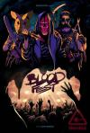

[血宴](https://pewae.com/gaan/aHR0cHM6Ly9tb3ZpZS5kb3ViYW4uY29tL3N1YmplY3QvMjcxMDk1NDEv)

原名：Blood Fest导演：欧文·艾格顿主演：Barbara Dunkelman / Isla Cervelli / Juliette Kida / Owen Egerton / 奥利维亚·格雷斯·阿普尔盖特 / 扎克瑞·莱维 / 泰特·多诺万 / 罗比·凯 / 赛切儿·加布埃尔 / 雅各布·巴特朗类型：喜剧 / 恐怖地区：美国首映时间：2018

看的版本翻译不好，好多恐怖片的梗没翻译出来。
最后主人公杀爹证道，也算是老套路了。
女主身材很musle的感觉，挺不错的。

[办公室僵尸起义](https://pewae.com/gaan/aHR0cHM6Ly9tb3ZpZS5kb3ViYW4uY29tL3N1YmplY3QvMjY5MjkwNjAv)

原名：Office Uprising导演：林·奥汀主演：伊恩·哈丁 / 卡兰·索尼 / 巴里·沙巴卡·亨利 / 布伦顿·思韦茨 / 扎克瑞·莱维 / 柯特·富勒 / 格雷格·亨利 / 简·利维 / 萨姆·戴利 / 阿兰·里奇森类型：动作 / 喜剧 / 恐怖地区：美国首映时间：2018

说是喜剧片有点浪费了，这部片子的创意很好，完全是一部嘲讽职场的好剧。
可惜成本不足，好多东西出不来。

[无双](https://pewae.com/gaan/aHR0cHM6Ly9tb3ZpZS5kb3ViYW4uY29tL3N1YmplY3QvMjY0MjUwNjMv)

导演：庄文强主演：冯文娟 / 周家怡 / 周润发 / 廖启智 / 张静初 / 方中信 / 王耀庆 / 邢佳栋 / 郭富城 / 高捷类型：剧情 / 动作 / 悬疑 / 犯罪地区：大陆首映时间：2018

稍微有些拖沓但不失为好片。
可惜香港连个好看的花瓶都找不出了。
英文片名project古腾堡太缺乏民族自信了，活字印刷术分明是中国发明的，为什么不叫Project Huoban？

[憨豆特工3](https://pewae.com/gaan/aHR0cHM6Ly9tb3ZpZS5kb3ViYW4uY29tL3N1YmplY3QvMjcwNzMyMzQv)

原名：Johnny English Strikes Again导演：大卫·科尔主演：亚当·詹姆斯 / 大卫·穆梅尼 / 本·米勒 / 杰克·莱西 / 欧嘉·柯瑞兰寇 / 米兰达·亨妮莎 / 罗温·艾金森 / 艾玛·汤普森 / 萨曼莎·罗素 / 通恰伊·古奈什类型：冒险 / 动作 / 喜剧地区：法国首映时间：2018

不在于英式幽默或者美式幽默，而是段子都太老了，简直是在用30年前的哏。
憨豆先生本人也太老了，腿都抬不起来了。
对现代科技的嘲讽是剧情的亮点

[红海行动](https://pewae.com/gaan/aHR0cHM6Ly9tb3ZpZS5kb3ViYW4uY29tL3N1YmplY3QvMjY4NjE2ODUv)

导演：林超贤主演：尹昉 / 张译 / 杜江 / 海清 / 王强 / 王雨甜 / 蒋璐霞 / 郭家豪 / 麦亨利 / 黄景瑜类型：动作 / 战争地区：大陆首映时间：2018

优点是血乎沥啦的比较真实。
张译和圆寸妹子演得都挺好。
缺点是故事太假了，海清那条线根本就是扯蛋。

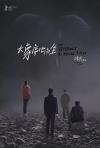

[大象席地而坐](https://pewae.com/gaan/aHR0cHM6Ly9tb3ZpZS5kb3ViYW4uY29tL3N1YmplY3QvMjcxNzI4OTEv)

导演：胡波主演：凌正辉 / 彭昱畅 / 朱颜曼滋 / 李丛喜 / 王柠 / 王玉雯 / 王超北 / 章宇 / 董向荣 / 赵燕国彰类型：剧情地区：大陆首映时间：2018

本片导演生于1988，因为跟制作方在剪辑等多个方面有矛盾，在片子后期制作的阶段上吊自杀身亡，豆瓣一多半的人给的是同情分。
导演用他的生命证明了，没有剪辑过的片子真的没法看，如果片长压缩到正常的90～100分钟，得分能够加倍。
女主妹子的颜值不错。

[我要发达](https://pewae.com/gaan/aHR0cHM6Ly9tb3ZpZS5kb3ViYW4uY29tL3N1YmplY3QvMjY5MDk0NTcv)

导演：黄柏基主演：吴浣仪 / 唐诗咏 / 庄思敏 / 朱咪咪 / 林盛斌 / 河国荣 / 邵音音 / 陈嘉桓 / 麦玲玲 / 黄光亮类型：剧情地区：香港首映时间：2017

浪费时间。
剧情在70年代都算不上新鲜。
所有人都很ging的状态，就好像抹了一身肥皂液干掉。

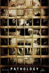

[恐怖解剖室](https://pewae.com/gaan/aHR0cHM6Ly9tb3ZpZS5kb3ViYW4uY29tL3N1YmplY3QvMjA2MDE4NC8=)

原名：Pathology导演：马克·施科尔曼主演：劳伦·李·史密斯 / 米洛·文堤米利亚 / 艾莉莎·米兰诺 / 迈克尔·温斯顿类型：惊悚 / 犯罪地区：美国首映时间：2008

血腥程度一般吧，好多线没展开。
只记住了女主角的胸。

[无名之辈](https://pewae.com/gaan/aHR0cHM6Ly9tb3ZpZS5kb3ViYW4uY29tL3N1YmplY3QvMjcxMTAyOTYv)

原名：慌枪走板导演：饶晓志主演：九孔 / 任素汐 / 宁桓宇 / 潘斌龙 / 王砚辉 / 程怡 / 章宇 / 邓恩熙 / 陈建斌 / 马吟吟类型：剧情 / 喜剧地区：大陆首映时间：2018

这片一般，营销得太厉害了，按照我的标准无论如何上不了8分。
陈建斌不行。
编剧是好编剧，但他作导演还得练级，最大的毛病是拎不清主次，导致搞笑也没多搞笑，感人也没多感人。

[少爷](https://pewae.com/gaan/aHR0cHM6Ly9tb3ZpZS5kb3ViYW4uY29tL3N1YmplY3QvMjY1ODQ3NjMv)

原名：坊っちゃん导演：铃木雅之主演：二宫和也 / 八岛智人 / 又吉直树 / 及川光博 / 古田新太 / 宫本信子 / 山本耕史 / 岸部一德 / 松下奈绪 / 鹫尾真知子类型：剧情 / 喜剧地区：日本首映时间：2016

故事是不错，但太闷了，高潮冲突不够high。

[罪人](https://pewae.com/gaan/aHR0cHM6Ly9tb3ZpZS5kb3ViYW4uY29tL3N1YmplY3QvMjc2MTUzOTgv)

原名：Den skyldige导演：古斯塔夫·莫勒主演：劳拉·布罗 / 奥玛尔·沙加威 / 安德斯·布林克·马德森 / 杰西卡·迪内奇 / 约翰·奥尔森 / 莫滕·桑博 / 蒙坦·瑟贝尔 / 西蒙·本尼杰格 / 雅各布·乌尔里克·罗曼 / 雅各布·克德格恩类型：剧情 / 惊悚 / 犯罪地区：丹麦首映时间：2018

这片子几乎就是一个人跟一部电话演下来的，其它所有人的镜头加起来不到5分钟。
对男主角佩服得五体投地。

[此房是我造](https://pewae.com/gaan/aHR0cHM6Ly9tb3ZpZS5kb3ViYW4uY29tL3N1YmplY3QvMjYzNjk4ODQv)

原名：The House That Jack Built导演：拉斯·冯·提尔主演：丽莉·吉欧 / 乌玛·瑟曼 / 刘智泰 / 大卫·拜利 / 布鲁诺·冈茨 / 希博汗·法隆 / 杰瑞米·戴维斯 / 爱德华·斯皮伊尔斯 / 苏菲·格拉宝 / 马特·狄龙类型：恐怖 / 惊悚 / 犯罪地区：丹麦首映时间：2018

把一个变态的成长演绎得淋漓尽致。
第一个碎嘴子被害人真没看出来是乌玛瑟曼。
遗憾的是美术功底不行，没看出最后拗造型的含义。