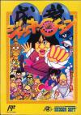

[成龙之龙](https://pewae.com/gaan/aHR0cHM6Ly93d3cuZG91YmFuLmNvbS9nYW1lLzI0ODgxODM2Lw==)

原名：ジャッキーチェン机种：FC厂商：HUDSON类别：ACT发行年月：1991-01耗时：10

秘技:在标题画面输入上上下下上下BA,START,可以将continue数增加到最大.

一款节奏比较轻松的动作类游戏.很有HUDSON风格.另一个方面也可以看出成龙大叔当年在亚洲是多么走红.游戏仍旧是英雄救美的主题,不过背景是发生在少林寺.注意,这个东东跟成龙踢馆可是完全两码事.
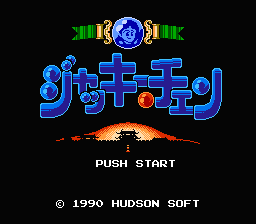
游戏的一个特点是boss都比较容易,反倒是中途蹦的时候有点难,怀疑hudson的游戏都这个特点.
第一关BOSS
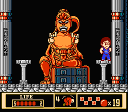
第二关
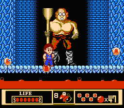
第三关
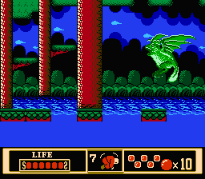
第四关
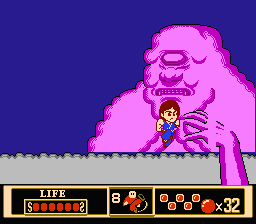
第五关
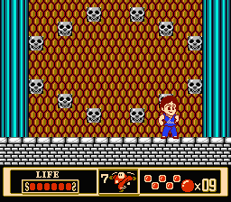
最终boss
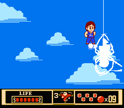
救美成功
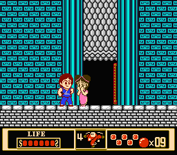
通关
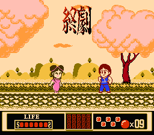

一个疑点.为什么中国背景的游戏会出现河童??
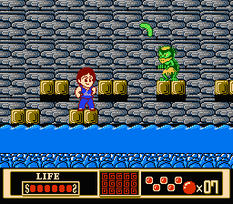