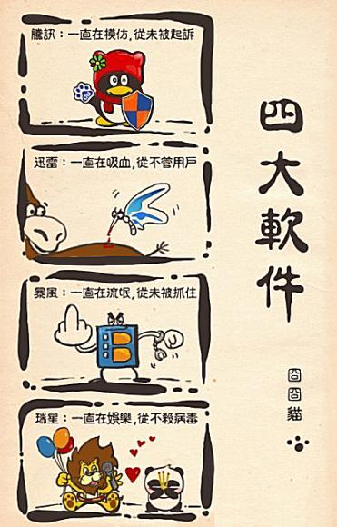

比特海老鸟一只，对于所谓“中国四大软件”的评论，深感认同。

之腾讯
没用过小企鹅的网民，算不上一个好的潜水员。四大中至今仍然潜伏在系统中的也只剩下它了。
2000年初试互联网，学校机房里的学长第一个指导我使用的网络软件就是这厮。
当时还不知道它抄袭icq，只是看着那一个个头像：这不史努比吗？这不加菲吗？这不墨菲吗？这不菠菜男和布鲁托吗？竟然还有我大爱的口袋PM，于是坚定地选择了胖丁做头像，一用就是5年。直到它们开了可以自定义头像的功能为止。
后来腾讯也不知道是被人告了还是自己心虚，所有侵权头像都给换了，竟然把胖丁换成了一只猪，我简直&……%&￥！
当然，腾讯抄袭的恶心之处对于我来说也仅限于此了。
因为我从来不进QQ空间，不看QQ新闻，不用QQ邮箱，不用腾讯搜搜，不用QQ影音，不用腾讯旋风，捆绑的QQ医生腾讯浏览器QQ游戏也在第一时间被我喀嚓了。
说实话，要不是因为经常有现实中的访客有在我机器上使用QQ的需求，小企鹅在我的系统上就只会存在叫Linux的那一只。

之迅雷
最痛恨的就是它了。
从迅雷开通bt下载功能并且强制把自己设成bt下载的默认工具的那一刻起，我就认清了它的流氓本质。我是一个纯粹的p2p精神的信仰和传承者，一个从来不限制自己上传速度的人。倒不是有多么的高尚，2003年一个游戏花了133天才下载完毕的经历让我深深体会到了“源”的重要性。所以，即使再多的人夸奖它如何如何方便或者如何如何资源丰富，我也不为所动。eMule和uTorrent一直静静地在那里。工作。
痛恨到不是因为它吸血，而是因为那无处不在的“使用迅雷下载”。好好的http协议不用，非要跟个流氓勾搭在一起……
最不能忍受的是，还把我钟爱的快车给带坏了，操@！
我永远怀念刚学会批量添加任务并用快车1.5从闪客帝国拖下200多个flash的那个晚上。

之暴风
暴风本不是流氓。或者说，它是披着军大衣的流氓。
刚出来那阵，暴风真是个表现不错的三好学生。体积小，速度快，整合了大量解码器和字幕工具。让RealOne、ffdshow、mpc等一干工具统统退居了二线。甚至给I记做视频测试项目的时候，对方要求把暴风作为测试工具之一。后来才知道，原来有的解码器并不是免费的，但是暴风使用了这部分代码，自身却是免费的。I记为了不产生版权纠纷，才让俺们用的……
“忽然有一天，小邋遢变了……”这厮竟然偷偷尝试连接网络……
我就去你妹的，换回了mpc+完美解码。
直到去年改用了射手。

之瑞星
说瑞星不杀毒，冤枉。说瑞星“能”杀毒，也是冤枉。
自打1999年寝室电脑装上以后，就一直是裸奔。直到2000年某天开始，机器不断的重启。俺们几个菜鸟说，怕是中毒了吧！正好瑞星推出99元正版风暴活动，就用献血的慰问金买了个。嘿！查出了300多CIH，好感倍增啊！！
一直到2003年，都是用的瑞星。哪怕是机器启动得越来越慢，也没当回事儿，只是以为机器配置跟不上了。
没想到啊没想到，枉我那么支持它，它连蠕虫的第一轮都没挺住，直接挂了。后来又升级又专杀的，反正是一直搞不干净。直到我工作了，从单位偷回了一个版本的诺顿，困扰我半年之久的蠕虫余毒才消灭干净。
然后就惊奇地发现，原来我的机器启动还是很快的啊！
于是彻底抛弃了瑞星。
现在用免费版的avast！

所以，现在的结论就是绝不轻易使用国产盈利单位制作的软件，不管是免费的还是要钱的。

（图片来自寒香阁）