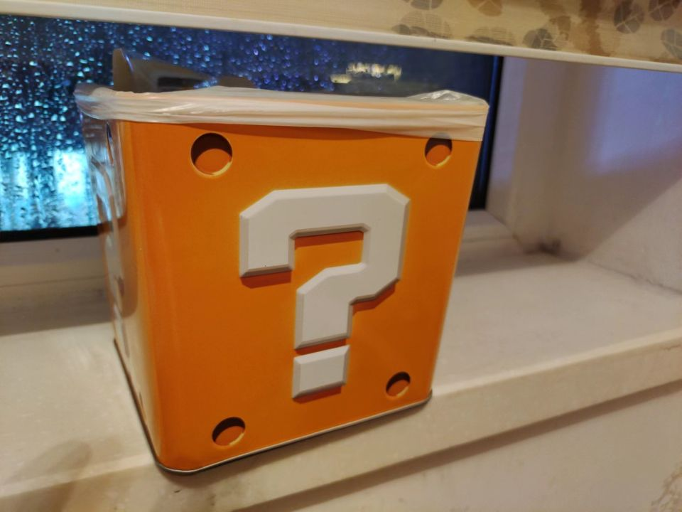

[超级马力欧兄弟大电影](https://pewae.com/gaan/aHR0cHM6Ly9tb3ZpZS5kb3ViYW4uY29tL3N1YmplY3QvMjcxOTk4OTQ=)

原名：The Super Mario Bros. Movie导演：亚伦·霍瓦斯 / 迈克尔·杰勒尼克主演：克里斯·帕拉特 / 凯文·迈克尔·理查德森 / 塞巴斯蒂安·马尼斯科 / 塞斯·罗根 / 安雅·泰勒-乔伊 / 弗莱德·阿米森 / 朱丽叶·杰勒尼克 / 杰克·布莱克 / 查理·戴 / 科甘-迈克尔·凯类型：冒险 / 动画 / 喜剧 / 奇幻 / 爱情 / 科幻地区：美国首映时间：2023

上个工作的礼拜二是下班最顺路的那家影院上映《超级马力欧兄弟大电影》的最后一天。正好老婆大人晚上开会，就让她给我淘了张票，补个念想。

时间过得真快，上次给任氏交情怀税还是在2019年[[1]](https://pewae.com/2023/05/a-bill-from-my-teenage.html#inner_anchor_1)。这次赶上了哪能不看，况且老婆孩子又不会跟着，简直双喜临门。

进门前为了盒子买了份爆米花套餐。结果盒子带回家后也没什么大用处，只能沦为垃圾桶。

厅是小厅，人更少，只坐了不到20个人。我占了倒数第二排最中间的位置。旁边挨着一对95后小情侣——他们本来想跟我换位置，但一声叔叔喊出来这事儿就别想让我假装听得见了。

鉴于任地狱一向的低幼化倾向，对于剧情的平平无奇是早有心理建设的了。因为期望值低，所以每个能发现的彩蛋便都是惊喜。

第一个出现的拆屋工BOSS并不讨喜，因为那个游戏并不好玩。

后排小孩大声问他爹地：“这什么游戏？”他爹说：“我没见过。”他妈说：“我小时候好像玩过。”我心说磁碟机你玩过个屁啊！于是大声点破：“光之神话。”

“可是公主在下一个城堡”出现时全场就我一个人在笑，唉！

字幕出现莫名其妙的“1-2”挺讨厌的。要加你倒是全加啊。“4-3”啊，“耀奇岛”啊，“大金刚国度”啊，“奇诺比奥广场”啊，“路易与鬼屋”啊，“库巴飞船”啊不都没写嘛。

人物一般。马里奥性格不突出，路易戏份太少，酷霸花痴比较单调，耀奇和迪迪刚只是背景，也就大金刚、奇诺比奥和碧奇有血有肉 。哦对，还有马里奥银河出现的那只小蓝星星也可以。

大金刚身上出现了一系列吃设定的情况。先是名字翻译成“咚奇刚”，显然是Donkey的音译，也就是说“森喜刚”这个奇怪的名字被废了。然后他爹有句特别毁设定的台词——“你就不能救我一次”——可是大金刚二代的别名就是猩猩救父您咋给忘了？最后就是大金刚能吃道具变身这点很别扭，虽然知道大乱斗系列是可以的，但还是觉得别扭。

全片彩蛋最密集也是最精彩的地方就是彩虹赛道了。飞翼、香蕉、导弹尤其是蓝色乌龟壳炸弹可全是马车系列的精髓。不过马里奥电影以马车为卖点真的好吗？

最后，纽约的下水问题究竟解决了没？挖坑不埋的编剧最讨厌了。

---

- [(1)](https://pewae.com/2023/05/a-bill-from-my-teenage.html#inner_ref_1)：《大侦探皮卡丘》