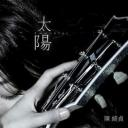
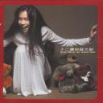
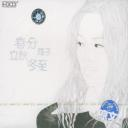
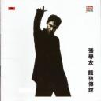
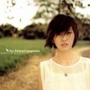
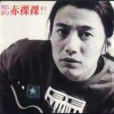
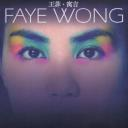
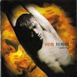
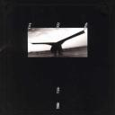

*按：每个人都听歌，每个人都有自己喜欢的歌和歌手。
由于某种原因，忽然想把自己认为的“神”专列一下。标准当然是专辑里的每一首歌都牛叉。
这种榜单类的东西当然是一家之言，萝卜青菜，不喜随意喷。*

**13.《太阳》**

[太阳](https://pewae.com/gaan/aHR0cHM6Ly9tdXNpYy5kb3ViYW4uY29tL3N1YmplY3QvMzM5MDAwMg==)

音乐家：陈绮贞风格：流行地区：台湾发行年月：2009-01

袅娜的悍女。
很早就关注陈绮贞，毕竟也算是阿宗的门下。但陈老师却是在离开滚石之后却一步一步越走越好。三张夫妻店专辑没赶上好时候，质量却都很高。尤其10年的金曲奖，陈老师一袭惊艳的红裙却两手空空的场景还历历在目。
10年，臭宝出生的时候，晚上去陪护，白天回家，睡不着的时候听的就是这张《太阳》。慵懒的声音里透出的却是一种坚强。
兴奋与沮丧并行的日子里，《太阳》给了我前进的力量。
唯一遗憾的是，专辑里的歌大多歌词复杂，好听却不好唱。
专辑最热歌曲《鱼》。
我最喜欢的歌《烟火》：陈老师给杨乃文写的《证据》，又拿回来自己唱。前奏的编曲，会让你产生“耳机是不是坏了”的错觉，然而进行下去之后，又觉得前面的编曲是理所当然的。重金属风格的配乐配上陈老师慵懒的声音，浓浓的反差萌啊～

**12.《范特西》**

[范特西](https://pewae.com/gaan/aHR0cHM6Ly9tdXNpYy5kb3ViYW4uY29tL3N1YmplY3QvMTQwMzMwNw==)

音乐家：周杰伦风格：流行地区：台湾发行年月：2001-09

强大的异端。
我完全彻底坚定不移地不喜欢周杰伦。我认为一个歌手做不到吐词清楚就是渎职。
但周董的第二张专辑牛叉到直接把我KO。02年春节同学聚会，专辑里10首歌一一被点而且首首都被从头唱到尾。三十多年来的生活轨迹里，前无古人，后无来者。22岁的周董出了如此牛叉的专辑，转过年来22岁的我却只能在KTV里听一帮牛鬼蛇神唱他的歌，这就是人生。
让一个人承认他牛逼不难，让一个人不得不承认他牛逼，难。
专辑最热歌曲《安静》。
我觉得还可以的歌《爱在西元前》：绕口令般的歌词配上特有的周氏含混不清的发音，产生了独特的斯德哥尔摩综合症式魅力。

**11.《十二楼的莫文蔚》**

[十二楼的莫文蔚](https://pewae.com/gaan/aHR0cHM6Ly9tdXNpYy5kb3ViYW4uY29tL3N1YmplY3QvMTQwMjIyNw==)

音乐家：莫文蔚风格：流行地区：台湾发行年月：2000-11

风中的落叶。
99年上大学前漫长的暑假里，重新认识了莫文蔚。上了大学之后，不断向同寝同班的同学们灌输莫文蔚的强大，给他们推荐这张专辑里的《寂寞的恋人啊》、《两个女孩》、《因为所以》。得到的回馈却是：“白晶晶也就一首《阴天》能听。”两年后，《盛夏的果实》红到烂街，隔壁邢土鳖和杨土鳖有过关于谁更早关注莫文蔚的争论，我听见了，我走了。呵呵。
在我心中，这张是莫文蔚最好的专辑。虽然卖得很差。小李不愧是大高手，这张专辑把莫文蔚的特质发挥到了极致。莫文蔚有一种能摆脱作者的特质，听过之后，你只会觉得这是莫文蔚的歌，而不是李宗盛的歌。
专辑最热歌曲《寂寞的恋人啊》。
我最喜欢的歌《遇见另一个自己》：这是我最钟爱的李宗盛的作品之一。听过后，就会想，如果是我自己遇到了自己，跟自己对话，会是怎样的情景？能令神经大条的我触景生情的，就是好歌。

**10.《春分·立秋·冬至》**

[春分立秋冬至](https://pewae.com/gaan/aHR0cHM6Ly9tdXNpYy5kb3ViYW4uY29tL3N1YmplY3QvMTQwMjM3OA==)

音乐家：筠子风格：民谣地区：中国大陆发行年月：2000-01

倔强的信仰。
那个年代好歌太多，以至于我并没有在第一时间关注到这个名声不彰的歌手。03年非典，被关在自己家里作毕设。当时完全遵循伊拉克时间，半夜玩游戏看小说，听歌的时候去搜刮论坛，找别人推荐的东西来听，听到了《立秋》感觉不错，就下载了整张专辑。然后这张专辑伴随了我整个毕设的过程。
不得不承认，高晓松这个矮东瓜，真是个有才的矮冬瓜。筠子跟矮冬瓜和皮裤汪之间的纠葛，对我来说只是谈资，我的观念里感情上的事情本来就没什么对错和背叛之类的分别。只是可惜了筠子的好嗓子，她的条件完全有成为国内顶尖的民谣/摇滚歌手的潜力。
专辑最热歌曲《立秋》。
我最喜欢的歌《冬至》：虽然是对冬天的描写，却充满了力量。我是个听到电吉他响起血温就会提升两度的人，伴随着十万个为什么一样的追问，是绝望中的希望，完全没有怨妇的酸味儿，难得。

**9.《饿狼传说》**

[饿狼传说](https://pewae.com/gaan/aHR0cHM6Ly9tdXNpYy5kb3ViYW4uY29tL3N1YmplY3QvMTQwMjYwOQ==)

音乐家：张学友风格：流行地区：香港发行年月：1994-05

最强的神。
1994年我听到的专辑其实不是《恶狼传说》，而是《天与地》。那年家里买了一部新的爱华音响。大表姐为了表示祝贺，送来了一张《天与地》的2CD专辑。当然，如你所料，是盗版。其中的第一张就是全粤语的《恶狼传说》。
第一次用辣么高档的设备听辣么高档的CD里的辣么劲爆的歌，当时就燃了——虽然粤语听不懂。第一次感觉到了配乐其实也是歌的重要的组成部分。顺便提一句，买音响是老爹配的试音碟是邓丽君的杂集。
当然后来的张学友仍旧很强，出了很多很多脍炙人口的歌，我最喜欢的歌神的歌也不在这张专辑里。但就专辑的完整性来讲，我觉得这就是Jacky的巅峰。
专辑最热歌曲《饿狼传说》。
我最喜欢的歌《春风秋雨》：编曲，编曲，编曲！

**8.《我要的幸福》**

[我要的幸福](https://pewae.com/gaan/aHR0cHM6Ly9tdXNpYy5kb3ViYW4uY29tL3N1YmplY3QvMTQwNTAyOA==)

音乐家：孙燕姿风格：流行地区：台湾 / 新加坡发行年月：2000-12

远去的白裙。
03年春天，学生生涯的尾巴。上了几天的课就开始在沈阳大连两地之间来回跑招聘会。赶不上合适的火车就去坐大客。有一次，跟隔着过道的女生换磁带听。我手上的是《郑钧=zj》，她的就是《我要的幸福》。之前孙燕姿的这第二张专辑，也听过几首，却从来没有感觉出这样温暖的味道。大客上的电影两个小时就播完了，开始放当时最火的MV，恰好就有孙燕姿的《我要的幸福》。
真的是好巧。看着画面里一袭白裙绕着钢琴翩翩起舞的孙燕姿，本来忐忑的心情也放松了下来。
没什么暧昧，那个女生也不是完全不认识，以前在火车上也见过几面的，叫不上名字。形色匆匆，都是为了未知的前途。
专辑最热歌曲《开始懂了》。
我最喜欢的歌《我要的幸福》：现在的孙燕姿唱的感觉，跟我字典里的“憧憬”二字，一起消失了。

**7.《夜太黑》**

[夜太黑](https://pewae.com/gaan/aHR0cHM6Ly9tdXNpYy5kb3ViYW4uY29tL3N1YmplY3QvMTQwNTM2MQ==)

音乐家：林忆莲风格：R&B / 放克 / 灵歌地区：台湾 / 香港发行年月：1996-01

都市的晚风。
这张也不是第一时间听的。林忆莲成名太早，中学时代知道这个名字的时候，她就已经是属于哥哥姐姐那个时代的知名歌星了。追着这种稍老的不符合中二少年的性格，但追李宗盛这种幕后不算。
这张专辑是98年在某本八卦杂志里知道了林忆莲跟李宗盛的多年暧昧关系后，跟熊换来听的。一听之下，觉得林忆莲把都市女子的~~骚气~~妖娆演绎到了极致。尤其是那首《诱惑的街》，简直就是“小三之歌”嘛！《我明白》有两个版本，独唱版和对唱版是完全不同的感觉。当时听就觉得，这种歌，说这俩人没事儿，谁信啊。
可惜林忆莲的这张专在她所有的作品里评价并没有很高，也没有卖得很好。她老人家的两张粤语专辑历史地位比国语的要高得多。但这并不妨碍我对这张专辑的喜爱。节奏适中，曲调明快，词让你听得心里痒痒的。至于演唱……整个华语乐坛敢跟Sandy拼嗓子和技术的也没几个吧。
自己觉得好听就行了，别人怎么说是别人的事。何况咱听的时候也没花钱，是跟人换的。
现在的小孩儿都不能换磁带听，真没劲。
专辑最热歌曲《夜太黑》。
我最喜欢的歌《野风》：96年还是97年，大连2套黄金时间演电视剧版的《新龙门客栈》，虽然是我喜欢的武侠题材，但并没有觉得多么出色，也可能是马景涛太讨人厌了。每次都是主题歌响起的时候跟爹妈一起看，主题歌唱完要么换台要么回屋写作业。我太喜欢这歌前面部分的李氏雨打浮萍万点坑大珠小珠落玉盘的节奏感了。

**6.《平成風俗》**

[平成風俗](https://pewae.com/gaan/aHR0cHM6Ly9tdXNpYy5kb3ViYW4uY29tL3N1YmplY3QvMTk1MDA2MA==)

音乐家：斎藤ネコ, 椎名林檎风格：摇滚地区：日本发行年月：2007-02

傲骄的女王。
这张的入选，违规了。本来选的时候，给自己定了合辑不入、精选不入、翻唱不入的规矩。但在查资料之前我真不知道这张里面的《茎》和后7首都不是首发，而是出自苹果姬03年的专辑《加尔基・精液・栗ノ花》——一张看名字就虎得一B的砖，据说三者的共同点是气味一致。这名起的，连在脚盆国那样的国度，唱片公司都不敢大张旗鼓地宣传。
反正规矩是我自己定的。JPop那块儿也真是不熟。
平成风俗四字看起来跟江南style有点儿对仗，可B格不知高到了哪里，看看豆瓣评分就知道了。
07年苹果姬的“东京事变”乐队成员一个伤了一个病了，她自己也忙着给某电影当音乐指导，所以这张砖发的时候挂的是个人和伴奏乐团的名字。封面有两个隐喻：苹果代表林檎（林檎二字日文发音跟苹果一致，这也是苹果姬外号的由来），猫代表合作伙伴斎藤ネコ。
那年跟黑杰克不合，常常一个人跑到交大校园里玩PSP。当时shuffle里装的就是这张砖。苦闷的日子里它给予了我混乱的动力。爵士、探戈、华尔兹、电子、金属风格的混搭，绝对是听觉上的盛宴。
PS：个人感觉《茎》不如《加尔基》版。
专辑最热及我最喜欢的歌曲《ギャンブル》：听这首歌，眼前会自然而然地浮现出一个穿着风衣的女子，在大街上不管不顾地奔走的样子。电影没找到，找到了一定要配合看一下。

**5.《黑豹》**

[黑豹](https://pewae.com/gaan/aHR0cHM6Ly9tdXNpYy5kb3ViYW4uY29tL3N1YmplY3QvMTQxMzYyNw==)

音乐家：黑豹风格：摇滚地区：中国大陆发行年月：1992-12

冬夜的流星。
虽然我已经很老了，但我关注摇滚乐的时候没赶上黑豹最好的时候。这张专辑当然是补追的。
这得感谢初中那个转校生老丛，他打开了我的摇滚之门，借给我《摇滚乐中国势力》听。听完后我对窦唯不太感冒，他说，你去听黑豹一就知道窦唯多牛逼了。于是就省了几顿午饭买回了一盒《黑豹一》。
窦唯的嗓子的确好，偏流行的摇滚也的确容易被人接受。用来做听摇滚的引路专辑，再合适不过。每一个能发片的摇滚乐队或者乐手，第一张专辑都非常突出，黑豹尤甚，首专里每一首歌都能达到“开口跪”的效果。但首张出名功成名就之后，后面的往往就没那么给力了，黑豹尤甚，again——大家都知道，窦先生跟乐队分道扬镳，修仙开始了。分开似乎是双输的事情，但是人各有志，也没什么。
继任者栾树是个好的音乐人，但他真不适合玩摇滚乐——“嗓中有痰 眼中有泪 心中有火”栾先生一样都做不到。
黑豹让人知道了，愤怒不仅可以像崔老先生那样平实地喊出来，而且可以喊得很动听。
专辑最热歌曲《无地自容》。
我最喜欢的歌《Take Care》：跟另外两首知名歌相比，Take Care相对小众一些，更柔和更性感一些。窦唯的嗓子在这首歌里发挥得淋漓尽致。“睡着的人可以自由的飞”

**4.《赤裸裸？！》**

[赤裸裸](https://pewae.com/gaan/aHR0cHM6Ly9tdXNpYy5kb3ViYW4uY29tL3N1YmplY3QvMTQwNDQ1Nw==)

音乐家：郑钧风格：摇滚地区：中国大陆发行年月：1994-01

疾驰的鹰。
郑钧出专辑的时候，正赶上国内流行音乐大爆发的年代。感谢蛤蛤，换今天这专辑名肯定第一时间被毙掉。
主打歌《回到拉萨》很快就在各电台电视台打榜成功，取得了不俗的战绩。然而我对老郑那时的扮相实在是有些不感冒——皮衣皮裤无所谓，扎小辫子也无所谓，但你有必要整得那么油吗？再加上老郑的声音本就带一点西安式的鼻腔和一点腻，当时对他的印象并不如何好。
96年，阿飞在一次班会上唱了首《极乐世界》，我觉得这词儿写得太好了，就问阿飞借了整盘带回来听。对老郑的感官一下子就改变了——虽然油头，但还蛮有才的嘛！而且老郑的这张专辑虽然是摇滚，却非常适合用来泡妞。阿飞至少跟一巴掌以上的女生一人一只耳机~~啪啪啪~~趴桌子一起欣赏过这张专。
专辑最热及我最喜欢的歌曲《灰姑娘》：老郑早就抛弃了灰姑娘，前年她现任的老婆上真人秀，去年他亲自上真人秀——生活的现实更反衬出理想中爱情的美好。

**3.《寓言》**

[寓言](https://pewae.com/gaan/aHR0cHM6Ly9tdXNpYy5kb3ViYW4uY29tL3N1YmplY3QvMTQwMjUzMQ==)

音乐家：王菲风格：流行地区：香港发行年月：2000-01

踯躅的精灵。
有人说王菲的路子太广以至于受众五花八门，门下的追随者自己就能跟自己干起来。这张专辑就可以成为窝里斗的一根导火索。
专辑的前五首歌由王菲本人亲自作曲，林夕填词，张亚东编曲，展现了faye天后最强的创作实力。这五首歌也被称作“寓言五部曲”，合在一起构成了完整的故事。如果专辑只有这五首歌，那么这就是王菲本人毫无疑问的巅峰。
然而。唱片公司觉得这五首过于前卫，给后面增加了一堆商业化的口水歌，日本版还追加了FF8主题歌《Eyes On Me》，导致此专前后风格分裂，在当年的金曲奖评选上也输给了《JAY》。
争议由此引发，很多人以风格分裂为由，不承认这是王菲最好的专辑，而支持前一张《浮躁》，而另一派则觉得有那五首就够了……
在我看来，前五首前卫好听，后八（九）首流行好听。好听就是硬道理。
2000年冬天，隔壁的隔壁的老四分4次用软盘从机房下载了专辑的前7首歌回来给我听，我永远承他的情。开着宿舍里的破PC接外放，这张前前后后差不多放了一年。266的CPU,我姑娘点读笔的芯片都比这个快= =
专辑最热歌曲《笑忘书》。
我最喜欢的歌《阿修罗》：五首里最晦涩的一首，表现的是执迷。些许拖沓的节奏凸显了王菲的好嗓子。现在的她磕再多的金嗓子或者摇头丸也出不来这样的声音了。

**2.《垃圾场》**

[垃圾场](https://pewae.com/gaan/aHR0cHM6Ly9iYWlrZS5iYWlkdS5jb20vaXRlbS/lnoPlnL7lnLov)

音乐家：何勇风格：摇滚 / 朋克地区：中国大陆发行年月：1994-08

放荡的绅士。
以前说过了，[何勇是我的偶像](https://pewae.com/2010/10/fatty-idol-of-fat-man.html)。所以这个榜单里出现《垃圾场》，天经地义。这帮唱摇滚的唯一的遗憾就是容易把所有的能量都憋在第一张专辑上迸发出来，后面的专辑却往往不如人意。何勇没这个问题，因为他只出了一张专辑。
魔岩三杰里独爱何勇。他是朋克，我也是；他的精神病治好了，我的精神病还没去看，就这样。
专辑最热歌曲《钟鼓楼》。
我最喜欢的歌《头上的包》：跟专辑里另外两首著名作品相比，这首歌名气要小得多。但我觉得这首歌更能体现海魂衫朋克的幸福生活。“头上的包，有大也有小，有的是人敲，有的是自找”

**1.《在别处》**

[在别处](https://pewae.com/gaan/aHR0cHM6Ly9tdXNpYy5kb3ViYW4uY29tL3N1YmplY3QvMTQwNzQ5OA==)

音乐家：许巍协作：窦颖风格：摇滚地区：中国大陆发行年月：1997-01

青春的黑光。
1997年秋，高二。
十一前夕，[愉快的下乡生活](https://pewae.com/2010/06/stories-happened-13-years-ago-in-the-countryside.html)结束了，回到学校的我们开始运动会。
刘翔小学刚毕业的那年，110米栏在田径运动会上可是个非常冷门的项目——平常接触不到且容易受伤。但在我们学校却一点儿也不冷。六班和二班各有一个脑壳里都是肌肉的特招生都擅长这个，四班的一个也在区运动会的这个项目上拿过名次。所以，我们班就战略上放弃了这个项目，只是派两个~~余男~~上去避免弃权罢了。
我就是鱼腩乙。
但好歹也是运动员，能够专享一些运动员福利，比如不用坐看台独自在教室里试钉鞋之类的。而米栏是第一天下午第一个项目，所以连午休算上，有好长的时间要打发。
去问阿飞，说我想买盘摇滚专辑，买什么好。阿飞推荐说：“许巍出了专辑了，就是上次借给你的《红星一号》里唱《两天》的那个。”
就买了回来。
然后，高二和高三的无数个夜里，这张专辑与孤灯陪伴我做了一张又一张的卷子。
十八年前的老许远没有2000年之后的那种心境。这是一张孤独的专辑，里面有很多孤独和迷茫的歌。恰好年少的我也有同感，共鸣就这么产生了。
秋天、孤独、迷茫、悲伤——这都是《在别处》里最常出现的单词。这可不是造作，因为，那个时候的许巍就是那样的。
那个时候的我，似乎也是那样的。每个人都有不同的青春，我这人心思重，听《青鸟II》听《我的秋天》听《我思念的城市》，心里会很不舒服。两年后上大一，第一次回家的火车上，听《我的秋天》，悄悄地掉眼泪。
可人总是会变的，我不能苛求现在无欲无求的许巍写出那样失落的歌——十八年前我120斤，现在200斤，哪里有资格要求别人呢？
偶尔翻出来听听，怀恋一下青春吧。
专辑最热歌曲《我的秋天》。
我最喜欢的歌《水妖》：许巍的平实陈述之后，窦颖的女声缓缓升起，袅袅余音之后机长李延亮的电吉他强势插入，令人难以忘怀。