入选标准：
1.本人通过电视或者电脑追过。
2.OP（片头）或者ED（片尾），插曲不算。
3.有词的才叫歌。

~~P.S：网易云的iframe我这边放不出来，如果各位也放不出来的话，我也没什么好办法。~~

No.13《华斯比历险记》OP

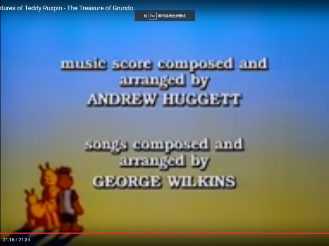
93年统治屏幕了一个春天和一个夏天的动画。片子本身65集已经是够长了，结果大连台播完教育台播，教育台播完教育台重播。片子里的主角挺无聊的，倒是坏人特威格非常有性格。
同名主题歌高端大气，电视上第一句唱出来特别有气势：“大地与我同在……”，其实是翻译错了= =
国语主题歌找不到了，找到了英文原版。要说老美就是实在，竟然能直接链接……

No.12《热带雨林的爆笑生活OVA》 OP 《LOVE☆トロピカ~ナ デラックス》 by Sister MAYO

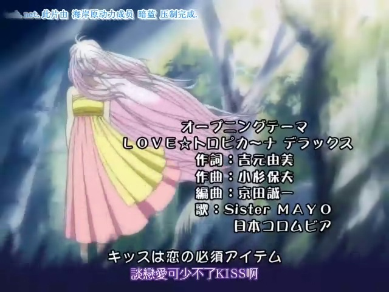
《热带雨林》是一部非常搞笑的动画。讲的是正常少年晴跟着妈妈搬家到一个热带雨林中的小岛上，身边被不正常的人充斥的故事。片中的女主角阿布以变脸著称，是我非常喜欢的动画角色。
主题歌《LOVE☆トロピカ~ナ》非常欢快，跟热带的气氛很搭调。OVA版的主题歌跟TV版稍有不同，加了一段主人公小晴（爱河里花子）的大贯口，而且OVA6集，每集的内容都不同。所以这版的歌名后面多了个小尾巴“デラックス”。

No.11《人鱼之森OVA》 OP 《Like an angle》 by 石川知亜紀

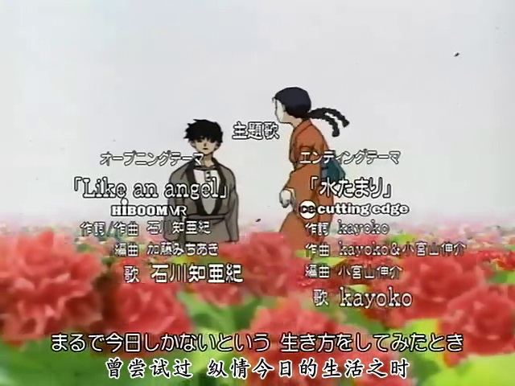
03年《犬夜叉》热播的时候，制作公司趁热把高桥留美子的代表作《人鱼之森》动画化。故事本身探讨的是长生不死的寂寞，非常的阴暗和无奈。不要以为高桥老师只会画低幼作品，人鱼系列因其血腥和世界观在霓虹国可是G15的作品。
其主题歌由大名鼎鼎的石川老师（后来改名智晶）创作，配合片头的真鱼，可谓是唱不尽的惆怅。

No.10《Last Exile（03版）》 OP 《Cloud Age Symphony》 by 冲野俊太郎

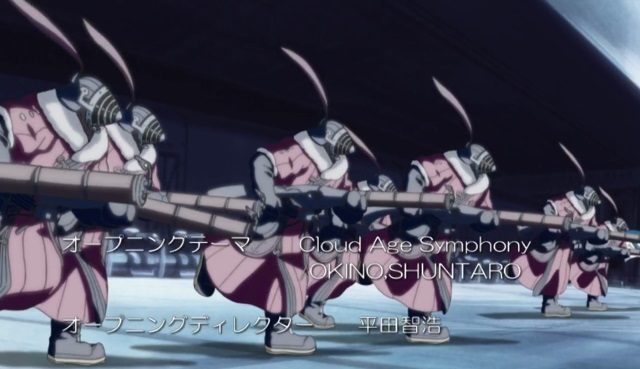
03年暑假期间，遭遇了一部难得的好动画《Last Exile（最终流放）》，制作精良，TV版作出了OVA的水准。这部动画讲述的是追求自由的故事，其空战场面无比奔放畅快。迄今为止这是唯一一部让我从头到尾26集连播12小时片头片尾都不跳的动画。
OP《Cloud Age Symphony》，契合主题，有种在云端飞行的感觉。

No.9《怪鸭历险记（Count Duckula）》ED

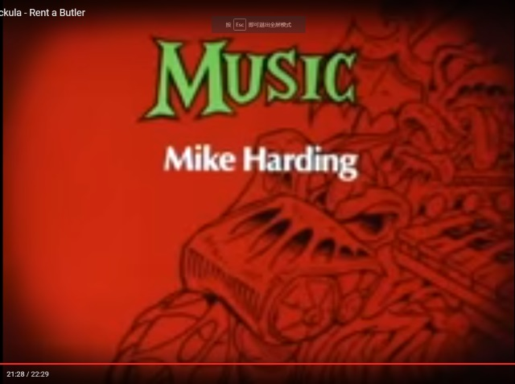
一部英式恶搞的精品动画，片头片尾其实是同一首歌，片尾比片头更流畅一些。
感谢广电总急不杀之恩，让10岁的我接触到了英式摇滚。

No.8 《我的女神》OP 《OPEN YOUR MIND~小さな羽根ひろげて~》 by 石田燿子

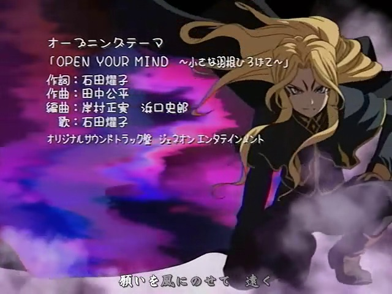
藤岛康介代表作，治愈系动画典型。贝露丹迪霸占日本最受欢迎女角色TOP3称号15年。甚至有人说贝露丹迪是唯一的女神。
主题歌听起来温柔而又温暖。

No.7 《丹佛，最后一只恐龙》 OP

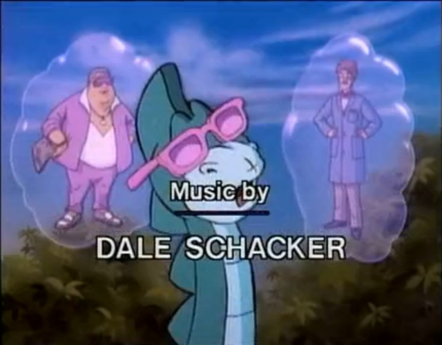
再谢广电总急。这回是美式摇滚电吉他。
这首歌就一个字：脆！

No.6 《Last Exile（03版）》 ED 《Over The Sky》 by 黒石ひとみ

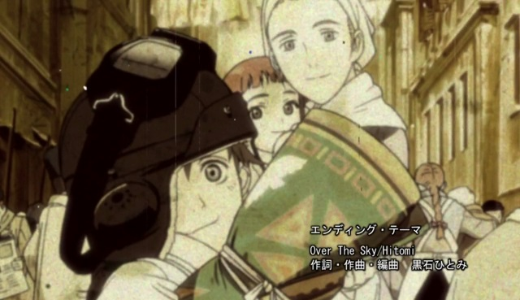
片尾曲。充满宗教般的仪式感，如果说OP是天上的风，那么这首ED就是风中的羽毛。hitomi老师的气声唱法，难度非常高。

No.5《虫师》 OP 《The Sore Feet Song》 by Ally Kerr

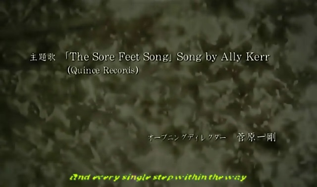
《虫师》是一部骨骼清奇的作品。跟一众打来打去爱来爱去的作品完全不同，探讨的是世界观的高大上话题。
其OP1是一首自然流畅的吉他弹唱，低吟浅唱间表明了动画的主旨。一个词形容就是“舒适”。
不过仔细看第二段的歌词就不知道作者是怎么想的了，听旋律就好。

No.4《乔乔的奇妙冒险3星辰斗士》 ED 《Walk Like an Egyptian》 by The Bangles

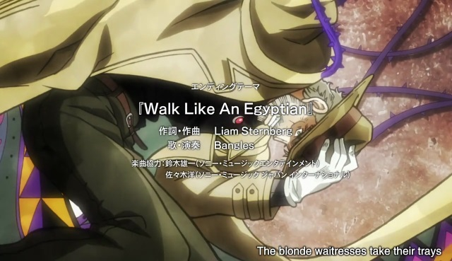
结婚以后追新番很少了，乔乔是不多的一部。乔乔这种作品的动画化当然不容错过。11版的乔乔动画质量非常高，据说是荒木老师当年的助手去做的监制。
这部动画的好多主题曲并不是原创，而是选了荒木老师喜欢的歌，也算独树一帜。
所以这首《Walk Like an Egyptian》其实是公告牌1987年的冠军，Hard Rock风潇洒得一塌糊涂。

No.3《全职猎人（99版）》 OP 《おはよう》 by Keno

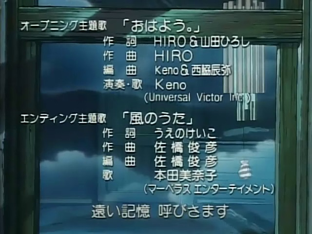
作品不用再介绍了。套句网易评论：猎人里唯一讨厌的就是富奸老贼。
其实除了主题歌和西索，99版是全面落后于11版的，但一首《おはよう》感觉是少年向动画的最高峰。

No.2《罗德岛战记~英雄骑士传》 OP 《奇迹の海》 by 坂本真绫

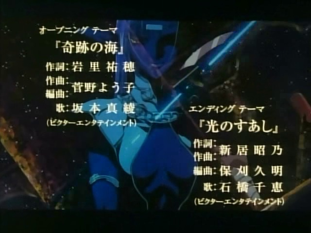
罗德岛是日式奇幻的精品。2的质量不如1。
当年只有16岁的坂本真绫横空出世，震惊全日本。我其实特别不喜欢叫她玲村太太，因为显老，因为我跟她同岁啊~
这是一首辽阔的歌。

No.1《罗德岛战记OVA》OP 《炎と永遠》 by Sherry

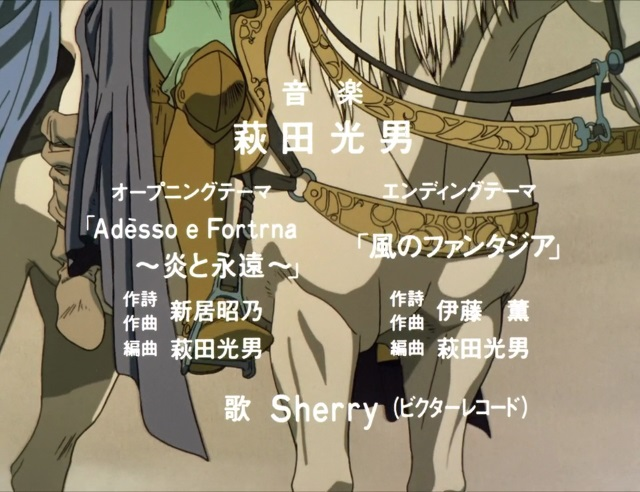
神作配神曲。可惜没有辽艺配音版放出。
OP里迪度依偎在帕恩怀里，远方是巨大的龙。
无论是节奏还是韵律，都透着委婉的美。