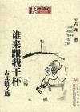

2005年2月15日起，2010年8月27日止，用了5年又6个半月的时间，完成了“重读古龙主要作品并作读书笔记”这一目标。
自己挖的坑自己填，就是用的时间有点超长了，颇有些“只说三四月，谁知五六年”的感觉。我开始预计的是三年，最后超支了近一倍。高估了自己读书的热情，也低估了年龄的影响。
我所定义的主要作品，是自《名剑风流》开始，至《英雄无泪》为止，加上《护花铃》、《大旗英雄传》两部早期作品，并且除去代笔过多的《圆月弯刀》、《血鹦鹉》、《凤舞九天》，的共计38部。
有些多，有些长，有些痛苦。毕竟是70年代的流行文字，90年代读着还可以，又过了20多年，快感已经降低了好多好多。
我甚至怀疑，当年的自己其实也并不是喜欢读武侠或者别的什么小说，只是年少时空余时间太多，选择太少罢了。

不过我的这次行动的目的并不是为了读书本身。
旧书重温，就像跟20年前的自己展开了一场对话。虽然花费了很多时间，但我觉得挺值的。
是半夜三更用被子堵住门缝的小心翼翼，或者是清晨伴着第一屡阳光和晨勃专找“嘤咛一声”的章节时的专注，是某位仁兄把我的书借走20多年都不曾还回来的记仇体质，是自习课上套个书皮读书眼观六路的提心吊胆，是放学途中坐过了站被售票员提醒的浑浑噩噩，是遇到盗版书缺页错字心中想骂娘。
全都回来了！这感觉真好！

我一直坚持认为，博客，weblog，就是把log记在web上。是为了自己记的。交流不交流什么的是锦上添花的事情。有更好，没有也不缺什么。
开始挖这个坑的时候就想到了，大多数来访的朋友可能对这个话题并不感兴趣。但总还是有些憧憬的。看中文的那么多，一旦有一个同样喜欢古龙的同好呢？
结果……不愧是不合时宜的古董话题。
貌似诸位朋友里只有陈大猫读过一些。

这并不奇怪。武侠小说本就不是什么高级东西，特定时间的流行物。古龙又是武侠小说中比较不那么典型的一个分支。
我说的是古龙的小说。一部一部来的。
既不是古龙作品改编的影视剧，也不是金庸的小说，当然更不是武侠小说。
于是很多留言我并没有回复，实在是不知该说什么。
常来的对于总是爱答不理的我也早免疫了吧。

除第二篇《七种武器》系列外，每篇我都用了一句古词做标题。以至于全宋词里不够用，还凑了一首柳如是和一首纳兰。
真是没想到的明珠投暗。除了木瓜园和路易斯cue过两次标题，以及倒数第二篇最有名的陆小凤+最有名的李易安勾引得王老师对了半句暗号以外，再没有人get到这个点。
可能古诗词同样过流行了吧。

不流行便不流行。计划中我要做的最后一件事，还是要说说我最喜欢的古龙人物。排名分后先。
**13.原随云（蝙蝠传奇）**
做坏蛋就要心思缜密。
**12.马真(霸王枪)**
想讲道理吗？先来一拳。
**11.梅吟雪（护花铃）**
爱即一切。
**10.苏樱(绝代双骄)**
绝对不要爱上苏樱，因为现实中这么聪明且善解人意的人根本就不存在。
**9.唐缺（白玉老虎）**
咬牙切齿面目狰狞的都不是真坏蛋，真坏蛋得会笑。
**8.荆无命（多情剑客无情剑）**
工具便要有工具的觉悟。
**7.燕十三（三少爷的剑）**
一个人若不能掌控自己，莫不如消灭自己。
**6.老实和尚(陆小凤传奇)**
不说假话，也不必说实话。
**5.白开心(绝代双骄)**
损人与利己根本是毫不相干的两件事。
**4.风四娘（萧十一郎）**
喝最烈的酒，泡最野的男人。
**3.王动(欢乐英雄)**
一动不动，这是结论。
**2.燕七（欢乐英雄）**
关心你就是要吐槽你，但身体比林妹妹好多了。
**1.傅红雪（天涯明月刀）**
要杀便杀，毫不犹豫！

最后，解释一下标题。

[谁来跟我干杯](https://pewae.com/gaan/aHR0cHM6Ly9ib29rLmRvdWJhbi5jb20vc3ViamVjdC8xMjA3NjI2)

作者：古龙出版社：百花文艺出版社出版时间：2002

古龙死后，有人给他总结了一本散文集，名字就叫《谁来跟我干杯》。
古龙的诸多小说里，我只推荐了一本，对吧？现在推荐一下这本散文集。里面是他在一些作品里的序和跋，以及发表在报纸上的一些评论。
老熊的文字非常厉害。他之所以写武侠，不过是武侠赚钱而已。