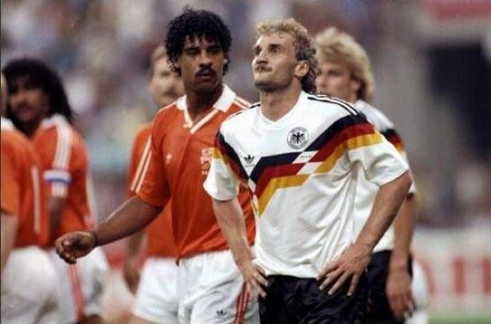
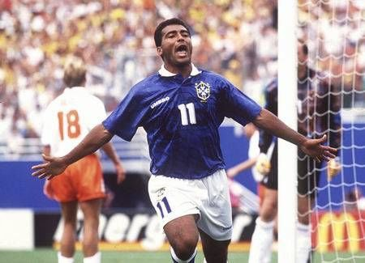
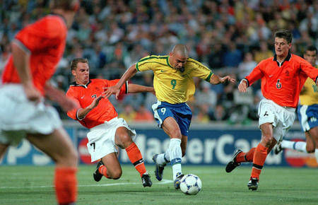

10岁之前不看足球。
意大利世界杯是我看球的启蒙。开幕式那天正在我姨家，表哥们早晨起来异常兴奋地谈论着一个什么队如何如何牛，把一个什么什么马的人带领的什么什么蜻蜓队被什么什么龙给干掉了。而且我知道了，足球比赛是可以有人被罚下了。90年世界杯的界面不像开幕式那么友好，它跟当时热播的《葫芦兄弟》有冲突（CCTV横杠2世界杯录像，CCTV横杠1葫芦兄弟）。争不过老爹，只好到楼下找3P同学玩。也就是那个时间段，我们一起挖蚂蚁窝。用雪糕棍和砖头作为工具挖了个半米左右的大坑——蚂蚁蛋看起来白白糯糯的——要是那时3年之后的我，肯定会毫不犹豫地咬一口上去——但我彼时还没那么变态——连一点苗头都没有。

接下来的暑假，总是不停地播放比赛录像。从录像里，我知道了有个很强的队叫西德，知道了德国队有个马很厉害，这个马很可能跟上届的那个马在决赛里碰面。决赛又是在姨家看的。是第二天的重播，那时我在跟两个表哥还有表姐夫打麻将——他们欺负我，让我坐背靠着电视的位置，除了重放的点球，什么都看不到。录像看得多了，也逐渐知道了足球比赛的各种规则——虽然直到3年后我才知道什么是越位。我有了第一个偶像，他有点谢顶，名叫利特巴尔斯基。
偶然，在一个无聊的下午，我看到了这个偶像所在的德国队跟一个穿着桔红色衣服的荷兰队打的比赛。一个黑啦吧唧的满头小卷的人跟我们德国的黄毛什么尔（那个时候德国好多尔）像两个泼妇一样在场上动手，看得真太TNND过瘾了！！那个时候还不流行“酷”这个词，只是觉得这两个家伙太帅了。同时，我喜欢上了这帮穿桔红色衣服的人。一个另外的黑糊糊的头发比打架的这个还长的人太帅了!我简直爱上他了，他的名字也比打架的那个好记多了，叫路德.古力特。同时，也记住了德国人是俺们的死敌。

之后年底的丰田杯，我终于记住了那个短头发的黑人，他叫里杰卡尔德，飞行5米之后的凌空头球帅得快赶上俺偶像了。

94年世界杯的讨厌之处，在于它的比赛时间太恶心了，1X个小时的时差，导致比赛都在早上进行。这届看的比赛相当少，只有阿根廷打罗马尼亚的那场算是完整看了。记忆中的片断包括倒霉鬼埃斯科巴的乌龙、山羊胡子拉拉斯的倒钩、尼日利亚野人奥利赛赫的远射和苏比萨雷塔的莫名失误、三四名决赛时满场飞奔一头小辫的亨里克拉尔森，当然还少不了决赛紧张的巴乔和帕柳卡。很奇怪的是，前面的比赛，一场荷兰的都没看。

又是暑假，又是重播，又认识了一个荷兰偶像——罗纳德.科曼、又知道了一个死敌的名字——巴西。

98年世界杯，已经上高二了。总觉得这是迄今为止最好看的一届世界杯。因为在上学，所以必须要挑比赛来看，只能偷着爬起来看凌晨的一场。这届的荷兰队异常强大，汇聚了范德萨、纽曼、科库、斯塔姆、德波尔兄弟、奥维马斯、戴维斯、西多夫、克鲁伊维特、博格坎普等一干精兵强将。印象最深的小组赛是5：0胜高丽鬼子，连范胡伊唐克都能打得那么好。兴奋得我5点多看完比赛就直接冲出家门直奔学校。半决赛对巴西是终生遗憾的。荷兰人演绎了史上最华丽的进攻，奈何巴西历史上最好的守门员发挥太出色，最后体力下降的荷兰又一次死在点球上。
决赛对于我来说是有传奇性的。决赛的当天做了个神奇的梦：一个我和另一个我在回顾整个世界杯：“法国淘汰了意大利和克罗地亚进了决赛。英格兰输给阿根廷输给荷兰输给巴西。巴西输给谁了？巴西和法国的决赛打了么？？”然后“蹦”地一声坐起来，跑到客厅开电视，看了大半的比赛，没错过任何一个进球。

02年世界杯缺少了橙色，只好把注意力放到另两个比较喜欢的球队身上：瑞典和阿根廷。可惜这俩队并没有联手干掉我厌恶的英格兰，反倒耗子动刀窝里斗，阿根廷出局了。身在大学，有了多多的空余时间来看比赛。可惜好好的世界杯被韩国和中国给搅和了。中国是太烂，一批伪球迷在宿舍呜噢乱叫搞得人没法静心看比赛；韩国是太赖，有韩国的比赛根本没法看——一帮韩国留学生更是给看球填堵：每个韩国比赛日的晚上，都会成帮结伙的在校园里“大韩民国”到深夜。决赛？？一点印象都没留下。这届比赛记忆最深的竟然是塞内加尔对乌拉圭的耍赖大战。

足球回到欧洲了！荷兰人回来了！！有1W个理由期待这届比赛。荷兰确实没有以往那么强大了。但喜欢一个球队，也许是不需要理由的。

荷兰好运！墨西哥好运！瑞典好运！阿根廷好运！
90年挖的坑，早就被人种了树了。那树已经1米3左右了