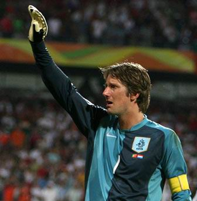

两天

> 我还是飞不起来依然需要等待
> 你就这样离开带着所有伤害
> 秋天还是秋天依然美丽凄凉
> 还是飘飘荡荡依然充满幻想
> 我想飞还是飞不起来
> 我想飞在每个想你的秋天
> 我想飞在歌声响起的夜晚
> 我看到我的身边他们都比我美
> 我看到我的身后时间都已枯萎
> 我想起昨天你柔软的身体
> 我想起从我身边再次出走的你
> 我只有两天我从没有把握
> 一天用来出生一天用来死亡
> 我只有两天我从没有把握
> 一天用来希望一天用来绝望
> 我只有两天每天都在幻想
> 一天用来想你一天用来想我
> 我只有两天我从没有把握
> 一天用来路过另一天还是路过
> 哦……

——许巍《两天》

我的世界杯，只存在了两天。第一天用来死亡，第二天还是死亡。
钟爱的瑞典、墨西哥、荷兰以或无奈或惋惜或不甘的心情相继死去。
可惜，在这个所谓的舞台上，没有什么虽败犹荣，只有你死我活后的最后的幸存者。

今天起可以睡安稳觉了。

再见，范德萨；再见，科库。