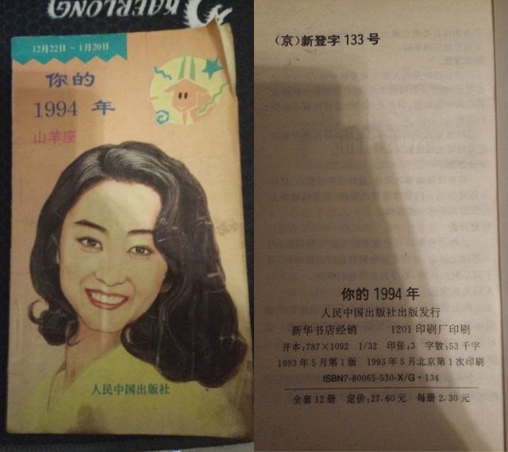
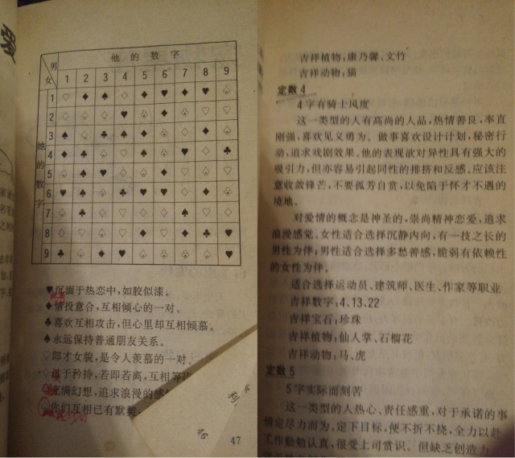

搬家时发现，这本名为《你的1994年》的书竟然还在。算起来，这件老物是本人购买的第三本星座书。
第二本是它的前篇《你的1993年》，那本书算是本人的星座学正式启蒙，里面对土水火风的概念描述得比较明确。对照第一本星座书进行比较，好多问题豁然开朗。
这本续篇，滥竽充数的内容实在是多了一点儿，并算不上一本好书。可惜第一本书在班级男女里转了一圈之后就丢了，根本没见到1993年的太阳。
至于第一本嘛，当然是《[圣斗士](https://pewae.com/2006/01/memories-of-saint-seya.html)》咯。

说回这本。1993年夏天，小学快毕业的时候，每天都要照例去杂志摊逛一圈。忽然发现了这本跟丢失的“1993”长得非常相似的“1994”。第一反应是这出得也太早了。怎么着也得快过年的时候出才有时效性啊。不过反正也不是太贵，横竖就是一顿饭钱，拿下。最少林青霞要比林忆莲（93封面）名气大吧！后来网络时代了才知道，林忆莲和林青霞都不是摩羯座的。
拿回家一啃，就非常失望了。里面干货的内容很少，跟属相的搭配是重复的，跟血型的搭配呢，又不知道自己什么血型。至于1994年每日的运程，本来就是一堆模棱两可的话，再加上还有大半年呢，谁会在乎呢？前后翻了几个来回，可能只有姓名配姻缘有点儿用吧。

于是就有了上面的笔记。我不光记得这四个女生是谁，连当时用的笔长啥样都记得。如意算盘打得蛮响的——我把书带到学校传看一遍，就一定会传到ABCD四个女生手里，万一谁有意思，不就勾搭上了吗。
然而，那啥是丰满的，那啥又是骨感的。什么事情都没发生。
不仅如此，升上初一之后，“如胶似漆”的那位变身大姐大，成天在校门口圆规立，抽烟抢钱。
好像什么东西碎裂的声音。
于是这书直接就压书堆底下了，才得以活到今天。

幸亏没继续信这书。
“心心相通”的那位，如今在朋友圈卖保险，是个刷屏的粉刷匠。

真正有用的是我后面买的第四本星座书，托名张小娴的作品。那本书把星座间的关系说得特像那么回事儿。可惜借给Rock之后被她弄丢了。
凭借这深厚的星座知识功底，初中三年，很是过了一把神棍的瘾。
在神棍的道路上，我也是一直不懈追求进步的。比如通过漫画JOJO，我又盯上了塔罗牌。但那就是另外的故事了。

可惜那几年也是追星狂潮最猛的几年。娱乐杂志里很容易就潜移默化地把星座知识灌输给了痴女怨女们，我的这套东西逐渐变得尽人皆知。没有装逼的乐趣，我也就不玩了。

所以在本博搜星座关键字，只能找到几篇而已。频率千分之几。
现在有人跟我提星座，我就当面锣对面鼓地说：“把一个人的性格的决定因素，简单地归结成出生日期。你这叫一元化归因谬误。知道什么叫逻辑学谬误吗？blabla……”逻辑学哎，听起来多高大上。我又可以愉快地装逼了。

我承认，因为玩星座的太多就不再玩下去这事儿，很摩羯。