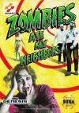

[我的邻居都是鬼](https://pewae.com/gaan/aHR0cHM6Ly93d3cuZG91YmFuLmNvbS9nYW1lLzI1ODU4MTcyLw==)

原名：Zombies Ate My Neighbors别名：邻居不是人 / 僵尸邻居机种：MD厂商：科乐美类别：ACT发行年月：1993-09耗时：22

秘技:最终BOSS不战而胜法:带一只狼人进到最后的房间,躲到右上角,让狼人杀死你。再出场时狼人能跳进里面的房间杀死人质。过关门出现。

对我来说，这是一款充满了回忆的游戏。初二的时候宝宝的表哥弄来了这盘卡，每天中午我们都会偷偷跑到他家玩上那么一小会儿。这是个非常适合双打的游戏。论两人配合的游戏，还是卡婊和科纳米做的最好。
明明直译过来是“僵尸吃了我邻居”，可港译偏偏就喜欢这么哗众取宠。不过游戏后半段什么木乃伊外星人鱼人狼人弗兰肯吸血鬼都出来了，僵尸反倒是最好对付的敌人。
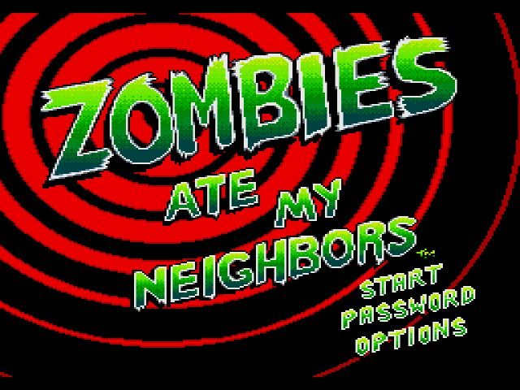

游戏的优点是配合音乐和节奏产生的一种紧张感。这个游戏玩起来，神经始终是紧绷的，要不停地跑跑跑，捡东西规划路线救人质换枪都要在极短的时间内完成，否则很快就挂掉了。
而在能力允许的情况下，救完人质要尽量把版面上的物品搜刮一下，不管是道具还是武器，游戏里都是有限制的，能多整一点儿就多整一点儿吧。
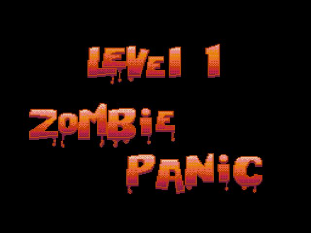
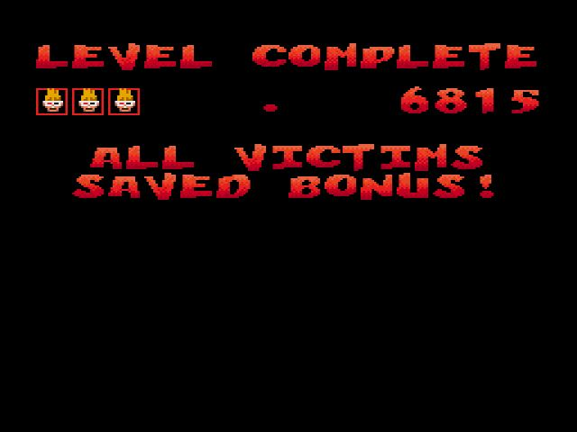
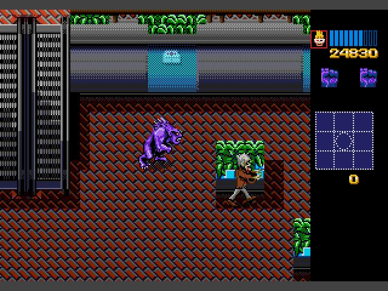
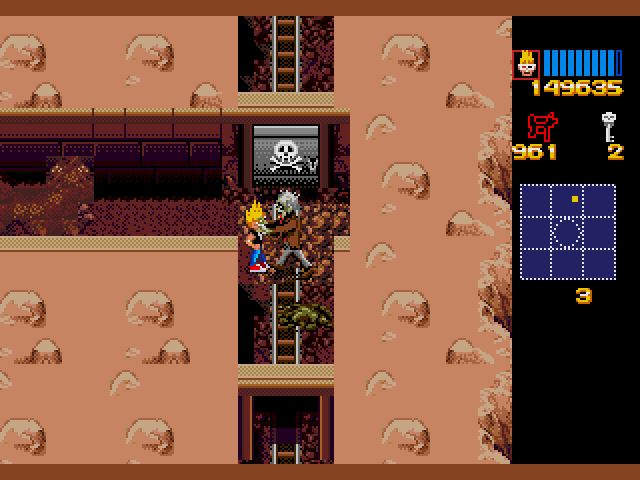

缺点嘛，就是流程太长了。当年我和宝宝要是知道这玩意儿有48关正常关+7关隐藏关那么多，怕早就放弃了。要知道我们俩配合最多只能打到第八关，挂在这个巨婴手里。
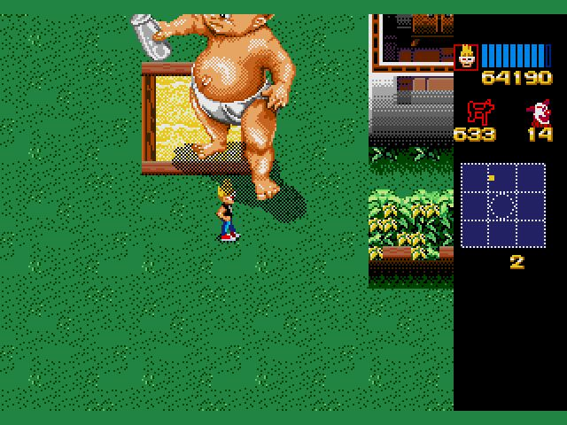

第31关以后画风突变，不用救那么多人质了，而要点变成找骷髅钥匙救人，变成解谜游戏了。同样好玩。
第31关就要和这种地龙拼命才能弄来钥匙。
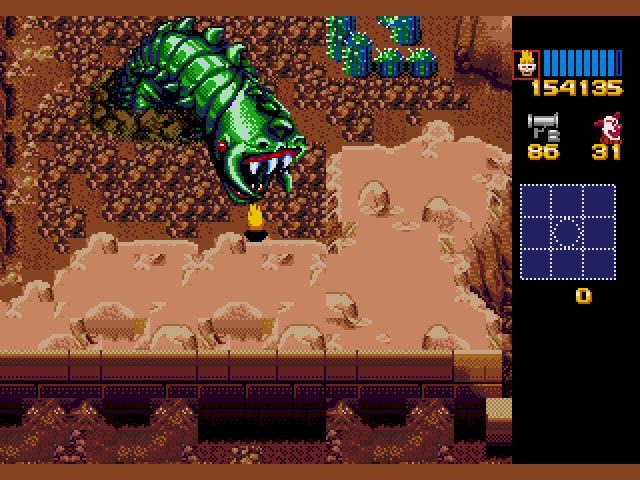

救人质的时候一定要坚决，不要抱着先放一放等一会儿回来救的想法。因为好多敌人会穿墙术，你不抢先救人质的话，不出五分钟人质就会挂掉。
后半部分人质如果意外死了，主人公也会直接挂掉。
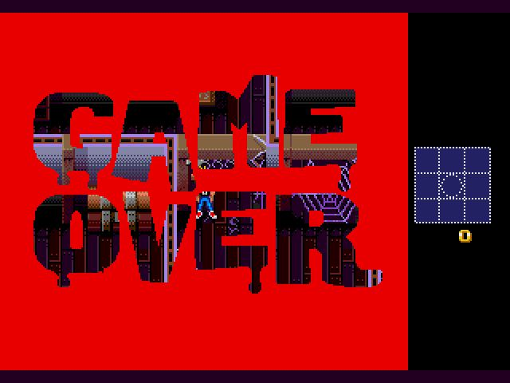

遇到问号一定要捡，因为接下来会进入好东西多多的隐藏关。虽然又有弗兰肯斯坦又有吸血鬼，但地形已经非常简单了。
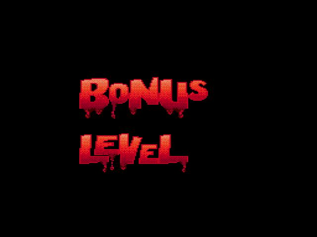
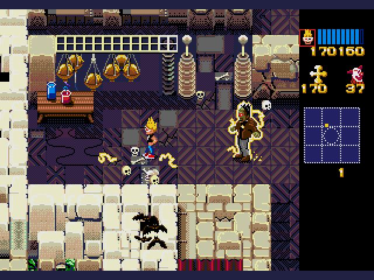

最终BOSS在前面其实出场过一次，变身成蜘蛛。
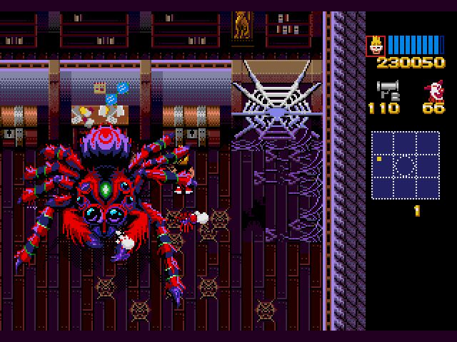

最后一关，BOSS先嗑药变成蜘蛛，打死后再嗑药变成一个大脑袋，然后越打越恶心，直到最后挂掉。
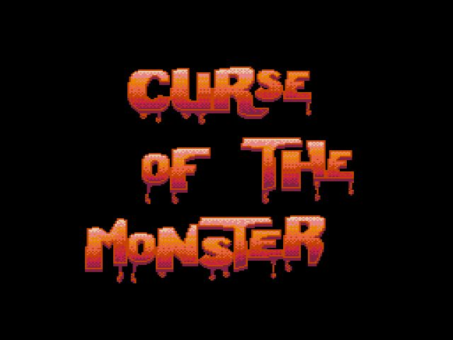
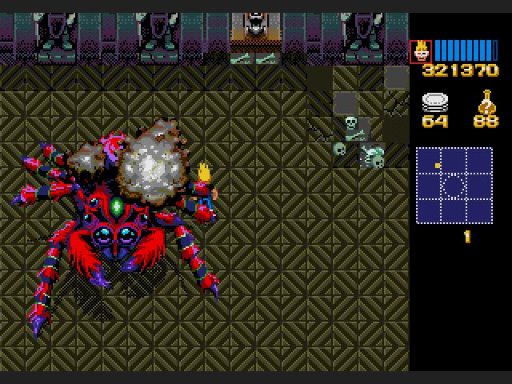
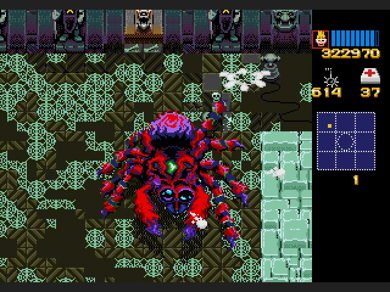
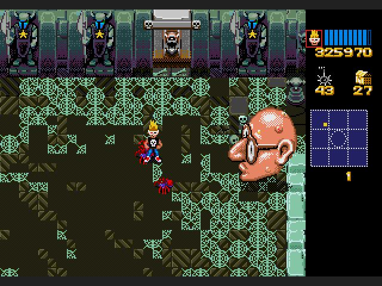
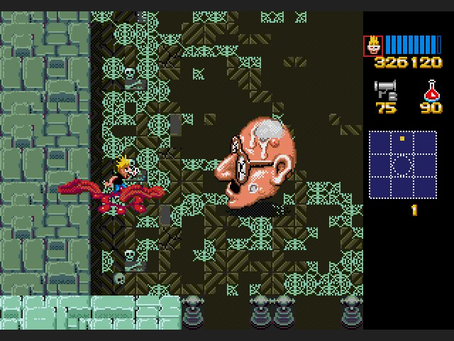
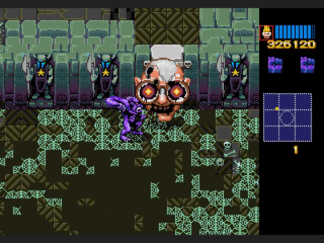
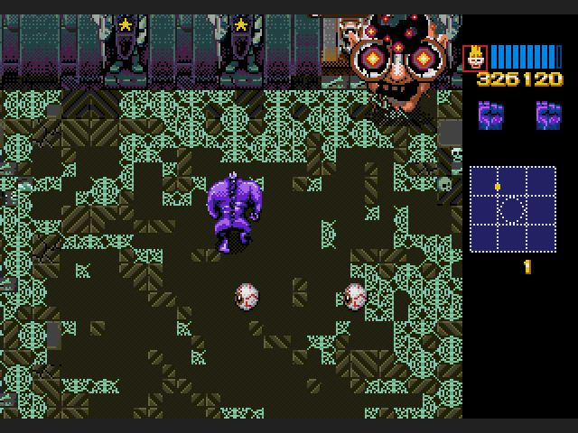
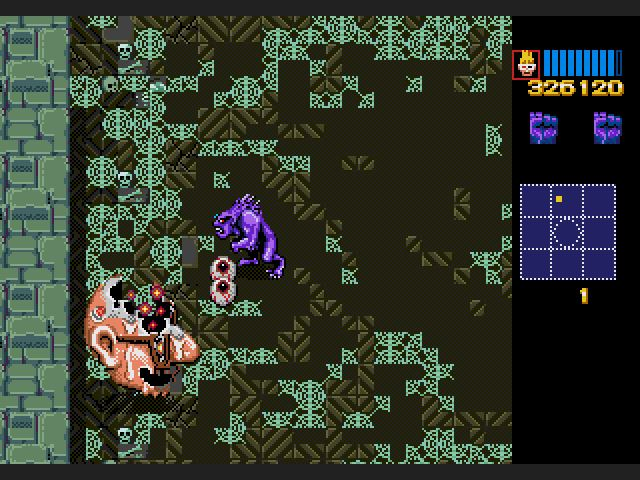

通关以后先撒花，统计你的杀敌数量
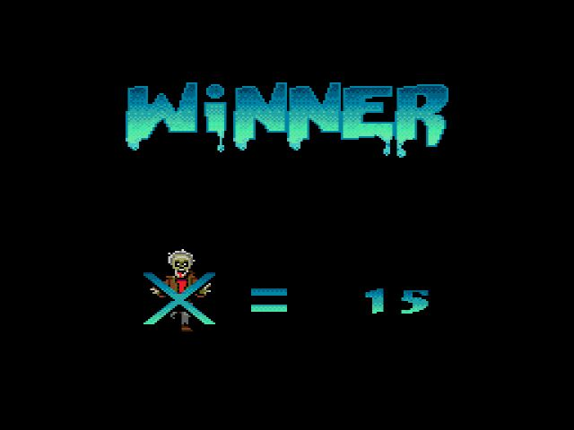
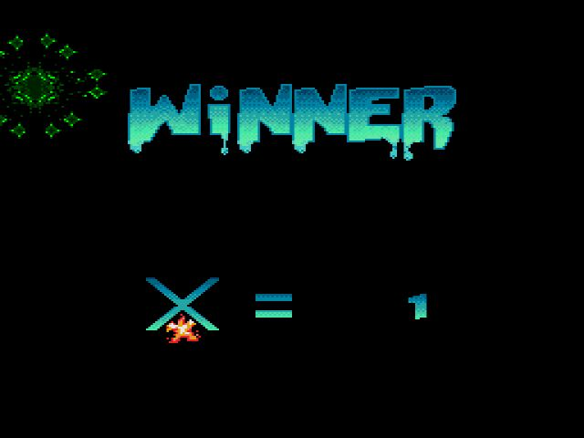
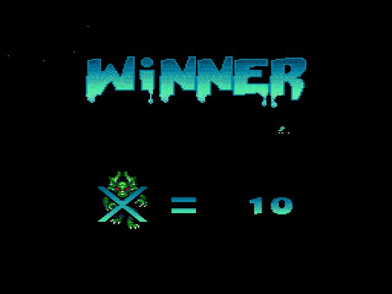
最后也比较有意思了，以一个隐藏面版的形式来介绍staff。
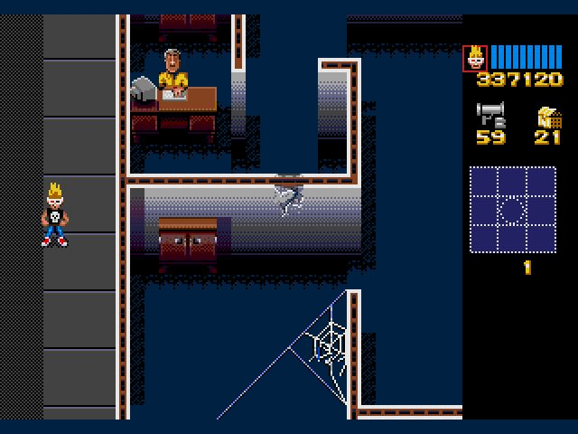
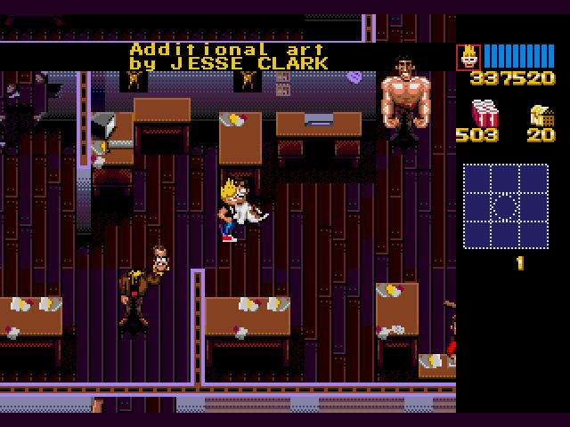
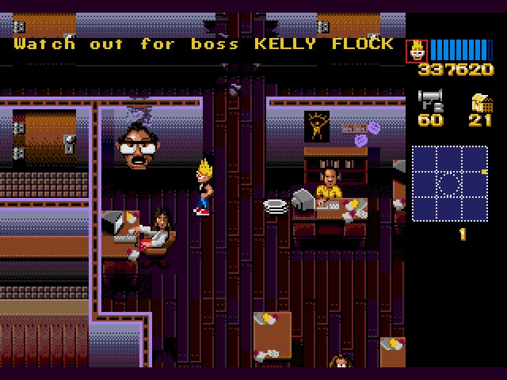

P.S:三连发，把MD篇终结了。人的状态也很好。感谢法西斯。