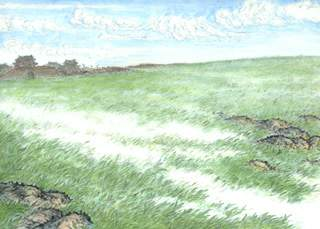

其实我本来想写《我为什么不爱写议论文》。但一下子想起好多自己不喜欢的课文来。于是。
大学没有语文课，所以都是中小学课文。

**变色龙**
*契诃夫/初中*
在公元2004年重新认识希腊足球队以前，我一直觉得战斗民族的名字是世界上最难记的。这篇课文里的主要角色名字无论长短都非常拗口。应该都有印象吧，这篇课文附带了一个分角色朗读的要求。除了旁白，我无论扮谁都会陷入混乱中。不是溜号，而是真的记不住自己是哪个。所以被老师点名的时候拖累了整个团队。就是不愿给人添麻烦，没办法。
还有作者的名字也非常讨厌。因为这篇课文当时是一位刚从农村调到我们学校的口音非常重的老师代课的时候讲的。她教的时候，读的是契he夫；而正牌语文老师回来之后，说代课老师口音太重，应该是ke。但我们查字典又是he，简直一脑门子官司。
嗯，我们初中语文老师是个傻逼，以前讲过[她坑全班的段子](https://pewae.com/2010/07/poison-in-books.html)。稍后我会讲跟她的个人恩怨。

**在马克思墓前的讲话**
*恩格斯/高中*
这篇课文，应该说翻译的很好吧。讲课的目的也很明确，就是归纳段意。第一部分写马克思死了，第二部分写他生前如何如何牛，第三部分是我如何怀念他。
但是，意义何在啊！在语文课上学习马克思如何牛叉？文字里说他对数学也有贡献怎么也过了吧；或者就是为了教大家如何写一篇悼词，如何写一篇溢美之词？

**荷塘月色**
*朱自清/高中*
原因一：一向对小资情调堆砌华丽辞藻的文章不感冒
原因二：要背诵
原因三：一句“这几天心里不宁静”怎么就能扯出来“大革命失败以后，内心苦闷彷徨”来了？怎么就不能是跟老婆吵架或者打麻将输了或者大姨夫来了呢？
生来爱较真。

**反对党八股**
*毛泽东/初中*
这篇文章里伟大领袖干了件自相矛盾的事。他说党八股的其中一条罪状是“甲乙丙丁，开中药铺”，但这篇文章本身就是第一条罪状、第二条罪状……这么罗列下去的。
尤其有意思的是，课本里这一课跟刘少奇的一篇什么课文是挨着的。怎么看怎么像伟大领袖在教训接班人。所以我就纳闷编教材的到底是在搞那样儿啊！
刘的那篇文笔烂到家了，甚至还有语病，没入选纯是因为我想不起来从题目到内容的任何一点线索了。

**项脊轩志**
*归有光/高中*
“三五之夜，明月半墙，桂影斑驳，风移影动，珊珊可爱。”
意外吧？
因为你们的老对儿（同桌）都不叫珊珊。
这篇课文是要背诵的。但一背到这儿就要脸红瞅旁边一眼。
今年聚会的时候她居然拿起麦克就唱萧亚轩的《闪闪惹人爱》——17岁到34岁，脸皮的厚度一定不是线性增长的。

**寒号鸟**
*不详/小学四年级*
刚上四年级的时候，我们换了新班主任。新班任有个坏毛病，她在讲完每篇新课文之后，都要求同学们把全文抄写两遍。而这项作业，一般都会在星期三半天的时候布置下来。有的时候进度较快，周三的下午就可能需要抄四遍课文。
四年级正是玩得疯的阶段。我就想到了偷工减料的办法——开始是省略助词，后来干脆把课文简写，最狠的时候不到原文的1/3。
小伙伴们都惊讶我为什么总比他们早跑出来玩，我就把绝招外传了。不久，就成了众人皆知的秘密。
事败之后，被罚抄写《寒号鸟》20遍。
《寒号鸟》是小学四年级上册里最长的一篇课文。

**荔枝蜜**
*杨朔/初中*
本身对托物言志这种形式就非常不喜，杨朔的这篇文章根本就是纯扯淡！
什么“不是为自己，而是为人类酿造生活的甜”啊，这不睁眼说瞎话吗？蜜蜂酿蜜根本是为了自身繁衍，你去动一下蜂窝试试！没看过《少年科学画报》，难道也没看过《熊大熊二智斗维尼》吗？

**为了六十一个阶级兄弟**
*王石、房树民/高中*
太、肉、麻。

**论“费厄泼赖”应该缓行**
*鲁迅/高中*
虽然语文老师老戴在讲课时一直极力证明鲁迅把别人比作狗是有道理的，但我还是觉得人身攻击是不妥的。起码不应该选做课文。就这么简单。
上大学的时候跑去图书馆看林语堂，读到了《论语丝文体》。发现被鲁迅拍砖的这篇其实条理更清晰，语言更流畅，更适合作为议论文的范文来当课文。

**依依惜别的深情**
*魏巍/高中*
太、太、肉麻。
而且我们高三的班任特别喜欢用魏巍+奥斯特洛夫斯基式的长句排比反问大贯口来教训/鼓励人。我坐在底下的反应就是，嘚啵这么久，还让不让人写作业了。

**沁园春.雪**
*毛泽东/初中*
诗是好诗。坏在注释上。
“指人民群众”。
呵呵。

**草**
*白居/小学二年级*
我没写错标题，也没写错作者。“离离原上草”怎么惹到我了？这要怪我那个无良的大表哥。
——“大致，上二年级了。都学什么啦？背来听听。”
——“草。离离原上草……春风吹又生。”
——“后面还有呢？”
——“没了啊！”
——“远芳侵古道，晴翠接荒城。又送王孙去，萋萋满别情。”
——“这个老师根本没教啊！”
——“还有标题你也没背对。这首诗叫《赋得古原草送别》，记住了吗？”
草草草，操啊！不过我还真记住了，转过头就回学校去阴小伙伴了。
但是。
这种以物寄情的诗把后半截砍了当教材真的好吗？怕小朋友不会写字你可以不放到二年级啊。
现在想起大表哥那贱飕飕的表情，后槽牙就觉得痒痒。被我阴到的小伙伴想必同样如此。

**俭以养德**
*马铁丁/初中*
文章本身就挺烂。作为一篇议论文，“是什么”根本没有，“为什么”逻辑混乱。而且第一段和第三段的段意非常难以总结，傻逼语文老师（以后称她小灰灰吧）讲到这节课的时候毫无主见，几乎从区里开一次会回来，就带回一个新版本。
如果只是这个原因，这篇文章绝对不会排在第一的位置。排第一是因为一个悲伤的故事：

初中语文讲到这个时候，该学着写议论文了。小灰灰要求我们写一篇“跟消费有关”的议论文。我不知道她当时是怎么想的不直接布置一篇论节俭，如果那样的话也不会有后面的事儿。
请注意本人的一个基本属性：爱抬杠。
我写的是《中学生应该有自己的零用钱》。自己觉得挺流畅，起码论证过程非常充分：第一现在家长比较富裕；第二中学生应该有自己的空间；第三可以培养理财能力。啪啪啪一千多字。
作业交上去后我就被叫到讲桌前面点名批评了。
要不怎么说小灰灰水平太凹呢，她要是上来就说你的观点不对换个论点重写，我就被一击KO了。但她没有。

小灰灰：“你看你这段写的，怎么能举因为身上没钱坐车耽误了时间的例子呢？这不成了不能没钱吗？”
我一头雾水：“我举例子就是为了说明身上留点钱的必要性和不带钱的危害性啊。”
小灰灰：“还有这句话，你把主干提出来，是不是 中学生 应该 有 钱。不是应该写中学生应该有适当的零用钱吗？”
我：“老师，我第一段就写了，中学生应该有零用钱，这就是我的观点啊！我从来没说‘适当的’啊？”
其实这个时候我已经明白她是想批评我论点不对了，其实早在一开始写的时候就有这样的觉悟。
小灰灰：“你不能这么写，你应该写‘适当的’零用钱，要是不加‘适当的’，不就会乱花了吗？”
我：“可是我最后一段不是写了‘当然，家长应该监督学生钱的用途’了吗？我认为乱花之后再进行教育比一分钱都不给要好，这我都写了啊。”
小灰灰无语了。她只能让我在讲台上站着。这个笨蛋连个台阶都找不到。
我块头大，总挡的某些同学看不到黑板，他们就在底下指挥我“左边一点，右边站站。”
教室里就乱套了。
后来还是班主任大人进教室来给解了围：“鲁迅的有些观点也是很尖锐的，但不是人人都能当鲁迅，下次别再这么写了。”把我放回了座位上。

一个语文老师被物理老师解围的故事。