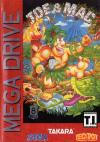

[战斗原始人](https://pewae.com/gaan/aHR0cHM6Ly93d3cuZG91YmFuLmNvbS9nYW1lLzI2MzcyOTQ3Lw==)

原名：ジョーとマック 戦え原始人机种：MD厂商：DATA EAST类别：ACT发行年月：1991-12耗时：3

首先,J字头最好玩的游戏本来应该属于《侏罗纪公园2》。元旦之前就在攻关了，可惜昨晚不知惹到了哪路邪神，打着打着定版了。无论如何读取都不能继续进行下去，只好忍痛割了——那游戏流程太长，实在没有再来一次的勇气。

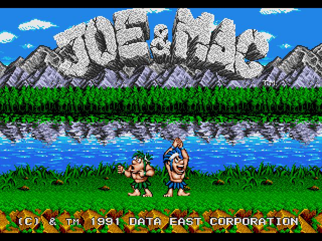
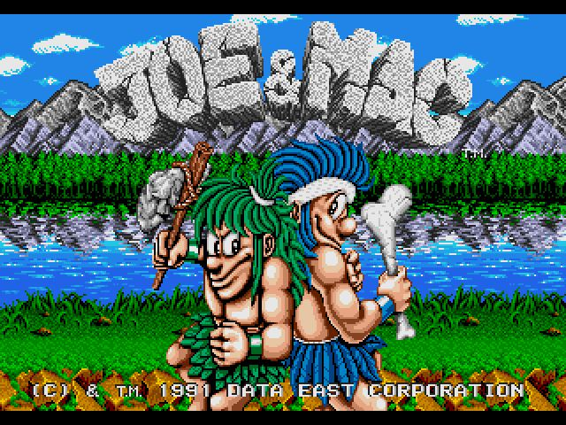
咳咳。战斗原始人系列是DATAEAST公司非常著名的一个系列。1991年在街机上推出第一作后大受欢迎。于是趁热在各个平台上推出了移植版。其中，MD移植版由TAKARA操刀。
游戏的最大特色是色彩艳丽的画面和节奏明快的音乐。而SFC音乐画面均偏柔，所以推荐MD这款。
游戏的主角可以使用火焰，石轮，回旋标，石飞镖和石斧作为武器，同其他野人和恐龙进行战斗。推荐使用的武器是石轮。因为移植上的bug，石轮是唯一一个不需要攒劲到最大就可以释放出来的武器。boss战时非常有用。是的，本游戏的爽点就是按住B键攒劲之后，一下把巨大化的武器砸出去。我才不会告诉你们我打一周目的时候不知道攒劲，第二关boss花了半小时呢！

故事的发生是这样的，一天半夜，其他部落入侵，把MM抓走了……
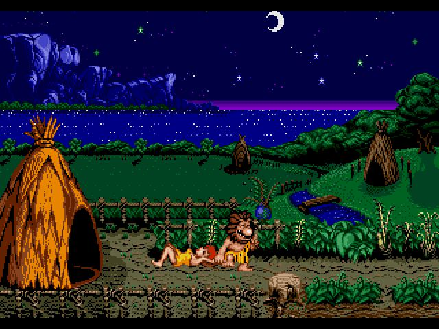

于是伟大的勇士踏上了征程，开始勇斗各路恐龙boss。其实很奇怪，明明是人把MM抓走的，为啥所有的boss都是怪兽？
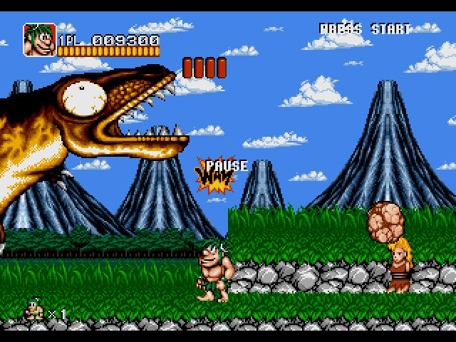
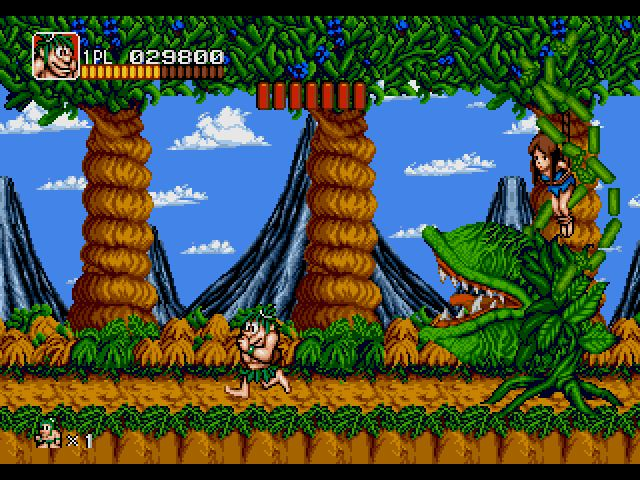
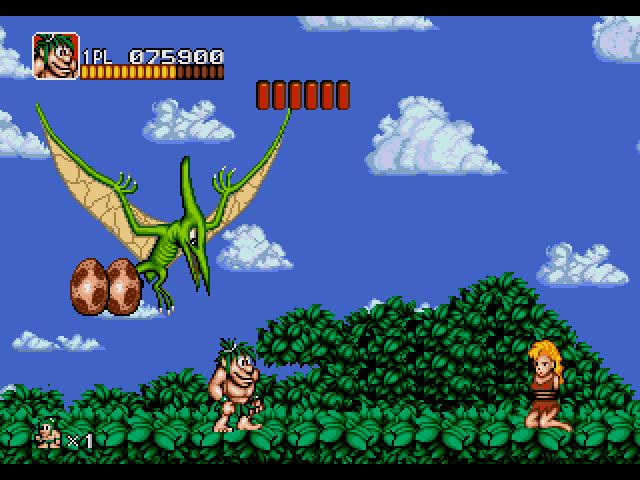
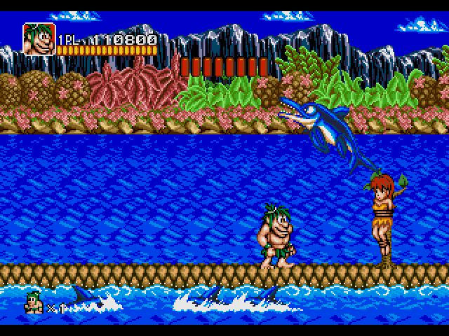
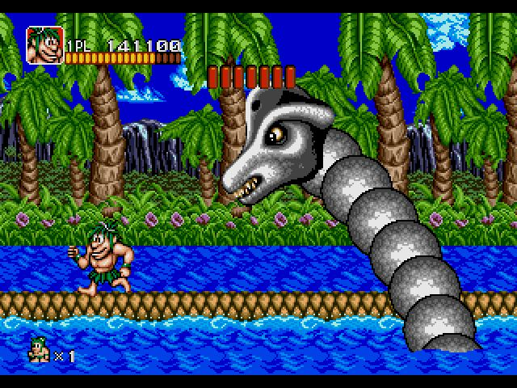
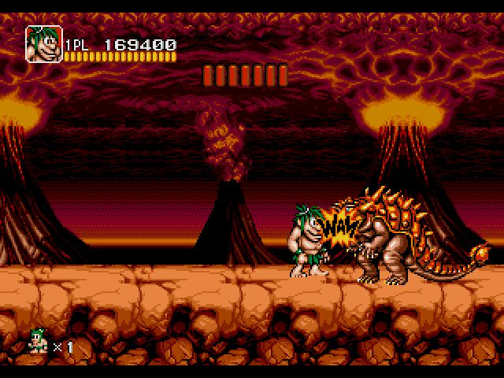
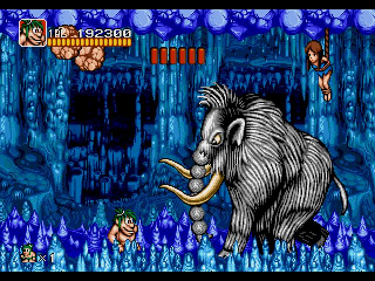
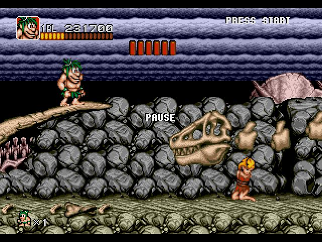
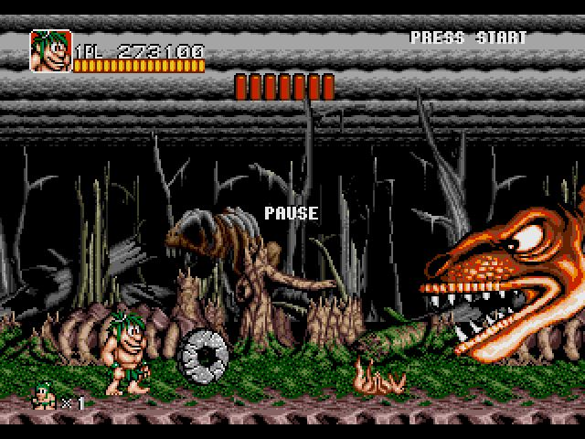
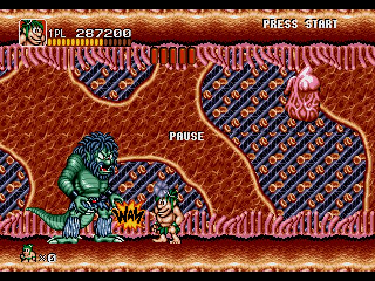
其中，最后一关是从倒数第二关boss倒下后的嘴里钻进去的。貌似剽窃了沙罗曼蛇的创意？？

打倒最后的boss后，有三个分支路线可选
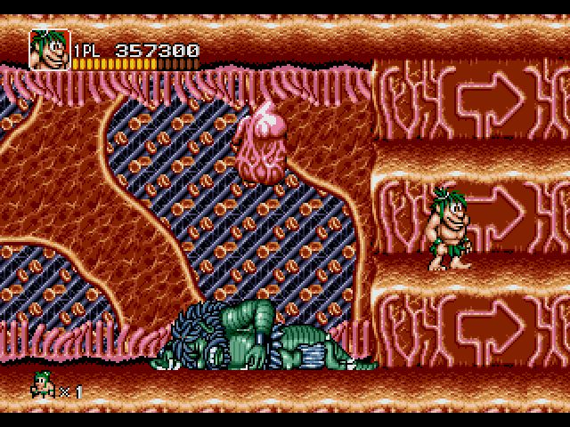
其中两条出来的通关画面是被丑女追，只有一条会被一群MM追。你猜，哪个才是会出美女的路线？
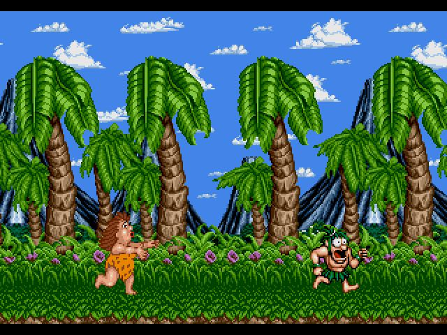
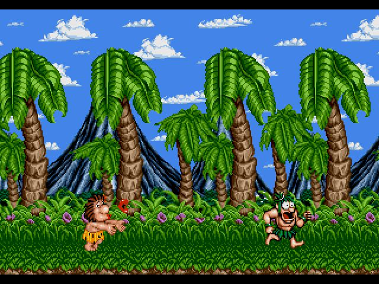
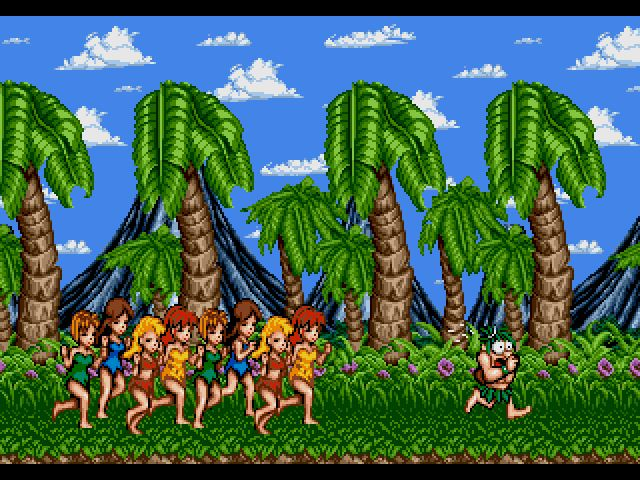