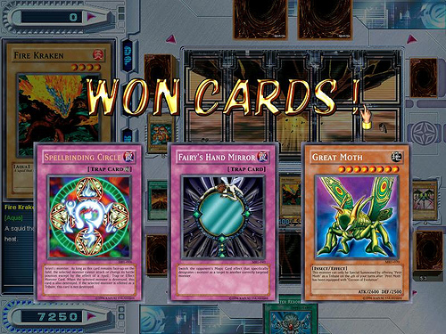
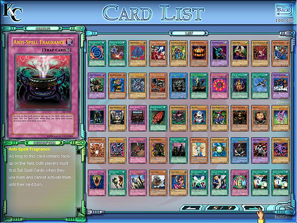

7月22日至今,俺就没玩什么PC上的新游戏,几乎将全部精力都放在打上了.今天,刚才,10月29日19:00的时候,俺终于打出了最后一张卡,从而凑齐了海马这一代的全部315张卡.
期间,总计打出1062张卡.也就是说,平均每3.37张卡才出一张新卡,这还不包括一开始白送的40张卡.也就意味着,俺最少打了354场以上的对决.而实际上,俺的胜率在80%左右(一开始的胜率没那么高),所以,俺应该是打了400局以上(三场胜负).来之不易啊!!!

总结一下吧.

1.俺通常是带17张普通怪物卡,19张带特殊效果的怪物卡,21张魔法卡,7张陷阱卡.共计64张.带的卡一定要比敌人多,实在不行了也可以把对手耗死.

2.7星以上的卡只带3张,青眼白龙,手枪龙,水神隧极各一张.其实可以换成带两只手枪龙不带青眼白龙的,但是习惯了青眼白龙作为普通召唤出来的最强大存在.手枪龙这种东西太无赖了,要不是召唤有点费劲简直无敌了!!隧极的作用是防止对方的高攻卡的.suiji这个系列的三个有个特点,可以将敌人的一次攻击抵消为0并且反射回去.用来对付敌人召唤出来的闪电龙或者三个青眼白龙组合成的那个攻击高达4500的怪是最好不过了,俺唯一两次赢了无尽的白龙靠的就是这个.风水雷其实带哪个都行,只不过俺的怪物以主打水系为主,所以带了水神.这三个可以祭祀出一个高达11星的”大门守卫”,但是实用价值实在太差,还不如召唤无尽的白龙呢,放弃之!

3.怪物以带水系和火系为主.其实本来打算全带水系,但是一直没打出第二张水系加强卡而作罢.水系的怪物,七彩鱼和红蟒都是攻击1800的高攻卡,相当不错;火系带了3只UFO龟,一个火树(1600/1500)什么的,两个6星怪齿轮战士.如果有第二张水系的话,会把UFO龟换成妈妈灰熊,把齿轮守卫换成火箭龟,把树换成水鬼.之所以用水系和火系而不用地系和暗系的原因是,这两系虽然也有很多攻防属性都很好的卡,但是你有敌人也有,有时候用个地系加强卡,人家蹦出个vorse rider,纯是给鬼子送干粮了.其余的攻击卡就很平常了,带的vorse rider,神灯怪,什么的.custal of dark illusion 和 pumping the king of the ghost的组合相当的好用和平衡,所以各带了两个.特殊攻击的,带了个会七伤拳蜘蛛,两个fiend megacyber.不习惯带什么低攻击的卡.只带了一个cyber jar(这个是俺最打怵的一张卡),两只线虫(不带三只的原因是你带三只敌人也会带三只),一个暗森林守望者,一个梦小丑.UFO龟的作用是为了延续场上的香火以便伺机反击,暗森林守望者的作用是调动手里的怪物卡,梦小丑的特殊技能俺相当喜欢–从攻击状态转换成防御状态时毁坏敌人的卡片一张,常常用来对付对方有翻转属性的卡.

4.带了两个噬龙者.主要是用来对付青眼白龙的.但是千万记得自己的青眼白龙在场而对方没有龙在场的时候一定不要召唤,否则等着哭吧.防御类的卡也是不可少的,俺带了两只伪装鼠.

5.魔法卡其实也就那么几种,怎么使用完全靠经验.陷阱卡俺习惯带两个自残类的所罗门的判决,配合megamoph有相当不错的效果.魔法卡里比较特别的可能就是带了水加强和火加强各一张吧.另外俺一般习惯带一张野猪.

6.想搜集全最重要的是耐心和时间,其次是运气,最后才是技战术.实际上俺很怀疑俺这两下子遇到真人PK肯定玩完.

好想从马路上揪个小孩跟他玩游戏王啊!