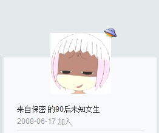

昨天才把emoji换成原来的表情，还寻思今天找个好的包替换一下来着。结果收到了[Sumhat](https://pewae.com/gaan/aHR0cHM6Ly9sZW9uYXgubmV0)同学的留言，去他那儿看了一下，又顺藤摸到Hooli同学这个瓜。他们玩的使用cdn的解决方案正是我想要的，果断给换了。当然，昨天的折腾也没删，只不过添加了一个选项。自己定义的插件就这个好处，想抄谁抄谁，还不用担心换主题。
继续在Hooli那儿转悠，才知道v2ex有gravatar的镜像，也一并收了。所谓相见恨晚也不过如此。

当然，用cdn和存本地各有各的好处。换成CDN的优点是随机头像不用头疼了。同样，加了个选项，随时可以换回来。话说抄来抄去，我自己的这个插件已经超过1300行了，还蛮自豪的。

公司前天发了邮件，嘚啵嘚啵说了一堆方法和如果不执行的害处，但就少一句主旨：把邮件服务器从exchange换回pop3。那个破手顺看着就来气，一上来就是“首先，确认你的outlook版本是2010以上……”妈蛋，还敢歧视老员工！看我收拾你！立刻拿起电话，打给IT服务部：“喂，IT吗？请问你们什么时候方便上来给我的office升级啊？”
“你的office什么版本？”
“2007”
“那不用升级啊。”
“你们发的邮件说的啊，只有新版本的office才能配新服务器啊。然后说有问题就找IT的。”
“……2007也能用。”
呵呵，当年哥配Pop3邮箱的时候，你们IT服务部还没成立呢，我还能不会这个？就是不能惯毛病！

周末，手机上的虾米也把我惹恼了。不知抽什么风，连着弹了两次“立刻评价”“我要吐槽”“再用用看”的求打脸画面。神烦这种叫花子行为。把给臭宝听的歌单备份一下之后，果断卸载了。要不是去年年底换服务器的时候发现大多外链都挂掉了，我根本想不起来还在虾米注册过，所以，放弃了一点儿也不心疼。只不过需要花一点儿时间把贴过的歌换一遍地址而已。好在我不那么爱贴歌。何况早有人反应过虾米的界面跟我风格不搭了。上web版扒拉了半天，也没找到注销的地方。

新宠是网易云音乐。虽然国内多流氓，但这流氓还算讲江湖道义。几天用下来，发现哪儿哪儿设定都还贴心，除了歌曲评论页不能看。什么叫“当年上学时的美好回忆”啊！对哥（shu）来说还是新歌来着 😥
然后就搜到了一个把网易的歌转成可以外链地址的工具，但考虑到那网站还不一定能有本博活得长，还是算了。有空加个button得了。