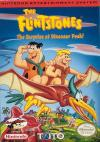

[摩登原始人2：恐龙峰的惊喜](https://pewae.com/gaan/aHR0cHM6Ly93d3cuZG91YmFuLmNvbS9nYW1lLzM1Mzg2MjE2)

原名：The Flintstones: Surprise at Dinosaur Peak!别名：摩登原始人2 / 聪明与笨伯2机种：FC厂商：TAITO类别：ACT发行年月：1994-08耗时：9

最初接触这个游戏游戏是1995年初。寒假快开始的时候，我在北京街旧货市场买了一张4合1卡带。4个游戏良莠不齐，1个比较好玩，1个一般，2个非常烂。本作就是那个一般的。
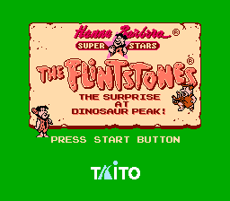

该游戏发布的时间非常晚，美版在1994年的8月，欧版在1994年的2月，没有日版。美版出的时间点上，日版的红白机都已经停售了，PS都快出来了。加上一些杂七杂八的因素，造成这款游戏的实体卡带非常罕见。eBay上每盘带的售价都在800刀以上，而2017年曾经有过1500刀的成交记录。
这盘卡不久后就被我换掉了。估计老美的收藏家也没兴趣买盗版卡，并且他们搞到黄卡也大概率玩不了。
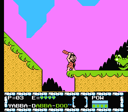

这游戏是带IP的，同名的系列卡通港译版叫《聪明与笨伯》，小神龙俱乐部播放的时候叫《摩登原始人》，好像CCAV6也播过。主机平台上这款游戏跟之前说过的《[战斗原始人](https://pewae.com/2015/04/joe-mac.html)》非常相像，也是石器时代的人打恐龙，非常容易搞混。其实我对这款游戏的动画原作印象更深一些。虽然初中回家的时候时间波动大，小神龙俱乐部看的是有一天没一天的，而那玩意儿每天播出的动画好像也是随机的，赶上动画版的时候并不多。但是当时那版的女VC的一句：“弗雷德弗雷史东~”还是很洗脑的。
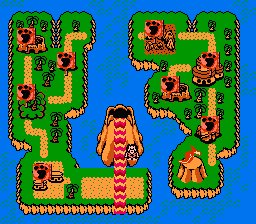

本作说的是弗雷史东的孩子在山脚下玩，忽然火山爆发，他拽上好朋友巴尼去救孩子的故事。
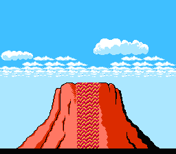

按说红白机游戏，尤其是动作游戏，发展到1994年，已经非常纯熟了。同一时期的《冒险岛4》和《松鼠大战2》都趣味盎然。然而本作却只能算一般，主要是因其自作聪明地（相对于一代）增加了一个人物切换功能。默认的操作的人物是动画里的主角弗雷德，还是非常好用的，攻击用可以蓄力的棒子，跳跃遇到悬崖可以按住B抓住崖边，再↑+B把自己拉上去。坏在切换的巴尼身上：巴尼跳跃后能抓住绳子和细杆，按住B后能左右移动，↑+B后能站到绳子上一小会儿。就是这个“一小会儿”太要命，时间非常不好把控，一不注意就会摔死。而巴尼攻击用的是弹弓，虽然打得远，但威力太小。所以巴尼除了用来对付特殊地形，是完全没用的存在。
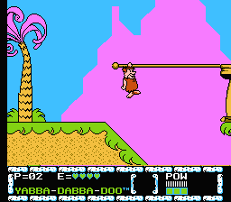

当初每夜一游的第6个游戏，原本计划的就是它。但当时手柄方向键不太灵，最后一关“跑酷”玩法的地方死活过不去，手指头累得生疼。真机上能过模拟器反倒过不了挺丢人的，却也没什么办法，才临时换成了手拿把掐的《前线》。想想那也是16年前的事了。
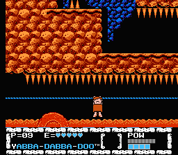

全游戏最难的地方就是最后一关打BOSS前的一小段，跟石头轮子的追逐赛。需要频繁切换两个人物，而巴尼的操作又特别累手，打着打着就生气上火。当年真机上面能过，完全是拿命填出来的。
这游戏命来得真挺容易的。屏幕左下角的“YABBA-DABBA-DOO”是剧中人物喜欢说的一句感叹词，类似“HAKUNA，MATATA”。一共13个字母，游戏里每捡到一个五角星就能点亮一个，全句点亮就奖一条命。前面的关卡几乎没什么难度，打到一关最后20几条命很正常的说。
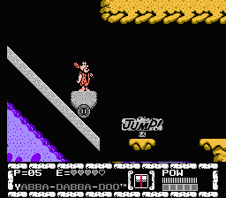

瞧豆麻袋，另外一个捡星星得命的游戏是什么来着？《松鼠大战》啊！这个游戏的第七关里的敌人跟松鼠大战2里的一关简直一模一样。可《摩登原始人》的制作方是汉纳巴伯拉，而《松鼠大战》归迪士尼；这个游戏是TAITO作的，《松鼠》的出品方是卡婊。哪儿哪儿都不挨着。现在没有任何资料能显示出两游戏或者原作有相关性，真是吊诡。
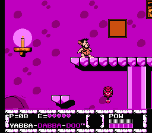

这次重温发现另一个严重的问题是活动精灵（sprite）丢失得特别严重。屏幕上的活动块只要超过三个就会隐形，只能凭感觉来躲。这对于一家成熟的游戏公司来说是不应该的。只能理解成红白机这碗饭没得吃了，制作态度不严谨。1995年真的过去太久了，我完全记不起真机上是不是也有这个毛病了。
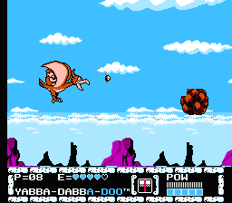

本作有个小特色，嵌入了两个小游戏，冰球和篮球。战胜对手之后才能在地图上向下一关前进。有点热血系列的意思，但是超级简单。
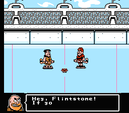
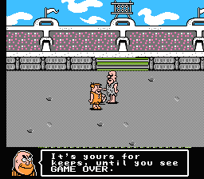

BOSS都异常简单，轮棒子硬拼都能过。
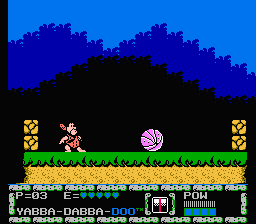
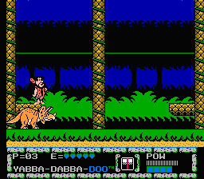
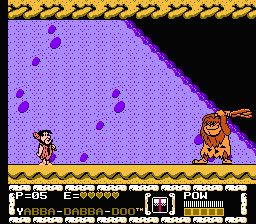
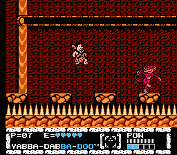
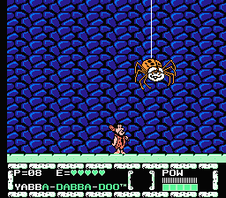
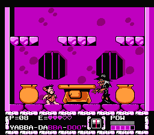
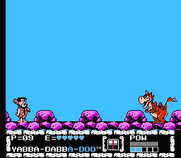

最后一关先打小恐龙，然后打了小的出来老的。
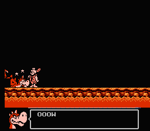
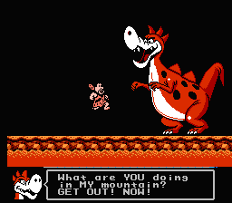
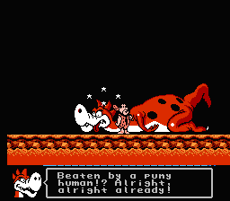

通关！
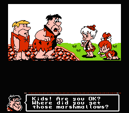
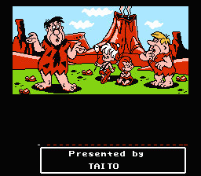