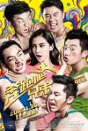
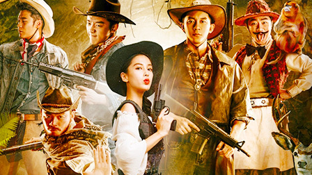

[奔跑吧！兄弟](https://pewae.com/gaan/aHR0cHM6Ly9tb3ZpZS5kb3ViYW4uY29tL3N1YmplY3QvMjYyNzQ5MTAv)

导演：岑俊义 / 胡笳主演：伊一 / 李晨 / 杨颖 / 熊黛林 / 王宝强 / 王祖蓝 / 谢依霖 / 郑恺 / 郭京飞 / 金钟国类型：喜剧地区：大陆首映时间：2015

过去的半年左右时间里，每个周末我们全家守在电视机前看的娱乐节目是浙江台的《奔跑吧兄弟》。
虽然我一直在跟她说，宝宝这几个叔叔都是在照剧本演的，不是真的……
比如那期五个人被两个人翻了盘；比如那期对海泉那个废物大叔二打一非要变成单挑；比如那期白百何两口子那恶心人的造型……

可架不住闺女是中国跑男的忠实粉丝，所以上周五晚上举家去看了《奔跑吧兄弟》大电影。
看完之后这个后悔啊，这粗制滥造玩意儿也能叫电影？

首先一开场就继承了常规节目里有开头没结尾的传统。根本不交待邓队长去哪儿了。

莫名其妙的导游开始然后莫名其妙地开始分组玩游戏——玩完之后连所谓的好房间烂房间连个交待的镜头都没有——这得多节约成本啊！
然后就在一个影视城或者旅游景点之类的地方展开最后的任务了，这得有多敷衍啊，人家爸爸去哪儿大电影怎么说也是个森林动物园，还住了一晚（其实也没多少成本了！）
好歹你交换队友也换一下衣服好吧……
伊一一副受气包的样子一看就是装的好吧，还有莫名其妙地求加入……
王宝强自杀的情节一下就猜到了好吧……
被粘下来的名牌无比假好吧……
几个人轮着去举报简直是着急领盒饭的感觉好吧……
抓到李晨之后怎么就结束了，那88888才是任务目标好吧……
宣传片里造型的全在花絮里出现好吧……

这玩意儿，连个特别节目都算不上，完全是匆匆上马不顾剧情的骗钱玩意儿。就这样竟然一下午的场次都是满场。

亏陈赫先生如此拼了地为了影片造势。
这么假的“真人秀”节目，不出三季就会解散了吧。