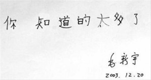

十多年前，不是大一就是高三的时候，《科幻世界》增刊上有一篇小说，说的是某人是很牛B的数据分析专家，能够从海量的垃圾信息里分辨出有价值的信息，抓住其中的情报并获取利益。靠这项本事，这厮成了能操控别人生死的大人物。

我自问没有这样的本事。每天面对GR上的1000+，都在是不是要把某个分类置成“全部设为已读”而纠结。设吧，实在怕错过精彩的段子；不设，每条每条的，别说午休时间，就是一上午都赔上了，也未必能看得完。

痛定思痛，整理订阅似乎成了必然。

说是整理，其实只不过是删除一些订阅和将一些订阅打上可看可不看的标签。反倒是死掉的订阅没有必要清理，反正离订满（据说是1000个）还遥遥无期。

首先被降级的是玩聚SR的最新。内容虽好，但网友口味大多相同没太多的新鲜内容，而且更新又异常的快。所以单独打上一个标签，看不过来就干脆全部标记成已读。
同样待遇的还有几个订阅的新闻。想看就看，不想看干脆等下一波。

其次是删了一批“新鲜事儿”类网站。最委屈的可能就是“奇趣发现”“专利之家”了。他们被我直接喀嚓了。没有别的原因，只是内容重复而且图片太多。一个[煎蛋](https://pewae.com/gaan/aHR0cDovL2phbmRhbi5uZXQv)就足够我吃的了。

再次，冷笑话类站除了保留一个冷组官方站以外，火星娱乐和掘图志这俩炒冷饭的楷模统统被放到了低优先级组。有空容我慢慢嚼，时间紧迫的时候就扫也不扫一眼了。另外被放到低优先级里的是~~译言(http://www.yeeyan.org/)~~，因为没空看又舍不得。

然后，忍痛砍了郑渊洁的blog。作为看了他作品20年的人，实在是无法忍受他现在的文字。何况他还一直呆在我最不待见的新浪博客，何况他还用无耻的加大字体让人隔老远就能被发现我没干正经事……因为类似原因被干掉的还有几个喜欢用彩色字体的“名人”以及数个遮遮掩掩不采用全文输出的zhuangbilities。

接着，把那几个一点击就会被提示google不干活了的，合并到同一目录下。有梯子的时候一起看。

最后，删除了一批成天堆砌关键词的SEOer们。一次两次博出位，用热门词汇提升博客排名可以理解，若干年前我也干过。可你不能成天就是围着排名收录PR这种东西写那些老太太裹脚布吧？收录的再多再快，不也是一站的粑粑？完全没为人类贡献出任何有价值的东西，却腆着脸占在搜索引擎的前列，就不怕被人骂到喷嚏不止而一命呜呼？

反倒是那些可能三天打渔两天晒网的素昧平生的网友的blog，一个一个都保留着分成一类。即使写得东西再不合我胃口，也是人家的真情实感，让我知道，有些人，是这样的想法……

话说，开头提到的小说里的主人公，被人在信息里钓了鱼，最后死掉了。