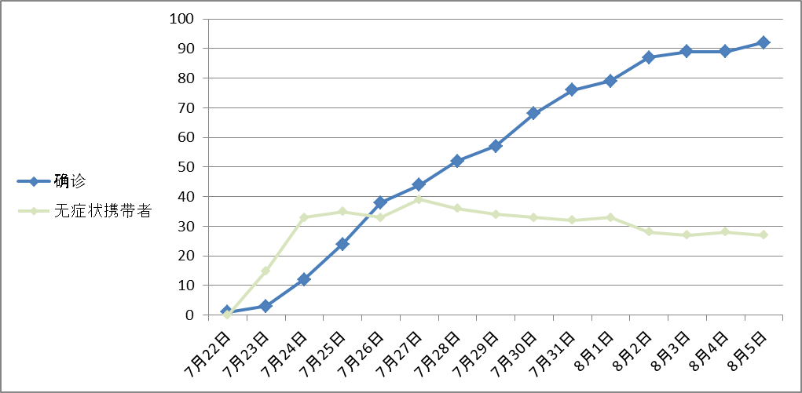
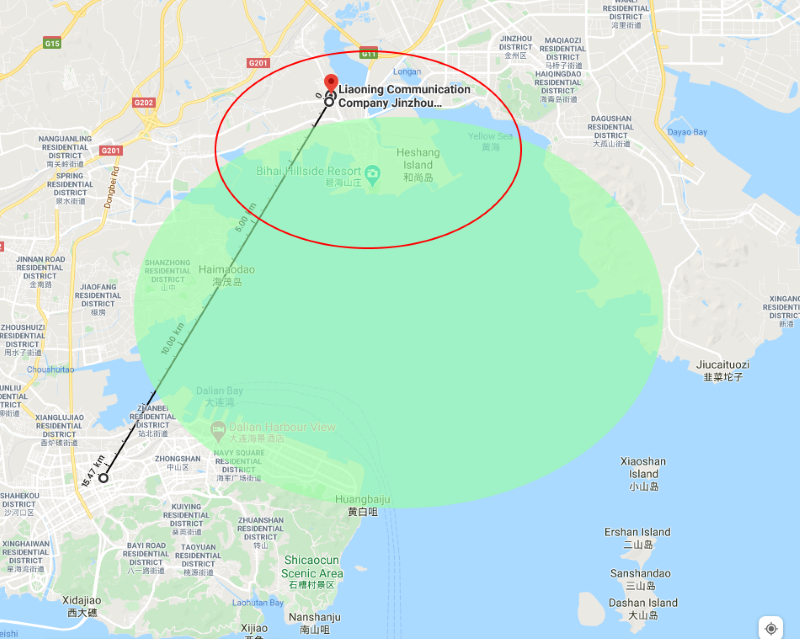

## 大连新冠人数感染趋势图

数据来自~~大连市人民政府官网（http://dl.gov.cn/yqfk2020/）~~，由大致个人制作而成。不保证数据的准确性。
其中无症状感染者人数官方未作总数统计，有偏差在所难免。

以下所有引用报道均来自大连市人民政府官方网站。

## 2020年7月22日，星期三

朋友圈开始转电影院23日起全面复工的消息，有的还列出了23号营业的影院列表。因为23号是周四，有的电影院想等到周五，所以并不是所有电影院都第一时间开门。
老婆先订好的票，我们一家三口去离家不远的一个洗浴中心洗了个澡。
这家洗浴中心是把一座饭店拆了重建的，去年年底装修完毕，本来发广告要在情人节开业的，结果一直耽误到5月末才开。
在洗浴中心吃晚饭的时候，老婆刷手机，说：“大连又有了。”
卫健委宣布发现1号病人。
晚，朋友圈开始盛传其行动轨迹。
稍后证实该轨迹是2号病人，并非1号。官方宣布了~~1号病人的行动轨迹（http://dl.gov.cn/yqfk2020/info/1052156_1114059.vm）~~
显然，大连至少新增了两例。

## 2020年7月23日，星期四

上午，公布2号和3号病人。
老丈人出发去了盘锦，跟几个下乡的同学们一起忆往昔峥嵘岁月去了。
下午接孩子，托管班老师表示教育局已经要求所有校外辅导机构全部停业。
开托管的小郑老师简直把愁苦挂在脸上——她2019年7月才把场地换到了隔壁，面积扩大了一倍。之前租的房子一直也没转租出去，结果从寒假开始就一直没让开门。协弃市7月1日才让托管和教辅重新营业，甘区7月15号才开始放暑假。托管上个礼拜白送了3天不讲课只给带孩子，这礼拜才算正式开门，谁知刚开了4天就又要关了。
傍晚刷到了最新公告。所有教育辅导机构全停。酒吧、洗浴、KTV、影院全停。

## 2020年7月24日，星期五

一早就收到单位群发消息，要求家住大连湾街道或者香炉礁街道工人村社区的必须居家隔离，不准到单位。7月9日后坐过轻轨3号线的必须先去做核酸检测，结果出来前也不准到单位。
老丈人不在家，托管又停了，只能请假在家看孩子。我们部门为了看孩子而紧急请假的刚好10个人。
中午，发现小区的大门又不让外卖进入了。
下午，保安小哥又拿起了久违的温枪。
三点多，老丈人就被盘锦老乡灰溜溜地撵了回来——“人一听是大连来的都躲着俺们走，好不容易才找到住的地方，早上吃了点东西就回来了，哪儿也去不了……”

晚上，老婆下班的时候说，所有公交车香炉礁站都已取消。
前三位病人的共同交集是大连湾海鲜市场。
传闻某水产品加工公司接的俄罗斯鱼货的外包装上带病毒。
小旭发朋友圈，说被隔离在大连湾某高层。

大连湾，地理概念上是指大连港所在的整个海域。图中绿色海域全都可以叫做大连湾。但在行政上，大连湾是指甘井子区下的一个街道（以前是镇），大约是红圈范围。虽然大连湾现在也是市区，但离传统意义的市区直线距离还有十五公里，反倒是离金州市区、开发区都比较近。自从2013年原来的黑嘴子鱼市所在地盘被李嘉诚买走，鱼市被拆掉以后，大连湾市场就成了最大规模的海产品批发市场。每天凌晨商贩和普通市民络绎不绝。此次大连湾被封，直接导致市内海鲜价格上涨。

## 2020年7月25日，星期六

有人在朋友圈晒排队核酸检测，但大规模的核酸检测并未展开。
闺女的英语课又无缝切换回了网课模式。
官方辟谣。说大连湾凯洋非法接收俄罗斯船上鱼货引发新冠为谣传。

## 2020年7月26日，星期日

上午开始，同事同学们陆续反应自己所在的小区开始了核酸检测。
有同事一早上就去排队，到了中午也还不见开始。先是解释试剂未到，又说医生未到的。
本来下午一点臭宝有一堂线上古筝一对一课程。老师临时发消息，取消了，因为她要去做核酸检测。
到了下午才得到官方发布的核酸检测的通知——进行的是5人混检。如果一起检查的5人都是阴性则不会有任何通知，5人中有人阳性会要求复检。因为结果不通知，所以当然也不能用作出市用的证明。
并没有对核酸检测进行强制要求，于是各个社区的执行都很迷很随缘——有的要求上到90下到刚断奶都得测，有的要求每家出一个代表就行，有的必须是本社区居民要提供楼号，有的随便什么人拿身份证就可以测。
下午跟老婆大人打电话，她说，单位门口就是一个核酸检测点，也没几个人排队。但那个社区说不给她们测，不接受社区以外的人进行检测。
快到晚上6点，接到老丈人电话，说他家那边没人，随便什么人都给测，要我们快去。一家三口穿戴完毕，还没走到停车场，老丈人又打过来：“别来了，人家收摊了。”

## 2020年7月27日，星期一

因为学生放假，以及部分企业改回居家办公，所以地铁上人很少，一号线6：30分中途上车，差不多人人刚好有座的样子。
地铁保安严查“国务院行程卡”。之前只看绿箭头，现在要查看日期，必须是当天。
各大医院宣布全力进行核酸样本的检测。对于个人核酸检测申请，有的医院直接停掉，少数两三个医院进行了限号，加一起也就200个名额的样子。

单位楼下两侧拦出了两条线，入口分别站保安，负责检查“国务院行程卡”。正门还有两个保安，负责检查“辽事通”健康码。大厅里的测温门本来就没撤，而4月份才撤销的刷员工卡确认身份的小喇叭又摆了回来。温控门后面的保安小哥又重新穿上了防护服，全副武装。
开工的第一时间，新任项目经理就要求每人填表，在家里已经做完核酸检测的要填完成，没做的要填身份证号和手机，下午单位统一做检测。
没有几个在家测过的。
下午两点开始，没测过的都收到一封内部邮件，里面有个号，凭号到楼下排队，过号等所有人完事后重排一轮。进行地很快，两轮过后就全体OK了，五点刚过。

鉴于前几天核酸检测产生了很多混乱和低效情况，市里紧急动员了放假在家的中小学教师到核酸检测的现场“做义工”，负责录入人员信息。而卫生系统也动员了有医生和护士资质的市民做真正的义工。
前两天场地不够的检测点都转移到了学校操场。

我们家所在的社区上午也开始了检测。正好老婆休假，就带孩子去测了。我们社区并不要求必须辖区内，只要报一个身份证号就可以检测。

下班的时候给老妈打了个电话，问一下她做检测的情形。
他们老两口也是下午去做的检测，楼下小广场人山人海，乱糟糟有小一千人。自己带了折叠椅，刚坐下就被一位街道的服务人员认了出来——这位服务人员是我妈工友的孙女，就给安排上了。不到半个小时就插队检测成功，回家吹空调了。

老舅在家族群里发牢骚。他是前一天检测的。他们的小区也毫无秩序可言。从下午2点排到晚上10点才做上，晚饭都是跟老舅妈轮流回家吃的。

## 2020年7月28日，星期二

官宣，7月26日125万人进行了核酸检测。
市委开会，强调贯彻国务院部署。其中的一条措施是

> 要紧盯复工复产企业特别是海产品加工、冷链物流等企业，严格落实疫情防控“四方”责任。

所以，前面的辟的谣言是？

指挥部停止了聚集性餐饮。也就是说，两三个人吃饭不管，10人大桌，红白喜事、生日宴、谢师宴不行。这对高三初三毕业生来说是好消息吧？
规模稍微大型一点的饭店都停止营业了。估计是不开包厢的话，开门不划算。而且有人检查，毕竟一旦开了门，有客人上门也不好往外推不是。

单位的新项目经理如坐针毡，每隔20分钟就巡视一次，挨个提醒“口罩都别摘……喝完水赶紧戴上……不许露鼻子……”

Kelly说她在农村的父母是半夜12点去进行的检测。她舅舅是村长，得到内部消息试剂和医生已经到了，上面也要求必须开始测，但村民们都还不知道，那时人最少……

## 7月29日，星期三

开发间内有点儿小惶恐，因为公布的第二批感染者里，有两位是家住大连湾，在恒大云玺工地上工作的工人。楼层有两三位家住这工地的隔壁小区。其中一位的行程还到过小平岛社区，在市场买过菜——我们小组里目前有3位住小平岛。
旁边楼上午时拉走一位隔离。小道消息说是楼下罗森的店员。若真是罗森店员就惨了，每天我们单位去罗森的该有上百人次吧。

## 7月30日，星期四

早上地铁安检处，有位50挂零的大哥在不停地跟工作人员解释：“我不是没有码，是手机欠费了……”工作人员也一脸无奈的样子，耐心地劝大哥返回地面去座公交。
其实很容易解决，随便来个人给大哥开个热点，让他用微信或支付宝把话费充上就行。不过看看30号这对于流量来说比较尴尬的日子，还是不多嘴了。

临近下班出了大幺蛾子。
因为混检有一瓶阳性，春柳街道的一个社区整个被封了起来。更劲爆的是大连的新晋购物广场“中央大道”也被封了起来，不准进不准出。里面的顾客挨个排查。整到晚上十点才放人回家。

## 7月31日，星期五

官媒及时公布了“中央大道”事件的后续：

> 关于7月30日市民关注的有关情况
> 7月30日12时许，沙河口区春柳街道集中采样结果显示有一份五混检测结果有疑似阳性，按程序立即对每个人进行重新采样复核。
> 沙河口区防指为尽早做好人员管控，立即启动应急预案，第一时间确认5人名单和家庭成员，对其居住生活区域进行临时限制；疾控机构对相关场所进行消毒，对在家的8人参照阳性结果进行管控，进行二次核酸采样，对外出的2人进行追踪、检测。
> 其中，重点人员王某在中央大道购物广场（长兴电子城）上班，沙河口区立即对中央大道购物广场内进行临时限制、消毒，并对广场内的所有人员参照次密切接触者进行临时管控。
> 7月30日22:30，市疾控中心检测结果显示，上述5户10人重点人员的核酸检测结果均为阴性。目前上述场所生活秩序已恢复。

市区免费检测结束。官方统计已经有409万人参与了检测。
虽然不是强制的，但单位也好，社区也好，都纷纷在统计没参与检测的人员，追究原因。
组里小新因为在家坐月子没有检测，被单位各级领导关心了好几轮，还被要求录了视频备份。
物业也通过微信给业主发调查表，也要写没参与核酸检测的原因。选项里有什么太老啊，太小啊，太忙啊，行动不便啊之类，但就没有一个选项叫“不想测”。

这就叫非强制的强制吧。

## 8月1日，星期六

遛弯时遇到臭宝同学的爸爸。他们家是齐齐哈尔的。得知该同学的爷爷奶奶7月3号的时候回齐齐哈尔奔丧，在亲戚家住了几天，结果现在行程卡是红的，哪儿也去不了，不敢出门，怕被抓去隔离。跟人解释已经过了14天也没有用，人家只认码。现在老头求着家里的晚辈去办了张新本地电话卡，注册了新微信号，老两口轮流拿着这手机出门。
但是因为红码，一时半会儿是买不了车票，回不了大连的了。
有两点好奇怪。其一那卡并不是14天自动解封，而应该是手动的。其二别的地方看大连是疫区，都变红码。而大连自己只有大连湾是黄码，其余地区都是绿的。全国除了大连本地已经没红码的了，那你成天检查绿码还有什么意义呢？

指挥部第13号令：

> （二）海关要加大对进口海产品、肉类等食品的检验检疫，确保食品输入安全。口岸、交通运输等部门做好对卸货转运、冷链运输及物流等各环节监管。市场监管部门要着重加大市场监管力度，高度重视水产品、冷冻冷藏肉品等重点产品的风险排查，尤其是要加大对进口水产品及肉类产品的加工包装、市场销售等各环节监管，全面加强对农贸（批发）市场、水产品（海鲜）等经营单位和冷库、冻库等重点部位的日常监督检查，实现相关行业全产业链、全要素风险管控。落实食品进货查验、索证索票、销售记录制度，切实把好食品进货关，严防来源不明及存在被新冠病毒污染风险的食品流入市场及学校、机关、企业、事业等单位。

所以，前面的辟的谣言是？

## 8月2日，星期日

单位群里忽然紧急要求统计家住普罗旺斯小区以及去过普罗旺斯小区内某饭店的人员。
已经公布的行程表里，并没有说有什么人去过该小区。

## 8月3日，星期一

市长和市委书记视察海关，要求严格履行进口冷链食品查验程序。
又有专家公开分析

> 赵作伟表示，本次疫情是与冷链海鲜产品加工相关的聚集性暴发，通过初步流行病学调查发现，本次疫情最早于7月9日发病 ，凯洋海鲜公司的病例发病时间早于该公司之外的病例，提示本次疫情可能起始于凯洋公司海鲜加工车间，之后在加工车间迅速传播，并向外面扩散。截至目前，该车间共有60余名工人和管理人员感染，患病率高达61.9%。

所以，前面的辟的谣言是？

各医院恢复了普通市民的正常流程核酸检测。

## 8月4日，星期二

小新在群里说，他对象单位餐厅出了问题，全员被要求回家隔离。她很高兴，有人陪着坐月子了。
官方高兴地宣布，今日0增长。
老婆买衣服，某宝店主说大连是疫区，不能发货。气。

## 8月5日，星期三

高兴没过一天，又出三个。
第一位患者出院了。
希望一切能有新的开始。