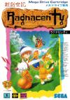

[新创世纪](https://pewae.com/gaan/aHR0cHM6Ly93d3cuZG91YmFuLmNvbS9nYW1lLzI2OTQ2NzI5Lw==)

原名：新創世記ラグナセンティ机种：MD厂商：Atlus / NexTech类别：A-RPG发行年月：1994-06耗时：35

[攻略](https://pewae.com/gaan/aHR0cDovL3dpa2kucGV3YWUuY29tL2Rva3UucGhwP2lkPXdpa2k6bWQ6JUU2JTk2JUIwJUU1JTg4JTlCJUU0JUI4JTk2JUU3JUJBJUFB)

先说说攻略的事儿。百度百科同名条目下的那篇攻略，来自于电软95第二期，只字未改。但是，这份攻略在同年第六期的秘技天地里有热心读者进行了勘误和补充。其实也不算误，人原作者说了让玩家自行探索……可惜的是网上所有抄来抄去的版本都只有前半部分，没有那位北京的热心朋友提供的补充。我自己整理的这份就加上了，尤其把他说错的部分也改了过来。鉴于我的那份攻略是禁止搜索引擎搜索的，所以把最重要的遗漏点标出来：
**《新创世纪》狸猫加入法：
得到金色奖章回到王宫后，换上长毛狗伙伴，去村子里教堂右侧靠上面的房子里，跟里面的小孩对话，选是。回到自己家，跟妈妈对话，选是，再回到那个房子里，对话后小孩变成狸猫加入队伍。**
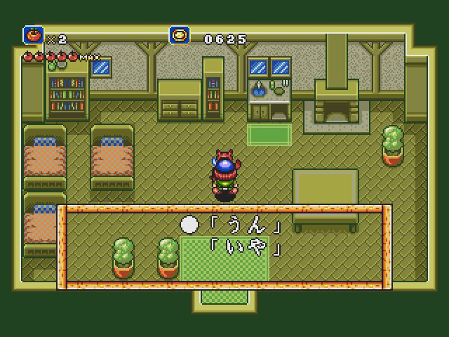

终于把MD上三大ARPG名作凑齐了。相对来说，《新创世纪》在三款作品里是难度最低的。只是相对，毕竟ARPG这东西太简单就不好玩了。这难度对我来说较为合适，比较没有那种完全靠手速才能完成的机关。
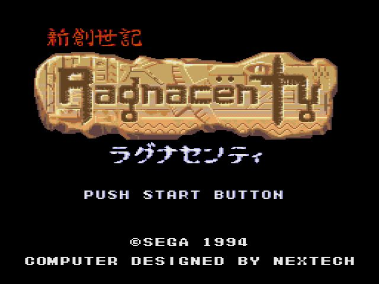

故事的开始实在是稀松平常。一个黑暗的年代，刚过完生日的中二救世主出发了。
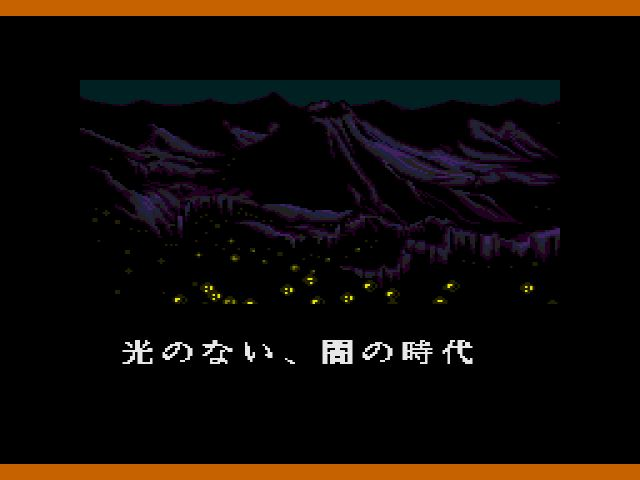
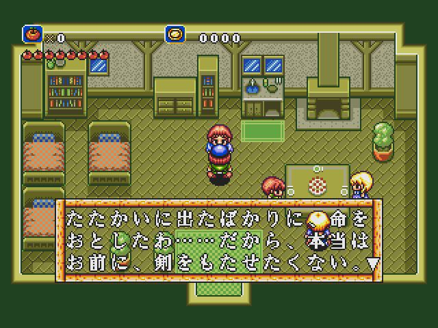
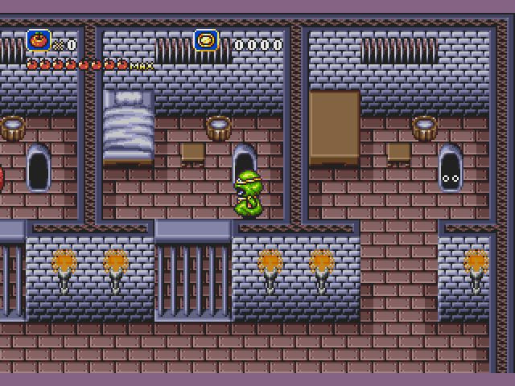
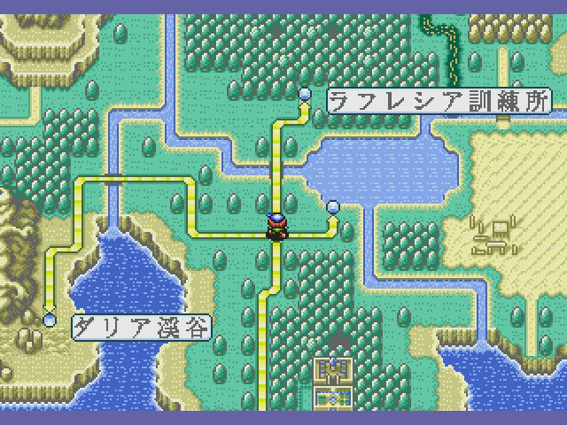

主角靠一把剑打天下，抄袭的实在太具体了……
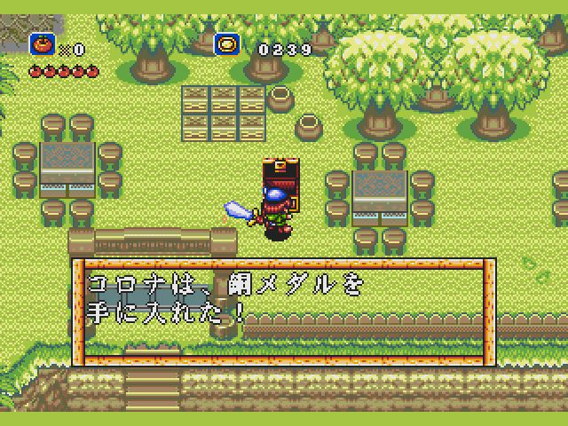
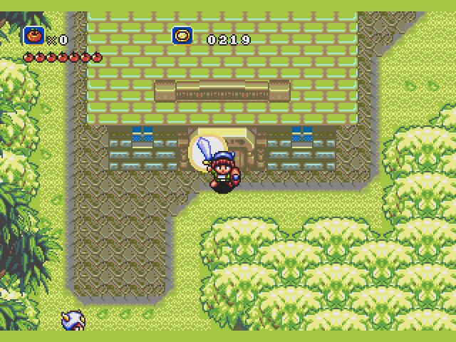

当然，要是完全的抄袭也就称不上名作了，本作的亮点是各种各样动物朋友。一共12个，但其实有三个消耗性道具，真正可以用的是9个。另外游戏过程中还得到了兔子和大象的能力，童趣满满。
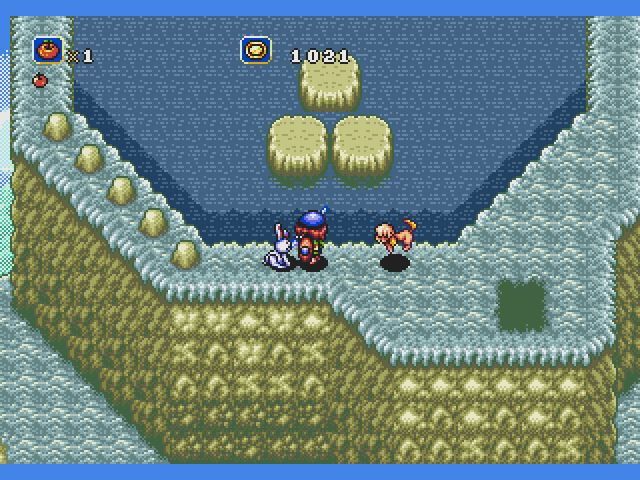
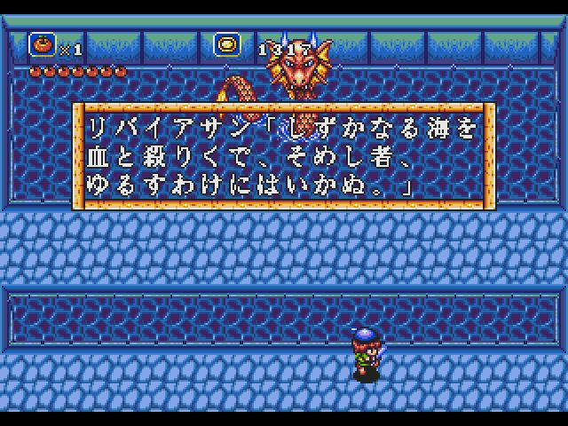

老人家表示，多层卷轴这种没卵用的机能最晃眼了……
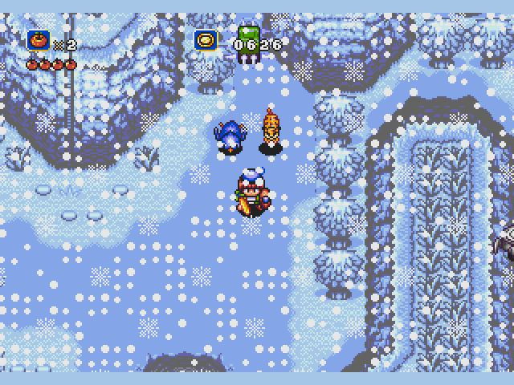
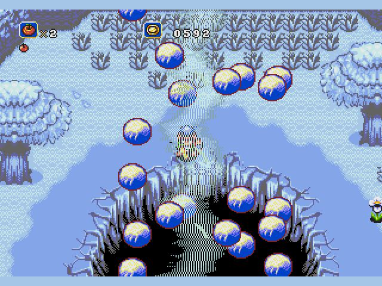

大明星来客串。
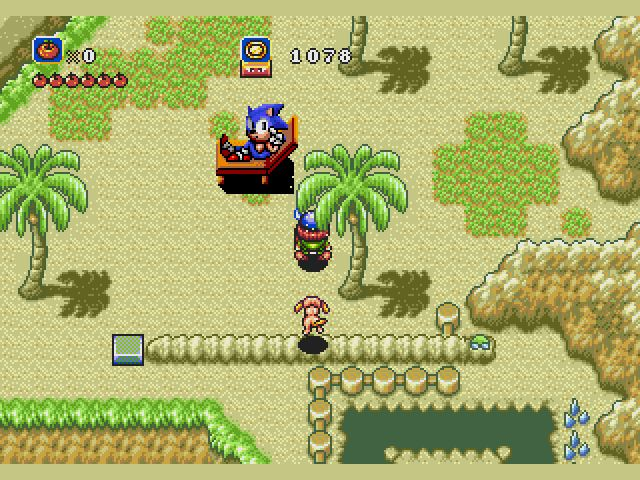

部分boss。
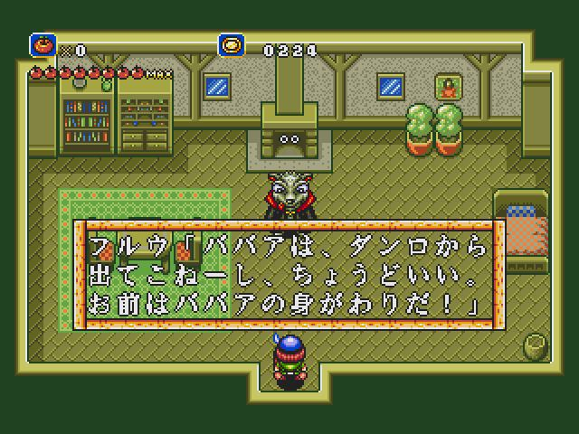
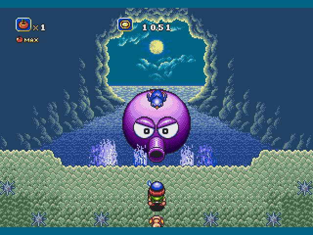
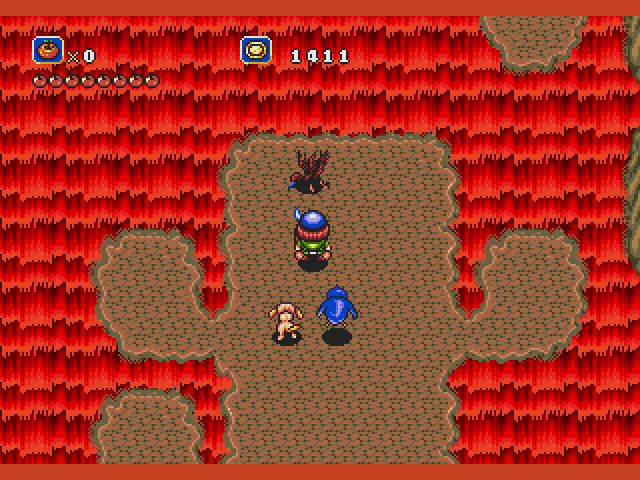
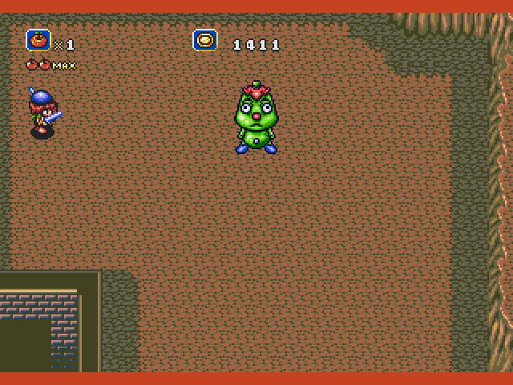
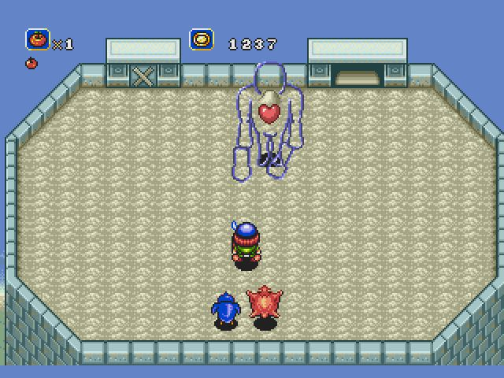
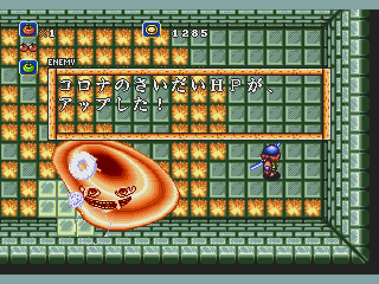
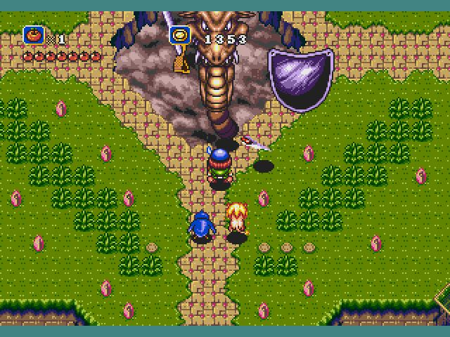
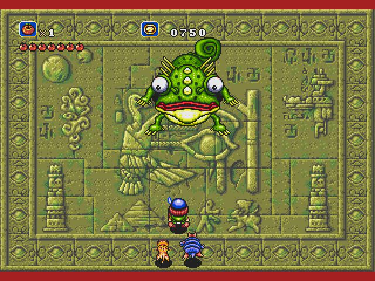
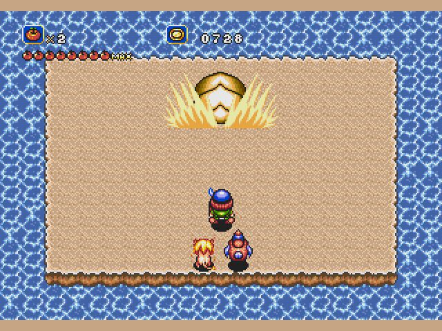
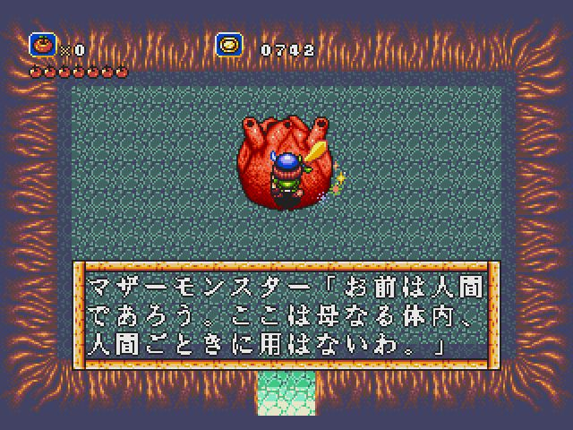
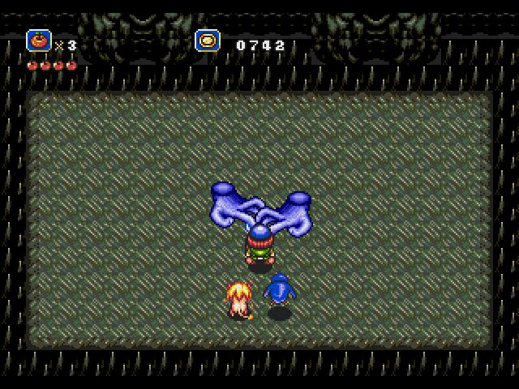

最终boss非常好打。
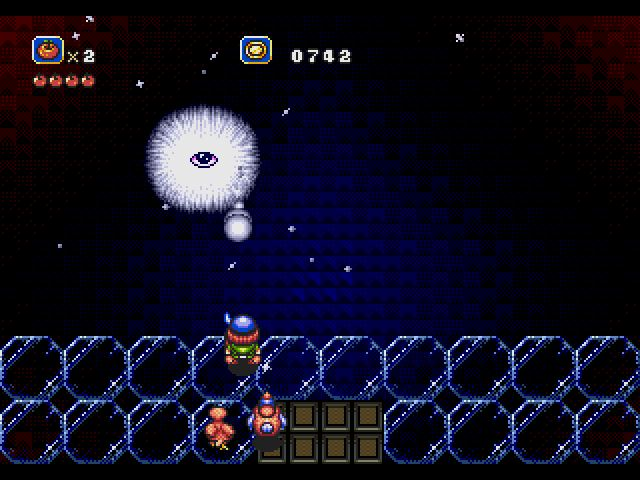

打完仗后还有两个不是谜题的谜题才能看到结局。
一是要去找狗（在皇宫二楼），二是要到桥头跟女朋友对话。
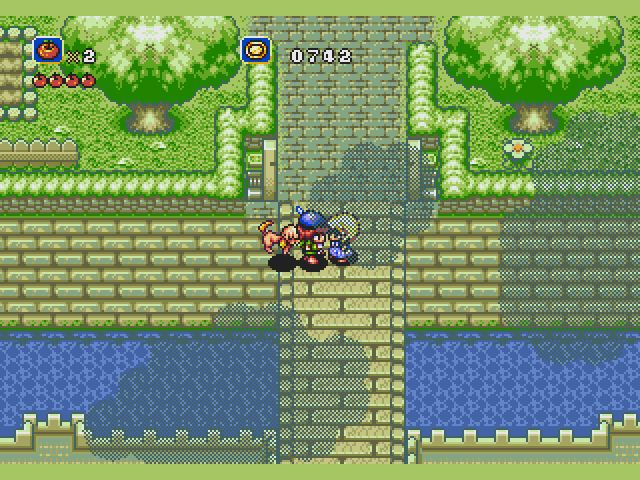

通关！
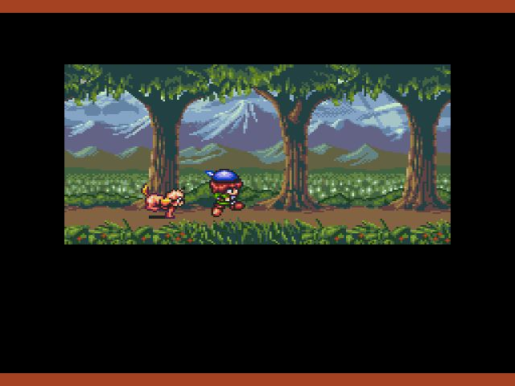
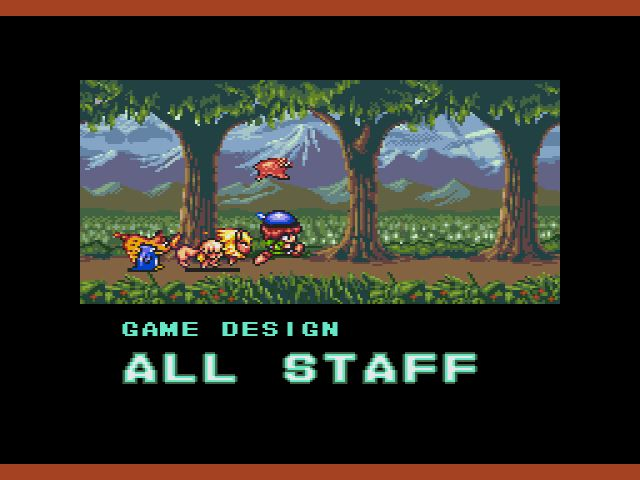
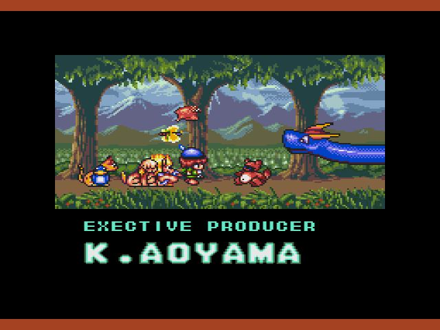
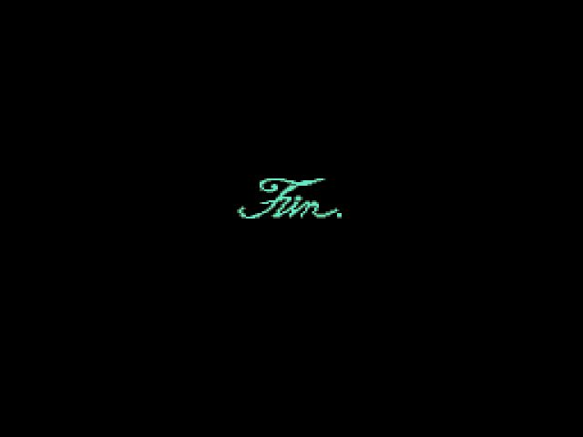