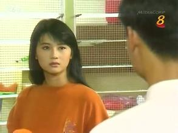
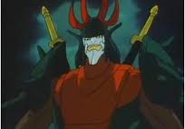
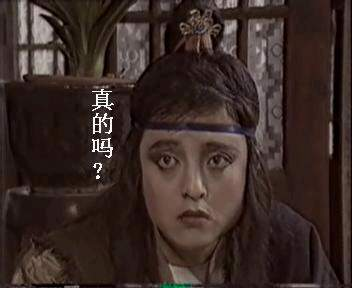

曾经风光一时的香港无线电视日前~~关张大吉~~改弦易辙了，现今提起“无线信号”这几个字，人们的反应要么是网络，要么是手机，已经几乎不会往电视方面展开联系了。但在20多年前，对电视机+天线构成的系统来说，自身的质量只是内因，信号的强弱才是直接影响收看效果的最重要的因素。
信号的传播在当年靠的是电视塔和转播站。80年代末，大连在劳动公园旁边的绿山上修了一座电视塔。彼时是城市明信片封面的不二之选。当年市领导非常喜欢带外宾去参观这玩意儿，而早期普通市民想上去还要找点儿路子才行。90年代中后期有线电视技术普及，此塔地位下降，塔顶开了旋转餐厅。即便是这样，没登上过这个塔的市民还是占了绝大多数，除非有外地客人来，不然我们本地人确实很少光顾这种“名胜”。这塔在数字时代被弃用了，也更名为“大连观光塔”，承包它做餐厅的经营者换了一波又一波，门可罗雀，停业整顿的时间远比开放的时间长得多。迄今它仍旧是市区内海拔最高的建筑没有之一。
转播站也很重要，大连是丘陵地形，那时几乎像样点的山头上就有广播电视信号的转播站，还有武警站岗。在家里收电视节目，把天线跟转播站的夹角调成正确的角度是重中之重。

有信号，就有干扰。但我绝对不是为了搞清楚它俩之间的关系才学了电子专业和《信号与系统》的专业课。对信号的理解最早来源于（山寨）红白机。
红白机与电视的连接方式有三种：RF射频线、无线天线和AV线（红黄白）。当年很少有人用后两种连电视。采用RF线的时候，要先在电视上调好一个预设的频道，这个频道在8频道跟10频道之间，靠近10频道的位置。红白机尤其是山寨的，可能无线天线那部分电路功率较强，发射出来的信号是很强的，楼上楼下的邻居只要把预设频道也调在那个位置，就可以收看到别人家打游戏的直播。
我就非常喜欢看别人玩游戏。在老房子住的时候，附近邻居家至少有三台山寨红白机，每当没什么好节目看的时候，我就会搜台，看看邻居家在玩什么。印象比较深的一次，是邻居打魂斗罗，第三关开始之后不往上蹦，而是趴在一开始的位置打石头，直到出现奖励一条命的提示音。我才知道世上还有这么无聊的贪命方法。还有台球连号有奖励也是通过邻居家观摩学到的。
后来姑父给表妹买了游戏机，我也成了别人观摩的对象。第一次玩洛克人1的时候，在石头那关一口气死光了30条命（这是个改版），怒摔手柄的同时，听到楼上一声大喝：“真臭！”
然而这种观摩有个弊端，就是当两个以上的邻居家同时在玩的时候，你反而会什么都收不到。

因为我掌握了收红白机直播的要领，得陇望蜀，没事儿的时候就想调台试试能不能收到别人家放的录像。小伙伴间流传是能搜到的，但我从来没有成功过。或许邻居们都不习惯在7点之前放录像吧。
说的是这种搜台玩产生了一个副产品。
90年代初期的大多数时间里，大连的转播站里只提供4套信号：大连、CCAV1、CCAV2和辽宁1。我家老房子所在的位置当时是市区的最北边缘，可能无意中接受到了金州或者普兰店哪个山头上的转播信号，所以我家能收到辽宁2！虽然得看天气（一般阴天效果比较好）、虽然清晰度非常差劲，但毕竟在7点的时候多了一个难能可贵的选择。这也成了在小伙伴当中炫耀的资本，到处宣传“辽宁电视台-1”的那个1并不是摆设，换今天就摄屏发朋友圈了。辽宁2在7点钟的病毒时段是放电视剧的。印象最深的是《金色珊顿道》，新加坡剧，女主是陈莉萍。那是我第一次看陈莉萍主演的电视剧（比大连台的《法网情天》早），觉得非常惊艳。陈女士眼大肤白，微带babyfat，是非常萌的大姐姐的存在。可惜她跟张柏芝一样有个致命缺陷——嗓子太粗。剧里都是配音当然无法知晓，可90年代中期她也曾经发过单曲，一字记之曰哎呀我艹！再后来听说是服药导致身材走形，不太能在电视上见到了。至于剧情，新加坡剧能有什么好剧情？再说我也没连续看过几集。

跟我家类似，住在大连市西南角郊区的三舅家能跨海收到山东台。鉴于三舅妈气场太强大，只在阴天时的6点时段能惊鸿一瞥。短短的几次经历就够了，反正那时比别人多看一个台是挺牛逼的事儿。
这短短的经历里其实只是看了一部动画片《[oz国历险记](https://pewae.com/2007/08/cartoon-oz-the-country-adventureswizard-of-ozdownload.html)》。

大约在93、94年，大连有家叫方正的广告公司跟电视台勾搭，干了件特别恶心的事儿：每天晚上10点以后，他们会把辽宁台的信号掐了，换成他们自己的“方正剧场”。说他们恶心并不在于替换信号这行为本身——反正辽台深夜也没什么好节目——而是他们不！定！时！有的时候9点半就来了，有的时候11点也不开始，有的时候没广告直接放片，有的时候广告长达50分钟。而且还没预告，你根本不知道当天晚上要演啥，跟tm砸金蛋似的。所以最悲催的情况是从九点半就开始放广告，我就在旁边傻傻地等，每隔十分钟换过来看看演片了没有，这么一直来回换到11点半，困个熊样，出雪花了……
砸中的最好的金蛋是《变相怪杰》，94年的一天放的，当时是很新的片。对卡梅隆迪亚茨的身材直流口水——然而第一次看霹雳娇娃的时候我根本没意识到那是同一个演员。
007系列(95年以前)的大部分内容也是在这个方正剧场里看的，那阵子还算比较有规律，是每个周五。
这时段另外印象深的是周润发版的《笑傲江湖》。说实话水准一般，光看周在那儿扮酷了，以及任盈盈的扮相相当地丑，比吕颂贤那版的还丑。

自己家辽宁台很清楚，收看却受限制；奶奶家收辽宁台效果不好，但没人管我。好在我无师自通解决了天线的问题——把红白机用的射频线的一端留在电视上，另一端引出导线，绑到暖气管子上即可。好像那时的小伙伴们都不约而同干过类似的事。

同样是转播信号的故事。每个周二下午是小伙伴们最沮丧的日子。每周电视台都会在这一天检修维护设备，下午5点以前是肯定没信号的，至于5点以后什么时候恢复，则要看人家维修人员的心情。一直到有线电视时代的初期都是这情况。

1993年春季里的一天，同学们之间流传一个消息：大约34频道的位置，每天下午会连播6集《射雕英雄传》。一周多以后，这个频道变成了固定频道——大连教育电视台出世了。
又有了一个7点看不到[邢奶奶](https://pewae.com/2011/07/xingzhibins-secret.html)的频道，是件激动人心的事。
初期的教育台，播的节目也给力。
首先是我最爱的动画片。教育台第一炮播的是《华斯比历险记》。一部规模相当宏大有些虎头蛇尾的英国动画片。按照以往惯例，你们又该知道我喜欢谁了——没错，反派卢比。它还有个女朋友叫什么来着？主题歌还能记得一句“大地与我同在”。本片有线时代后各地方台都有重播，却再也找不到首播时的乐趣了。

圣斗士也是教育台刚开始在主打。说来我[跟圣斗士感情很深](https://pewae.com/2006/01/memories-of-saint-seya.html)，这是一部对我影响深远的漫画作品。但是，圣斗士动画生不逢时。1993年的秋天教育台开始演圣斗士的时候，漫画已经出全了，其内容不说倒背如流也是滚瓜烂熟了。而教育台播动画的时间尴尬，是晚上七点四十以后，正是老娘霸占遥控器的时段。再加上圣斗士动画版剧情超-级-拖-沓，还有个莫名其妙的北欧篇。一来二去，这动画篇对我来说存在感极弱，跟没有一样。
《铠传》可能是教育台播过的最好的动画片，也是辽艺配音天团的巅峰之作，当时译作《魔神坛斗士》。每个晚上想看这一集可不容易，因为要抢老妈看电视剧的时间。好在那时刚搬家，每天老娘都有做不完的家务，对我霸占20分钟遥控器的行为忍一忍就过去了。火焰神里奥，光辉神随机，天神陶马，以及陀神和水神两个死跑龙套的。印象最深的又是反派拉纠拉，脑袋上带的字是个“忠”。

而就像试播时一样，教育台最吸引人的是它播的武侠剧。
除了初期的射雕，它播的第一部剧是国产的《江湖恩仇录》。里面有一段敌方迷魂阵艳舞的情节，在那时算尺度很大的擦边球了。女反派东方闻樱，红楼里演探春，演这部武侠剧的时候还相当有争议。多年前猫扑里喜欢引一张“真的吗”的图，出自本剧的“聪聪大侠”。其剧情是完全想不起来了，但“江湖恩仇何时了”的主题歌至今还能哼唱，堪称穿脑魔音。男猪叫李小刚，也不知张小凡的诞生有没有受到他的影响。

第二部是汤镇业、黄日华、梁家仁和陈玉莲主演的天龙八部。剧本跟原著比改动得比较大，最奇怪的是虚竹戏份非常多，更像主角。而梁家仁演的萧峰，怎么看都不像好人。全剧最出彩的人物是黄杏秀的钟灵和石修的慕容复。钟灵演得很活，完全压住了陈玉莲这个女主。而慕容复更是把孤傲坚忍发挥到了极致，一个人压制住了正方的三个。石修版是我看过最好的慕容复。
天龙八部刚刚播完，暑假里正好播首届亚洲大专辩论会。决赛里两队表现简直惊为天人，辩论人性善恶的时候拉四大恶人作例子。我才第一次觉得大学生其实并没有那么高高在上。复旦的一辩姜丰女士及四辩蒋昌建先生的人生经历，更是让人慨叹世事无常。
接下来的暑假重头戏是郑少秋版的楚留香传奇。虽然播放的时候已经是老剧了，但香帅仍旧是魅力四射。每天晚上追剧都忘了打游戏了。直到几年后看了原著，才知道整个剧除了楚留香苏蓉蓉李红袖胡铁花这几个名字以外，所有的剧情几乎都是瞎编的！

教育台另一个非常好的动作，是每个周日晚上8点播一部黑白老电影。《虎口脱险》《大独裁者》都是趁此机会填补的空白。

后来有线电视普及后的九十年代中后期，大连的电视台展开了一轮整合，教育台就不明不白地消失了。最后一次看，是高二时听说我们初中英语老师上电视了，讲了一堂初升高的英语辅导课。
至于平日晚上别人播动画片的时候教育台播的课？我了个去这台领导脑子是不是进水了，谁家小孩会在演动画片的时候看你播的课啊！

btw，我的直属领导老陈的第一份工作，就是在教育台做字幕。