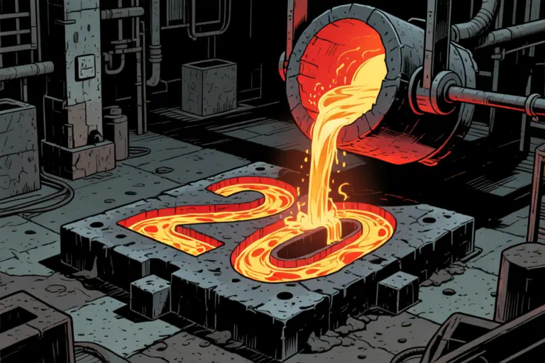

本来说好了整数年不搞，但是想想又怕一旦不玩了，别人会以为我出了意外，所以还是搞一篇吧。
这一年更新频率很低。主要原因是倦了。也不是烦，也不是懒，是“激情退去后的那一点点倦”的那种“倦”。
常年大姨夫不调，终于迎来了更年期。

除了主观疲软，客观原因也有几项。
首当其冲的就是素材没那么多。现在组里10/15个女人，年龄从83年到1999年，既有性别隔阂又有代沟。老娘们儿唠嗑咱能插上嘴的机会就不多，再严选掉大部分没营养的话题，能记下来的素材更少。男的……TA们不是男的，是90后。

其次是这一年多以来，组里的小项目增加了，我一个人要给6个小工程做技术支持。本来岁数大了，切换思路就没那么麻利。即使摸鱼时间不少，也架不住这里面有4、5个勤奋的笨蛋，一个简单的10行代码就能实现的功能讲两个钟头都说不明白。有这时间都足够我把整个工程写完然后去厕所带薪拉屎半小时的了！
你孜孜不倦，我渴了。
本来愉快地码字呢，被打断了激情和思路不说，还要大口喘气大碗喝茶大泡撒尿对抗厌蠢症。

第三要怪自己没事找事，搞了个愉快而没有意义的项目——让WordPress4.9在php8.2下正常运行。这事本身本来也花不了太多时间，但是代码读的越多就越想干掉没用的功能，越删越上瘾，到现在3个多月了，也看不到头。

每年到了这个时候本来是我对博客关注度最高的时候。今年终于是把字号调大了。至于换字体的事只是顺带，哪天心血来潮就又换了。
主题就这样了，底子不好不值得修了，至少还得凑合一年。

因为年底有大事发生，所以2026之前都不会有机会更太多。
依着我物尽其用的性子，明年10月服务器到期前自戕的可能性不大。
一旦在2026年10月之前嘎了，亦属正常。Words告罄，Press的欲望也冇，每次按下【Publish】都可能是拔管。

> 比如去岁前年，今朝差觉门庭静。玉轴锦标无一首，知道先生还佞。假使文殊，携诸菩萨，来问维摩病。无花堪散，亦无香积斋衬。
> 回首雪浪惊心，黄茅过顶，瘴毒如炊甑。山鬼海神俱长者，饶得书生穷命。不慕飞仙，不贪成佛，不要钻天令。年年今日，白头母子家庆。
> 【宋】刘克庄·念奴娇·壬寅生日