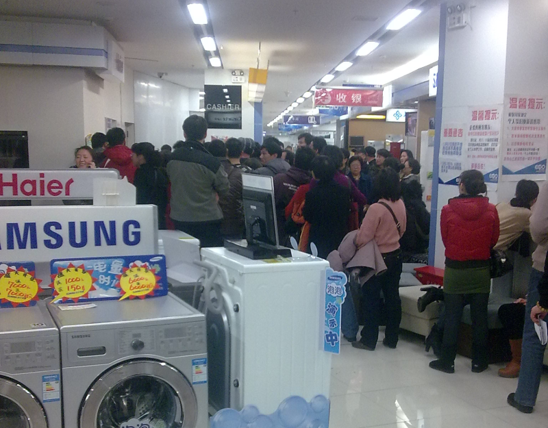

10月份的时候，老婆怕没上暖气的日子冷，冻到臭宝。于是某个晚上俺俩抱着臭宝出来买空调。因为苏宁西安路店人比较少，适合臭宝乱跑，所以就选在了那里。
正好，导购说有政府补贴的活动。回收旧家电可以低值10%。
弄呗。俺爹在家里找到可以出图像的旧电视的时候，已经是12月20号了。

之前几天由于俺自己犯迷糊和见到人多就躲的属性作祟，一直没把这区区200多块钱的折扣款拿回来。眼瞅着过了2011这东西就要作废了，老婆的会计天赋和威压加成导致俺今天不得不拜托同事打卡，一大早就赶到店面去领折扣款。没想到，见到了难得一见的热闹场景。

话说，这苏宁西安路店有3个门，俺没有在正门排队，而是绕到了侧门等待。一是正门得在露天挨冻，而侧门有个耳房躲风；二是正门进入后只能走扶梯，还要在到达5楼之前绕来绕去，而侧门紧挨电梯和楼梯，有利于俺拼体力。虽然正式营业是在9点，但是8点半的时候，几个门就已经被围得水泄不通了。

侧门这边比正门早30秒开始放人。俺从一开始就没打算去挤那狭小的电梯，而是在楼梯上狂奔。身后有数位四、五十岁的大哥大嫂也在百舸争流。一位身穿西装的小哥跟俺争夺的甚为激烈，只是他不太熟悉苏宁的地形，在到达5楼兑换点儿的时候被俺抄近道赶过了一个身位。

奇怪的是，俺并没有抢到第一。苏宁已经安排好了长长的椅子阵，一个手拿喇叭的胖子在高声叫喊：“不用挤不用挤，今天不排号，请按照座位坐好，今天一定按照顺序给大家办，不排队的一律不办……”旁边一位女销售代表还在做注解：“这位是我们店长。”
在俺前面大概有30人不到，好像都是认识工作人员或者是委托当时售货的人给提前带进来的。后来的麻烦也因这些人而起。

8：55AM
首先发飙的是一位冲动的大哥。这厮根本不听胖店长的指挥，直奔兑换处而去：“我tmd早上7点就在赧门口排队了！排第一个！怎么一上来坐了这么一排人，都哪来的？今天不第一个给我办，我就把赧机器给砸了！”胖店长说我们不只一个门。冲动哥说：“我不管，你们为什么不同时放人？”接着就开始狂拍兑换处的小方台。
后面好多人见有机可乘，纷纷放弃了自己的位置，里三层外三层把兑换点儿围上了。

胖店长见势不妙，把喇叭一扔就跑了。只留下兑换点里可怜兮兮的四个员工（其中三位为女性）。

9：10AM
冲动哥还在继续用口水对兑换点儿进行火力压制，从队伍后面又冲出一位穿皮草的大姐。大姐也一路骂着冲到了兑换台前：“我早上清清楚楚数过，我排在第十二个。一上来可倒好，前面100多！赧还能不能干了！我tm开车来跑好几趟了，天天都这么多人，来早了有什么用？你们必须先给我办……”

这个时候，连各个厂商的导购员都跑了个精光……

9：30AM
四个倒霉蛋顶不住冲动哥和皮草姐的压力，开始办理。结果加塞男A和加塞男B之间大打出手，碰到了他们身后的加塞孕妇C。C开始哭喊。办理终止了。

9：40AM
此时整个5楼除了那四个倒霉的替死鬼以外已经找不到任何苏宁的工作人员了，情绪激动的冲动哥、皮草姐和加塞男A加塞男B闹得不可开交。
俺身后的西装房地产小哥出手了。他让俺帮忙看着位置，然后风度翩翩地走到皮草姐跟前，说：“女士，您是不是把车停在西安路边上了？您的返款也就是几百块钱吧？您最好是把车换一个地方停，不然被贴条的话就得不偿失了。”于是，皮草姐青着脸朝楼下奔去。冲动哥也立刻转移了目标，朝地产小哥吼了起来：“赧苏宁出来个人说话！”小哥微微一笑，说：“我不是苏宁的人。”就退了回来。

9:45AM
最前线仍旧堵了个严实，排在正常队伍十几位置的一位白发大爷在接了一个电话之后开始发飙：“妈了个臭B的赧苏宁就四个黑店！大前天上午就把我旧冰箱拉走了，说下午送货，下午没给送，给我两个电话嘛，一个关机，一个说明天送，前天又说昨天，昨天上午又说晚上11点给送。我家里鱼都臭了不说，你让我一个70岁老头等你到半夜啊？你半夜送了也行，11点半了给打电话又告诉我等到今天，草泥马有大半夜给银打电话的吗？好，刚才又打电话告诉我没有货了！你没有货给开的什么发票！有没有银出来？我回家把臭鱼臭虾全拿来塞赧腚眼子里！赧那是嘴吗？给我退货！”

10：10AM
可能是老头气场太强，把冲动哥和加塞男都给压制住了。但是仍旧没有开始办理。这时有前排一位正义大姐出来疏导秩序，她走到兑换台前面，挨个对加塞男加塞女们展开劝说。但显然是徒劳的，没有一个加塞的人肯退步。正义大姐回到队伍，给110和《新视点》（大连电视台的一档新闻节目）打电话。

10：20AM
冲动加塞男C出场。他拍着桌子骂四个倒霉蛋里唯一的那个男性，大意是你管什么排队不排队的，赶快给我办！倒霉蛋男也冲动了，回骂冲动加塞男C。随即两人开始动手……本胖子开始大喊：“110”。正义大姐一脸苦笑：“都打了，说20分钟来。”

10：25AM
动手的过程，倒霉蛋男因为空间狭小吃了小亏，他推开众人要出来找场子，但冲动加塞男已经消失了。

10：35AM
前排又走出一位正义奶奶，她又开始挨个劝说加塞男女。有部分面皮稍薄的加塞者实在受不了被一个70岁老太太指着鼻子骂不要脸，离开了。但有一位红衣加塞男负隅抵抗，说：“那么多人插裆儿，你怎么盯着我一个？”俺展开后排进攻：“穿红衣服的臭不要脸！”后面数十人也开始展开叫骂。红衣男只好愤愤不平地走开了。其实对红衣男挺不公平的，确实还有那么十多个人没排队的。但谁叫他穿红衣服呢？俺要是喊穿黑衣服的，早就被口水喷死了！

10：45AM
正义大姐和正义奶奶逐渐理清了大部分区域。这时苏宁的所有男丁返场了。包括保安和部分员工，但没有那个胖子店长。一毛衫男子指挥手下搬过来数台冰箱，形成隔断。但他并没有有效的手段清理出加塞人员，只是一味强调排成一排。
房地产小哥又一次走到了前面，亲自揪出了一个加塞男，并叮嘱前面的队伍要一个紧跟一个，前面的队伍还真听他的（可能又是看行头把他误认为工作人员了）。

10：50AM
一白发插队奶奶受不了众人指责，坐到地上撒泼：“要是不给我办，我就犯心脏病。我心脏病要犯了啊～～～”于是，她被默许插队了。

10：55AM
开始放号。（真不知道早干什么去了）
俺分的号码是29号。

11：10AM
有位大婶“闹事”。因为她拿的是昨天的号。好在她没有影响队伍的秩序，只是追着一个工作人员要说法：“昨天答应得好好的今天还可以用……”

11：30AM
有人自己做了号插队，被前排一位正义老爷爷撵了出去。

11：40AM
一红衣中年妇女无号强行插队。正义老爷爷与其展开对骂，后来老爷爷得到了数百人的元气加成，成功把红衣中年妇女骂走。
不断有后来的人过来问房地产小哥到哪儿排号。
还有人拿排到的号过来问：“我这号几点能排到？”俺瞅了一眼，312。看看前面只办到11号，房地产小哥跟她说，你吃完晚饭再来吧。

12：05PM
终于轮到俺办手续了。办理得很慢。从递交材料到领钱大约要20多分钟。

12：20PM
后面的34号又出了事情，那是个什么企业的集体采购，手里拿了30份材料准备办理。甫一递交，35号大叔当时就凌乱了，揪着倒霉鬼2号说：“你们不能把企业的放到后面抽空办吗？先给老百姓办不行吗？”倒霉鬼2号也有苦衷：“大叔啊，我昨天晚上一直敲到半夜11点多。今天这架势只比昨天晚不能比昨天早！你说我能抽出空吗？再说人家也是排了队了的，我凭啥不给人办啊？”

12：35PM
终于拿到了219块钱。

总结
这一上午，虽然乱糟糟的，但其实俺的心态很好，一直在看热闹和起哄，并没有太多的怒气。
原因嘛，
这是本胖子30多年来第一次跑第一哦!!