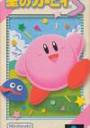

[星之卡比3](https://pewae.com/gaan/aHR0cHM6Ly93d3cuZG91YmFuLmNvbS9nYW1lLzI2NDI0NDI4)

原名：Kirby's Dream Land 3机种：SFC厂商：HAL / 任天堂类别：ACT发行年月：1998-03耗时：30

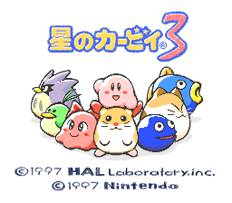
星之卡比3是卡比系列正统作品的第5作，Dream Land的第3作。诞生于GB上的卡比初代就叫Kirby’s Dream Land，所以这部作品可谓是玄门正宗，Dream Land正是卡比的家乡。而后续的作品只有Wii上再次出现了Dream Land的字样，说明卡比真的已经离开家乡，走向世界了。有趣的是之前介绍过的[梦之泉物语](https://pewae.com/2006/07/hoshi-no-kirby.html)，其在GBA上的复刻版又名“Nightmare in Dream Land”，说明红白机时代也没离岛。
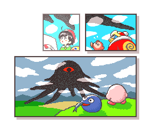

本作美版发售于1997年，是美版超任平台上最后一款任天堂本社的作品。但是超任日本的策略过于奇葩，2000年还有作品发售，卡比就排不上号了。因为出得晚，所以把超任的技能利用得淋漓尽致。半透明和回转机能都得到了充分的发挥。好像卡带上还带有特殊的芯片。这部作品最大的特色是其美工。仿蜡笔的色彩效果拔群，角色形象愈发可爱。
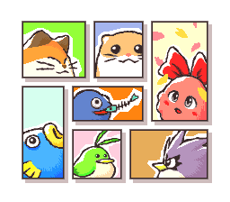

卡比2和卡比3是想走宠物路线的。跟系列的其它作品相比，卡比能吸收的能力数目大大减少，只有区区8种。但配合上丰富的宠物伙伴就多了，8×（6+1）共50多种呢。宠物方面，有二代传下来的仓鼠、猫头鹰和鱼，也有三代新增的小鸟、女朋友和三花猫。三花卡比，实在太可爱了。但是吧，正是因为宠物跟技能的组合好多技能华而不实或者滥竽充数，没有设计很多针对性的关卡和谜题，大大降低了带宠物的乐趣。除了二代和三代，宠物再也没出现在卡比系列的主线游戏里。
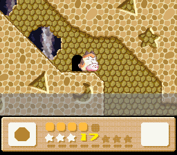

女朋友永远在上面，粉肉球你搞半天也是个受啊！
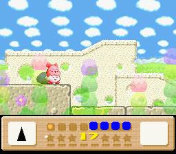

本作的一个特色是支持双打。双打的时候2P控制个黑球。可能是个失败的尝试吧，往后20年里卡比都没再支持过双打，直到18年NS上的最新作“新星同盟”才再次支持双打。
想想也是，副把的黑球只能吃东西吐星，不能变身。可大家玩游戏图的都是个爽快，谁会甘心用个又丑又没超能力的家伙呢。所以我连个黑球的图都没截。
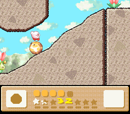

卡比全系列的难度都不高。这部的隐藏条件只有每关的一个事件。有难有易，小游戏，利用不同能力开门之类都是常规操作。第二关那个长得像屁股的弹簧需要卡比女朋友摸一下这种谜题就太无厘头了，不看攻略根本想不到！不过这些都不重要。卡比系列最要紧的是有趣。
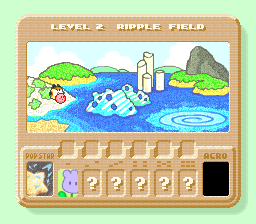

BOSS们大多是卡比系列的熟面孔。尤其是第一关的风语大树简直是系列的招牌。第四关的画家画出来的太阳月亮云彩也是老朋友。
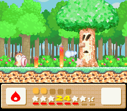
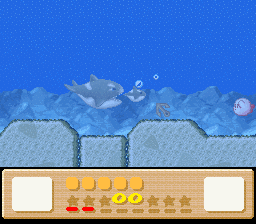
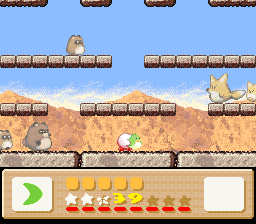
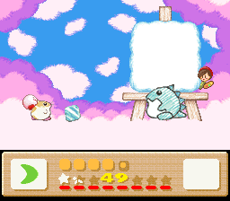
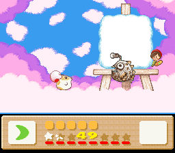
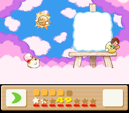
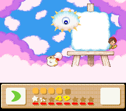
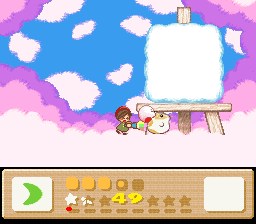

第五关的BOSS是迪迪迪大王。这个笨蛋又一次被控制了，这个梗任天堂坚持不懈地玩了20多年。如果前面每一关的事件都完成，就能发现幕后真正的BOSS。否则只能进入BAD ENDING。
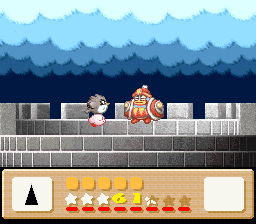
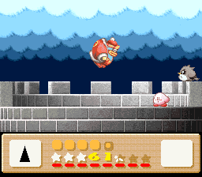

真正的BOSS是个眼球怪。有三层变身。这个游戏有个不爽的地方就是最后BOSS战变成了射击游戏，很无聊。最后BOSS的难度一般，第一种形态有机会连击；第二种形态比较讲究走位；第三种皮很脆。我打的时候看第二种形态只剩一滴血就浪了起来，直接对拼，发现还有第三种变身的时候只剩半滴血了。还好能SL。
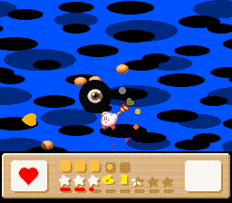
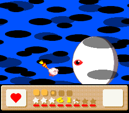
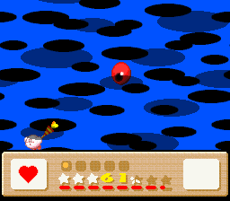

通关画面非常精彩。手绘形象连敌人都很可爱。
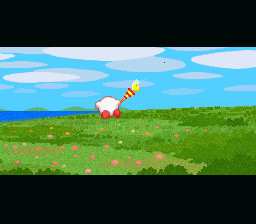
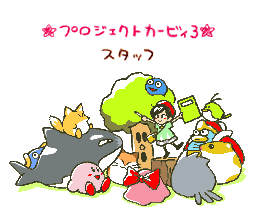
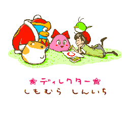
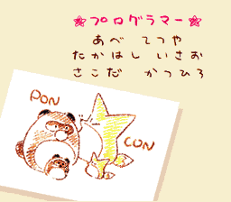
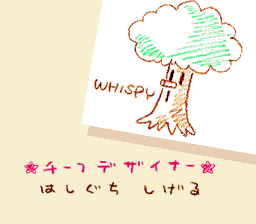
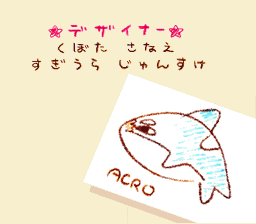
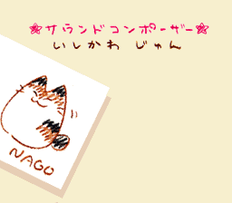
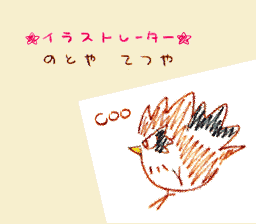
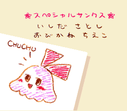
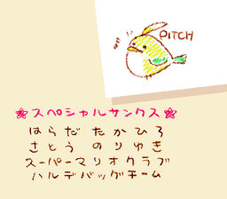
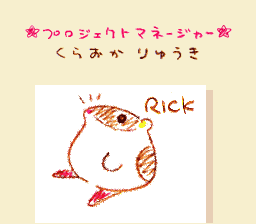
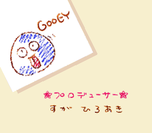
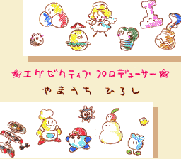
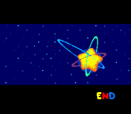

还没完。大约从90年的超级马里奥大陆开始，任天堂的几大招牌不约而同地开始玩起了收集的套路。按照正常完成事件打死隐藏boss的路子，看完通关画面后再次进入游戏，会发现完成度是97%。
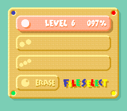

进入OPTION，会发现完成每个大世界第3个小关后增加的小游戏连轴转挑战M，以及打过6个BOSS后新增的白板卡比连战6BOSS的BossRush模式，再挑战M模式成功后，追加立定跳远J游戏。全部挑战成功，才会提升到100%。光板卡比其实挺好用的，只是血量不足，容错度不太高。
制作组其实准备了三套通关画面。迪迪迪背后黑手找不到一套，上面贴的一套，BOSS挑战模式成功后是第三套。还是觉得第二套最顺眼。
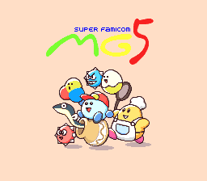
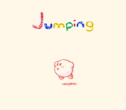
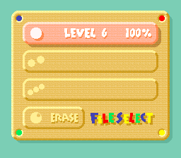
以上。