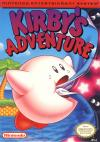

[星之卡比：梦之泉物语](https://pewae.com/gaan/aHR0cHM6Ly93d3cuZG91YmFuLmNvbS9nYW1lLzI2MzMzODA4Lw==)

原名： 星のカービィ 夢の泉の物語别名：梦之泉机种：FC厂商：任天堂类别：ACT发行年月：1993-03耗时：72

秘技:通关以后有隐藏模式.

这是一款很神奇的作品,绝对的名作.要知道它在10年之后的03年在GBA上出的毫无改动的复刻版也轻松的卖到了百万份.请大家注意它的出品年份,1993年.这个时间次世代都已经快出来了,HAL却很神奇的选择了在FC上制作这个游戏.貌似从此开始,卡比也成了给任氏主机送终的”最后的大作”.比如在超任上推出的星之卡比3更是达到了惊人的1998年!要知道这个时候N64几乎都要死了!跟任天堂其他几大招牌马里奥/金刚/林克相比,卡比真的是小弟弟.不过它却跟另一个招牌瓦里奥差不多,都是从GB杀了回来的.卡比系列的第一作是1992年,平台就是GB.当时HAL濒临破产,桜井政博就投靠了任天堂,做了它的第二方,在GB上开发了卡比初代.并且一战成名(听起来跟square有点像.)题外话,任氏的几个招牌形象中,基本只有马里奥和赛尔达一直是自己做的.其余像大金刚啊,火狐啊,卡比啊,口袋妖怪啊都是委托第二方制作的.
跟其它名作相比,卡比属于那种简单而有趣的类型.整个游戏的过程中最大的乐趣就是吸收敌人的能力,探索隐藏关卡,研究什么样的boss用什么能力打最轻松,以及小游戏怎样能赚取最大的利益等.要想死掉是很困难的事.
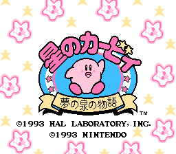

本来就是个球,吞了空气就更胖了.
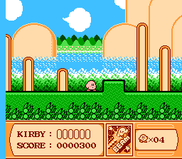
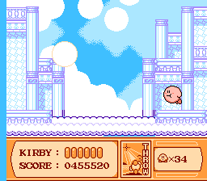

有各种各样的小游戏用来加命.
小游戏之一夹娃娃
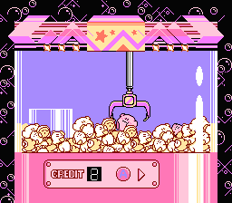
小游戏之二斗技场
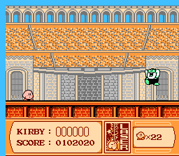
小游戏之三牛仔单挑
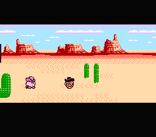
所以,命根本不是问题.甚至可以挑简单的一关反复打,利用最后的加命跳台增加生命.
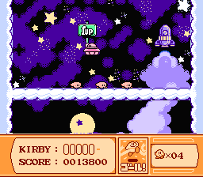
隐藏关的开关
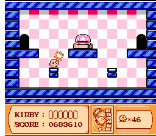
最终boss,出场挺酷,其实很面
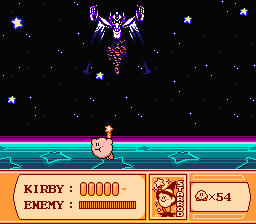
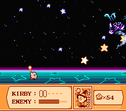

通关
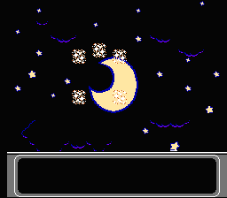
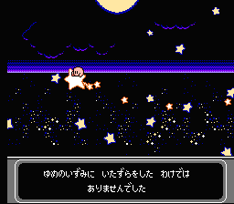

通关后的boss回顾
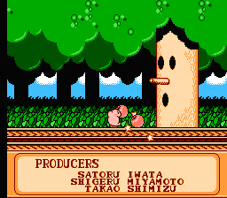
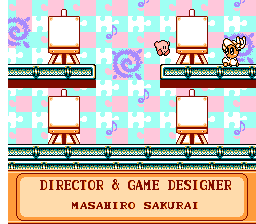
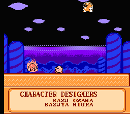
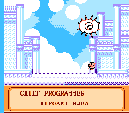
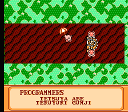
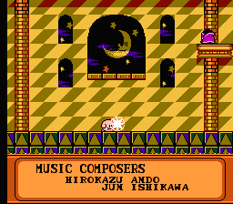
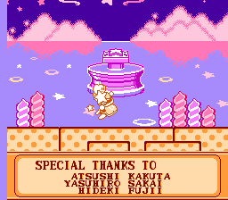

==== Update 14.10.3 ====
介绍的那段简单文字见诸各个模拟器网站,却不见一个注明引用的.奶奶个腿儿.