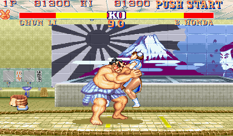
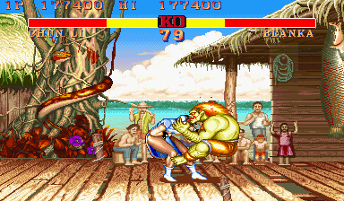
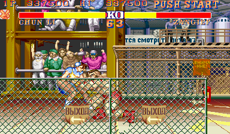
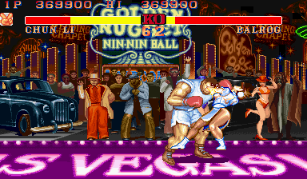
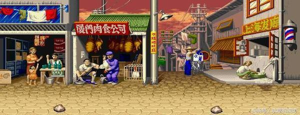
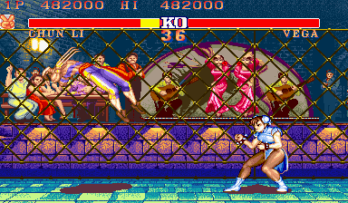
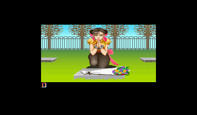
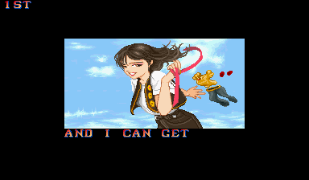

2018年3月1日，是世界著名女子格斗家春丽女士50周岁生日。
春丽是街头霸王2所有格斗家里最年轻的一个，09年古烈生日的时候，就想着，我这小博能坚持到给春丽庆祝50岁生日的那一天吧。
到了日子，还真是给忘了。

SF2最流行的那一版，对于在游戏厅混迹的我们来说，无疑是震撼性的。
一个个鲜明的角色形象成了我们课间的流行话题。其中万绿丛中一点红的春丽更是瞩目的焦点之一。
春丽的形象非常有特色，中式双髻的发型几乎成了后来中国元素的标配，而那双异常健硕的大粗腿，配合背景里的熟肉店，伙伴间一句“火腿”，心照不宣。

如此出众的形象设计，即使放在整个电玩史里也是最顶尖的成功案例。
街霸的故事主线应该是1-zero-2-4-5-3，春丽参与了除一代以外的所有主线游戏。SF3本来砍掉了隆肯以外所有老角色，但到了3rd的时候，响应玩家召唤，春丽强势回归。
除了主线，卡婊出的各种大乱斗系列，什么卡婊对漫威、卡婊对SNK、SF对铁拳……春丽几乎从不落下，一姐地位固若金汤。
连红白机上的盗版，四人和九人街霸，春丽也是不可或缺。
甚至09年卡婊还授权好莱坞拍了一部《街霸春丽传》，比隆肯的《街霸杀人拳》还要早。（都是大烂片）

其实在街厅里，SF2CE时代春丽的使用频率并不高，因为其两个大招的破绽都太大，而从空中发起进攻的话，遇到高手就是找死。加之当时的游戏厅基本没有配齐6个按键的，如果是三拳一脚的机台，春丽的拳又轻又短，就相当于废掉了。
但春丽作为对手又真的很受欢迎，卡婊把春丽的主场画得很接地气（虽然八十年代末的城市街头并不是那个样子），主场音乐活泼灵动，CV的配音也很魅惑（や、やや、やった、SpringBirdKick）……

说实话，就这主场设计，卡婊得感谢那时候中日蜜月期，换今天，分分钟给治个辱华的大不敬之罪。
那时我的朋友马莲花总撺掇我练习使用抓挠（巴洛克），因为他听说一个传闻，抓挠的爪子某些情况下可以把春丽的裙子抓掉……

本身就不是格斗游戏的爱好者，使用春丽最多的时候也就是在衍生作品口袋战士上了。
口袋战士系列形象可爱，难度也没有正传那么高，最重要的是社会大哥可能觉得把持这样的机台太丢份，我能抢上机器。
其实还是更喜欢用的是疯狂进攻的黄毛（肯）。

大学时代模拟器开始野蛮生长，CE、NC，ZERO12，口袋战士、口袋方块都能轻而易举地玩到，可却已没有街厅了的氛围。
基本上天天玩各种RPG，偶尔跟寝室的好基友战几盘拳皇，春丽什么的，已是明日黄花~~キララ~~。
逐渐忘却了春丽这个大姐姐。

不知不觉间，小30年过去了。
50岁女人的裙子已经没人去掀了！

好在，在今年的SF5里，春丽仍旧活跃，给人们展现她二十岁时候的样子，真好。
专一的男人啊，10岁时候喜欢20岁的小姐姐，20岁的时候喜欢20岁的小姐姐，40、50、60岁的时候仍旧喜欢20岁的小姐姐。

祝春丽永远20岁。

Audio Player

<http://ocr.blueblue.fr/files/music/remixes/Street_Fighter_2_Chun-Li's_Theme_(Funky_Flute_Mix)_OC_ReMix.mp3>

00:00

00:00

00:00

[Use Up/Down Arrow keys to increase or decrease volume.](javascript:void(0);)