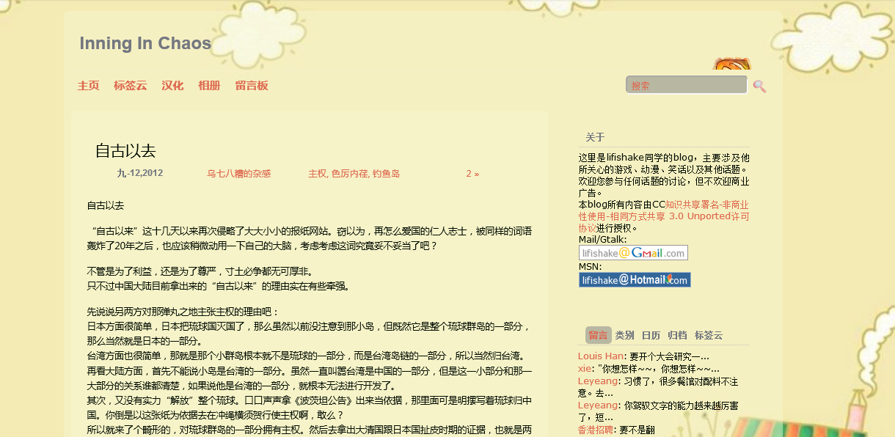

无意中发现一个叫做“时光机（http://archive.org/web/）（墙ed）”的网站，就尝试着去缅怀一下本站最初的样子。
从05到14，内容倒是硬硬的还在，样式表却是没抓到的，光秃秃的好像CSS裸奔日一样。唯有12年左右的一段日子能抓到背景和样式，看到熟悉的界面，有一种想要掩面泪奔的冲动。

为啥咧？
本人虽然爱插件爱折腾，但其实向来都是东拼西凑的小打小闹，真正动手从无到有做出来的主题就只有一个为了纪念我家臭宝出生而做的PrincessSisi。那真是把twentyeleven吃透了之后一行一行抠出来的，颜色的使用咨询了学美术的专业人士，背景图片跑作者的主页去要了授权——总之是非常认真的一次改修。结果好景不长，使用不到两年网站被挂马，主题代码里查出嵌入二进制的木马文件，被google和服务商警告，我不得不放弃了该主题。虽然后来换成官方主题后仍然被挂马，却已然没有了再次启用的勇气。
今天，真相终于大白了。时光机有记录，说明那段时间的robot文件有漏洞。确实，貌似那个时间段照着某大能的教程改过robot和.htaccess……
这是个教训，在自己搞不明白的领域，要么搞懂它，要么别乱动手。当然了，知易行难。

上周的一点空余时间里颇有些不爽。在了解了子主题这种形式之后，我一度觉得找到了最佳的解决方案：技术大能们负责紧追潮流优化功能，我老人家负责自娱自乐个性化配色和样式。然而，老外们的步子有点儿大，每次大更新都动上十来个函数——这样每次我也要提心吊胆地查看他们的release note，看看我重载的函数在不在升级的范围内。再一点不爽的就是原作者的团队越来越热衷于googlefont的展开了，几乎每个大版本更新之后，进首页的时候都会看到连接googleapi那便秘般的小字。我不是不会解决，而是不想解决。每次比较代码的感觉太不爽了。到底是你更新还是我更新？千日防贼一般的不爽！

自己写一个吧，又缺乏灵感并且知识储备不足，我毕竟不是玩前端的也不是美工。当爹的喜悦之情改变不可能再次迸发出来；js只会改不会写的硬伤依旧存在；还有自适应宽度的原理也没搞清。配置项神马的也是个坑——怕加了配置项之后自己完全不想改或者写死了代码却天天心血来潮。走一步看一步吧，反正写博也只是玩，量力而为，尽力而行。

以上怎么看都像是自己为不再折腾现在这个子主题找的理由吧！其实不是的。已经偷了好几个社会化插件，准备加分享按钮来着。至于现成儿的，哪儿有自己可以掌控的舒坦哪，想都不要想！