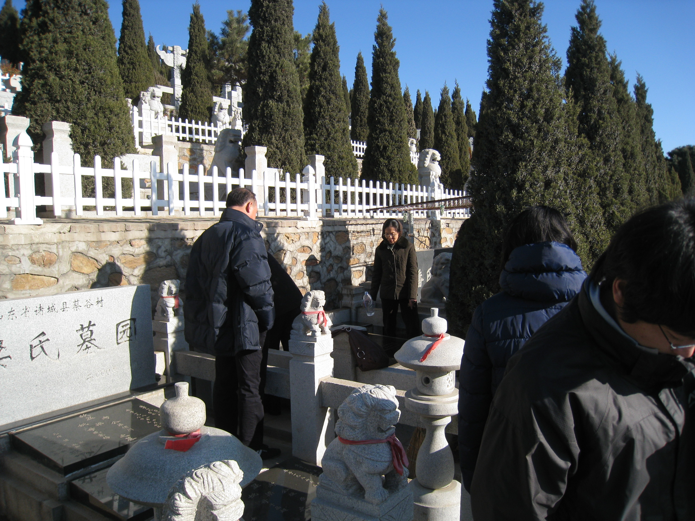
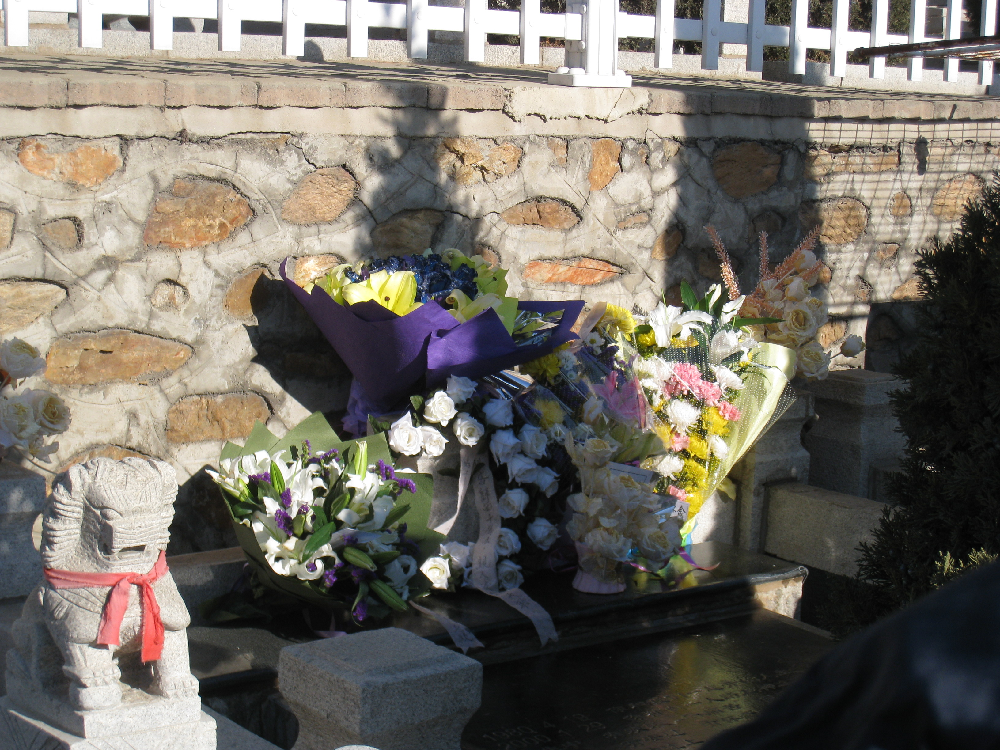

昨天是我的高中同学文博的10周年祭日。

原本素来是对这种整数周年的事件不以为然的。
几次上山祭奠老文，也都是有意错开了他的父母可能出现的时间。
然而昨天不同。

文博的父亲一个多月以前就设法联络到了高中同学，希望征集关于文博的回忆，以往的照片等种种。
甚至文爸爸还[专门开了一个博客](https://pewae.com/gaan/aHR0cDovL2Jsb2cuc2luYS5jb20uY24vbHNkZnp3ZW5ibw==)来放这些文字和资料。
文爸爸的回信，一下子就让我回到了10多年前的热血学生时代，一下子就让我明白了，10年来，他们一直都放不下。

看看他母亲悲伤的样子，和他父亲的故作镇定……我觉得很心伤——而已。
10年了，所谓的朋友，除了偶尔感慨一下“天妒英才”或者“真可惜”之类，能做的真的不多。
真正痛苦的，唯有他的父母。
无人能分担，无人能取代。

逝者已矣，活着的人却要好好活着。
所以，昨天上山的目的并不是要祭奠文博，而是要他的父母知道，同学并没有忘记他。
是否真的没有忘记其实不重要，只要让两位老人知道并认为同学还有人没有忘记，文博仍然活在别人的回忆里，能宽慰一些，目的就达到了。

我就是做给活人看的。
我觉得昨天做得很成功。