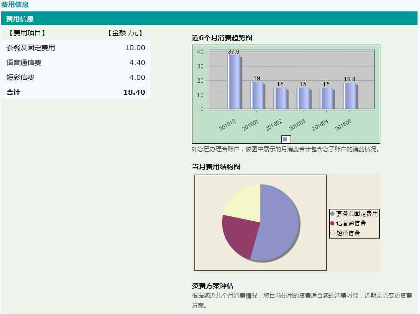
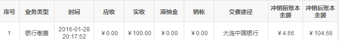

在话费的控制上，我不是针对谁……

刚才加班前出去透口气，接了个电话。这几天同样的号码给我打了不下10个电话了，终于被ta逮到了。对方自称是移动的客服。
客服：“先生，我可算是联系上您了。这样，今年电信日我们对8年以上的老用户有一项特别的优惠，免费送您一部XXX手机。”
我：“得改套餐吧？”
客服：“……是的。这个套餐是我们目前最优惠的套餐了，简直是白菜价，每个月只要38块钱，包括blabla……”
我：“38太贵了。再见。”

我不是敷衍她。目前我的资费是这个样子滴：

> 神州行大众卡无月租费，赠送来电显示，最低消费15元/月。早9点至11点，在本地拨打本地电话0.6元/分钟；其它时段，在本地拨打本地电话0.4元/分钟；在本地每月可免费接听500分钟，超出后接听电话0.1元/分钟。国内漫游拨打国内电话0.6元/分钟，接听电话0.4元/分钟，给国内客户发送短信0.1元/条，一条短信包含140个字节，约70个汉字。以上资费不含港澳台。

这15块钱的最低消费，一般情况下我是花不了的。
常通话的老婆大人、老爹大人和老丈人都加入了老婆单位的大客户网络，互相不要钱。老妈特殊原因没加入，但我从不主动给她打电话= =。咱也不跑什么业务，一个月10个电话足够我打的了。而且我信奉有话则短无话挂断的原则，单个电话很少有超过一分钟的。

上次贝总夸咱协弃市的wifi普及得好，还真没说到点子上。
2013年的时候特意关注过几个月的话费详单，发现连续7个月都没超过4块钱。于是果断把流量包月从5块钱的30M提升到了10块钱的70M。其实对我来说5块钱预防流量偷跑就够了，提升的部分只是不想白白被移动赚了便宜，而已。我是真没什么移动设备上网的需求。微信不开，在线支付不用，微博、打车、团购、地图和QQ都没装，游戏的非wifi联网权限都取消了。几乎所有的流量都花在看小说上。而且咱也耐得住，30M有30M的追法，70M有70M的追法，没流量了直接关闭移动网络，回到家再下载缓存，无非晚几个小时，一点儿损失也没有。

这张就是我刚过去的5月份的话单。右半部分的柱状图是近半年的话费。去年12月份奶奶姥姥相继去世，跑腿的事情做得多，超标没办法；1月份过年打了几个拜年电话，属于正常的透支；5月份为激活twitterAPI的管理权限先开通手机认证，往英国发了4条短信，4块钱额外开销属于意外。
就是这超标的月份，咱也没用上38啊！

“100块钱够我用大半年”明明是句实话，咋都不信呢？