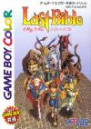

[女神转生外传：最后的圣经](https://pewae.com/gaan/aHR0cHM6Ly93d3cuZG91YmFuLmNvbS9nYW1lLzI3NjYxNjI3Lw==)

原名：女神転生外伝 ラストバイブル机种：GBC厂商：Atlus类别：RPG发行年月：1992-12耗时：28

[自制攻略](https://pewae.com/gaan/aHR0cDovL3dpa2kucGV3YWUuY29tL2Rva3UucGhwP2lkPXdpa2k6Z2I6JUU1JUE1JUIzJUU3JUE1JTlFJUU4JUJEJUFDJUU3JTk0JTlGJUU1JUE0JTk2JUU0JUJDJUEwMg==)

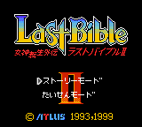
女神转生系列是Atlus的招牌作品，号称是DQ和FF之后的第三大日系RPG（系列）。但相对于DQ和FF，女神转生系列的命名就太蛋疼了。本作的全名是《女神·转生·外传·最后的圣经2》，每个被我用点隔开的部分都能找到姊妹篇。女神->魔神；转生->异闻录；外传->正传；最后的圣经->X之书，还有本作没涉及到的真->旧约。Atlus除了女神转生就没什么拿得出手的名作了，所以后来不管出什么游戏都喜欢往这个系列里装，所以其庞大的谱系考证足以写一篇万字的论文了。SQUARE和ENIX合并之后，DQ和FF的影响力都在下降，反倒是女神异闻录一作接一作地出，也可谓是沧海桑田了。
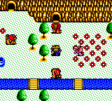

当年买的第一张GB盗版合卡里就有这个游戏，但因为日文的问题根本没碰过。后来电软上登了攻略，照着攻略打到大约1/3，又放弃了。
砖头机上玩到的是92年的黑白版，这次怀旧用的是99年GBC上的重制版。GBC刚出的一两年里，几乎所有的公司都在搞这种复刻骗钱。有良心的加一两个小彩蛋（比如塞尔达梦见岛），而本作除了上了个颜色以外，两个版本好像没有任何区别。GBC真机上没玩过，模拟器上的颜色显得太艳了，还不如黑白机看得顺眼。
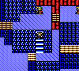

这个游戏，其实在去年（2016）11月就开始攻略了，但打得实在太辛苦。除了本人时间零碎之外，更多是游戏自身的原因。
首先，女神转生系列的一个特点是怪物队友。这也是我当年看到攻略之后立刻攻关的动力之一，我对这种招怪打架的游戏毫无抵抗力。
然而女神转生系列的另一个特点是所有的怪物队友都不能升级，最多打两个场景你的怪兽队友就不给力了，就得换掉。这就意味着没走多远就得忙着去抓怪物了，什么剧情什么系统都被搞得支离破碎。
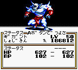

其次，就是抓怪物本身。为了突出女神转生系列的世界观，抓怪物的时候不用什么道具，也不用魔法，也不是概率的问题，而是要回答怪物问的问题。有的时候两个问题答对了就能加入，有的8个问题之后自己跑了。同样的问题，做出回答的反应时间会关系到它下一个问题问啥。总之各种坑。当年看不懂问题也就罢了，现今翻译出来问题仍旧是一头雾水。
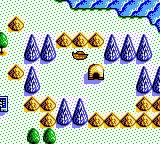

第三，系统繁琐。举个栗子，某道具在候补席上的某只怪物身上，想换到主角身上，操作步骤如下：队列-交换-确定-物品-给予-从-到-选择-确定。我觉得这个游戏的设计一定是个无证程序员。
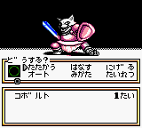
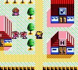

以及，乱飞的鸟文。本身全程假名已经够痛苦了。游戏里的魔法、道具和大部分魔兽名却是用的片假名外来语，有的是真英语，有的是生造的。用英语音译也就罢了，偏偏还要缩写。最令人咋舌的是英文版，直接把假名按照日文拼写又直译成了罗马字。攻略上Bufudai、Jiorama这种东西，看得人实在是火大。
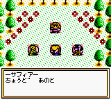

ATLUS有个镇宅之宝的插画家金子一马，现在很受追捧。STAFF里说本作的角色制作(Character Producer)也是他。来欣赏一下这骨骼清奇的最终BOSS吧！
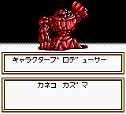
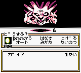

反正不管喜欢还是不喜欢，魔兽队友都是本作的最大特色。因为不能升级，所以队伍的构成始终在变化中。相对于大多数RPG来说，本作的迷宫都可以说短的过份。但敌人都很厉害，以人类的小身板是很难硬抗过去的，这时就要依靠强力的魔兽队友了。以及到了下一个场景，老队友力不从心的时候，还可以合成成新魔兽再做贡献。如果能合成出新场景里的魔兽就最好了。因为如果踩雷的时候遇到同类，仗就可以不用打了。几个分分合合的人类队友实力都挺费电的，打最终BOSS还是要靠魔兽。
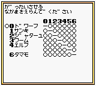

通关！
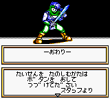