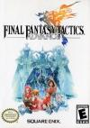

[最终幻想战略版Advance](https://pewae.com/gaan/aHR0cHM6Ly93d3cuZG91YmFuLmNvbS9nYW1lLzExNjE5MjYz)

原名：Final Fantasy Tactics Advance别名：FFTA机种：GBA厂商：SQUAREENIX类别：SLG发行年月：2003-09耗时：140

最终幻想战略版Advance，简称FFTA，是我最喜欢的GBA游戏。
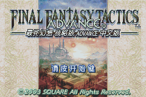

这个游戏我前后打过4回。
第一次是2004年出差，真机卡带，没通关；
第二次是2007年出差，用PSP厚机玩的模拟器，隐藏任务没打完，PSP被偷了；
第三次是2014年，刚换智能机，趁新鲜劲玩模拟器，打了2个多月，剩6个任务死活不出来；
这是第四次，从2月10号复工开始，到今天差不多三个月，终于被我完成了所有300个任务和4个特别任务。
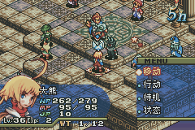

可能慢慢悠悠的战略游戏是最适合我的游戏类型了。而且还要战法丰富，收集要素有趣，还不能太难。FFTA从这些角度来说，堪称完美。史克威尔的看家大作最终幻想系列从第三部开始有了转职系统，而最终幻想战略版可以看作是转职这一思路的发扬光大。利用花样繁多的职业以及职业组合，产生趣味感和爽感，是这个系列区别与最终幻想正传系列的最大卖点。
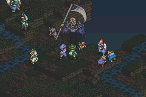
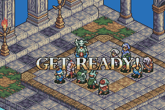

以及，负责FFTA项目的小组，并不是最终幻想正传系列的人，而是来自《皇家骑士团》（奥迦战争）。这个组是跟着艾尼克斯合并过来的。所以FFTA可以说是结合了史克威尔的创意与艾尼克斯的细腻而生的巅峰之作。无论是PS上的前作还是PSP上的续作，都没有本作这么耐玩。直到后来NDS上的FFTA2才又回归精彩。
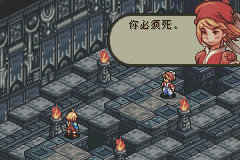

一般文字类游戏，尤其是日式战略游戏和RPG，都是日版更符合国人口味一些。本作却恰好相反，欧版玩起来要更加轻松有趣，隐藏要素也更多。
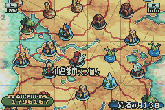
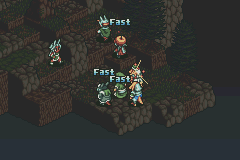

故事其实很简单，主人公和他的弟弟，以及两位同学在学校都受到歧视，晚上在房间里一起读书。夜里睡着之后，同学缪特以强大的怨力开启了一个想象中的世界。主人公需要召集团队，陆续战胜他的三个伙伴，回归正常世界。
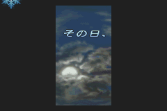
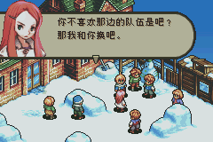
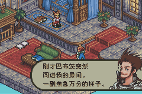

FFTA的一个特色是战斗时候要受到世界规则的限制。有的规则可以让本方轻松取胜，有的则无比蛋疼。比如在打怪兽的战斗中遇到了“怪兽爱护”，或者在大后期遇上“伤害50以下”，都够头疼的。
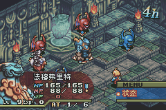

当然本作的缺点也很明显。首先可能是机能所限，每场战斗战场上最多只能容纳12名角色，战场上最惨烈的一场也不过是4对7，很多强力招式炼成以后，或者神奇的组合成型之后，还没发力敌人就倒下了，颇有种“杀不够”的感觉。其次是怪兽收集系统有些过于鸡肋，获得捕获技能已经是中期，很容易错过前期出现的怪物，而变身士这一职业练起来太困难，虽然能够达到游戏中的最大攻击，但等练好了之后，黄花菜都凉了。第三是规则的覆盖范围太小，而且最后阶段之后不再刷新，没有惊喜感。最后就是到了后期，缺乏强力BOSS，炼成了厉害招式却找不到人试刀。
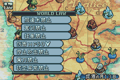

受本人青睐的游戏一定是有无赖要素傍身的。这部游戏最有趣的地方第一是盗贼有偷武器和偷技能的技能。为了尽早学会这个技能，游戏开始后首先要在大地图上晃悠好几个小时，不停地招人踢人，提前拿到学习可以偷武器技能的匕首，然后再进入特定的一关，偷取能偷技能的那把匕首，之后就就一片光明。而且有的敌人身上是有隐藏武器的，这一设定几乎意味着鼓励你来偷。
二是敌方的曲艺士和忍者可能用武器来砸你，而队伍中若是有兔子族和莫古力族学会了“捕捉”技能，就能接到好多珍惜武器。选择敌人，卡死角，让敌人升级……都是容错率很低的操作。可以接的武器一共181种，接了好几天才全获得。我做了一张表来专门记录这事儿。
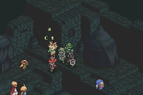
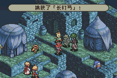

什么土水火风四色守护神兽，已经是游戏的常规操作了，一点儿也不新鲜。
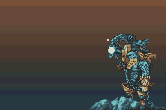
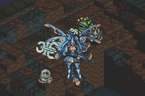

普通招数里要算幻术士的全屏魔法和召唤士的召唤魔法有些华丽的感觉。但也就是个噱头。幻术士攻击力太低兼放招太浪费时间，大部分时间都在坐冷板凳。
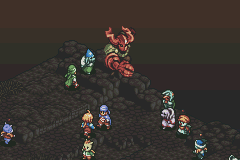
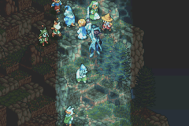

裁判是同学的爹地，倒二BOSS是同学的想象出来的妈咪，最终BOSS当然就是同学本人了。
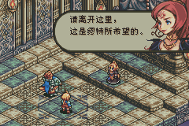
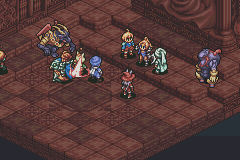
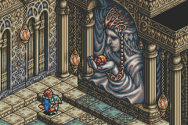
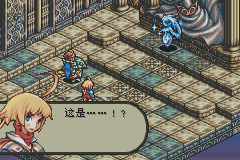

通关！
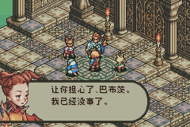
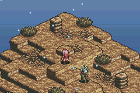
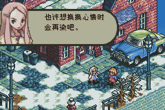
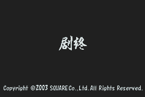

那个时期游戏的一个特色是“通关以后才开始”。好几个任务和强力武器都是在打完BOSS以后才出现的。我上一次玩没打出的任务里有一系列是要在物品栏先阅读一个书状道具才能出现的，“阅读”要按下SELECT键。这个操作完全没有任何说明，实在是坑的很。
所以这300个任务我可真是久违了！
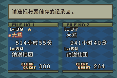

还有四个隐藏任务，道具需要联机才能获全。此时不用修改器更待何时？
这几个任务都是派遣任务，不能痛痛快快打一场，真是遗憾啊。
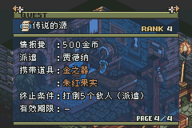
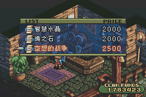