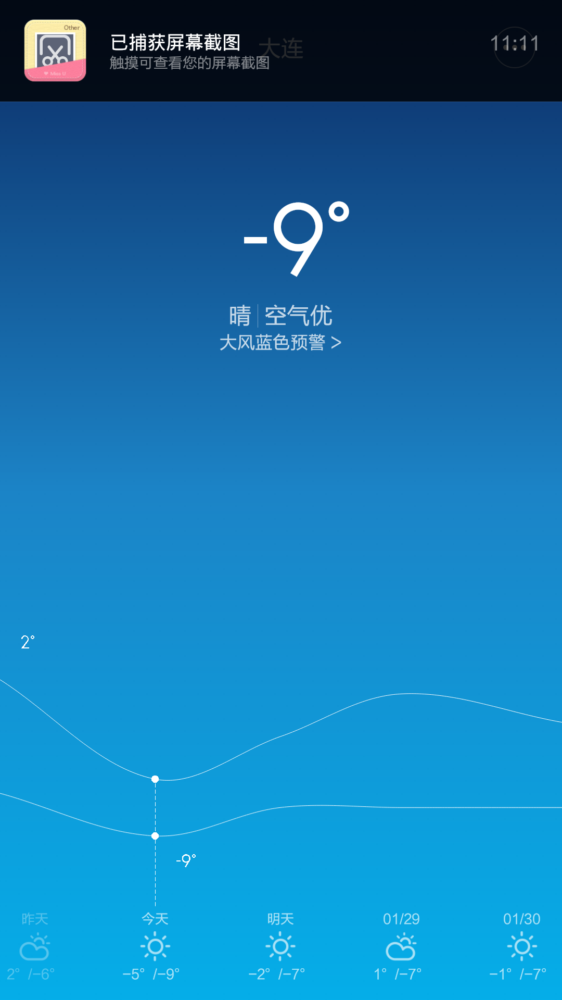

公元2015年~~2~~1月27日，农历腊八。11点温度是-9度，配合着6级北风，体感大概是-14、-15的样子，在大连这个地方确实可以算冷了，但其实也冷不到哪儿去。
回退一天，腊月初七。

我们家臭宝每天上下幼儿园的行程是：早上老婆开车，把楼下阿姨跟臭宝扔到适合转弯的十字路口，阿姨把臭宝送进幼儿园交给老师；放学时阿姨去接，带着臭宝坐两站公交车回家，天气不好的话打车（报销）；然后臭宝寄存在阿姨家，直到我们俩下班再给接回家。当然，是有报酬的。

昨天晚上，老婆接到阿姨微信：“霞啊，俺闺女胃肠感冒，明天在家休息，我想在家照顾她，就不送臭宝了，我在家看她一天，你看行吗？”
你妹啊！28岁到处张罗让帮着相亲的大姑娘还用照顾？
所以老婆没接茬：“这样吧，阿姨，你就帮我们送去就行，正好让小妹儿多睡一会儿，晚上让她姥爷去接。”
……

十分钟后。
——“霞啊，明天降温，你看今天晚上就够冷了，幼儿园都放假了，光有带班老师，我怕把孩子冻着。”
——“阿姨，你看你照顾小妹也忙活不过来。再说幼儿园比咱这老房子暖和多了，都是常年23、4度，俺家不开空调才17度。”
……

又是七、八分钟。
——“霞啊，阿姨实话跟你说吧，阿姨这个腿啊，天一冷就发麻，实在是打憷上下楼梯啊——”

这这已经近乎无赖了，还能怎样。倒不是说交了托保费不去幼儿园或者是给了阿姨酬劳不让她跑腿儿吃亏，而是觉得不应该给孩子灌输幼儿园/学校说不去就可以不去的坏念头。
如果有人能代替她，早就翻脸了吧。垄断就是牛，说啥都没用。

有一种冷，叫楼下阿姨觉得冷。