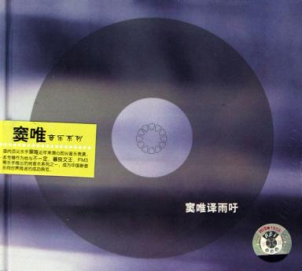

[雨吁](https://pewae.com/gaan/aHR0cHM6Ly9tdXNpYy5kb3ViYW4uY29tL3N1YmplY3QvMTg0OTk4MA==)

音乐家：窦唯, 译风格：摇滚地区：中国大陆发行年月：2006-08

有的人的歌，听到旋律就可以体会到意境，比如Enya。
有的人的歌，歌词朴实，听了以后很舒服，比如李宗盛。
有的人的歌，听完歌词需要想一会，才知道他唱的什么，比如陈升。
有的人的歌，听完就知道他其实什么都没唱，比如刀郎。
有的人的歌，不看歌词不知道他们唱的什么，比如周杰伦。
有的人的歌，看完歌词也不知道他们唱的什么，比如**窦唯**。
下面是新专辑里的歌词:

> 肓诜君众
> 弆殇落
> 雨吁
> 症悻祟意
> 诩诤朗斡
> 惶瞠目妄惊喜
> 几或言勖
> 令旺书筲笙筝
> 夭武
> 少暮
> 影音遮雾
> 须校士噤讳猖
> 徒呜呼
> 待熹楚
> 置众处
> 专辑的包装很cool的说.

不过,整张的旋律还蛮好听的.谁规定歌词一定有含义的??