1.1994年10月，在太原街淘《幽游白书》的时候，发现一份杂志，蓝色底面的上方是几个马赛克堆成的小人儿。上方另有几个大字《GAME集中营》。对于当时热衷于收集各类攻关秘诀的我来说，毫不犹豫就拿下了。看过之后，发现其小不正经的风格实在太对胃口了，封面那几个马赛克小人儿是VR战士！俺终于在同学中间有新的吹牛资本了！你们连世嘉机都没怎么玩过，知道什么是3DO吗？知道要出的土星么？听说过PC-E么？知道旋风小子里小胖子手里拿得那个东西可以换节目么？于是在那个周六放学的时候果断大范围搜索过往杂志，从学校一个书摊一个书摊地访，新华街市场书摊–成仁街集贤街书摊–迎春街市场书摊–太原街五一路书摊–成仁街五一路书摊–成仁街民政街书摊–五四花园书摊–兴工街教堂书摊。最后终于在兴工街教堂边上那个书摊上买到了他挂在那里的最后一本第二期。可惜，这两本杂志不久后就被同桌死党宝宝给弄丢了。
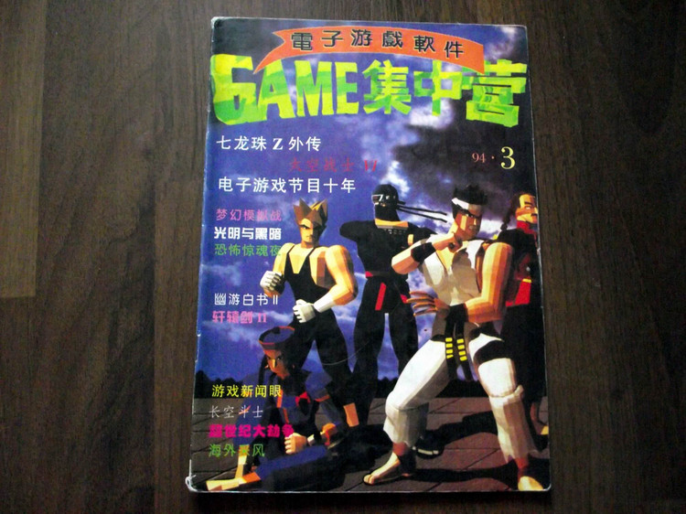

2.从那以后，每天中午闲逛的时候，都要上熟识的新华街市场老太太书摊那里问一句，《电子游戏软件》来了吗？其实，很想直接问GAME集中营的，但是怕老太太不知道GAME是什么。老太太总是说：“没来，看看别的吧。”宝宝说，可能像其它的骗钱杂志一样，出两本就黄了吧。可我还是每天都坚持去，当然不光是问电软，也包括画王和其它单行本漫画，前前后后问了大概4个月。终于盼来了95年3月号。

3.当时班上只有俺俩对这杂志有兴趣，外流得毫不严重，几本杂志在两人手上传来传去，但最后基本都会放到宝宝那儿保存。因为他住奶奶家，没有那么严厉的审查。但比较恶心的是，宝宝有个大他两岁的表哥，也是个狂热的游戏爱好者，经常从他那儿把杂志顺走。

4.94典藏本一直收藏着，直到98年的一天，宝宝说要打皇帝的财宝，要去了。然后，丢了。

5.95.7期是暑假在东财补课的时候，东财校门靠群英小学的那个书摊买到的。封面是小悟空。里面的攻略相当相当过瘾，多年以后仍旧回味无穷。梦战2和大航海2的攻略几乎能背下来了。下图是宝宝当年打大航海2时留下的笔记。
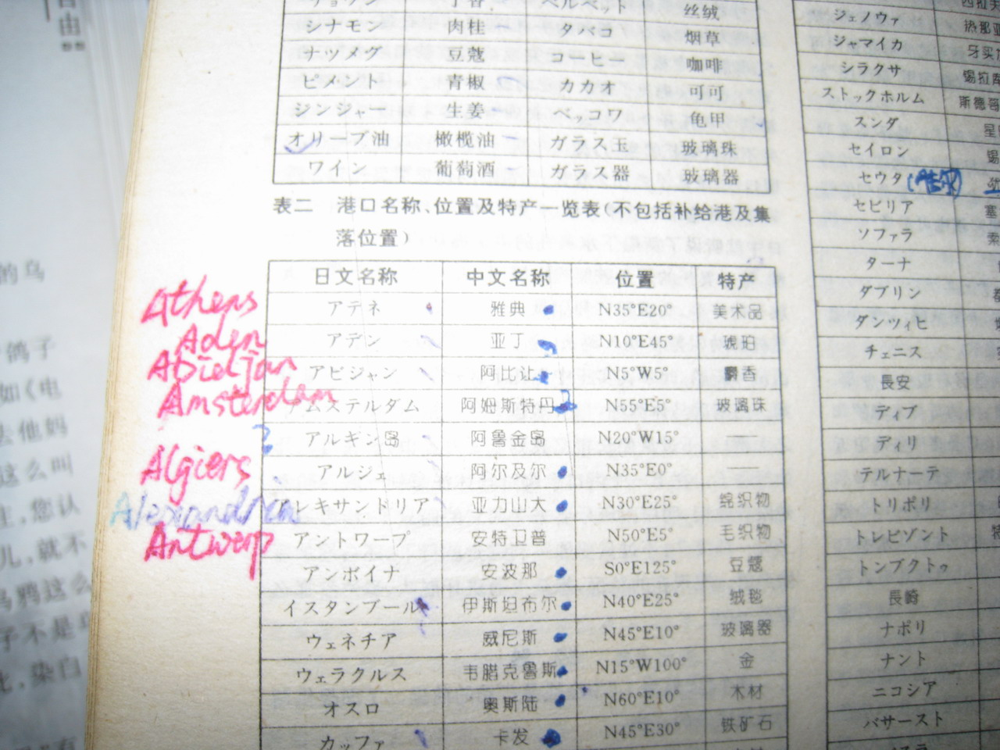

6.95.4期的卷首语《乌鸦.乌鸦.叫》，95.5期的卷首语《丧钟为谁而鸣》，95.7期的卷首语《大事.小事.猪脑子》直接惹恼了相关部门，杂志停刊了。再回来的时候，封面是一只小狐狸骑着耀奇，改名为《风景线》后，风格显得相当拘谨。后来出了95全年影印版，因为没买到发行量极小的95.1和95.2，所以就买了。但其余实体杂志都没扔，直到07年准备装修结婚，才忍痛把“重复”的几期杂志扔掉。但08年重温的时候猛然发现，整顿后的影印合订本连广告都没删，却偏偏少了这三篇社论。后悔不迭。看看我手上的这本缩印合订本吧——陪我上完初中高中，陪我去了沈阳上大学，陪我工作，陪我去南方三省出差，陪我常驻上海……
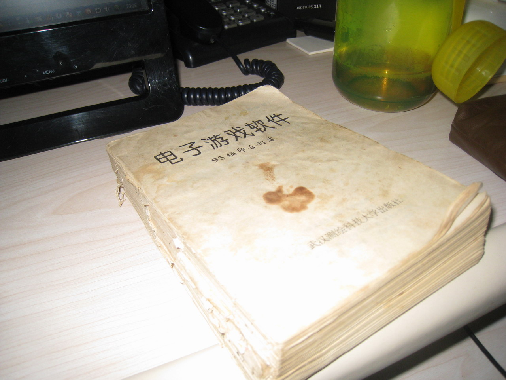

7.95典藏本和96.6期是一起在新华街老太太那里买的。那个时候，老太太已经学会说《GAME》风景线了，可我却习惯了跟她说《电子游戏软件》。这两本是我在老太太手里买的最后两样东西，念高中后远离了太原街地带，新华街改造以后，也不见了老太太的摊位。
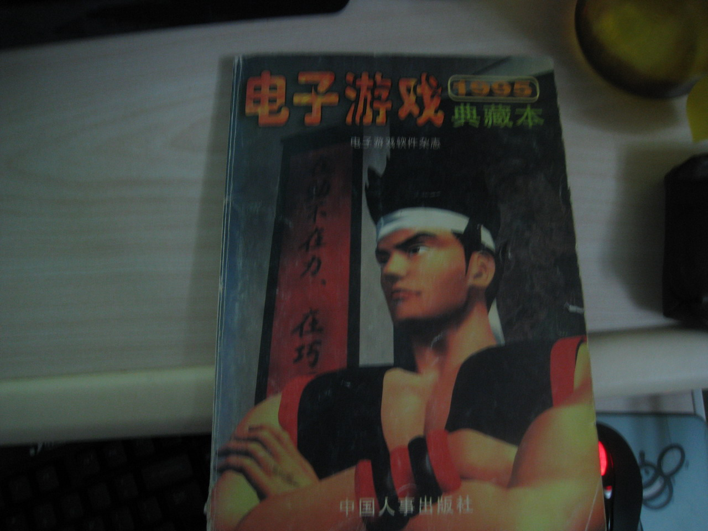

8.96年初的时候，电软搞了个知识竞赛，跟宝宝翻箱倒柜地找过往杂志，把自认为万无一失的答案寄出去，结果连个纪念奖都没捞到。于是开始互相指责对方没找对答案。

9.96年开始，电软搞起了正儿八经的合订本。于是基本上单期的杂志都会放到他家，我在年中和年终的时候再买一份合订本。由于疏忽，没买到96上的合订本，所以一直耿耿于怀。直到……直到2000年在沈阳大西门旧书摊闲逛的时候，发现有96上半年的单期杂志卖，于是以两块钱一本的价格美滋滋买回宿舍。翻看到这一页的时候，我当时就懵了！这tm分明就是我的字体啊，答案也是我填的答案啊！！暑假回去急匆匆拿着杂志找宝宝确认。宝宝也懵了。我们俩怎么也想不通，在大连丢的杂志，怎么会在沈阳又被我买了回来！！
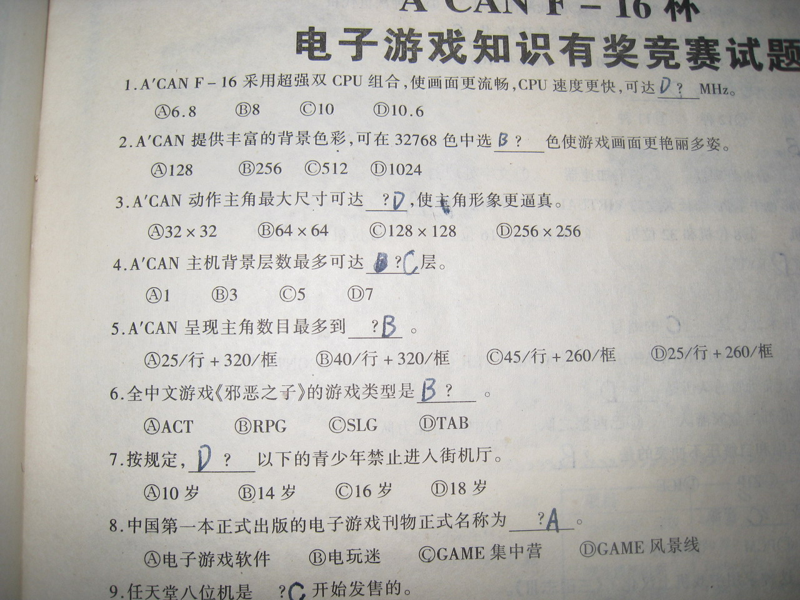

10.95秘技宝典，是我在兴工街书城买的第一本书。嗯，那个兴工街书城，并不是现在的长兴书城，虽然从位置上讲并没差多少……同一天还买了第一盘磁带。没错，95秘技宝典后来也被宝宝弄丢了。嗯，专辑的歌词被我夹在98增刊里。
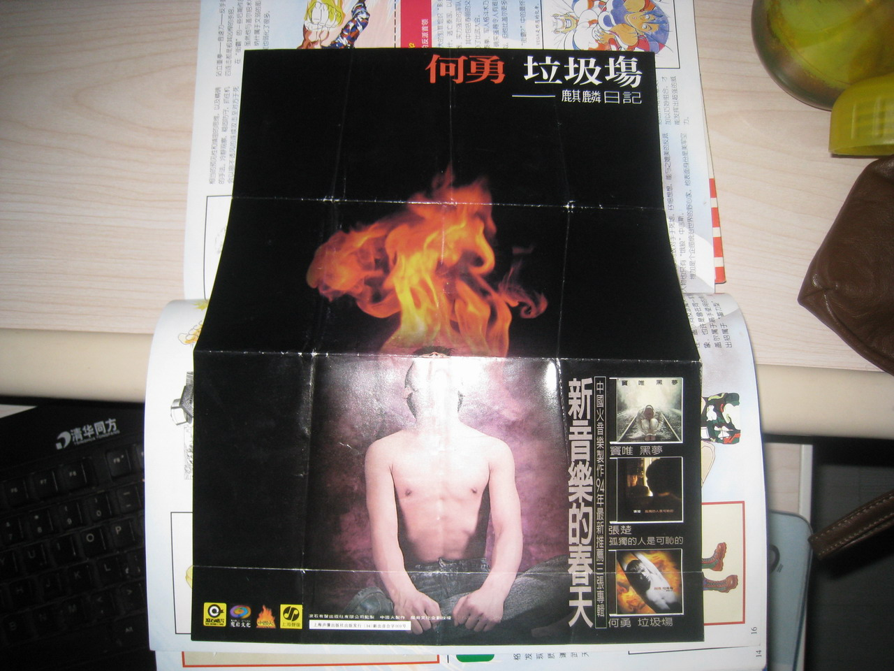

11.《MAGIC ZONE》最拉轰的增刊。这本书比我本尊可牛B多了，至少跟7，8个女生回过家。不过看过里面的这张照片以后，让俺一直对素未谋面的贝璐丹迪女神产生了阴影。当时真心地认为雪鹰大姐实在强。估计小雪@snowxh应该也有那个功力，但要知道，那个年月没有互联网啊！其实，《都市流行.酷》也是不错的增刊，但在班里转了一圈儿以后就不知道被哪个王八蛋给黑了。
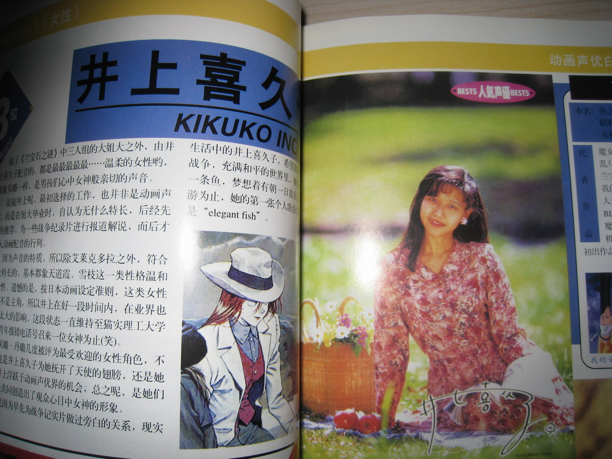

12.《97秘技宝典》的注意事项，是一篇十足的kuso文。至今看了以后仍旧会会心一笑。
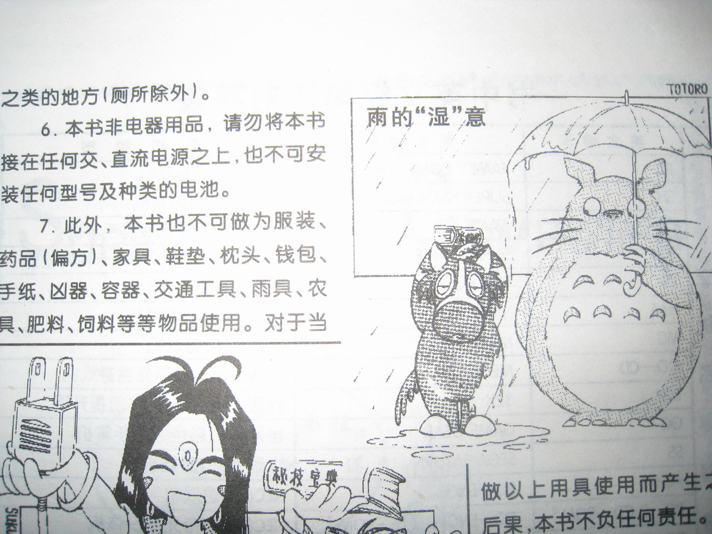

13.99年寝室里配了电脑。2000年一开始的时候，我从家里背了4本合订本到学校。

14.两本pocket增刊，都是提前跟书摊老板打招呼后给留的。
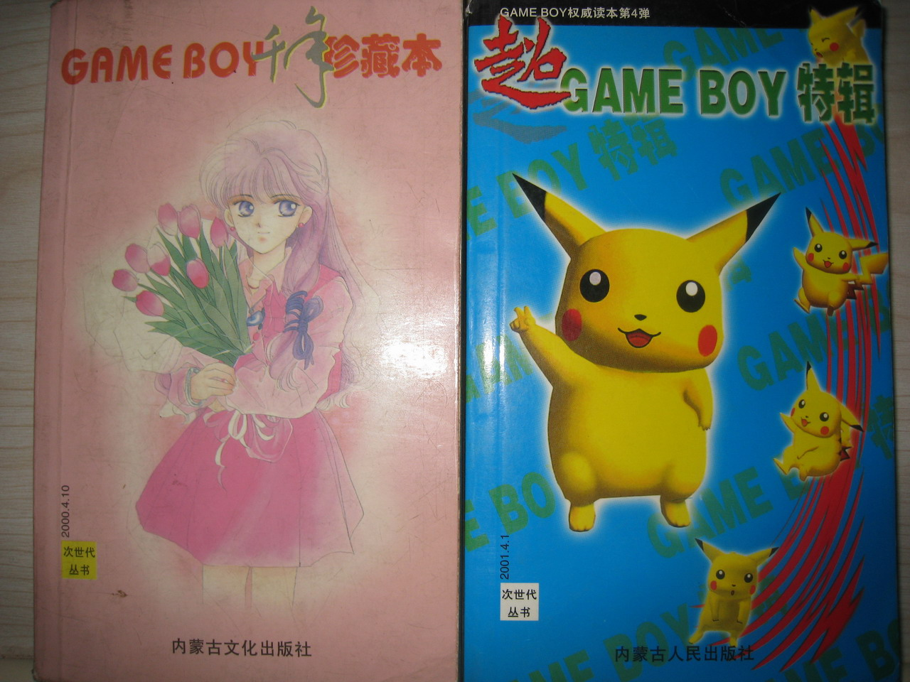

15.3本99版秘技宝典，是在中国医科大校门外面等丁丁出来吃饭无聊闲逛时在一个小书摊发现的，当即买下。3本一共50多，于是那顿只好可耻地让丁丁请了。
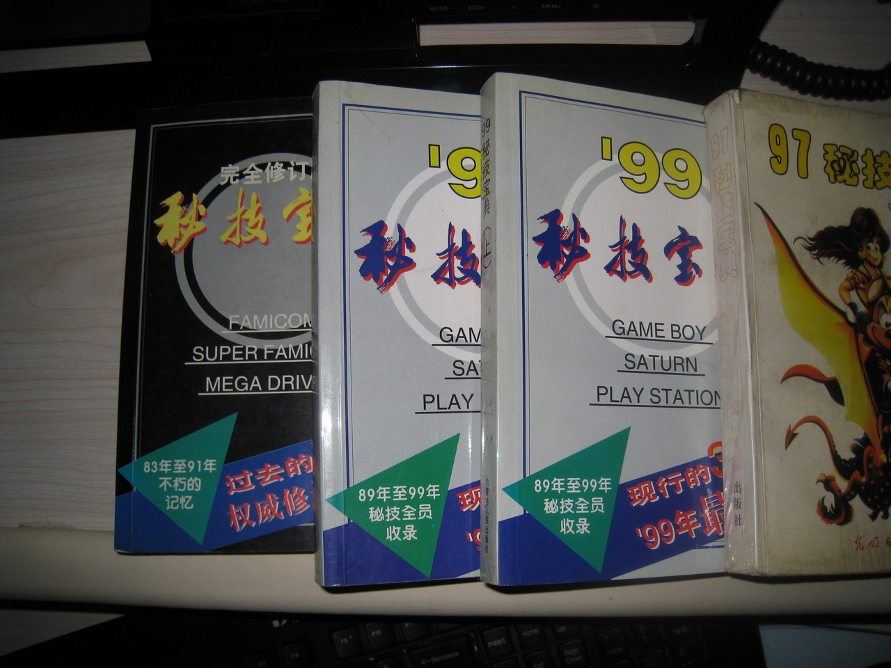

16.大钢读书品味一向不错，他对《游戏批评》的评价很高。
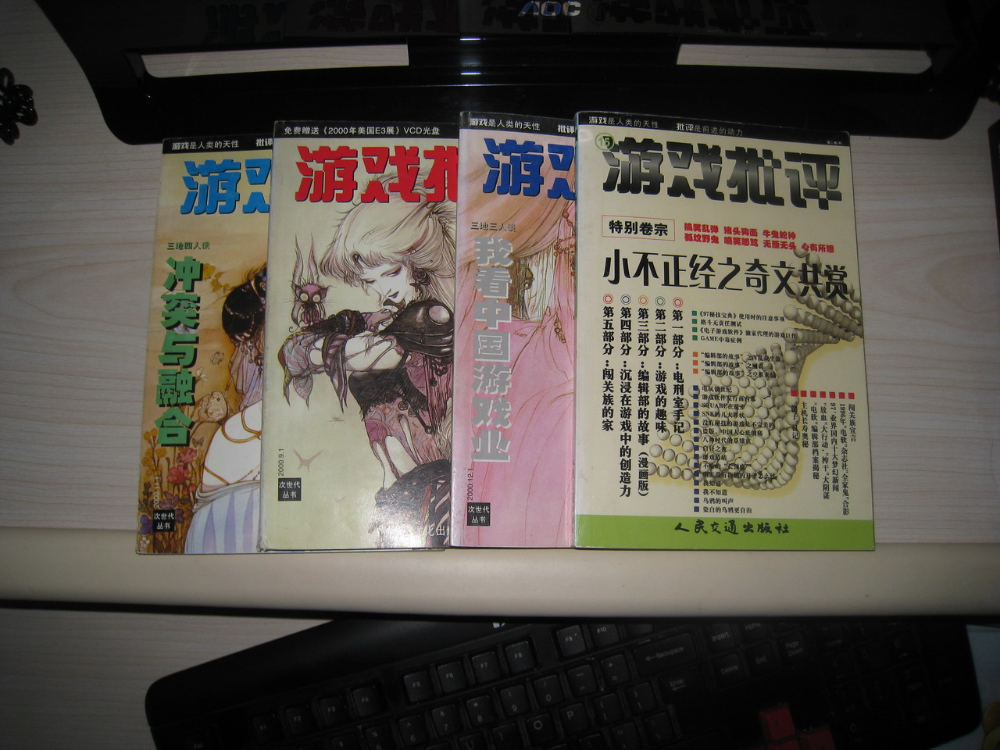

17.01年以后，发现跟杂志渐行渐远。老编辑逐渐淡出了。新编辑里，风林是个话痨，天师是个自大狂，新新编辑的什么莱茵简直是个白痴！于是只是出于习惯而继续着。终于，到了02年百期的时候，我想，是时候说再见了吧。03年开始，电软变成半月刊，再没买过。
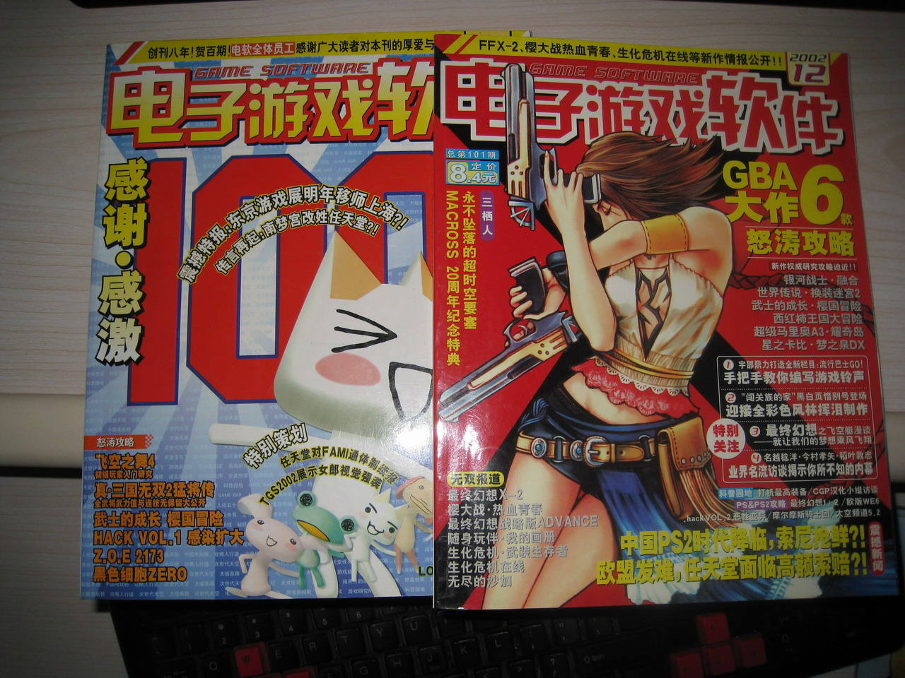

18.昨（前）天电软停刊了。我有很一些伤感。更多的，可能是我想念宝宝了吧。