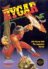

[阿尔戈斯战士](https://pewae.com/gaan/aHR0cHM6Ly93d3cuZG91YmFuLmNvbS9nYW1lLzI2NjMxMjg2Lw==)

原名：アルゴスの戦士 はちゃめちゃ大進撃 / Rygar别名：未来战士机种：FC厂商：TECMO类别：ACT发行年月：1987-04耗时：25

不算不知道,脱裤魔在FC上的有名的游戏作品还真不少.这个游戏最早是上初一的时候借来的一盘卡里面的.跟之前介绍的洛克人,热血硬派是同一合卡.其实,这几个游戏里面最先翻版的就是这个.
平常把它算作是ACT,但我觉得它已经具备了ARPG的特点.第一,主角的能力和血格都是可以升级的;第二,前面的关口得到不同的道具,而且还有隐藏的道具.

这个游戏还算蛮难的.最后一关如果没有带上隐藏血瓶,攒足足够的精神力,练满力量,想过关还真不是容易的事.好在这个游戏是无限续关的,只要有耐性,前面的关卡一定能过.至于后面的,就只能听天由命了–因为进了最后一关就出不去了.第一次翻版那天,是1994年的正月十七,打了整整6个小时…
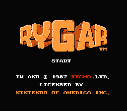

游戏的基本形式分横版和竖版两种
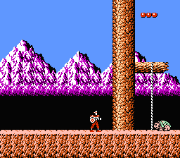
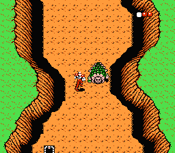
大多数道具是打败敌人得到的
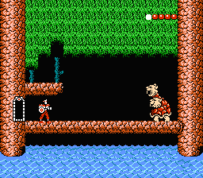
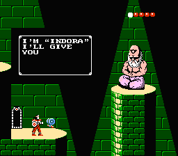

万事具备,只差血瓶.
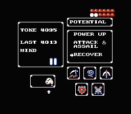

血瓶这个道具,必须在拣全了其余6样道具,并且血格涨满到12格的时候才可以在这个位置找到.
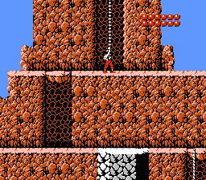
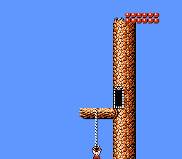
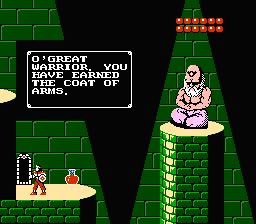

在这个位置使用”孔雀羽毛”就可以进入最后一关了
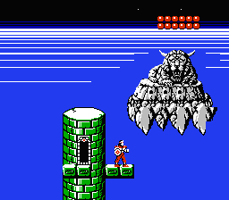
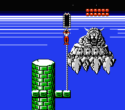

通关!!
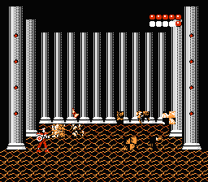
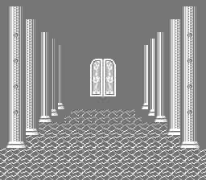
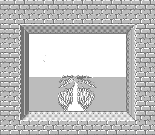