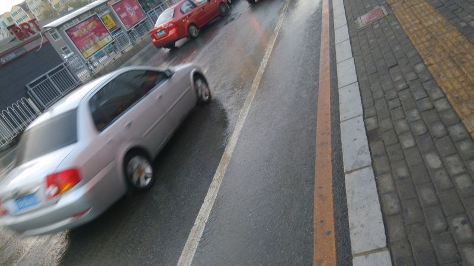
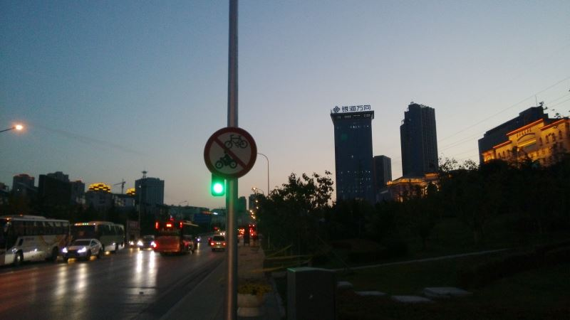
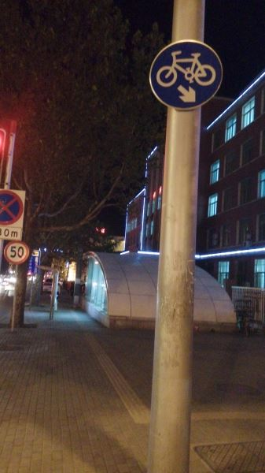

首先声明，我所说的情况针对的只是大连市市内四区（中山、西岗、沙河口、甘井子），另外的三区及北三市一县的情况我并不了解。

开始。
我大大连是个极度不适合骑自行车的城市。主要分自然和人文两个原因。

自然原因非常明显，先讲。
首当其冲的一点：大连是丘陵地形，地无三里平。没有重庆那么夸张，但上下坡多是非常不利于自行车出行的。以及，作为一个老牌殖民地，大连市的基础道路是老毛子和小鬼子做出的规划，并不遵守中国传统的方直平整的对称布局，而是欧式的中心广场辐射式，大部分原生主干道都一溜斜气，遇到小山包就是坡，稍陡一点的就会绕过去，就是弯。

其次就是天气原因：作为东北的最南端，我们是不好意思称自己的冬天冷的，但我们的冬天的那个风非常有性格——比我们风大的没我们潮，比我们潮的没我们风大。而且，这个城市一年里差不多有280天会刮4级以上的风。秋冬春三季，如果遇到顶风+上坡，那车骑起来可是爽得不要不要的。当年我妈就数落过我爸：“买个自行车还得搭件皮夹克”就是这么回事儿。

单单是自然因素的话还能克服，毕竟不是重庆。但下面要说的政策上的对自行车的杯葛行为就不是一般人能对付得了的了。某组织说人定胜天，就是说人为因素要比客观因素更可怕。
在大连骑车最大的问题是：没有自行车道！具体说来又有三种情况。
第一种是有车道，但是被划在机动车道边上。就随随便便划那么一条白色实线就算是自行车道了，心情好的时候有两米五宽，通常是一米，半米的也不是没见过。但不管多宽，跟机动车道都是没有物理分割的——也就是说，机动车想撞的话一点儿阻力都没有。事实上大连的机动车司机们最少70%并不知道这条白线的含义，十字路口右转车在自行车身后瞎吡吡的情况大有人在。这种还算是最好的情况，因为从理论上说，这是有自行车道。这种情况大约占市区道路的一半。

第二种是禁行。这个最好理解，就不多说了。大约有20%的道路自行车禁行。但是以大连市挥斥方猷的城市布局，如果两点之间是自行车禁行的，那么想绕路的话怕是要付出三倍以上的代价，还不能保证不违章。

第三种最坑爹。我还没在别的城市见过。这玩意儿叫“人行道推行”。就是说，这段路不是不让你过自行车，但是你也不能骑，只能在人行道上推过去。你要骑的话，撞了人就是全责。问题是现在大连市的人行道但凡能停下车的都停满了车，行人都被逼到机动车道上走路了，你推着个铁架子就更过不去了。这种也占了25%左右。

当然你非要在让推行或者禁行的路段骑车也没人管，但就没有法律保护了，理论上撞了活该。加之不管是哪种情况，自行车跟机动车都是没有隔离的，在机动车边上骑车都是与狼共舞，哪怕是从有自行车传统的城市过来的新大连人，也不敢造次。

除了路面上的问题，停车也是问题。在各个商业区，别说自行车棚了，就是栏杆都不好找。想骑车逛商（市）场似乎只有随身携带一途。例外的好像只有迪卡农——人本身就是卖自行车的。
所以，现状就是，骑车锻炼的还有小猫三两只，骑车代步上班的几乎就没有！
这么做也是有好处的。在近10年机动车车口大爆炸之前，大连的交通可谓井然有序，不仅自行车少，连踏板摩托、电动自行车之类的也非常少——人总归还是怕死的多。

最后说说历史轨迹。
在很久很久以前，大概35年前的80年代初吧，大连市的自行车保有量还蛮大的。有那么几个路口还是会出现百舸争流的壮观景象。那时大连的四排车以上的主干道旁边都是有专门的自行车道的。
我爹就是攒了很久的钱，于公元1984年买了一辆凤凰牌的大二八。
到了80年代中期，计委管得稍微松了一些，但凡100人以上规模的工厂都有了班车，效益稍好一点儿的还不止一台。我爹的二八前后没骑上两年，到86年他们厂就有了班车，他的二八就弃用了，闲置了一年后送给了我二姑父。
从80年代中后期到整个90年代，大连市的公共交通都搞得特别好，不是特偏僻的地方都有公交车通，所以，即使没有班车，选择自行车的也越来越少。高二班主任来自大城市铁岭，他就曾经盛赞：“大连的公交车，开得跟我们家那噶哒的救火车一样快。”

再往后就跟我们那个[著名的市长](https://pewae.com/2014/11/rumors-of-the-mayor-bo.html)有一丁点儿关系了。
随着个体经济的发展，好多路边上盖起了各式各样的板房简易房之类的临建，有的占人行道，有的占自行车道。三儿在93-95年展开了轰轰烈烈的“扒小房”行动。小房儿扒掉之后，原来是人行道的仍归行人，但如果下面是柏油底子的，则不声不响地都划成了机动车道。
再后来的交管路政部门有样学样，遇到交通堵塞需要扩道了，也不用大动干戈地搞动迁，直接把旁边的自行车道划成机动车道就齐活。于是到了新世纪，原来的自行车道就全部阵亡了。当时还有个政策，叫“修路不平坡，限制自行车”。

所以这骑车的人群呢，大概以90~93年为分水岭，这之前上中学的半大小子们，大多骑过家里的自行车。而这之后的呢，父辈的自行车早就马放南山，没碰过单车就再正常不过。
我刚上初一的时候，学校还是有自行车棚的。但是自行车棚是个危险的去处，初二初三的小混混们喜欢蹲在那儿抽烟。所以初一年级也只有混混们才敢到车棚停车——我们班只有两个人骑车上学。到初二这俩家伙也不骑了。一个是嫌冷，另一个是因为不安全。我们初二就开始补课，每天七点半放学，对于中学生来说确实稍微有点晚——可你一个女混子还怕黑？
估计其它的学校也差不多。到了高中就没有自行车棚了——高中必经的主干道就是一会儿有车道，一会儿让推行的那种路。学校出于安全角度，强调不准骑车上学。

所以上次说的大连市我这个年龄段的基本不会骑自行车，并不是特指80~83的这批人，而是从我这个年龄开始往后的，八成不会骑自行车。
可能在高校校园附近长大的例外。