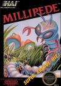
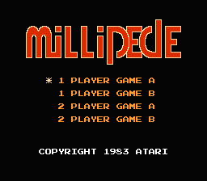
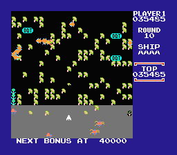
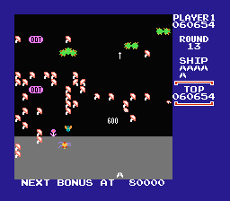
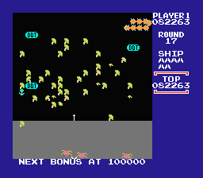

[杀虫大战](https://pewae.com/gaan/aHR0cHM6Ly93d3cuZG91YmFuLmNvbS9nYW1lLzM1MDY4NDM4Lw==)

原名：ミリピード 巨大昆虫の逆襲别名：毛毛虫机种：FC厂商：HAL类别：STG发行年月：1987-10耗时：0.5

首先要特别感谢秦大少。正是他在给我的回复中提到了一句“千足虫”让我脑洞大开进入刨根问底强迫症模式：
“千足虫就是马陆吧”
“跟蜈蚣有区别吧”
“蜈蚣是centipede（才重温人体蜈蚣，印象深刻），那么马陆怎么拼”
“查到了，马陆是Millipede啊”
“小时候第一个玩的FC游戏里会不会有这个单词呢？毕竟跟毛毛虫很像啊！”
然后就内牛满面地找到了正确答案。

这个游戏并不如何出色。但它是我20多年来一直在找的第一次花钱玩FC游戏时接触的[第一个游戏](https://pewae.com/2013/07/bonds-with-nes.html)，意义非凡。

查了一下wiki，本作《千足虫》是《蜈蚣》的续集（庐山瀑布寒），是ATARI街机上的名作，用轨迹球+一个按键来玩的。后来，任天堂的第二方HAL拿到了授权，移植到了红白机上。

游戏是典型的雅达利早期风格。每关开始，一只千足虫会从屏幕的顶端往下爬，遇到小蘑菇就会转向。玩家控制的飞船发射子弹消灭虫子，每节被打掉的虫子都会变成蘑菇。而蘑菇需要若干枪才能打掉。当时的画面条件下，实在很难分清马陆还是蜈蚣还是蚯蚓还是草鞋底子还是海蛆。所以我玩的那盘合卡里港译成“毛毛虫”也没啥大错误。只是想不到一个不准确的翻译，导致我找了它20多年。
除了毛毛虫，还有各种捣乱的其他虫子：打到后另所有虫子减速的尺蠖（妈蛋，不查wiki谁能认出来！）；一直在玩家区域跳来跳去可以吃掉蘑菇的蜘蛛；爬得很慢但如果碰到蘑菇会把蘑菇变成不可消除状态小花的甲虫；飞着下来速度奇快的蜻蜓和蚊子……

尽管有这么多设置，游戏还是一个字：不好玩。早期游戏的循环模式，八关之后颜色重置敌人数量增加。连个过场交待都没有。
昨晚在家玩的感觉就是，第一次玩游戏的我能坚持到第四关太不容易了。模拟器上用SL大法也只是坚持到了22关。