2月25号吧，按照 @S̆̈ 给的攻略，进城浏览一番无锡景。

没到8点，吃完酒店自助早餐就按照导航规划的路线，到某公交车站等车。当天气温还可以，10度上下，有点小风。在站牌底下站了5分钟以后才想起来去看一下站牌，果然不愧是开发区，公交车半小时一辆。再一想就算车来了我也一没零钱二不清楚APP的，这公交也没法坐。还是软件打车去了导航指示的地铁站。这里犯糊涂了，既然打车，就应该去最近的地铁站，白白损失了4块钱。

目标是早就确定了的惠山古镇。好找得很，出地铁站一目了然。出了地铁站就关掉了导航，信马由缰地逛，不然多没意思啊。
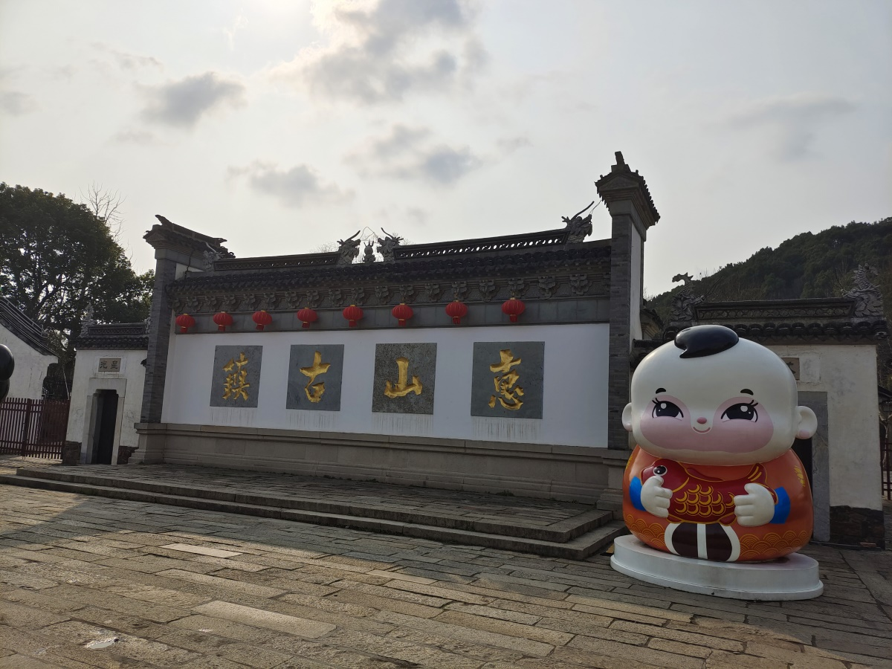

到的时候9点多点儿。游人和商家都没到达峰值。虽说全国的古镇都差不多，但无锡这边一个有特色的地方是宗祠。大约是谁家祖上出过省部级的高官，然后家族又逐渐传承了下来，就找块好地方供宗谱。对，你说作为一个景点，展示的物品是劳什子宗谱，有啥意思啊。恁家出过多少大人物跟我一游客有什么关系啊？
宗祠名人里只听说过范仲淹，另外还有一个张巡（庙），其余的看完介绍都不知道是谁，后面索性不进了。
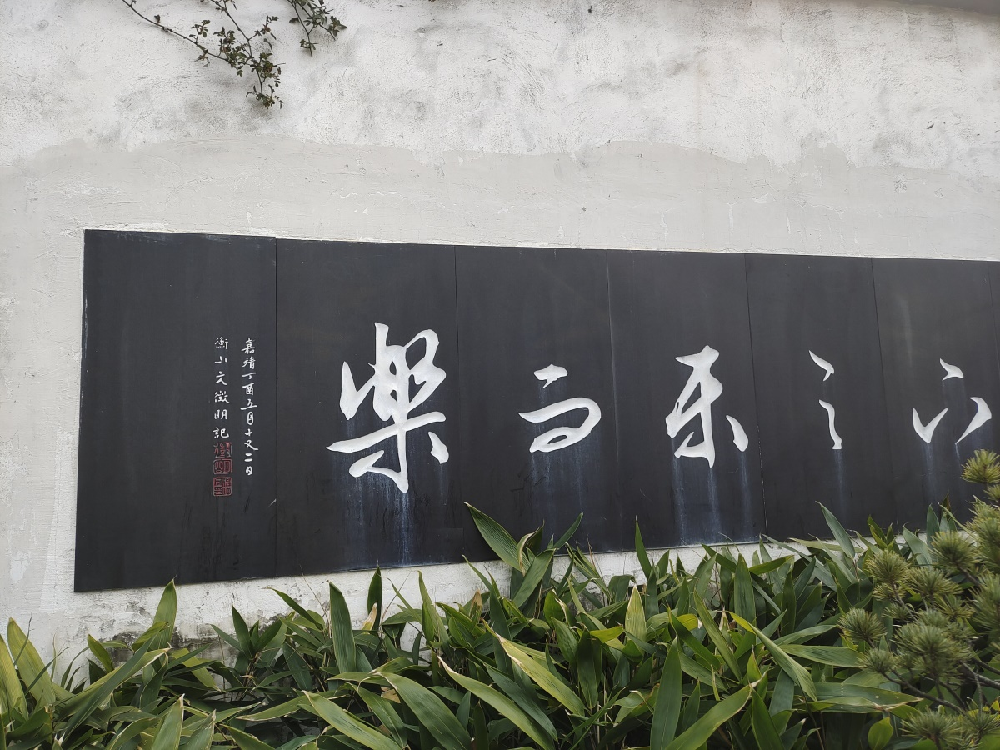

古镇里还有一个比较有趣的去处，是东岳行庙。东岳大帝是黄飞虎没什么问题，问题是两边的壁画上，武成王大人除了飞彪飞豹又多出了两个兄弟。而下一辈除了天化天祥天禄天爵也多出了一位。这下可把熟读《封神演义》以及各种衍生作品的我给整不会了。看门边的东岳大帝生平简介后才恍然大悟，这是为了把两辈都硬凑成“五子登科”。
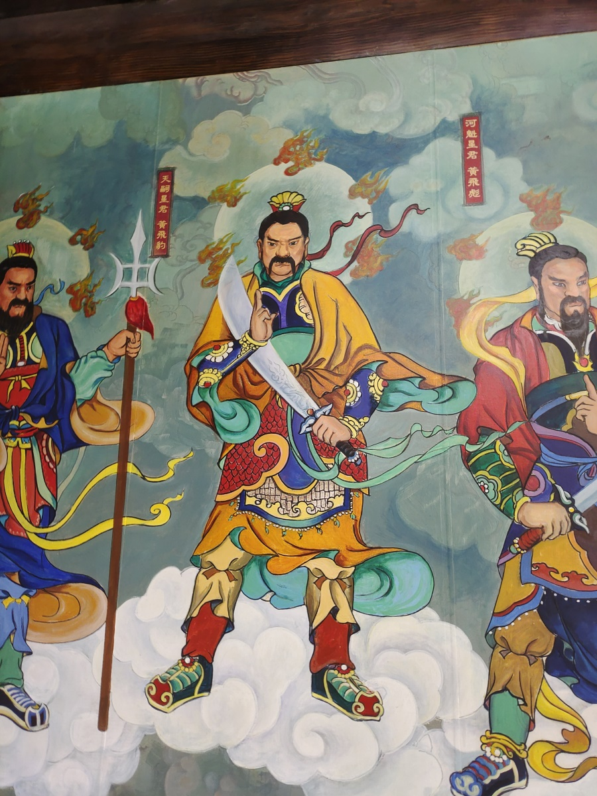

无锡这边的贡品也有看不明白的：为啥要有油啊。有油就有油吧，一大桶就一大桶吧，连盖子都不打开算怎么回事啊？难道不是贡品，而是摆在那里为了开光？
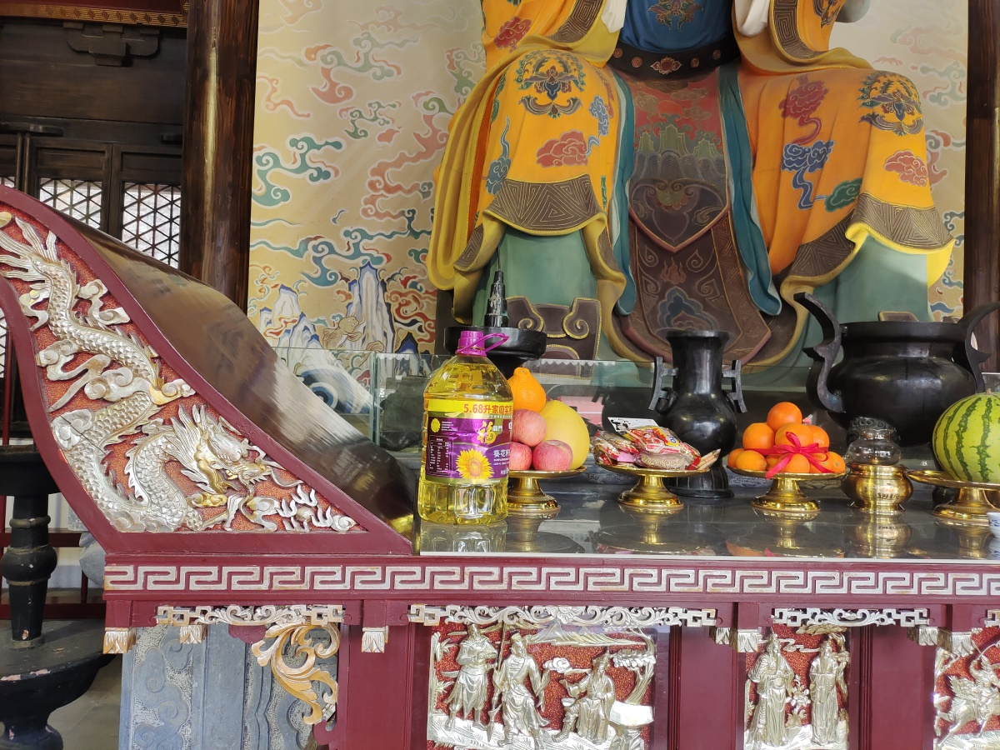

庙门口的花灯，二月二都过了，仍旧是虎年的……
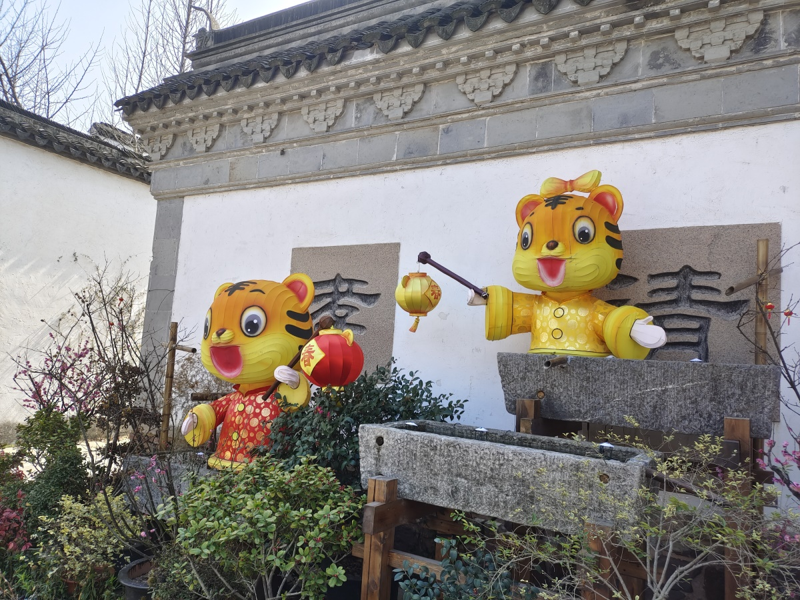

商铺里卖的东西没什么吸引力。特产好像是泥人，家里养猫我买这玩意儿干嘛。特产吃食是一种叫“油赞子”的东西。远远看着跟炸丸子差别不大，凑近了看——每家店的油味儿都很冲，我根本就没有凑近了看的心思！反正闻了就不想吃。哪怕用开了光的油也不行！

古镇的尽头是锡惠公园。售票处里贩卖机排大长队，窗口却没几个人。对我来说公园本身吸引力不大，说好的不爬山不拜庙，这公园却是左手山右手庙。公园里唯一吸引我的地方是一家名为“王兴记”馄饨。

进门之后逆时针前行不远，便是登山的路径。山脚下有个亭子，跟各地的公园一样，聚集了一堆中老年音乐爱好者。有块牌子，写着700多米。700米山路，对膝盖很不友好了。但来都来了，还是往上走了一小段。这山路的旁边应该是有涧水的，但季节不对，就很无聊。再说那个700米一旦不是路程而是海拔怎么办？虽然我不信无锡这么平的地方会有700米的山。
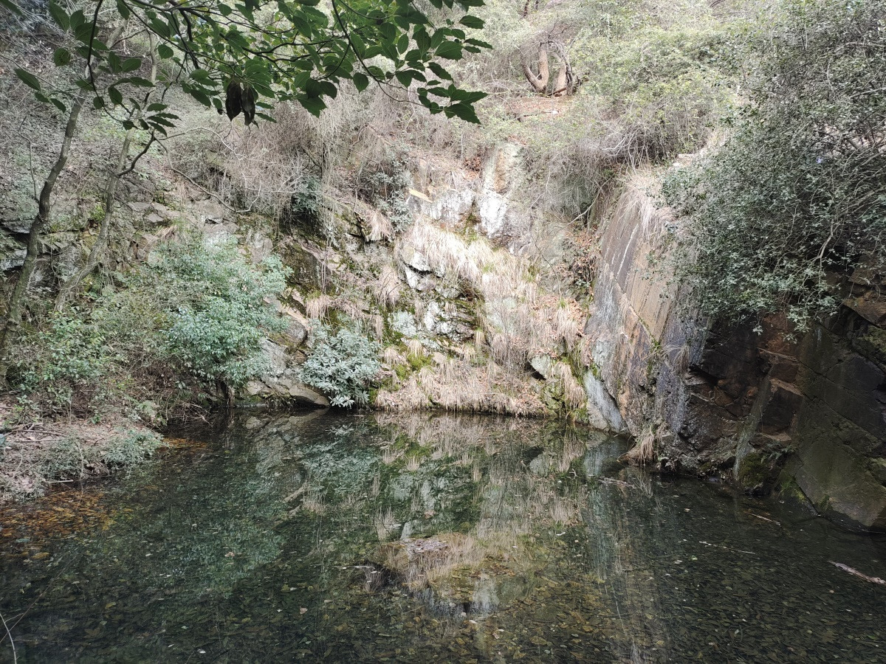

立刻回头，继续前行找馄饨铺才是正经事。这天天气对于逛公园来说不是很友好，穿外套热，脱外套有风。春未暖花只有玉兰开的季节，能看的景致不多。一路走到另一头的门，也没看到馄饨铺。往回走看到一扇盗版九龙壁。都说画龙点睛，这里的龙眼睛做得极别扭，一只二只像得了甲亢似的。近前一看，是什么陶瓷厂80年代的作品。
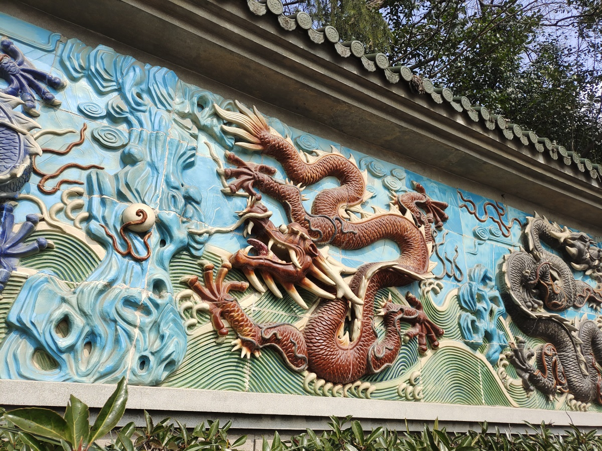

再往前就是庙。而且是山上的庙，敬谢不敏。转头看向另一边，能看到登山的索道。怎么看也不像700米就能登顶的样子。觉得自己放弃得好明智 。
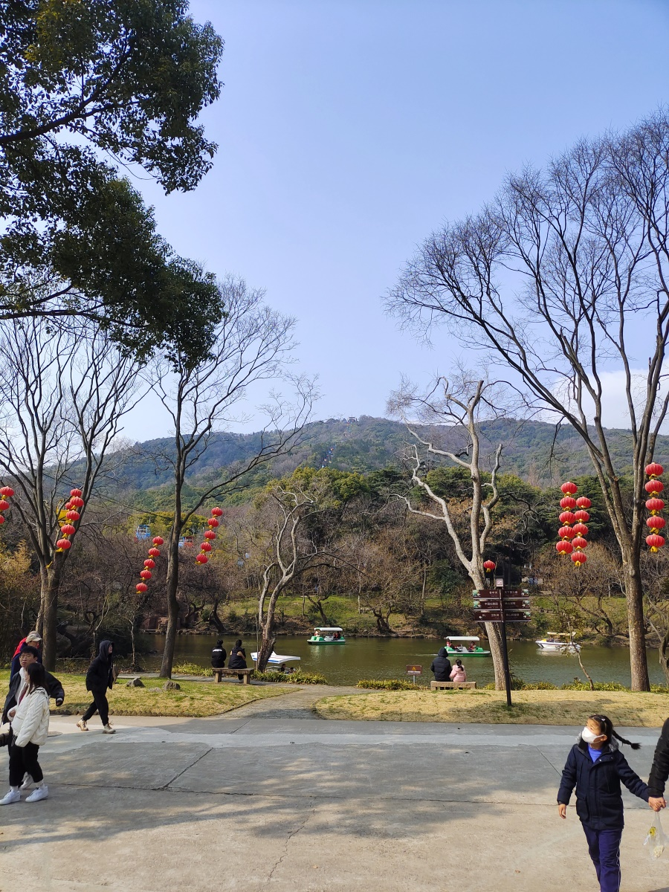

一圈转回大门，门口卖油赞子的店已然排了大长队。开导航找馄饨店，不然不白来了么。我艹，竟然就在一进门的右手边，也就是说，就在我刚进门的时候直接忽略的身后。
荠菜馄饨名不虚传，爽滑清香。肉馅小笼包有点甜。而且小笼包一口下去，汤嗞胸口上了。也好，绝了我脱外套的念头。
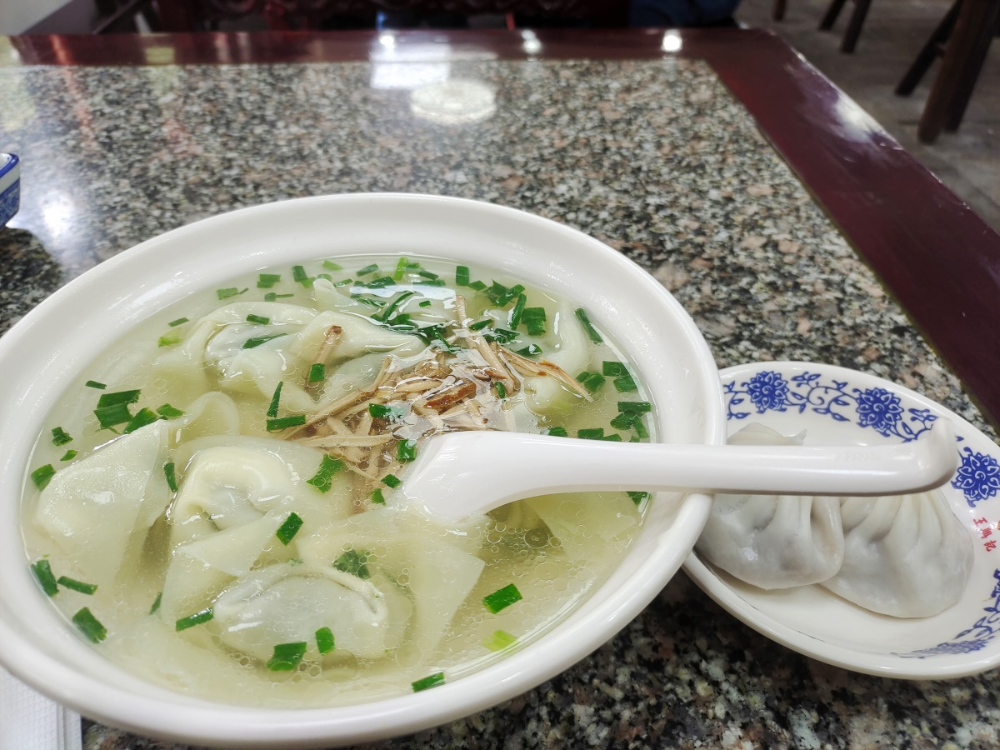

出锡惠公园，进寄畅园。江南园林果然都是极好的，但不常年住里面，走马观花的也就那样。旁边惠山寺，大写的不感兴趣。天井里有乾隆写的碑，字不好评价，诗是真不咋地。
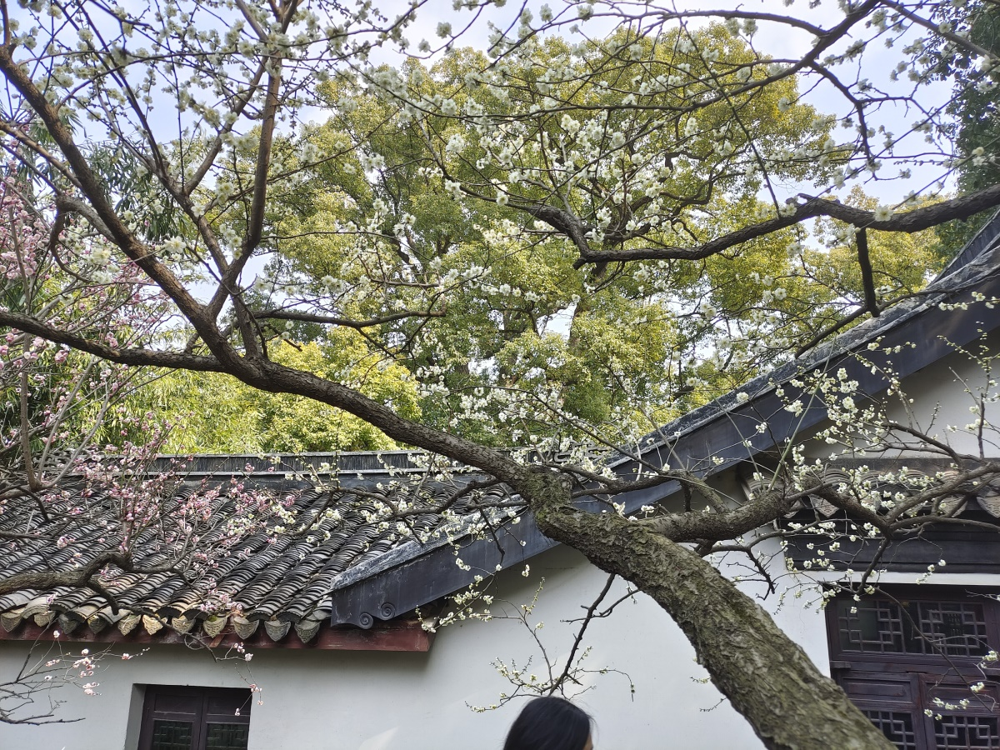

看时间尚早，索性把无锡同事推荐的南长街也给逛了。
这南长街的第一眼就挺失望。就是一路仿古的小吃街嘛。可从小我妈就不让我走路的时候吃东西，所以我对于这种地方本能上就是抗拒的。除了小吃店，可逛的店就不多了。卖上世纪风格零食的店有四五家，可一来主要是卖糖，二来内容似是而非，根本也不是我小时候见过吃过的东西，只进了头两家就失了兴趣。
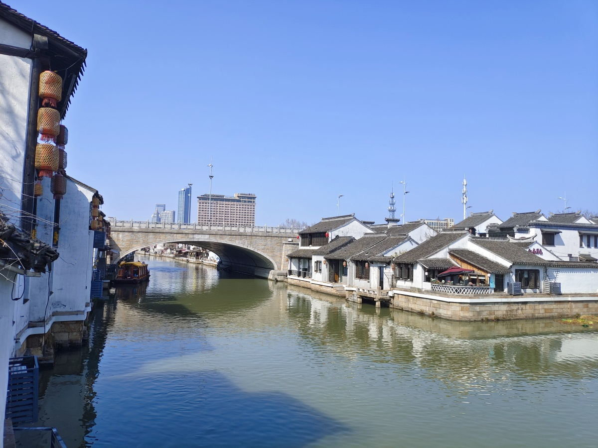

公司不成文规矩，从外地返回时要带お土産的。我甚至做好了在这里被宰一刀的心理准备。然而真没什么可买的，失望。

一路走到清名桥。这地方还挺有意思。主要是桥边的那段运河的样子有些既视感，似乎小时候假期没有台可换硬头皮看《话说运河》的片头或者片尾里出现过，而且三十几年样子没怎么变。来无锡前真没想到无锡会把运河当卖点。毕竟04年出差杭州的时候，每天午后消食就在大运河起点那里转悠，除了块碑也没见玩这么多花活。当然20年过去了，杭州现在啥样咱也说不好。
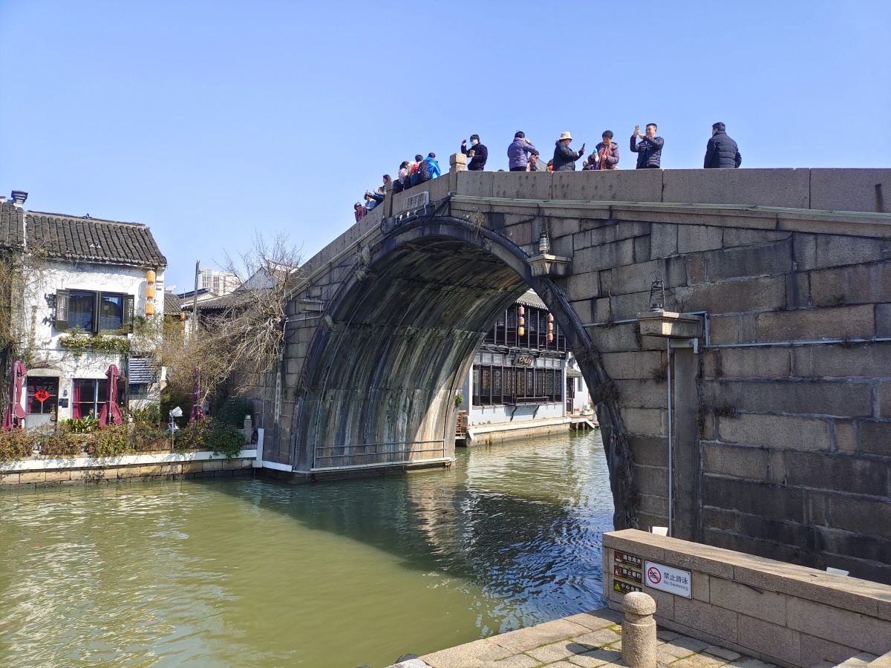

不知是疫情影响还是招商本就不利，过了清名桥就没什么光景了。无锡之行就此结束。