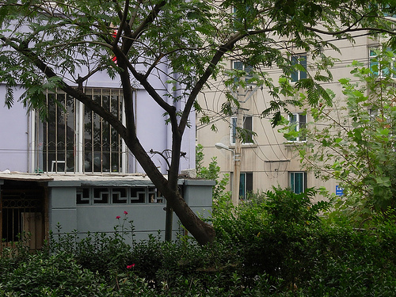

我又一次站在文星街的马路上。

3P家旁边的125号楼的挡土墙上，一阵响动。钻出一个老太太。戴了个红袖箍。
这个老太太我认识，是原来楼上邻居陈平学长的奶奶。二十二年前，我每天都要跟在陈平的屁股后面去上学。

二十多年了，她怎么还没死？

她朝我招了招手。示意我跟着她走。
于是我就跟上了。从塌下来形成的洞里进入，是125号楼的内部。穿过了一个类似生化危机2里的小教堂，从角门里出去，到了145号楼边上。“啊！怎么没感觉到上坡啊，这条路真神奇！”
陈奶奶没搭理我。

只是示意我跟上另外一个人。
这个人也认识，是3P家楼下福利厂里的工人，右手只有两只手指头的那个。“大叔你好啊！”
说完我就后悔了。我忘记了那次火灾过后，他连嗓子也一起烧坏了，不能讲话的。
他领着我进了145号楼一楼靠上楼楼梯的那个门里。出了门是个院子，出了院子又是个门，再进去是一家养了狗的人家。从窗户跳出去之后，是一片浓密的小树林。很眼熟。是我们的“基地”！

第三个人出现了。他往地上一跺，出现了一个暖气井。往下一跳，我发出了“啊～～～”的怪叫声。

落地已经是兰兰同学家开的驴肉包子铺里了。
阿姨热情地说：“来了啊！赶紧坐。给我6块钱。”
我奇怪地问：“为什么你跟别人都只要一块五？”
“因为你不守规矩。带你来的时候，你在三个人面前都发出了声音。带路服务5毛，咨询就是两块了。”

“可是，第一我没想吃饭；第二要吃也不一定吃包子；第三你的包子铺我认识，不用别人带；第四我问的问题那几个人也没回答啊！”
“想吃包子，不吃点亏怎么行！”

于是我吃光了她饭店里所有的蒜头。