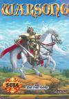

[梦幻模拟战](https://pewae.com/gaan/aHR0cHM6Ly93d3cuZG91YmFuLmNvbS9nYW1lLzEwNzkzOTk5Lw==)

原名：Warsong机种：MD厂商：Masaya类别：SLG发行年月：1991-04耗时：15

秘技：
1.音乐测试。在小地图坐标2，2处长按B。
2.选关。在大地图坐标2，2处长按B。不过选关后所有角色等级清零……
3.获得所有道具。在兵士配置画面长按左上及AB，听到效果音即可。这时可以获得除兰古瑞萨外的所有道具，并且金币数清零。

虽然二代通关了不下十五遍，这次要介绍的是一代。Again。
我也没想到间隔时间这么短就又选了一个神作二代的前作出来。只能怪W开头的好游戏也不多了。
而且这次同样选的是美版。说起来Warsong这个名字简单明快，窃以为比日版不知所云的“兰古瑞萨”要好。何况小鬼子还发不出瑞的音。
MD版的二是当之无愧的神作，一就黯淡了许多，算是水准之上的中规中举的战棋类作品吧。
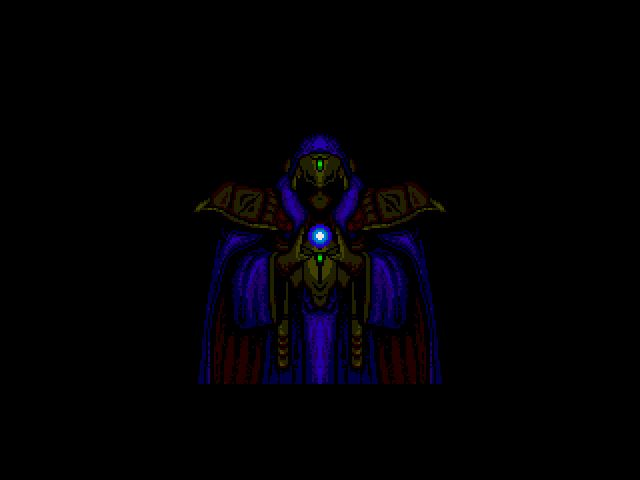
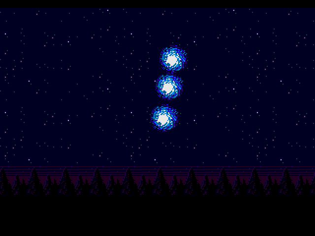
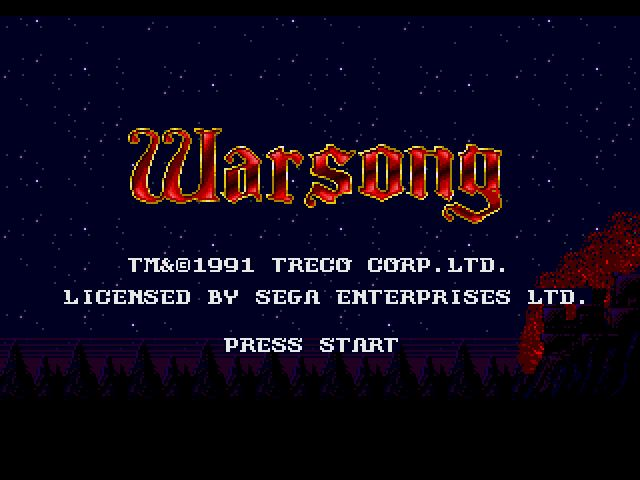

一登场就是一场围城战。所有的角色差不多一下就到齐了。
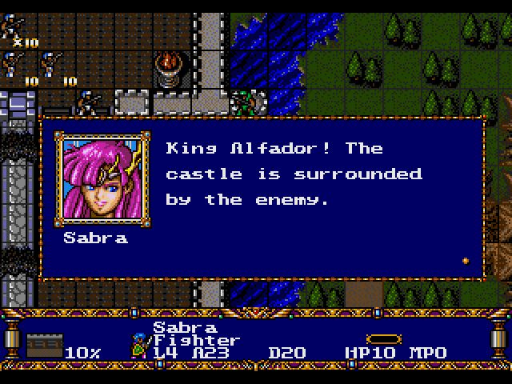
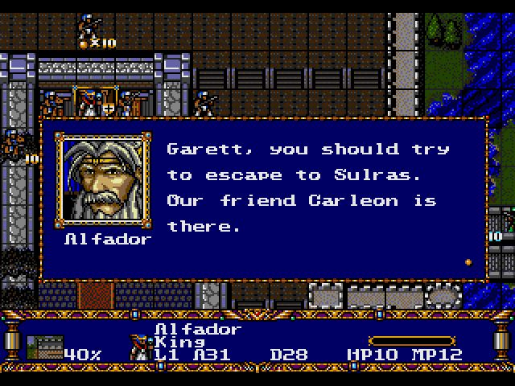
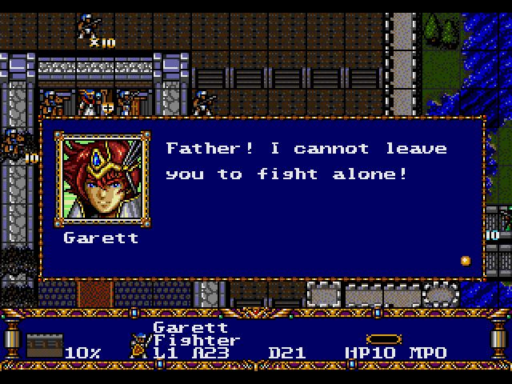
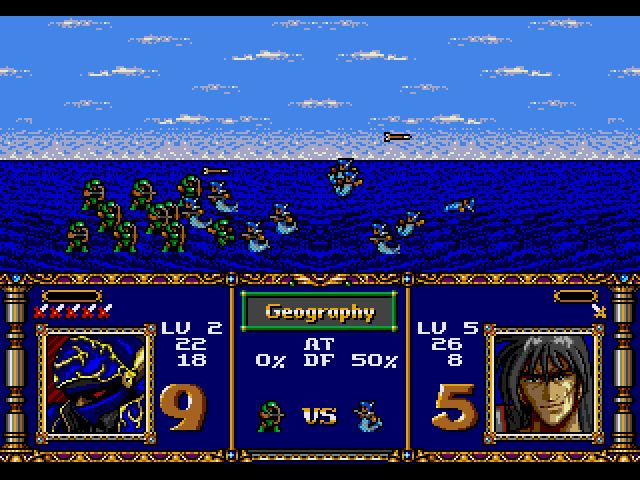

地图画面对于玩过2的来说也没什么差别。
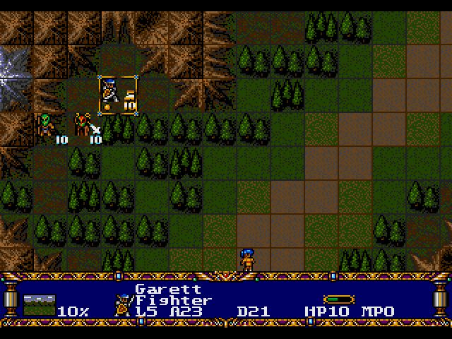

转职。
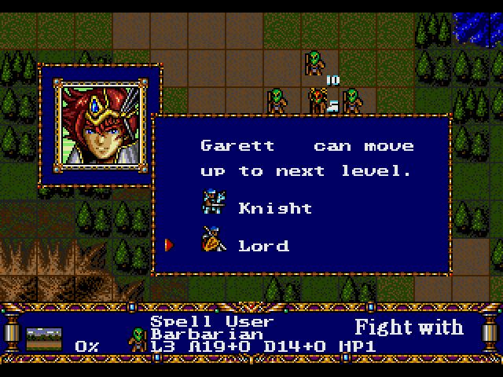
二的魅力泰半落在转职上。一代大多数角色只能转职两次。而且魔法职业跟战斗职业分得很开，战斗职业几乎学不会什么魔法。唯一有隐藏职业的是女主（就是上面那个粉色头发的），转职魔法骑士升满后有隐藏职业“突击队长”。

一直活跃到二代的杰西卡。相貌几乎没变化。
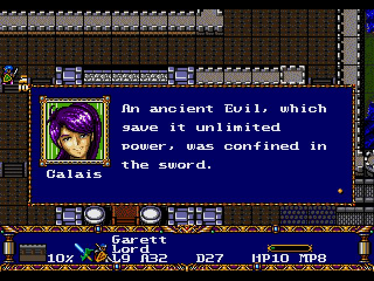

一代也有一个非常帅的反派。名字叫兰斯😅
不过他不像二代MD版的利昂，被救之后加入了。然后最后一战之前又跑了。所以，千万不要练他！还有第一关出现的大叔，没多久就会挂掉，也千万不要练他！
还有一个小tip，每关介绍的画面，如果出现的敌人部队数目小于8支，十之八九是有增援部队的。在这样的关卡千万要收着打，等增援部队出来后再过关赚钱赚经验。
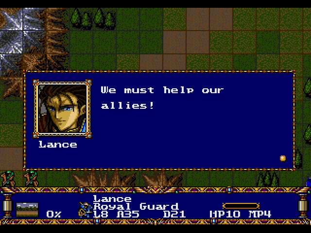
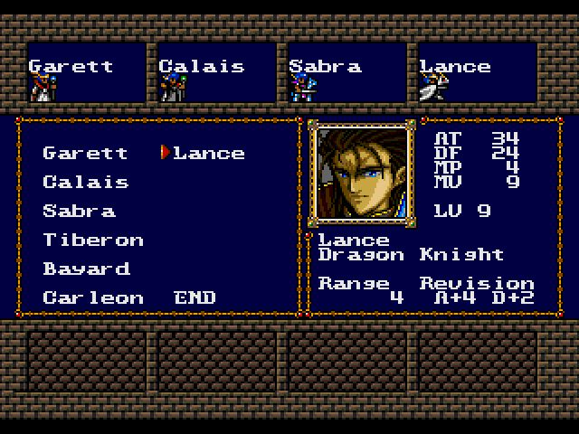

第十五关的龙，非常难对付。
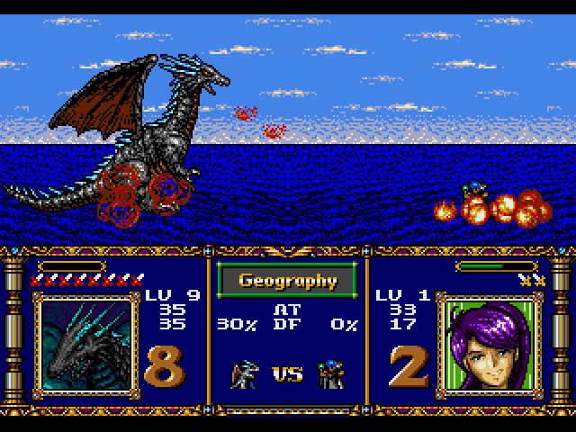

第十九关的指挥官，非常讨厌——小兵很强但自己是个饼才。只能用魔法对付。
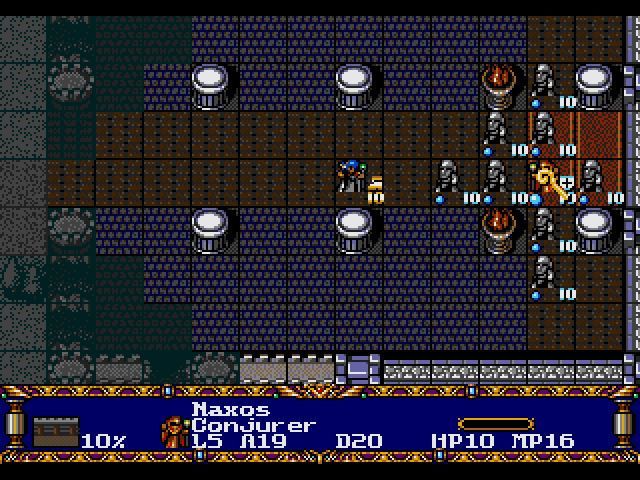

一代升LV的时候是不涨攻防的，所以主角到最后一关就只能是这个熊样了。跟二代动辄99简直无法同日而语。
同样，我的杰西卡最后只学会了三样魔法，而且这三样对最终boss还是无效的。
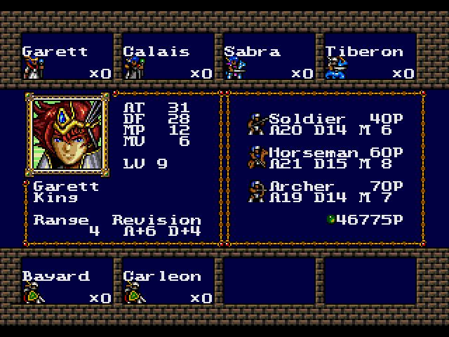
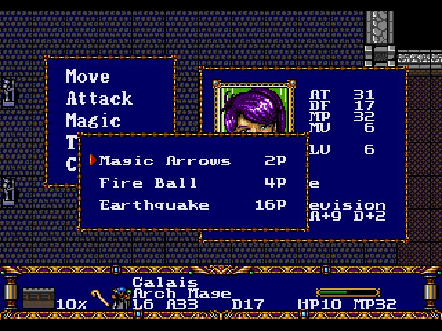

中boss是老熟人。对了，最后一关敌人行动时候的音乐很好听。
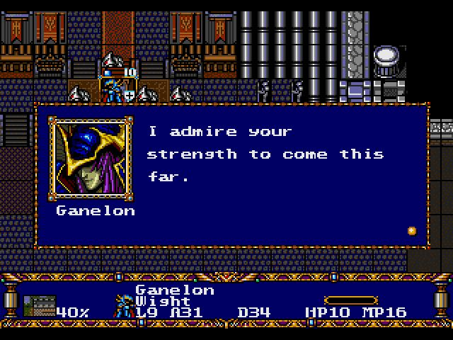

最终boss的名字我好喜欢。
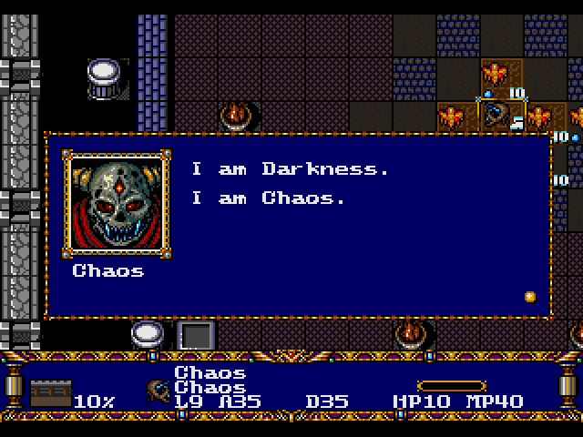
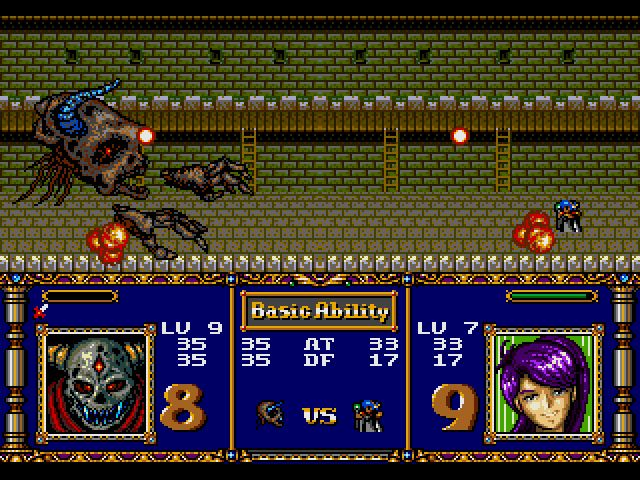

打完之后照例要聊两句。
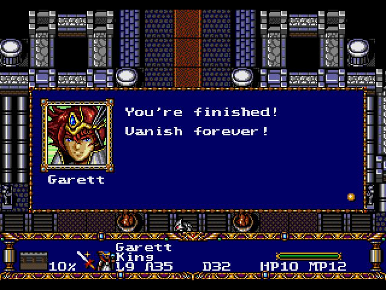
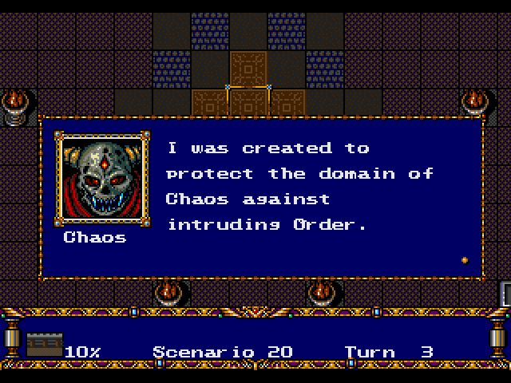

邪恶的敌人被推倒了。
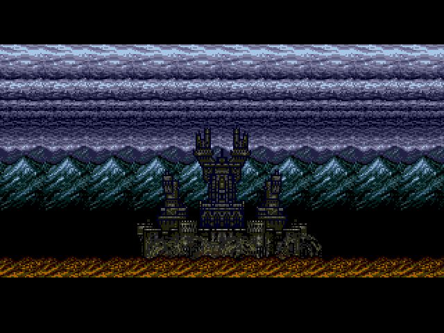
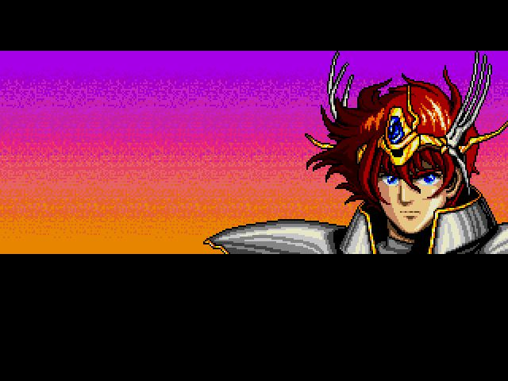

交待各个角色的下场也是梦战系列的传统。
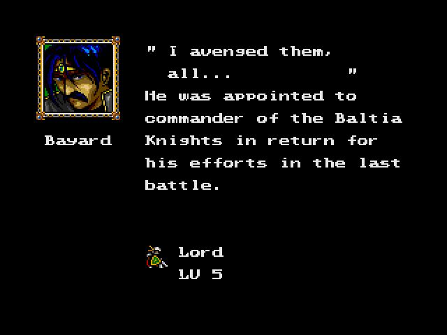
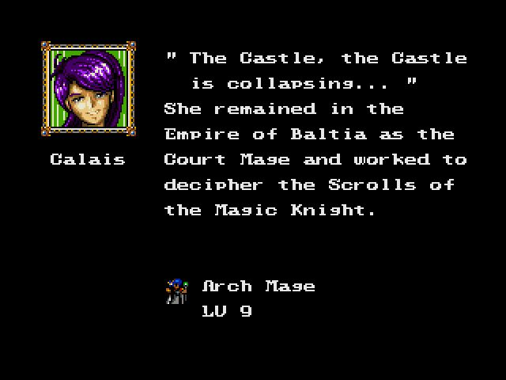
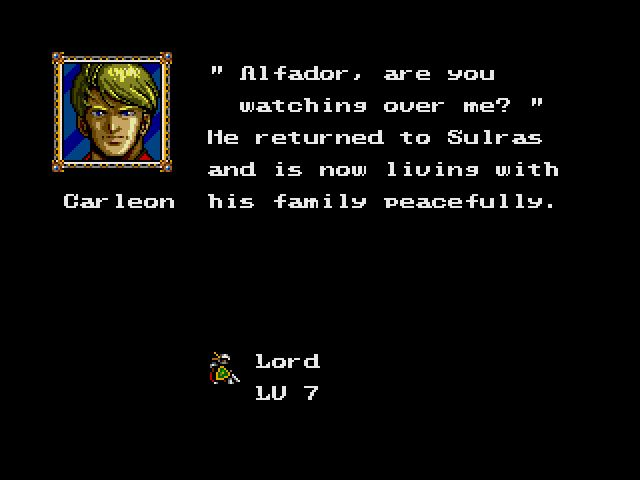
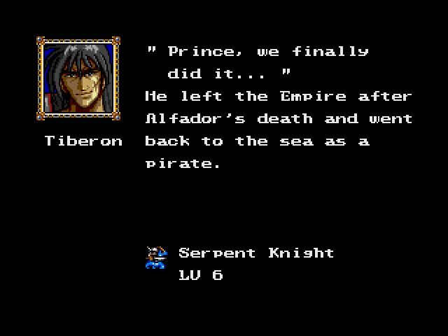
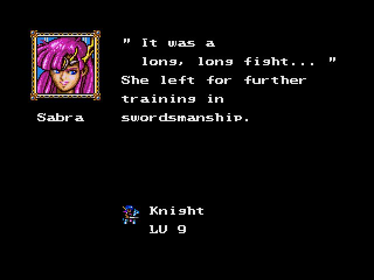
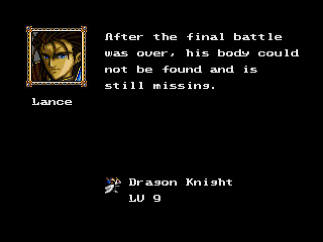
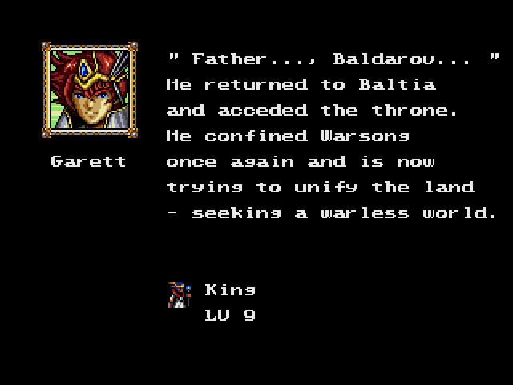
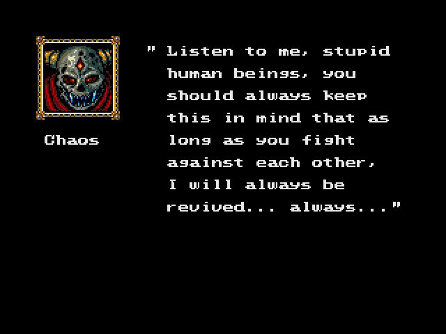

通关。
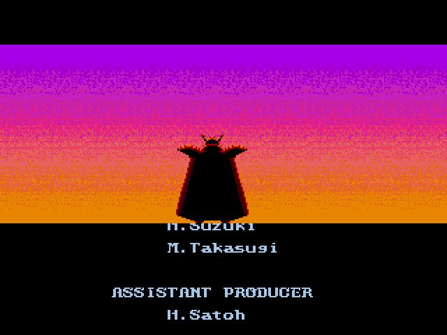