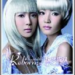
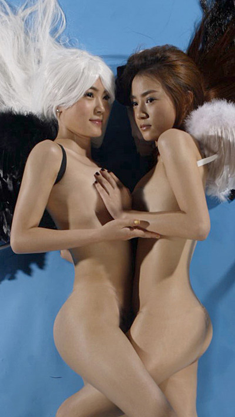

[快乐成双](https://pewae.com/gaan/aHR0cHM6Ly9tdXNpYy5kb3ViYW4uY29tL3N1YmplY3QvMjEzMjc1NQ==)

音乐家：Reborn风格：流行地区：中国大陆发行年月：2007-06

“超女Reborn化身全裸天使 光滑玉体丝般呈现”.

虽说俺总是对外宣称不看超女,但是多多少少还是知道一点的.去年的某个时间俺换台的时候(大家要知道在大连是没有湖南卫视的),偶然瞅了一眼,什么几进几的.唯一记住的就是这个reborn组合.
原因有三:
1.所有出场中长得最漂亮
2.所有出场中歌唱的最差
3.所有出场中唯一不是一个人出列的.

有评论说这是天娱在为这两人即将出的专辑造势.俺十分相信这是真的,是阳谋.但是这对于俺作为一个voice collector不去屌她们来说不会产生任何影响.俺可不相信那两只破嗓子能冒出什么好声音来.

只是天娱的这个策划实在太有才了.怀疑他是不是跟俺一样混豆瓣3.16小组的?