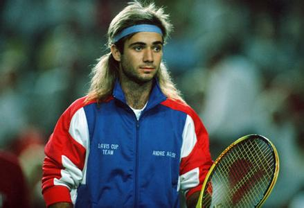

俺一向不认为自己比别人聪明,俺能够想到的题目,记者们也都能想到.他们之所以没用,可能是觉得时候未到吧.
可是阿加西真的是要退役了.随着温网的结束,他只剩最后一次大满贯了.
是的,他没老桑那么雄霸天下,大满贯冠军数也很可能会被费天王超过,甚至当年在亚洲受欢迎的程度也不如小黄脸的张德培.
但是俺就是喜欢这个亚美尼亚人的后裔.尽管他有点恋母,尽管他一点不给中国(上海)面子.

没有阿加西的日子,我还会关注网球么?