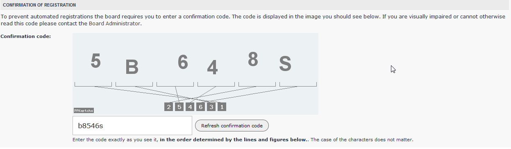

我的VPS上装的是比较没那么流行的vsetaCP。因为装svn服务的时候遇到了问题，就想上官方论坛上求助。
万万没想到，该论坛的验证码是这个样子的。由于根本没往阅读理解的方面想，导致三次全错，被禁止提交15分钟。

这个验证码在我看来，跟在一堆蔡依林里找凤姐是难分轩轾的操蛋啊。你说你一个毛子产品，为毛让人做英文的阅读理解啊？
问题挂了半个月了也没人回答，这毛子做的系统就是不可靠，吃枣药丸啊！全中国不会只有我和被我忽悠的那谁用这个面板吧……

周日带孩子上课，在外面等的时候忽然接到一个电话。
对方很有礼貌：“您好，我是XXX派出所的外勤民警XXX，请问您是XX街XX号X-X的居民吗？”
我第一反应是，难道又把楼下淹了？？
——“是”
——“我和街道的人上你家敲门好几次了，都没人开门。请问您和您父亲现在还住在那儿吗？”
——“没有。”
——“那么房子是租出去了吗？”
——“不。空的。”
——“请问窗户关了吗？你们这几天，礼拜三之前，会回去吗？”
——“关的。不会回去。”
——“那没事了。你要是回去的话，记得南边靠疏港路的窗千万不要开。有任务。”
——“跟达沃斯一样呗？”
——“比那个要求还要严。记得如果分局打电话给你确认的话，一定要说我们通知到了。还有，这就是口头跟居民商量，没有文件。”
[相关阅读](https://pewae.com/2017/06/fucking-summer-davos-3.html)
从舞蹈班出来，发现外面已经赌了个水泄不通，警车把十字路口的两个方向完全拦住，警察大约15米一个……
周一据说比周日还要严。
之前只是听说有个胖子要来看航模，没想到另一个胖子也会来。
反正这三天，协弃市的交通被两个胖子搅和得稀碎。

最近几天，白天的气温都是20度，捂这么严实也不知道某宝有没有同款痱子粉卖。

五一上班的第一天回家忽然脑热，看着avast!弹出的优惠消息心动不已。这玩意儿挺不错的，过去的10年也没在它身上花过钱，还挺愧疚的，于是咵咵地下单买了三年的VPN。
确认邮件收完，输入序列号后怎么也连不上。
换专门的客户端也不行。
忐忑之下点了退款——广告上承诺任何产品15天内不满意都可以退款。
退款理由是产品不合格。
一个工作日之后钱就给退回来了。回信是“China :(”
连个墙都对付不了，这安全软件的技术实力甚是堪忧啊。
一点儿也不觉得愧疚了。

公司HR大头目昨天分批紧急跟每个员工面对面沟通，解释这个月工资延发的事儿。
原因很操蛋——我们P记每年3-6月都会现金流紧张，都是靠跟银行贷款发工资的，到下半年钱收上来了再把贷款还了。但是今年国家下令银行不准给HH旗下任何企业发放贷款。
也就是说，16年P记选择去抱HH大腿，不仅没吃着羊肉，还惹了一身骚。简直蠢到49年投老蒋。也不知道能不能自己把自己赎出来。
P记高层这O那O的，平时都不看推特的吗？尤其CEO，还是个新加坡人！
对于我们这种老员工来说，很懊丧——我待了马上15年了，头一回遇到发不出工资这种事儿，尤其是这种无妄之灾。
对于新员工来说，比较惶恐，因为他们总觉得之前P记是因为不赚钱才会卖身的。
还有一批老员工，既懊丧又惶恐。
——CFO说，HH内部认购的那个理财产品，很大可能连本都保不了了。