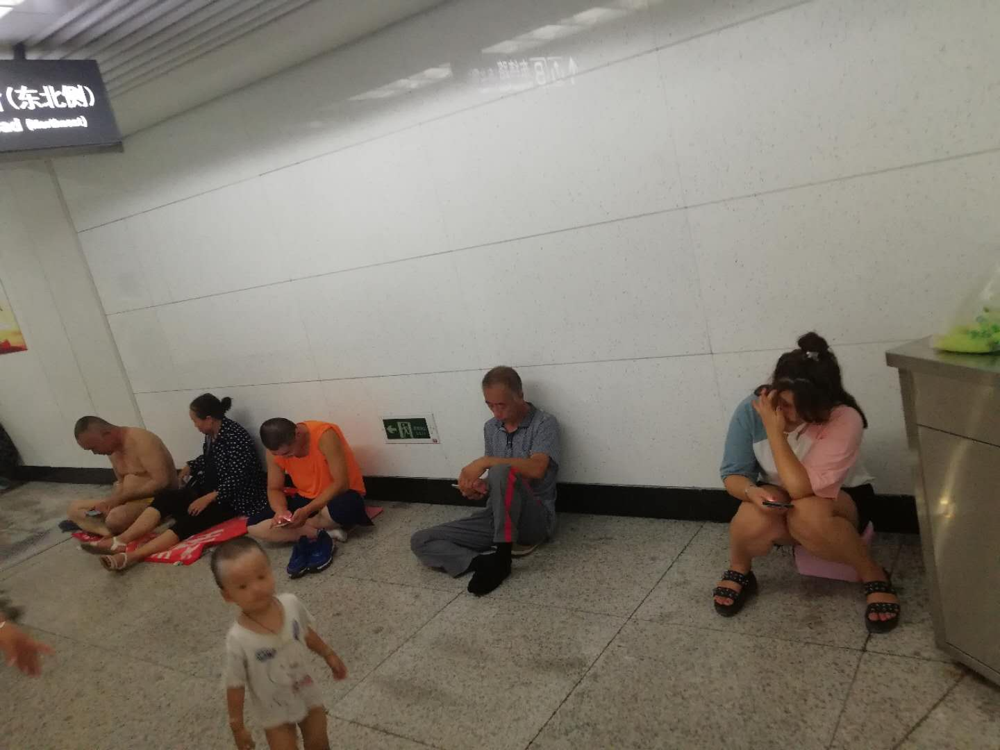

前天立秋。昨天大雨。
这个夏天，是协弃市有气象记录以来最热的，没有之一。
虽然最极端的高温记录没被打破，但连续近20天的33度，实在是坑苦了习惯30度以下的人们。
没心理准备啊。
往常，协弃市的海洋性气候特征明显，7月份一般在28～30度，一年中最热的几天出现在立秋前后。今年据砖家说收到邪恶的副高影响，变得跟内陆一样炎热干燥，反倒是这场雨给立秋这个节气正了名，虽然仍旧热，但早晚稍微透点风了。
为什么说是邪恶的副高？副高来自会考科目地理，会考科目地理有个好朋友，同样是会考科目的生物，生物里有一课老师不怎么讲……

周日去理发。有个大姐在烫头。应该是熟客，跟老板娘聊得挺开心。
老板娘：“天这么热，你卖空调不应该最忙吗？怎么周末有空出来作头？”
大姐：“上个礼拜忙。到这个礼拜，一万五以下的型号都卖光了。没货就不用忙了。”

有天晚上给我妈打电话，问她在哪儿呢，她说在406（公交）车上。
问这么晚了还出去啊？
答：“不是，太热了，赵阿姨拽我上公交车上蹭空调。”

*图：晚上八点在地铁站里纳凉的人。*

赵阿姨以前是我妈工友，现在是邻居。
赵阿姨的闺女[文小姐](https://pewae.com/2009/05/strange-old-man.html)住得也不远，所以我妈想上网买什么东西经常找她。
文小姐的闺女秋天要上小学了，夏天去学前班，找到我妈，跟我闺女借一年级的书。
人情债欠不得啊，赶紧来回打车把书给我妈送了去。
三本书加一起定价12块3，来回打车花了我65。
换我就直接上网买了。

客户对我们这边产生了极大的不满，这种不满完全是我们项目经理老张自己作死。
本来因为保密的需要，我们的项目客户是要求不准有外驻参与的。而老张为了控制成本，6月份招了4个外驻进来。
跟客户说是招了新人，客户要看简历。部门小助理傻乎乎地把公司数据库里的简历提了出来，老张也没看，直接发给了客户。
没出一天客户就打电话过来质询：“你们新找的都是外驻吧？”
老张当时懵逼了，不知道哪里露出了马脚。
原来问题出在简历里的邮箱上，公司统一分配的邮箱，外驻名字前面有个“v_”。
傻子也能看出有问题啊！

协弃市最近在推进垃圾分类。每处能见到的垃圾桶都升级成了带有分类标志的。
臭宝的学校更是用专门的课时给孩子们进行了垃圾分类的教育。教育局还弄了个网页，让家长以家长的身份答题，不及格还要重做。
臭宝就很认真地执行垃圾分类。一天傍晚她非要跟我一起去楼下扔垃圾，监督我把纸壳和废纸扔进“可回收”，把厨余扔进“不可回收”。还没等我们远离垃圾桶，收拾卫生的大哥就开着个电动车进了小区，什么可回收不可回收都一股脑装进了一个超级大的口袋，运走了。
臭宝当时就傻了，回家后只能用环卫工人素质低来解释。
实际上每个大人都知道根本不不关环卫工人的事儿。

对华为手机最近的一次系统升级表示强烈不满。
之前禁止后台运行能自动杀掉微信，现在杀不掉了。
微信这东西真的好烦。为了臭宝还不能卸。感觉每天被喂屎。
还有一个新特性：“为了保障安全，每天三次强制输密码解锁。”
这是哪个脑残想出来的主意？输密码怎么就比指纹安全了？！

过去的近两个月，除了看球就是打游戏。
因为今年是博客13周年大庆，我决定在11月之前把之前没填的坑都填上。
“每夜一游”只差两篇了。
倒数第二个游戏非常消耗时间不说，想玩好还必须作笔记。
于是我用一个excel作记录，白天在单位码公式和写VBA，晚上同步回家丰富数据。
单位的office是日文版的2010，家里是中文破解版的2007。
也不知为什么，有个公式在家里就是不出来东西。
不管是语言问题还是版本问题了，也没闲工夫去找什么完美破解或者应对办法，索性直接买了个2016个人版序列号。
下载安装，问题解决，美滋滋。
就当白嫖微软这么多年，给的补偿吧。虽然小200块有点贵，但终身使用也还行吧。
孙子曰：“主不可以怒而兴师，将不可以愠而致战。”
我还是冲动了，这样不好。
似乎真的回不到学生时代的思维方式了。