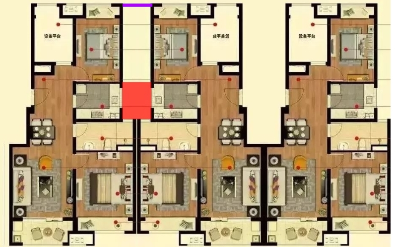

同事小黄的孩子疑似多动症。今年上小学，第一个月被找了9次家长。
小黄苦不堪言。从号贩子手里买了个北京什么医院的专家号，打算去确诊一下，究竟用不用治。
结果第二个月大有好转，只被找了两次家长。小黄觉得很有希望，觉得可能不用去了，就上网把号卖了。
人买家说号是假的……
更闹心了。

借着全国各地房闹此起彼伏的东风，协弃市万科的某楼盘上万科门口抗议。嗯，我家就在万科协弃总部门口。
理由是卖的房子不能算“五明户型”，厨房是黑的。
这户型吧，号称万科经典户型，我家也是型。这种户型，万科独出心裁地在两个相邻的楼之间开出一个大约5米（？）的洞，于是所有的户型都成了“五明”的了，好卖呗。
但凡有点良心的售楼员和有点脑子的买主，买卖的时候都应该会意识到厨房和卫生间的采光会有问题。比如我，买的就是靠边的。

“五明”固然是扣字眼，但也不意味着万科一点儿这儿都没有。可能是楼间距不足或者北边的建筑物过高导致的？反正就是个博弈呗，无所谓谁对谁错。

大约上午十点，这帮人穿着统一的廉价T恤，然后粗糙地在上面用黑色或红色的勾线笔写上“黑厨房”或者“欺诈销售”的字样。
万科总部旁边是一个新楼盘的售楼处，门口有台阶。这三五十号人就那么静静地坐在门口地台阶上，唠嗑或者玩手机，偶尔有人会作义愤填膺状，喊两句口号，也没个人响应。
万科把售楼处大门一关，俩保安往门口一站，就什么都不管了——本来就是休息日，能说了算的也不在啊——估计是算好了这一点，现在这社会，不会有人为了抗议而请假的吧。
一辆警车就停在路边，俩警察站边上，抽着烟瞅着，站累了就回车里坐着。

持续的时间倒很长，一直到下午四点，太阳下山，有点儿冷了，才散。

公司的15年司龄礼物是面条机。
又大又笨。
而且这是继11年的豆浆机，14年的空气炸锅之后，五年内第三件没什么卵用的厨房电器了。
看来真是发大白象让滚蛋的路子啊。

之前的6个月6G的流量包到期了，因为没设提醒，多跑了两天，花了我四块多钱，老心痛了。
翻遍中国移不动的流量包，估算了一下自己的量，只能心痛地补上一个30元1G的月包。
然后，老婆说，你不知道吗？中国移不动有个抽奖转盘，在XXXX地方。
就点了一下，中了个当月5G流量，我有一句妈卖批不知当讲不当讲……
这到了11月，大转盘活动也下线了。翻来翻去，只好用微信充了个180块12G的年包。
没仔细看，要是能分摊到每个月进行计费就好了，正好抵消15块钱的最低消费。如果不是的话，那就意味着每个月话费账单涨到30，翻了一倍，好肉痛啊。移动也是不待见我这种老渣渣用户了。

这几个礼拜都挺闲的，想起当初谁问我用的汉语转拼音的插件，想把它移到自己的大插件里。
看源代码发现，用的竟然是穷举法，顿时感觉好low。就想看看有没有在线翻译的API，整一个。
原来，google翻译收费了，有道翻译不开放注册了，百你妈的度则需要上缴手机号。
继续搜，没想到毛子的yandex，也就是我邮箱的这家，也是有翻译API可用的。
东抄西凑，终于被我搞出了个插件。
不爽的是，在保存的时候自动翻译，大概率连接失败。只好放弃自动保存，而是在后台slug的地方加了个手动翻译的按钮。还学会了在JS里掉JSON，美滋滋。
因为不太智能，所以就不写帖子说了，有需要的自己上我的github上扒。
每夫吐槽（024）翻译出的结果是“Each husband tucao（024）”，请自行判断。