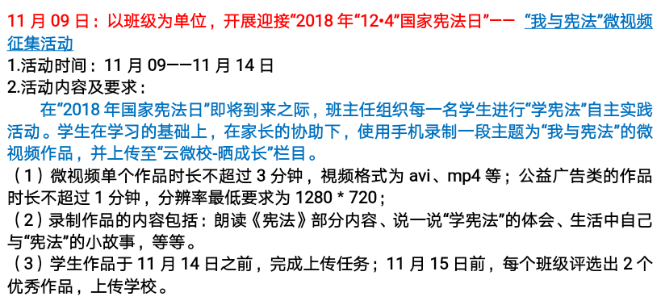

本地区有关猪流感的各种谣言，这几个月来就没断过。
同事有个版本，说他老家的政策是100斤以下的猪不补偿，100斤以上给补偿，所以小猪都等着来人之前杀了，所以当地冰柜脱销……
说得我都信了。
附近不少小饭店已经把鱼香肉丝、京酱肉丝之类的改成用鸡肉做了，顺应潮流还降低成本。
老婆单位有一天酸菜也是用鸡肉炖的。四个字，味同嚼蜡。
我爹比较惨，他既不吃鸡（生理作用），也不吃牛羊肉（心理作用），所以真真是三月不知肉味。据他所说，这俩月鱼价飞涨。

臭宝学校有天中午吃菠萝咕咾肉，一个正直的小男孩跳上讲台，大声跟同学们说：“我妈说了，现在的猪肉都有毒，都不能吃！你们赶紧给倒了！！”
老师赶紧安抚小朋友们，说学校的肉没问题云云，并且罚正直小男孩站了半小时。
我觉得作为一名受党教（kong）育（zhi）的人民教师，也挺无奈的吧，还能咋办？

上回说的万科被闹事件，原来是万科理亏。不知道哪个狗屎设计师或领导，“为了外观整洁大方”，给图里面紫色部分加了一道假墙和百叶窗。就这样，不黑就怪了，别说朝北了，就是朝向金三胖光也透不进来啊！万科最终的解决方案，跟当初我们小区的转门一样，要先征求所有业主意见，然后才能拆除。
真怀疑他们每个小区都这么整一下，是不是要先试探一下这小区住户是不是好欺负？？

今年公司的年会将回到五星级酒店并要再次求盛装出席。上次这么要求[已经是8年前的事儿](https://pewae.com/2011/01/2011-annual-meeting.html)了。
应该是有什么好事。之前疯传马爸爸要接手，也不知是不是真的。
我之前是觉得可能性不大，因为我们公司主要业务都不是什么新经济模式，而是IT里的传统产业。也许真是马爸爸退休导致A记胃口变了？

办公室发了全体邮件，要求大家提前准备，并特意强调可以趁着双十一赶紧采购。
妈的，公司又不发着装费，采购个屁啊。反正八年前的行头都还在。
有个出差的小伙儿，根本没西装，所以他在积极跟客户申请多待两个礼拜，躲过年会再说。可我们项目经理不同意啊，出差补助也是钱对吧。
一干女同事疯了一样，晚礼服不常穿可以租，鞋总得买新的吧；穿得那么亮眼，包也不能嗑碜了吧；那么重要的活动，不能被别人比下去，总得有两件像样的首饰吧；买都买了，也不差当天找个化妆师了吧……
公司这封邮件，越看越像给马爸爸的投名状啊。
真希望他接手然后把我给遣散了啊！

闺女老师上周末发的任务。
感受一下人民教师的无奈吧，again。

好久没提闺女学校的那些傻逼软件了。因为她们现在的班主任确实不太重视这些乱糟糟的任务。
这次因为个人原因再表扬一下[傻逼软件2号](https://pewae.com/2016/09/diray_564.html)。
这不是金先生驾鹤西去了嘛，我突发奇想，用这个读书软件做了一下《射雕英雄传》的测验题。
以前闺女答不上来，我总说她书读得不仔细，看来真的是错怪她了。

